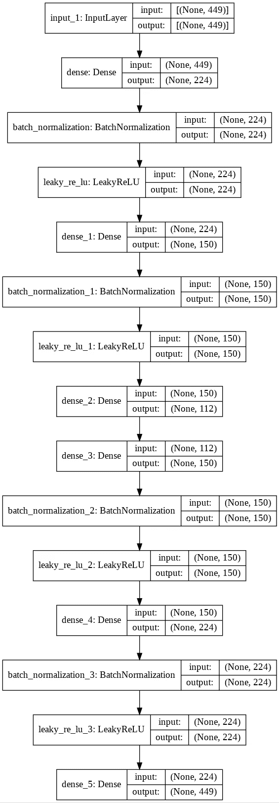
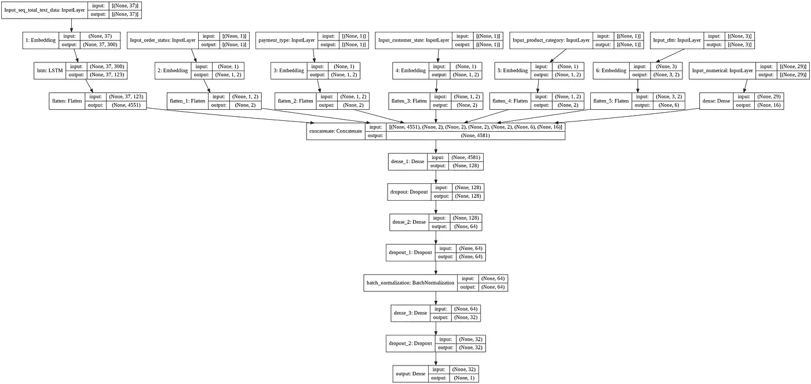

# 基于机器学习的顾客满意度预测

> 原文：<https://towardsdatascience.com/customer-satisfaction-prediction-using-machine-learning-66240e032962?source=collection_archive---------3----------------------->

预测客户对从巴西电子商务网站 Olist 购物的满意度。


```
**This Article Includes:
1.Introduction
2.Business Problem
3.Problem Statement
4.Bussiness objectives and constraints
5.Machine Learning Formulation
   i Data Overview
   ii.Data Description
  iii.Machine Learning Problem
   iv.Performance Metrics
6.Exploratory Data Analysis(EDA)
      a.Data Cleaning and Deduplication
      b.High Level Statistics
      c.Univariate Analysis
      d.Bivariate Analysis
      e.Multivariate Analysis
      f.RFM Analysis
      g.Conclusion
7.Data Preprocessing and Feature Engineering
8.Model Selection 
9.Summary
10.Deployment
11.Improvements to Existing Approach
12.Future Work
13.Reference**
```

## **1。简介**

近年来，随着互联网在世界不同地区的普及，电子商务领域正在迅速发展。这一行业正在重新定义全球商业活动，并在当今的日常生活中发挥着至关重要的作用。还观察到，消费者经常订购的主要商品类别是服装、杂货、家庭装修材料等，这些产品的比例在未来可能会显著增加。

总的来说，我们可以说电子商务是一种由互联网驱动的媒介，客户可以通过自己的设备(电脑、平板电脑或智能手机)访问在线商店进行浏览，并订购产品或服务。

例子-电子商务交易，包括书籍、杂货、音乐、飞机票和金融服务，如股票投资和网上银行。

电子商务主要有四种类型；这些如图 1 所示。


图 1 pari tosh Mahto 的电子商务图像类型

电子商务的主要优势是它每周 7 天、每天 24 小时都可以使用，在一个平台上可以买到更广泛的产品。缺点是有限的消费者服务，因为很难在线向消费者展示每个产品，交付产品需要时间。

机器学习可以在电子商务中发挥重要作用，如销售预测、预测消费者的下一个订单、评论预测、情感分析、产品推荐等。它还可以通过电子商务提供服务，如语音搜索、图像搜索、聊天机器人、店内体验(增强现实)等

## **2。业务问题**

Olist 是巴西的一个电子商务网站，它提供了一个更好的平台，将商家及其产品与巴西的主要市场联系起来。Olist 于 2018 年 11 月在 Kaggle 上发布了这个数据集。

该数据集包含巴西多个市场 2016 年至 2018 年的 10 万份订单信息。其功能允许从多个维度查看订单:从订单状态、价格、付款和货运表现到客户位置、产品属性，最后是客户撰写的评论。还发布了将巴西邮政编码与经纬度坐标联系起来的地理位置数据集。

*   这项业务是基于消费者、网店和卖家之间的互动。
*   首先，消费者在 Olist 网站上下订单。Olist store 收到该订单后，会根据订单信息(如产品类别、地理位置、付款方式等)向卖家发送通知。
*   在从卖方收到产品并在预计交付时间内交付给消费者之后。
*   一旦客户收到产品，或者如果预计交付日期到期，客户将通过电子邮件获得一份满意度调查，他可以在其中给出购买体验的注释并写下一些评论。


Andre Sionek 的工作流程图，图片来源[[https://www . ka ggle . com/andresionek/predicting-customer-satisfaction](https://www.kaggle.com/andresionek/predicting-customer-satisfaction)]

## **3。问题陈述**

*   对于给定的客户历史数据，预测下一个订单或购买的评论分数。
*   这个问题陈述可以进一步修改，以预测从巴西电子商务网站 Olist 购买的客户满意度(正面或负面)。

## **4。业务目标和约束**

*   无延迟-延迟要求。
*   模型的可解释性有助于理解客户的行为。

## **5。机器学习公式**

这里，目标是根据给定的特征，如价格、商品描述、准时交付、交付状态等，预测给定订单的客户满意度得分。

给定的问题可以通过多类分类问题(预测分数[1，2，3，4，5])、二进制分类问题(0 为负 1 为正)或回归问题(用于预测分数)来解决

**5.i 数据概述**

```
**Source:-** https://www.kaggle.com/olistbr/brazilian-ecommerce **Uploaded In the Year : 2018
provided by : Olist Store**
```

为了更好地理解和组织，数据被分成多个数据集。

```
**Data is available in 9 csv files:
1\. olist_customers_dataset.csv (data)
2\. olist_geolocation_dataset.csv(geo_data)
3\. olist_order_items_dataset.csv(order_itemdata)
4\. olist_order_payments_dataset.csv(pay_data)
5\. olist_order_reviews_dataset.csv(rev_data)
6\. olist_orders_dataset.csv(orders)
7\. olist_products_dataset.csv(order_prddata)
8\. olist_sellers_dataset.csv(order_selldata)
9\. product_category_name_translation.csv(order_prd_catdata)**
```


Olist 商店的数据模式，图像源[[https://www.kaggle.com/olistbr/brazilian-ecommerce](https://www.kaggle.com/olistbr/brazilian-ecommerce)

*   olist_orders_dataset 使用 order_id 和 customer_id 将每次购买的订单数据与其他数据关联起来。
*   olist_order_reviews_dataset 将订单数据表中每个订单的已标记审核数据标记为[1，2，3，4，5]，其中 5 为最高，1 为最低。
*   我们将使用大于 3 的评价作为正面评价，小于等于 3 的评价作为负面评价。
*   数据将被相应地合并，以获得分析、特征选择和模型训练所需的最终数据。

**5 .二、数据描述**

列数和行数，每个列的名称为。csv 文件显示在此数据框中:

关于所有列/特征的描述如下所示:

**5.3 .机器学习问题**

上述问题可以公式化为二元分类问题，即对于给定的订单和消费者的购买数据，预测评论将是正面的还是负面的。

**5 .四、绩效指标**

*   宏 f1-分数-
*   混淆矩阵

## 6.探索性数据分析

就我们对业务问题的理解和对机器学习问题陈述的表述而言。我们还了解了数据集和大多数功能。现在，我们将对该数据集进行探索性数据分析，以获得对特征的更多了解。

我遵循的第一步是阅读所有。并检查了每个 csv 文件中的列及其数据类型。在这之后，所有的数据根据给定的数据模式被合并。此外，我执行了数据清理，并对数据集进行了不同的分析。

**6.a 数据清理**

*   处理缺失值

合并后的最终数据有许多空值。最大数量的空值出现在对象数据类型的列`**review_comment_message**`中。类似于`**order_approved_at**` **、** `**order_delivered_carrier_date**`和`**order_delivered_customer_date**`的列也是空值。这些丢失的值要么被替换，要么被丢弃。代码如下所示。

*   重复数据删除

正如您可以观察到的重复行，如 order_id 为`**82bce245b1c9148f8d19a55b9ff70644**` 的行，所有的列都是相同的。我们可以去掉这几行，保留第一行。

**5.b 高标签统计**

合并、清理和重复数据删除后的最终数据具有以下特征-

合并后的数据有 32 列，并且具有诸如 order_status、payment_type、customer_state 和 product_ category _name_english 之类的分类特征。一个名为 review_comment_message 的列包含葡萄牙语文本数据。数字特征也很少。数字特征的描述如下所示-

我们可以从上表中观察到-

*   订单的价格和运费。订单的最高价格为 6735，而最高运费约为 410 巴西雷亚尔。订单的平均价格约为 125 巴西雷亚尔，运费价值约为 20 巴西雷亚尔。最低价格为 0.85 巴西雷亚尔的订单已经完成。
*   对于 payment_value，订单的最大支付值为 13664 巴西雷亚尔。此外，我们可以观察统计数据，如百分位值、平均值和标准偏差值、计数、最小值和其他数字特征的最大值。

相关矩阵-


图片由 Paritosh Mahto 提供

现在让我们观察目标变量，即审查分数，大于或等于 3 的分数被认为是 1(正)，否则为 0(负)。从目标变量的分布来看，我们可以观察到 85.5%的评论是正面的，14.5%是负面的。由此，我们可以得出结论，给定的数据集是偏斜的或不平衡的。


图片由 Paritosh Mahto 提供

**5.c 单变量分析**

在这个电子商务数据集中，主要使用四种类型的支付方式，即信用卡、baleto、凭单和借记卡。

> 注:**Baleto**= =>Boleto bancáRio，简称 Boleto(英文:Ticket)是在巴西由 FEBRABAN 监管的一种支付方式，是[银行巴西联合会的简称。它](https://jovian.ai/outlink?url=http%3A%2F%2FBanks.It)可以在任何银行、邮局、彩票代理和一些超市的自动柜员机、分支机构和网上银行支付，直到到期日。


图片由 Paritosh Mahto 提供

*   从上面的图中，我们可以观察到大多数订单是使用信用卡支付的，第二常用的支付方式是 boleto。
*   每种支付方式的百分比显示在饼状图中，该图显示在用户进行的所有支付中，75.9%的用户使用信用卡，19.9%的用户使用 baleto，3.2%的用户使用凭单和借记卡。


图片由 Paritosh Mahto 提供

我们可以从上面的帕累托图中观察到，96%的顾客使用了信用卡和 baleto。让我们看看这个特性是如何与我们的目标变量相关联的。


图片由 Paritosh Mahto 提供

我们可以从上面的叠加图中观察到，大多数使用信用卡的客户都给予了积极的评价。此外，对于 boleto、凭证和借记卡用户来说，也是一样的。由此，我们可以得出结论，这可能是我们对这个问题的重要的分类特征。

现在让我们对 customer_state 列进行单变量分析。该列包含相应 customer_id 的州代码。巴西地图上的州名和州代码如下所示。


巴西地图，图片来源[[https://st4 . deposit photos . com/1374738/23094/v/950/deposit photos _ 230940566-stock-illustration-map-Brazil-divisions-States . jpg](https://st4.depositphotos.com/1374738/23094/v/950/depositphotos_230940566-stock-illustration-map-brazil-divisions-states.jpg)

巴西人口最多的三个州是圣保罗、米纳斯吉拉斯和里约热内卢，我们还可以从下图中观察到，66.6 %的订单来自这些州，这意味着大多数客户来自这些州。


图片由 Paritosh Mahto 提供

此外，从下面显示的每个州的评论堆积图中，我们可以得出结论，每个州的大多数消费者都给予了积极的评价。在 **SP** 州的 40800 条评论中，35791 条评论是正面的，而对于 **RJ** 州的 9968 条评论是正面的，评论总数为 12569 条。对于这个问题，消费者状态可能是我们的重要特征。


图片由 Paritosh Mahto 提供

众所周知，产品类别是这个行业的重要特征之一。为了了解最畅销的产品类别，我绘制了一个柱状图，如下所示


图片由 Paritosh Mahto 提供

我们可以观察到，2016-2018 年间，订购最多的产品分别来自床 _ 浴 _ 桌品类、健康美容、运动 _ 休闲。

在这个数据集中也有一些时间戳特征，如`**order_purchase_timestamp**`、`**order_purchase_timestamp**`、`**order_approved_a**t`、`**order_delivered_customer_date**`、`**order_estimated_delivery_date**`等等。在提取了月、年、日、星期几等属性后，我对时间戳进行了单变量分析。给出的数据是 699 天的数据，收集数据的时间戳是`**2016–10–04 09:43:32**` **-** `**2018–09–03 17:40:06**` 。


图片由 Paritosh Mahto 提供

收到的订单总数的变化如上所示，2017 年收到的订单数达到最大值 11。还有，我们可以观察 Olist 从 201609 年到 201808 年的成长。基于从`**order_purchase_timestamp**` 中提取的属性对订单和评论的分析已经在中结束。


图片由 Paritosh Mahto 提供

*   从标题为“每月总评论”的子图中，我们可以观察到，2016 年至 2018 年期间总评论中正面评论比例最高的是 2 月，即 9.8%。在 5 月和 7 月的总评论中，有超过 9.0%的评论是正面的。
*   从标题为“按一天中的时间划分的总评论”的第二个子图中，我们可以得出这样的结论:在下午收到的订单数量最多，并且在那个时间给出的正面评论的百分比最高，即 32.8%。
*   从标题为“一周中每一天的总评论数”的第三个子图中，我们可以得出这样的结论:周一收到的订单数量最多，当天和周二给出的正面评论百分比最高，即 13.9%。

**对数字特征的单变量分析-**

*   每类产品价格分布


图片由 Paritosh Mahto 提供

*   每类 frieght_value 的分布


图片由 Paritosh Mahto 提供

*   每类产品高度的分布


图片由 Paritosh Mahto 提供

*   每类产品的重量分布


图片由 Paritosh Mahto 提供

*   上面的分布图显示了正类和负类的每个数字特征的分布。我们可以观察到，阳性和阴性类别的分布几乎完全重叠，这表明不可能仅根据这些特征对它们进行分类。

**6.d 双变量分析**

该数据集中有超过 10 个数值特征，但是从上面显示的相关矩阵中，我们可以观察到大多数特征是线性相关的。对于双变量分析，仅选择四个特征并绘制在散点图中。

*   从标题分别为`**Distribution of price vs freight_value per class**`和`**Distribution of price vs freight_value per class**`的两个散点图中，我们可以观察到，很难根据这些散点图对评论做出任何评价，因为根据评论，数据点是不可分离的，这些是完全混合的数据。
*   每类价格与运费价值的分布


图片由 Paritosh Mahto 提供

*   每类价格与产品重量的分布


图片由 Paritosh Mahto 提供

*   配对图

对于功能产品照片数量、产品名称长度、产品描述长度绘制了一个配对图，如下所示，因为这些功能与 review_score 列具有负相关值。基于评论，所有特征之间的散点图是完全混淆不可分的。我们可以说，这些特征没有一个对分类有帮助。


图片由 Paritosh Mahto 提供

**6.e 多元分析**

在多变量分析中，绘制了 2016 年至 2108 年之间的销售和订单演变。从图中我们可以观察到，2016 年和 2018 年之间的总销售额和每月订单总量存在相同的模式。


图片由 Paritosh Mahto 提供

**6.f RFM 分析**

对于给定的客户数据，我对这些数据进行了 RFM 分析。RFM 分析基本上是一种数据驱动的客户行为细分技术。RFM 代表近期、频率和货币价值。

```
**RFM stands for-
Recency — number of days since the last purchase****Frequency — number of transactions made over a given period****Monetary — the amount spent over a given period of time**
```

Python 代码计算最近，频率和货币-

创建 RFM 后的输出如下所示

要了解更多关于这种行为细分技术的信息，你可以访问这里

[](https://www.barilliance.com/rfm-analysis/#:~:text=RFM%20analysis%20is%20a%20data,much%20they%27ve%20spent%20overall.) [## RFM 分析指南:RFM 营销的 6 个关键部分

### RFM 分析增加电子商务销售。公司能够利用数据更好地了解客户的想法、感受和…

www.barilliance.com](https://www.barilliance.com/rfm-analysis/#:~:text=RFM%20analysis%20is%20a%20data,much%20they%27ve%20spent%20overall.) 

所有客户的分布最近、频率和货币如下所示。


图片由 Paritosh Mahto 提供

*   从最近的第一张图中，我们可以观察到大多数用户在 Olist 上停留了很长时间，这是一件积极的事情，但订购频率较少。
*   从第二个频率图来看，最多的交易或订单数小于 5。从第三张图中可以看出，在特定时期花费的最大金额似乎不到 1500 英镑左右。

客户行为细分的方形图如下所示。


图片由 Paritosh Mahto 提供

*   根据为所有客户计算的 RFM 分数，我将客户分为 7 类:

```
'Can\'t Loose Them' ====  RMF_Score_s  ≥  9
'Champions' ==== 8 ≤ RMF_Score_s < 9
'Loyal' ==== 7 ≤ RMF_Score_s <8
'Needs Attention' ==== 6 ≤ RMF_Score_s <7
'Potential' ==== 5 ≤ RMF_Score_s < 6
'Promising' ==== 4 ≤ RMF_Score_s < 5 
'Require Activation' RMF_Score_s <4
```

*   从上面的正方形图来看，最高百分比的客户位于类别潜力区域内。少数区域还标有蓝色刻度，显示需要更多关注的消费者的百分比，以便他们能够保留在列表中。
*   我们可以使用 RMF 分数或 RMF 等级作为解决这个问题的特征。

在对数据进行合并、数据清洗和数据分析之后，我们将得到最终的数据，这些数据可以进一步用于预处理和特征提取。

**6.g 结论**

```
* The target variable/class-label is imbalanced.We should be carefull while choosing the performance metric of the models.* From the univariate analysis of payment_type we observed that 96 % of the user used credit card and boleto and concluded that this can be our important feature.* Also,from the univariate analysis of consumer_state we found that 42% of total consumers are from the SP(São Paulo), 12.9 % are from RJ(Rio de Janeiro) and 11.7 % are from MG(Minas Gerais).* After analyzing the product_category feature we observed that the most ordered products are from the bed_bath_table category, health beauty, and sports_leisure between 2016 and 2018\. The least ordered products are from security_and_services.* The different timestamps seem to be important features as many new features can be explored from these. we observed within 2016–18 the total number of orders received is increasing till 2017–11 and after that their a small decrement. from the month, day and time we observed the most number of orders are received in the month of Feb, on Monday and afternoon time.* The numerical features like price, payment_value, freight_value,product_height_cm,product_length_cm doesnot seems to be helpful for this classification problem as observed from univariate and bivarate analysis.Also we can say linear model like KNN, Naive Bayes might not work well.* RMF Analysis is also done to understand whether new features can be created from this or not and we found that one numerical feature or categorical feature can be extracted from this.
```

## 7.数据预处理和特征工程

在数据分析之后，我们开始了解不同的分类和数字特征。所有的分类特征似乎都经过了预处理，我们不需要对这些特征进行预处理。但是，还有一个名为 review_comment_message 的列包含文本数据。在这些数据特征化之前，我们必须进行文本预处理。

**评论文本的预处理**

因为我们有葡萄牙语的文本数据，所以在选择词干分析器、停用词以及替换和删除任何特殊字符或单词时，我们必须小心。我为此选择了`**nltk**`库，并使用`**from nltk.corpus import stopwords**` 导入了停用词，使用`**RSLPStemmer()**` 导入了 RSLP 蒸笼。

当我们用`'nao_reveja'`替换评论数据中的空值时，我们必须从停用词中删除像`'não'` & `'nem'`这样的词。在此之后，我们必须删除或替换链接、货币符号、日期、数字、额外空格和制表符。预处理函数如下所示-

预处理前后的审查文本列如下所示-

*   以前

*   在...之后

**文本数据的矢量化**

现在，我们已经预处理了文本，为了转换这些文本数据，我使用 gensim 库中的 FastText，通过 TF-IDF 矢量器()将单词转换为矢量。tfidf 值给予最频繁出现的单词更大的权重。

代码片段如下所示-

用于加载快速文本模型(适用于 300 dim)

矢量函数:

在此之后，无用的特征将从最终数据中删除。被删除的列如下所示。

```
col= ['order_id',
 'customer_id',
 'order_purchase_timestamp',
 'order_approved_at',
 'order_delivered_customer_date',
 'order_estimated_delivery_date',
  'customer_unique_id',
 'order_item_id',
 'product_id',
 'seller_id',
 'shipping_limit_date',
 'order_purchase_month_name',
 'order_purchase_year_month',
 'order_purchase_date',
 'order_purchase_month_yr',
 'order_purchase_day',
 'order_purchase_dayofweek',
 'order_purchase_dayofweek_name',
 'order_purchase_hour',
'order_purchase_time_day','customer_city','customer_zip_code_prefix','product_category_name']
```

现在，我们有了经过预处理的文本数据、分类和数字特征的最终数据。我们可以使用`from sklearn.model_selection import train_test_split`和`stratify=y`分割数据，因为我们有不平衡的数据。我们还有尚未编码的分类特征。为了对分类特征进行编码，我使用了`CountVectorizer(binary= True)`函数，order_status 特征的编码如下所示。

数字特征也使用`from sklearn.preprocessing import Normalizer`进行缩放。使用`from scipy.sparse import hstack`堆叠所有矢量化的特征，以形成 X_train 和 X_test。

**基线模型选择**

我们有现有的矢量化特征，现在我们将构建几个基本模型，我们将选择一个作为基线模型。在此之后，我们将尝试通过添加新功能来改善基线，为了添加新功能，我将再次进行一些 EDA。使用的模型有随机模型、朴素贝叶斯模型和逻辑回归模型。输出分数和混淆矩阵如下所示。

*   随机模型

```
**Train f1-score 0.42757018716907186
Test f1-score 0.4261466361217526**
```


图片由 Paritosh Mahto 提供

*   朴素贝叶斯

```
**Train f1 score:  0.7424119484527338
Test f1 score:  0.7472580717762947**
```


图片由 Paritosh Mahto 提供

*   逻辑回归

```
**Train f1 score:  0.8165306456031154
Test f1 score:  0.8062989397776499**
```


图片由 Paritosh Mahto 提供

逻辑回归模型的表现优于其他模型。选择逻辑回归模型作为基线模型。从训练和测试混淆矩阵中，我们可以观察到假阳性和假阴性值仍然很大。让我们尝试通过添加一些特征和通过特征选择方法来减少这些值。

**特征工程**

除了现有要素，数据中还添加了 16 个新要素。这些功能的详细信息如下所示。

添加新特征后，我们总共有 29 个数字特征和 5 个分类特征，以及文本数据(300 dim)。我们将再次运行选定的基线模型，即逻辑回归模型，并检查其输出。输出如下所示。

```
**Train f1 score:  0.8258929671475947
Test f1 score:  0.8167104393178897**
```


图片由 Paritosh Mahto 提供

我们得到了更好的训练和测试 f1 分数，但我们仍然有很高的 FP 和 FN 值。为了减少这些值并增加分数，我尝试使用`Autoencoder Model` 进行特征选择。

**使用自动编码器模型的特征提取/选择**

> `**Autoencoder**`是一种神经网络，可用于学习原始数据的压缩(降维)表示。自动编码器由编码器和解码器子模型组成。编码器压缩输入，解码器试图从编码器提供的压缩版本中重建输入。训练后，保存编码器模型，丢弃解码器。
> 
> 然后，编码器可以用作数据准备技术，以对原始数据执行特征提取，该原始数据可以用于训练不同的机器学习模型。来源-[https://machine learning mastery . com/auto encoder-for-class ification/](https://machinelearningmastery.com/autoencoder-for-classification/)

该模型的架构如下所示。我使用了一个致密层，BatchNormalisation 层，leakyRelu 作为激活层。



图片由 Paritosh Mahto 提供

我运行了这个模型 10 个时期，在运行模型之后，我保存了编码器部分。

损失与时期图


图片由 Paritosh Mahto 提供

然后，从编码器模型中提取重要特征。

代码片段:

使用提取的特征再次运行基线模型。输出如下所示。

```
**Train f1 score:  0.8457608492913875
Test f1 score:  0.8117963347711852**
```


图片由 Paritosh Mahto 提供

f1 分数增加了，我们的 FP 和 FN 值也降低了。我们现在将运行不同的机器学习和深度学习模型，并为我们的问题选择最佳模型。

## 8.型号选择

**模型选择**是选择一个模型作为解决问题的最终模型的过程。正如我们已经看到的基线模型性能，现在为了提高分数，我们将尝试两种不同类型模型的模型选择过程(例如，逻辑回归、SVM、KNN、决策树、集成等)。)和配置有不同模型超参数(例如，SVM 中的不同内核)的相同类型的模型。

**机器学习模型**

我们从神经网络模型的不同分类模型开始。我们在本案例研究中试验的模型如下

1.  逻辑回归
2.  线性支持向量机
3.  决策树分类器
4.  随机森林分类器
5.  增强分类器(XGBoost/light GBM/AdaBoost/CATBoost)
6.  堆叠/投票集成技术

对于每个模型，我使用`RandomizedSearchCV`进行超参数调整。所有模型的最佳超参数输出汇总如下所示。

我们可以观察到基于测试 f1 的最佳模型——分数是 vot_hard 代码片段，输出如下所示。

所有模型的代码片段都可以在这里找到-

[](https://jovian.ai/paritosh/ml-models) [## 帕里托什/ml-模型-木星

### 与 Paritosh 合作开发 ml-models 笔记本电脑。

jovian.ai](https://jovian.ai/paritosh/ml-models) 

**深度学习模型**

由于我们已经看到了不同的机器学习模型，现在我们将尝试不同的神经网络模型。我尝试了 5 种不同的模型，并使用这些模型形成深度学习堆叠模型。

**模型-1**

在模型-1 中，我建立了一个简单的模型，其中 5 个密集层作为隐藏层，1 个密集层作为输出层。在输出层，使用 sigmoid 作为激活函数。给定的输入是从编码器模型中提取的特征。我使用定制的 f1 分数指标来评估这些模型。

*   **模型建筑**


图片由 Paritosh Mahto 提供

*   **纪元 Vs 损失图**


图片由 Paritosh Mahto 提供

*   输出

```
**Train f1_score: 0.8632763852422476
Test f1_score: 0.8218909906703276**
```


图片由 Paritosh Mahto 提供

**型号 2**

在 Model- 2 中，我使用了 4 个 CONV1D 层，2 个 MaxPooling1D 层，一个 dropout 层和一个 flatten 层作为隐藏层，1 个 dense 层作为输出层。在输出层，使用 sigmoid 作为激活函数。给定的输入是从编码器模型中提取的特征，但是具有重新成形的阵列。

*   **模型架构**


图片由 Paritosh Mahto 提供

*   时代 Vs 损失


图片由 Paritosh Mahto 提供

*   输出

```
**Train f1_score: 0.8610270746182962 
Test f1_score: 0.8253479131333611**
```


图片由 Paritosh Mahto 提供

**型号-3**

在 Model -3 中，我使用了 LSTM 层、嵌入层、批处理标准化层、密集层、下降层和展平层来构建具有多个输入和一个输出的模型。输入数据解释如下。

*   **Input _ seq _ total _ text _ data-**我使用嵌入层为文本数据列获取单词向量。我还使用预定义的 fasttext 单词向量来创建嵌入矩阵。之后使用 LSTM，得到 LSTM 输出，并使输出变平。
*   **Input_order_status-** 给定 order_status 列作为嵌入层的输入，然后训练 Keras 嵌入层。
*   **付款类型-** 给定付款类型列作为嵌入层的输入，并训练 Keras 嵌入层。
*   **输入客户状态-** 给定客户状态列作为嵌入层的输入，并训练 Keras 嵌入层。
*   **输入产品类别-** 给定产品类别列作为嵌入层的输入，并训练 Keras 嵌入层。
*   **输入 _rfm -** 给定 RFM_Level 列作为嵌入层的输入，并训练 Keras 嵌入层。
*   **输入 _ 数字-** 连接剩余的列，即数字特征，然后添加一个密集层。

所有这些都在最后连接起来，并通过不同的密集层。

*   **模型架构**



图片由 Paritosh Mahto 提供

*   **历元 Vs 损失**


图片由 Paritosh Mahto 提供

*   **输出**

```
**Train f1_score: 0.860330602322043 
Test f1_score: 0.8327277576694923**
```


图片由 Paritosh Mahto 提供

**型号 4**

Model -4 也使用 LSTM 层、Conv1D、嵌入层、批处理标准化层、密集层、下降层和展平层来构建模型，但具有两个输入和一个输出。输入数据解释如下。

*   **Input _ seq _ total _ text _ data-**我使用嵌入层为文本数据列获取单词向量。我还使用预定义的快速文本单词向量来创建嵌入矩阵。之后使用 LSTM，得到 LSTM 输出，并使输出变平。
*   **Other_than_text_data-** 所有分类特征都被转换为一个独热编码向量，然后使用 np 与数字特征连接在一起。hstack
*   **模型架构**


图片由 Paritosh Mahto 提供

*   **历元对损失**


图片由 Paritosh Mahto 提供

*   **输出**

```
**Train f1_score: 0.8815188513597205 
Test f1_score: 0.8218441232242646**
```


图片由 Paritosh Mahto 提供

**型号-5**

Model -5 还使用了 LSTM 层、Conv1D、嵌入层、批处理标准化层、密集层、下降层和展平层来构建模型，但具有两个输入和一个输出。输入数据与模型 4 相同。

*   **模型架构**


图片由 Paritosh Mahto 提供

*   **历元 Vs 损失**


图片由 Paritosh Mahto 提供

*   **输出**

```
**Train f1_score: 0.8508463263785984
Test f1_score: 0.8287339894123904**
```


图片由 Paritosh Mahto 提供

**深度学习堆叠模型**

正如我们已经看到的 5 个深度学习模型，现在我们将使用一种集成方法，其中上述 5 个模型用作子模型，每个模型对组合预测的贡献相等，XGBClassifier 用作最终模型，即元模型。我们将构建两个堆叠模型，一个使用硬堆叠，另一个使用软堆叠，并将输出与上述模型的输出进行比较。构建硬件和堆栈的每个步骤的代码片段如下所示。

步骤 1 加载五个子模型

每个模型的第 2 步预测

步骤 3 堆叠预测并通过元分类器

*   硬堆叠

**输出:**


图片由 Paritosh Mahto 提供

*   软堆叠

输出:


图片由 Paritosh Mahto 提供

正如我们可以观察到的，两种堆叠模型的输出都比上述深度学习模型表现得更好。所有深度学习模型的代码片段都可以在这里找到—

[](https://jovian.ai/paritosh/dl-models-2) [## Paritosh/dl-models-2 - Jovian

### 与 Paritosh 合作开发 dl-models-2 笔记本电脑。

jovian.ai](https://jovian.ai/paritosh/dl-models-2) 

## 9.摘要

*   从 EDA 中，我们得出结论，给定的数据集是偏斜的，并且具有相关值，我们已经看到大多数数字特征不是线性相关的，这意味着简单的 ml 分类可能不会很好地工作。
*   评论数据是文本形式的，我们对这些数据进行了预处理，并且增加了新的功能，有助于提高分数。autoencoder 模型在特性选择和性能增强方面帮助更大。
*   在模型选择部分，我们经历了不同的 ml 模型和 dl 模型性能。比较所有结果后，我们可以得出结论，该模型是一个深度学习堆叠模型，即软堆叠模型。现在我们将在部署过程中使用这个模型。

## 10.部署

使用 streamlit 和 Github 部署了最好的堆叠式深度学习模型。使用 streamlit uploader 函数，我创建了一个 CSV 文件输入部分，您可以在其中提供原始数据。之后，您必须选择唯一的客户 id 和相应的订单 id，预测将显示为图像。

网页链接-

[https://share . streamlit . io/paritoshmahto 07/customer-satisfaction-prediction/main/app . py](https://share.streamlit.io/paritoshmahto07/customer-satisfaction-prediction/main/app.py)

部署视频-

## 11.对现有方法的改进

在现有方法中，使用两个回归模型和九个新特征来预测评论分数，得到 0.58 的 RMSE。在现有方法中，也不使用不同的模型，并且也使用有限的特征。在我们的方法中，我们采用了比现有方法更好的结果，并且我们使用了新的文本特征化方法以及用于特征选择的自动编码器模型，因此模型的性能得到了提高。

## 12.未来的工作

用不同的方法对葡萄牙文本数据进行矢量化可以改善结果。此外，可以添加新功能和调整 DL 模型的参数，以获得更好的结果。

**我的 LinkedIn 个人资料**

【https://www.linkedin.com/in/paritosh07/ 

**我的 Github 个人资料**

[](https://github.com/paritoshMahto07) [## paritoshMahto07 -概述

### paritoshMahto07 有一个可用的存储库。在 GitHub 上关注他们的代码。

github.com](https://github.com/paritoshMahto07) 

## 13.参考

一、现有解决方案-

[](https://www.kaggle.com/andresionek/predicting-customer-satisfaction) [## 预测客户满意度

### 使用 Kaggle 笔记本探索和运行机器学习代码|使用来自巴西电子商务公共数据集的数据…

www.kaggle.com](https://www.kaggle.com/andresionek/predicting-customer-satisfaction) 

二。数据分析和可视化-

[](https://www.kaggle.com/thiagopanini/e-commerce-sentiment-analysis-eda-viz-nlp) [## 电子商务情感分析:EDA + Viz + NLP ✍

### 使用 Kaggle 笔记本探索和运行机器学习代码|使用来自多个数据源的数据

www.kaggle.com](https://www.kaggle.com/thiagopanini/e-commerce-sentiment-analysis-eda-viz-nlp) 

三。RFM 分析-

[](/recency-frequency-monetary-model-with-python-and-how-sephora-uses-it-to-optimize-their-google-d6a0707c5f17) [## Python 的新近性、频率、货币模型——以及丝芙兰如何使用它来优化他们的谷歌…

### 上次我们使用群组分析方法分析了我们的在线购物者数据集。我们发现了一些有趣的…

towardsdatascience.com](/recency-frequency-monetary-model-with-python-and-how-sephora-uses-it-to-optimize-their-google-d6a0707c5f17) 

四。自动编码器模型

[](https://machinelearningmastery.com/autoencoder-for-classification/) [## 用于分类机器学习掌握的自动编码器特征提取

### Autoencoder 是一种神经网络，可用于学习原始数据的压缩表示。安…

machinelearningmastery.com](https://machinelearningmastery.com/autoencoder-for-classification/) 

动词 （verb 的缩写）堆叠 ML 模型

[](https://machinelearningmastery.com/stacking-ensemble-machine-learning-with-python/) [## 堆叠集成机器学习与 Python -机器学习掌握

### 堆叠或堆叠概括是一种集成机器学习算法。

machinelearningmastery.com](https://machinelearningmastery.com/stacking-ensemble-machine-learning-with-python/) 

不及物动词堆叠 DL 模型

[](https://machinelearningmastery.com/stacking-ensemble-for-deep-learning-neural-networks/) [## Python -机器学习掌握中深度学习神经网络的堆叠集成

### 模型平均是一种集成技术，其中多个子模型对组合预测的贡献相等。型号…

machinelearningmastery.com](https://machinelearningmastery.com/stacking-ensemble-for-deep-learning-neural-networks/) 

七。师徒制

[](https://www.appliedaicourse.com/) [## 应用课程

### 我们知道转行是多么具有挑战性。我们的应用人工智能/机器学习课程被设计为整体学习…

www.appliedaicourse.com](https://www.appliedaicourse.com/) 

*感谢阅读，祝你有美好的一天！*🙂