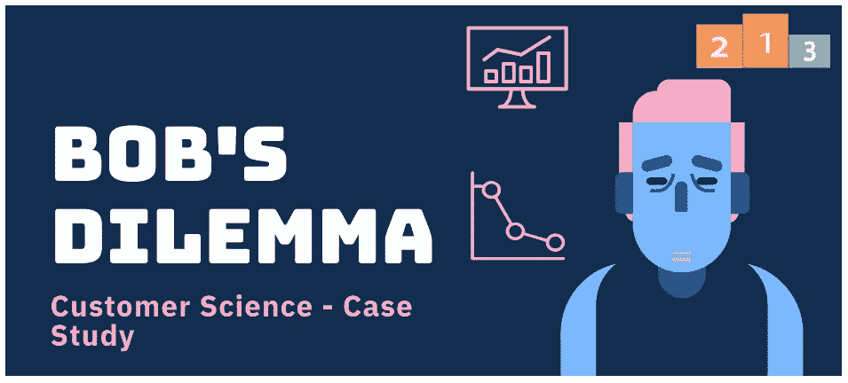
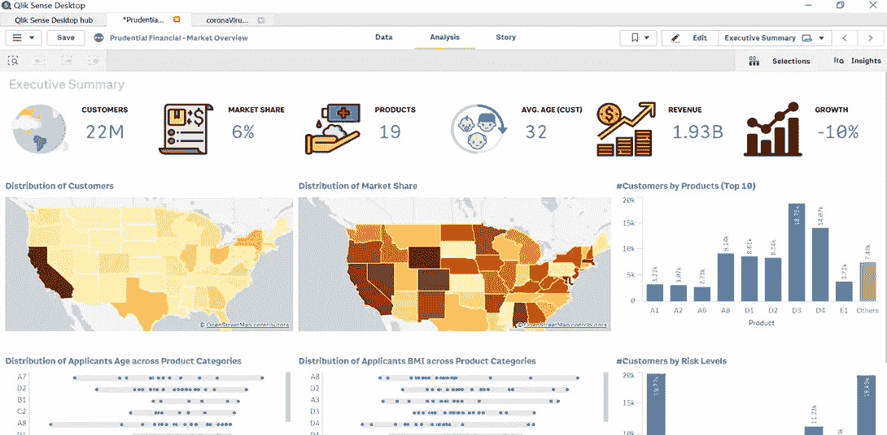

# 分析中的客户科学

> 原文：<https://towardsdatascience.com/customer-science-in-analytics-be05c67c898b?source=collection_archive---------21----------------------->

## 透视“小型企业”如何利用数据提高客户保持率

布莱克·维斯兹在 [Unsplash](https://unsplash.com?utm_source=medium&utm_medium=referral) 上的照片

客户科学一直是企业分析和数据科学领域的热门词汇。无论你从事什么行业，了解你的客户——她的动机、潜力和与她相关的风险——是至关重要的。这总是不容易的，尤其是当你不是基于订阅的模式时。让我从一个简单的小镇杂货商的角度出发，解释他如何提高对顾客的理解。

鲍勃在密苏里州堪萨斯城经营一家小杂货店，出售从薯片到化妆品的各种商品。).尽管 Bob 拥有相当稳固的忠诚度基础，但他感觉自己的份额正迅速被新推出的 Raider Poe 夺走。Bob 雇佣你来帮助他执行“客户科学”项目，并设计旨在改善客户关系的营销策略，而不是在邮箱中分发传单，这是一项基于直觉的活动(你的数据科学家应该将此理解为提高保留率、增加终身价值和发展客户 360 度)。

图片来源——由作者使用 PowerPoint 开发。

幸运的是，鲍勃在 2017 年推出了会员卡系统，因此你可以跟踪“谁在什么时候买了什么”他的卡系统很常见——每次你买东西时，你要么刷你的鲍勃的卡，要么告诉收银员它唯一的十位 ID，或者给你关联的电话号码，收银员会确保你的销售与你在鲍勃的账户关联。每次购物都会累积一些积分，你可以在以后兑换(通常是这样)。

想象一下，当她登录到自己的个人资料时，从亚马逊购物，而不是点击“作为客人继续结账”您运行了一些查询，发现 Bob 年收入的 50%以上来自购物时刷卡的人。这是一个很好的迹象，因为你的客户层面的分析可以影响超过 50%的销售。至于其他的，现在，我们什么也做不了。当你凌晨三点去奥兰多的沃尔玛买发胶时，你忘了使用你的会员卡。他们真的无法跟踪你的销售——如果你在销售过程中没有分享，就无法将它与你这个 Palmart 忠诚度会员联系起来。同样，亚马逊也不能在你作为客人结账时买了剃须刀后，给你发带有剃须刀刀片的脸书广告，因为你的电子邮件与购买没有关联。

斯蒂芬·菲利普斯-Hostreviews.co.uk 在 [Unsplash](https://unsplash.com?utm_source=medium&utm_medium=referral) 上的照片

现在，有了过去三年客户层面 50%的忠诚度销售数字，您就可以开始您的项目渠道了

1.  开发客户 360 度(首先了解他们)
2.  客户维系(我应该尽快锁定谁)，以及
3.  终身价值(我可以优先考虑吗？)

客户 360

鲍勃希望你回答的问题是——这些人是谁？我可以看一下下面的一些指标并理解它们吗？

一些货币指标–

*   每笔交易的平均购买金额
*   Bob 的总收入
*   累积和兑换的积分
*   购买的每件产品的平均价格
*   平均折扣购买的商品百分比等。

频率度量

*   每月的平均交易次数
*   忠诚会员？(客户什么时候拿到 Bob 的卡的？)
*   最近一次购买
*   购买的平均间隔时间

项目偏好

*   购物次数最多的类别 Lisa 来 Bob's 是为了购买啤酒和葡萄酒还是新鲜农产品，还是两者都有？
*   最常光顾的品牌

这些只是几个指标，显示一个人可以从简单的交易数据中获得多少。在大型零售商的现实生活中，数据分析师正在查询大量数据，收集这些关于客户的重要而直接的信息。人们可以更有创造性地使用这些度量标准(小心行事——这里可能会有点复杂)。例如，如果你取一个客户所有访问的购买间隔，并尝试拟合一条回归线，这条线的斜率将表明她访问间隔随时间的变化。如果斜率为正，这意味着随着时间的推移，她在购物后花了更多的时间回到鲍勃的商店，这表明她可能在其他地方购买杂货或比她去鲍勃的商店的平均水平多进货。查看销售值的同一条回归线的斜率，可以了解实际情况。

展示了执行销售总结。使用 Qlik Sense Desktop 开发。图片来源-作者使用 Qlik Sense desktop 开发的仪表板快照。

现在，想象一下在客户层面创建一个数据库——包含数百个指标，以及这些指标如何帮助您为营销活动选择客户群。如果你想锁定有一段时间没有和你一起购物的客户，只需查询并提取那些最近(自上次购买后的天数)比他们的平均购买间隔更重要的客户。因此，如果丽莎平均每十天在鲍勃商店购物一次，而她已经来了 15 天了，给她发一封电子邮件，说“我们想念你”或“这里有 5 美元的折扣”。简单而有效。

现在，人们可以用这些指标做各种事情——暗示无监督的学习方法，如 Kmeans，分层聚类，让算法识别类似的客户群。或者使用降维技术(如主成分分析)来发现变量之间的潜在关系。

*关于作者——Angel Das:高级分析专家和管理顾问，帮助公司通过对组织数据的业务、技术和数学的组合找到各种问题的解决方案。一个数据科学爱好者，在这里分享、学习、贡献；你可以和我在* [*上联系*](https://www.linkedin.com/in/angel-das-9532bb12a/) *和* [*上推特*](https://twitter.com/dasangel07_andy)*；*