# 顾客细分:阿瓦托·贝塔斯曼项目

> 原文：<https://towardsdatascience.com/customer-segmentation-arvato-bertelsmann-project-44e73210a1b7?source=collection_archive---------22----------------------->

## 一份简化的技术报告，解释我建立客户档案、通过人口统计数据锁定客户以及交流调查结果的解决方案

莎伦·麦卡琴的照片

了解一下你们公司的客户到底是谁怎么样？他们住在哪里？他们需要什么？他们是怎么想的？

更多地了解客户不仅有助于创造更多的*个性化产品*和*战略*，还可以让公司在将行动导向正确的目标时节省资金和精力:那些*最有可能*转化为客户的人。

在这个项目中，Bertelsmann Arvato Analytics 提供了与德国一家邮购销售公司的普通人群和客户相关的人口统计数据。目标是执行**客户细分**，确定最能描述公司核心客户群的人群，以及营销活动的适当目标，优化公司的客户获取。

该项目的结构如下:

*   数据概述和数据清理；
*   探索性数据分析；
*   无监督机器学习任务:聚类分析:
*   客户细分报告；
*   监督机器学习任务:为营销活动锁定客户。

# 1.数据概述

第一步包括了解普通人群和客户数据集的数据结构。包含一般人口统计数据的最大数据集由 *891.221 个观察值*(人)和 *336 列*(特征)组成。

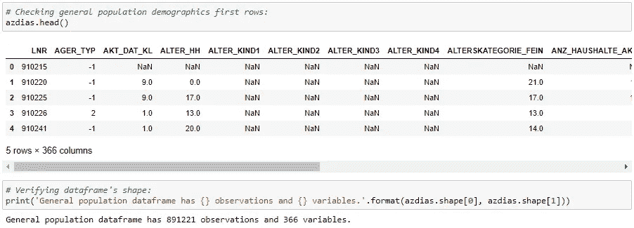

图一。普通人群数据框中的第一行(图片由作者提供)

这些特征在五个主要的*信息级别*中与人口的不同方面相关:

*   **人物**:包含与性别、财务和健康类型、社会地位、心灵契合度等相关的信息；
*   **家庭**:呈现家庭人数、估计家庭收入、交易活动以及更多家庭方面的信息；
*   **微蜂窝**:不同*客串*消费者分类，车主最常见年龄，最常见车厂，最常见车龄等。；
*   **宏小区**:居民密度、距市中心距离、家庭住宅数量、最常见建筑类型等。；
*   社区:居民，失业人口的比例，等等。

为了处理大量不同的功能，我们采用了以下策略:

*   **数据清理**，拼接*缺失*和*未知*值；
*   删除超过为*缺失值*定义的阈值比率的列(将缺失值和未知值一起考虑)；
*   删除一些与分析无关的列；
*   根据其表示处理*列的类型*；
*   **特征工程师**第 1 部分:将 *CAMEO_INTL_2015* 、*PRAEGENDE _ jugendjhre*和 *ALTER_HH* 特征中包含的多种信息扩展为更具代表性和信息性的特征；
*   **相关性分析**，删除信息相似的列，保留*缺失值率较低的列。*

在这些第一次过滤和变换之后，特征的数量减少到 *218* 。

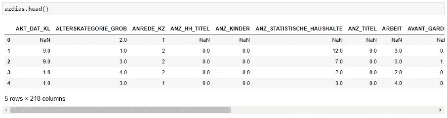

图二。筛选后一般人群数据框中的前几行(图片由作者提供)

之后，对客户数据应用相同的过程。

# 2.探索性数据分析

有趣的部分开始了。在本节中，我们的目标是执行之前的分析，以指出可能的方向，特别是提取一些关于与一般人群相比的客户特征的见解。

几个问题引导了这个*探索性数据分析*任务:

*   顾客多大了？
*   他们住在哪里？
*   作为消费者，他们是如何分类的？
*   他们的收入如何？
*   他们的消费习惯、生活方式、家庭构成是怎样的？

下面介绍了 *EDA* 的主要发现，这些发现有助于对客户的主要概况进行概述:

## 2.1 青年十年

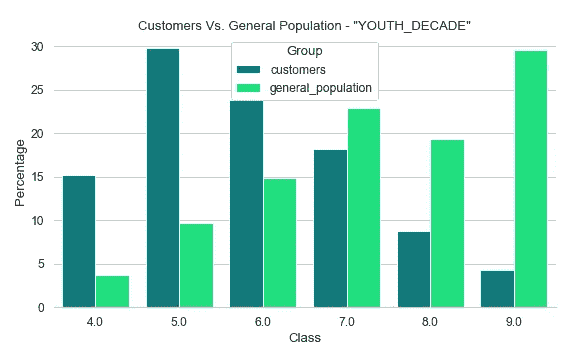

图 3。对比顾客和普通人群的青春十年的柱状图(图片由作者提供)

青年十年是这个项目第一部分的特色之一。它表示一个人在哪个年代度过了他/她的青年时期，从与 *40 岁*相关的 4 到表示 *90 岁*的 9。

虽然年轻人在总人口中的比例更高，但在客户中却发生了相反的情况，这表明大多数邮购公司的客户往往由老年人代表。

## 2.2 青年运动

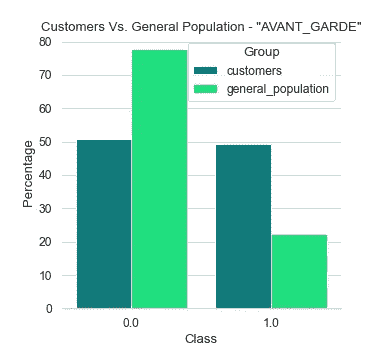

图 4。对比顾客和普通人群前卫运动发生率的条形图(图片由作者提供)

另一个设计特色是，**前卫**表明人们在年轻时参与了哪种运动:*前卫*或*主流*。1 表示与*前卫*运动相关，0 表示与*主流*运动相关。

尽管在顾客中，前卫和主流的比例相当，但与普通人群相比，顾客群体中前卫的比例明显过高。

## 2.3 家庭状况

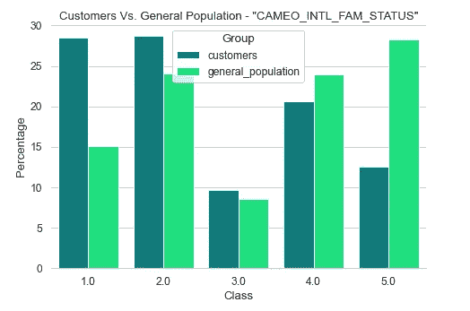

图 5。比较客户和普通人群家庭状况的条形图(图片由作者提供)

**家庭状况**专题讲述了 5 个不同的阶层:

*   `1` : *有钱人*；
*   `2` : *繁华*；
*   `3` : *舒服*；
*   `4` : *不太富裕*；
*   `5` : *更穷*。

虽然在一般人群中，较贫穷和不太富裕的家庭较为普遍，但在客户中，最常见的家庭是*富裕*和*富裕*的家庭，这表明，尽管该公司向不同人群的客户伸出援手，但与*富裕家庭*相关的地位最为普遍。

## 2.4 家庭收入

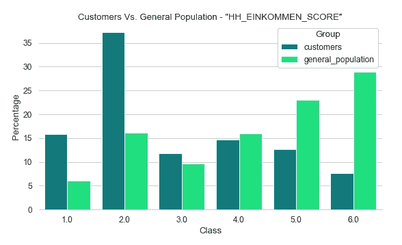

图 6。比较客户和普通人群家庭收入的柱状图(图片由作者提供)

**家庭收入**代表:

*   `1` : *最高收益*；
*   `2` : *极高收益*；
*   `3` : *高收入*；
*   `4` : *平均收入*；
*   `5` : *低收入者*；
*   `6` : *收入很低*。

再一次，我们可以看到一个明显的*高收入*家庭的过度代表*，加强了之前特征分析的观点。*代表性不足*恰恰发生在与*低收入*和*极低收入*相关的阶层。*

# 3.无监督 ML 任务:聚类分析

## 3.1 数据转换

为了将人口分组到不同的群集中，必须应用更多的变换，遵循以下过程:

*   又开发了一个**功能工程**流程，这一次是在 *CAMEO_DEU_2015* 功能上，替换了它的 44 个值类，这些值在 0 到 3 的范围内表示它们在客户中的过度表现程度；
*   *数值变量*的*缺失值*被中值代替，防止异常值的影响；
*   *使用 *pandas 的* `get_dummies`函数转换分类特征*；因此，*缺失值未被估算*，并在分析中被间接考虑；
*   在对*缺失值*进行处理后，使用*scikit-learn***standard scaler**对数据进行**标准化**；
*   一旦所有数据都在同一尺度上，就应用了**降维**技术( **PCA** )来减少特征的数量，并捕捉数据中最重要的方面。

在最后一步(*降维*)中，考虑了之前讨论的*信息等级*。假设是较低水平的信息包含更具体的信息，可以更好地解释群体之间的差异。

考虑到这一点，对于每个级别的信息，都应用了特定的 **PCA** ，从而产生了*纯成分*。换句话说，*每一级信息被单独处理*，而*每一个组件只能代表一级信息*。

为了确定每个信息级别的组件数量，研究了解释的方差，优先考虑低级别:

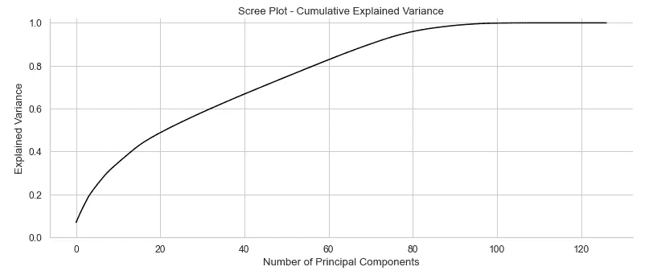

图 7。Scree 剧情人物关卡(图片由作者提供)

在**人员**级别，保持 60%的解释差异，产生 **30 个组件**。

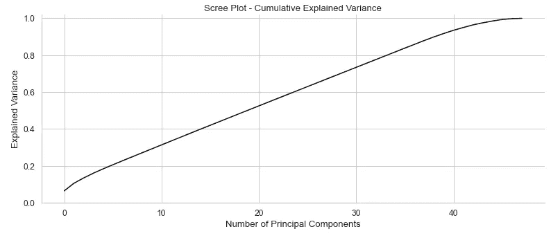

图 8。Scree Plot 家庭级(图片由作者提供)

在**家庭**层面， **20 个组成部分**可以解释大约 50%的数据差异。

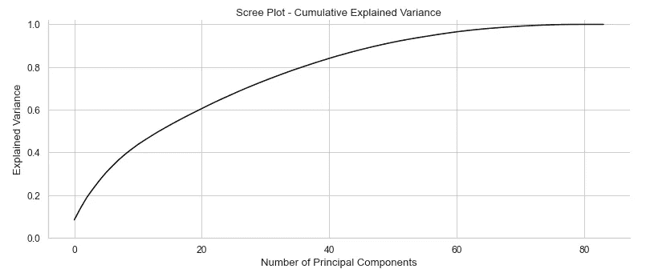

图 9。Scree Plot 微单元级别(图片由作者提供)

在**微单元**水平，选择的组件数量为 **10** ，解释了超过 40%的差异。

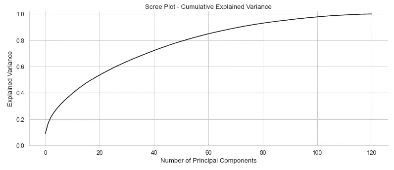

图 10。Scree Plot 宏单元级别(图片由作者提供)

最后，在**宏单元**级别， **10 个组件**解释了大约 40%的方差。

**社区**级别仅由*的三个特征*组成，正因为如此，不需要降维。

## 3.2 均值聚类

一旦数据准备好由 **KMeans** 算法处理，就使用**肘方法**来决定适当的聚类数。

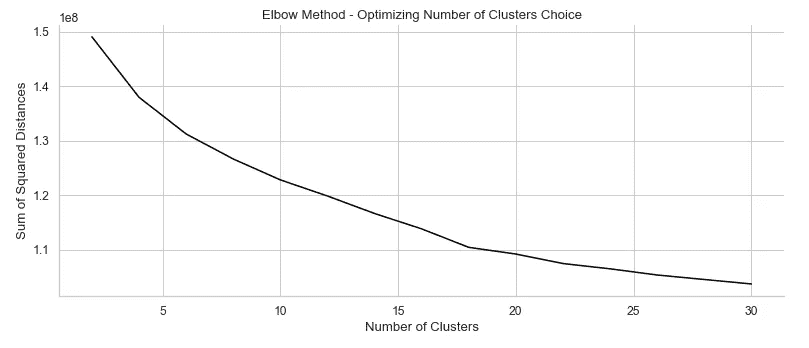

图 11。肘法图(图片由作者提供)

由于没有清晰的*弯头*指示最佳集群数，因此观察到线倾斜。在 20 个集群的数量之前，倾向中最有表现力的变化发生。于是，决定继续进行 **18 个星团**的实验。

随着*普通人群*被分成 18 个不同的组，算法预测每个*顾客*的观察值属于哪个组。之后，可以比较普通人群和客户人群中的聚类分布。

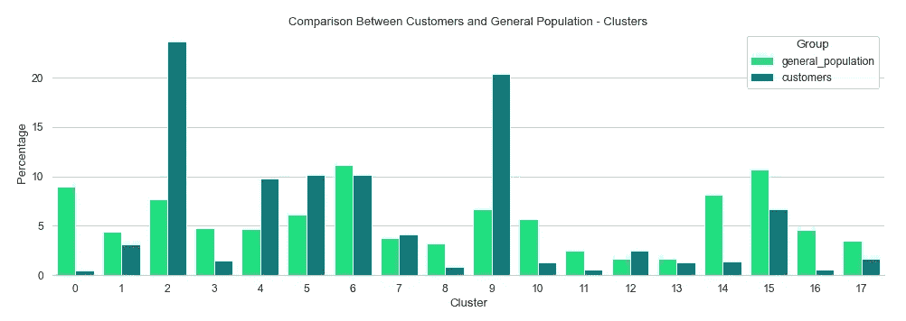

图 12。比较客户和普通人群的聚类发生率的条形图(图片由作者提供)

这些是突出显示的集群，表示客户中*代表过多的*和*代表不足的*群体:

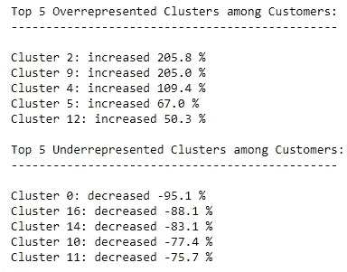

图 13。代表人数过多和不足的组别(作者图片)

# 4.客户细分报告

在这个阶段，需要解释这些集群，这样我们就可以了解哪些配置文件更有可能成为公司的客户。为了解释每个聚类代表什么，**聚类中心**表示最重要的组件，这些组件与最重要的功能相关联，从而允许进行聚类描述。

## 4.1 任职人数过多的群组

**4.1.1 绿色梦想家(集群#2)**

Agnieszka Boeske 的照片

*   他们的度假习惯可以归类为*自然爱好者*，已经强调绿色倾向是这个集群所代表的人群中存在的一个重要方面；
*   绿色方面通过*前卫*方面得到加强，将这个群体与具有前卫思维的人联系起来，这也将他们与*绿色前卫*运动联系起来；
*   他们似乎没有熟悉的头脑；
*   这个群体主要代表了不是单身的，没有批判性思维，但是有梦想和社会意识的男人。

**4.1.2 传统上流社会的长者(群组#9)**

照片由[拉维·帕特尔](https://unsplash.com/@ravi_patel)拍摄

*   他们处于生命的高级阶段，表现为家庭或多人家庭，也与较高的收入有关；
*   他们的社会地位可以分为独立者、房主和高收入者；
*   他们不是梦想家，也不是面向多事的人，但他们可以表现为批判性和传统思想，以及宗教信仰；
*   这个集群描述的是老年人。

**4.1.3 空巢、满钱包(集群#2)**

由 [Toa Heftiba](https://unsplash.com/@heftiba) 拍摄的照片

*   它主要代表中高收入夫妇；
*   它也可以代表有房夫妇和高收入夫妇；
*   第三个组成部分带来了之前看到的方面，传统思想，宗教，但不是面向事件的；
*   可以说，以前看到的一些方面现在主要适用于不同年龄的高收入夫妇，也适用于成熟和高收入夫妇。

## 4.2 代表性不足的群组

**4.2.1 新手少(集群#0)**

[邹蒙](https://unsplash.com/@xxm)摄

*   它代表可以被归类为不太富裕或较贫穷的人，主要指准家庭夫妇和单身或有孩子的年轻夫妇；
*   他们的家庭收入可以被认为是较低或非常低的收入，他们的保险类型大多被归类为*社会安全驱动型*；
*   就健康和购物类型而言，他们可以被描述为*卫生爱好者*和*要求高的购物者*；
*   微小区部分表示在 1994 年之前建造的、有两个或两个以上前业主的高护理率地区，从而形成了生活在较贫困地区的低收入人群的形象。

**4.2.2 多代储蓄者(第 16 组)**

安德烈·泰森[的照片](https://unsplash.com/@andretaissin)

*   该集群描述了来自多人家庭的低收入和较高年龄的平均收入者，以及被归类为*两代家庭*的家庭；
*   低收入或中等收入家庭的单身人士，以及来自多人家庭的较年轻的中等收入者也占了很大一部分。这个档案倾向于与住在西区的人有关；
*   他们的财务类型被划分为低财务利息或存钱型。

**4.2.3 二手车细胞(第 14 组)**

尼古拉·贾斯特森拍摄的照片

*   它代表可以被归类为不太富裕或较贫穷的人，主要指准家庭夫妇和单身或有孩子的年轻夫妇；
*   微小区部分表示 1994 年以前建造的、有两个或两个以上的前业主的高护理率地区，造成了生活在贫困地区的低收入人群的形象；
*   它还描述了家庭住房比例高、每户拥有汽车比例极低以及靠近市中心的地区；
*   这些方面中的大多数已经在其他集群中被强调，但是在这种情况下，它似乎更强调微观和宏细胞方面，而不是与人相关的方面。

## 4.3 行动呼吁

虽然有一个清晰的轮廓表明特定人群更有可能成为公司的客户，但重要的是要强调这样一个事实，即当涉及到收入、年龄或社会阶层分析时，基本核心客户代表了人口中较小的一部分。

这也可以被视为该公司的一个巨大机会，一旦可以推出现有产品的不同和更简单的版本，例如，可以由低收入人群购买。

与此同时，也有可能接触到特别关注环保问题的年轻人，投资与这些新一代沟通的定向营销活动。他们有可能成为一辈子的顾客。

# 5.监督式营销任务:营销活动的目标客户

在这个项目的最后一部分，不同的方法被用来寻找预测一个人在面对营销活动时有多大可能做出反应的最佳模型。

主要序列包括:

*   开发**数据转换**和**机器学习流水线**，避免*数据泄露*；
*   在数据转换过程中测试不同的方法: *PCA* ，*truncated VD*， *SMOTE* 等等；
*   用 **GridSearchCV** 和 **BayesSearchCV** 进行参数整定；
*   **在 *Kaggle* 平台上对**预测进行评分，以检查模型在未知数据上的表现。

## 5.1 评估指标

可以使用不同的度量来评估模型性能。在这个具体案例中，训练数据是呈现**阶层失衡**的典型案例。这意味着大多数观察结果对应于没有对营销活动做出响应的人。

在这种情况下，算法可能了解了其中一个类的很多信息，但却无法“理解”另一个类。因为我们对这两个类都同等关注，所以`roc_auc`分数显示为一个要使用的适当度量，因为它代表了*真阳性率*和*假阳性率*之间的权衡。

## 5.2 学习曲线

**学习曲线**被评估为几个算法做出一个首选。在该分析中，**梯度提升分类器**是性能最好的一个。

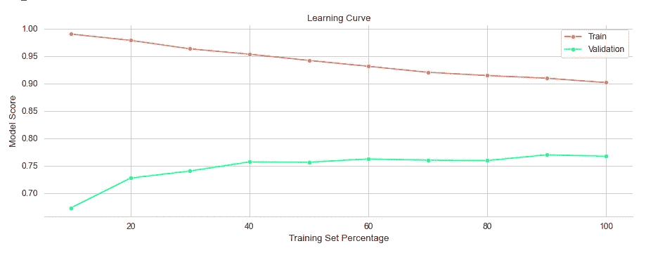

图 14。学习曲线梯度推进分类器(图片由作者提供)

学习曲线呈现收敛，没有**过度拟合**的迹象。正因为如此，第一次尝试是基于这种机器学习算法。

基本转换后，*数据管道*包括:

*   选择**数字特征**并用**中值**输入缺失值，之后**将数据**标准化到一个共同的尺度；
*   **分类特征**中的缺失值用**最常用值**(可以解释为*模式*)进行插补，然后特征被**一键编码**；
*   **具有缺失值的二进制特征**遵循与分类特征相同的程序，没有缺失值的二进制特征不进行任何进一步的变换。

另一方面，*机器学习管道*包括:

*   **按照上述模式预处理**测试集*上的数据；*
*   **训练**通过 **GridSearchCV** 测试不同参数组合的算法；
*   **在*测试集*上预测**不同的*交叉验证*折叠；
*   **通过 **roc_auc** 分数评估**模型，给出数据中显示的高级别不平衡；
*   返回最佳模型。

## 5.3 第一种方法:梯度提升分类器+ GridSearchCV

在第一次尝试中，两个模型的参数是固定的:

*   `learning_rate`:设定为*0.1*；
*   `n_estimators`:设定为 *150* 。

GridSeachCV 搜索三个参数的最佳组合:`min_samples_split`、`max_depth`和`max_features`。

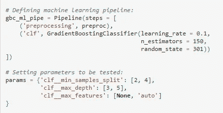

图 15。梯度增强分类器的参数调整(图片由作者提供)

`min_samples_split`是指*分割一个内部节点*所需的最小样本数，这里测试了两个值( *2* 和 *4* )。

`max_depth`表示*单个回归估计器*的最大深度，限制树中节点的数量。 *3* 和 *5* 是这里测试的数值。

`max_features`指定*寻找最佳分割*时要考虑的特征数量。如果*无*，所有特征都是要选择的候选，如果*自动*，模型限制可以选择的特征数量，在这种情况下，是特征总数的平方根。

考虑到这些参数和`roc_auc`得分，这是最佳组合:

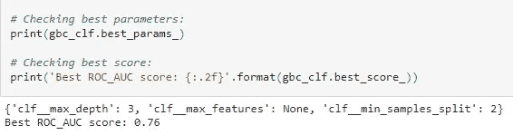

图 16。梯度增强分类器的参数调整结果(图片由作者提供)

最后，这个模型被用来预测**新的未知数据**。在 *Kaggle* 平台上提交这些预测后，可以获得实际的模型分数。

第一个模型取得了合理的 roc_auc 分数 *0.79488* 。考虑到 *Kaggle* 排名，第一种方法被定位在**前 150** 车型中。

之后，为了改进第一个模型，测试了不同的方法。基本上，测试了不同的算法，包括 **Ada Boost 分类器**和 **LightGBM 分类器**，以及**数据预处理流水线**的一些变体。

在这些尝试中，有一个单一的模型克服了第一个。应用了相同的数据转换和机器学习管道。梯度增强分类器被 **XGBoost 分类器**取代，而 GridSearchCV 则给 **BayesSearchCV** 让出了空间。

## 5.4 最佳方法:XGBoost 分类器+ BayesSearchCV

当 *GridSearchCV* 组合不同的参数值以找到优化结果的组合时， **BayesSeachCV** 接收与每个参数相关的一系列值(*整数*、*实数*或*分类*)。

一旦发现一个改进，它会更深入地探索该区域以实现更高的改进。

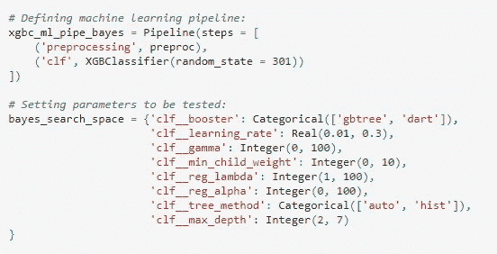

图 17。XGBoost 分类器的参数调整(图片由作者提供)

在这种尝试中，之前没有固定任何参数。测试了 g*b 三个*和*镖*内置助推器，以及两种不同的采油树方法:*自动*和*历史*。

进行进一步叶节点划分所需的最小损失减少(`gamma`)被设置在从 *0* 到 *100、*的范围内，而`learning_rate`被限制在 *0.01* 到 *0.3* 的范围内。还测试了不同的正则化项(`lambda`和`alpha`)。

第一轮搜索的结果是`roc_auc`得分 *0.7263* 。最后一轮网格搜索产生了这些参数的组合及其最终得分:

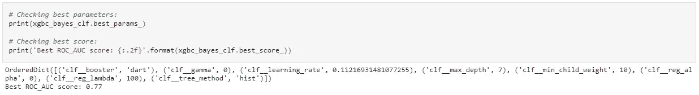

图 18。XGBoost 分类器的参数调整结果(图片由作者提供)

当使用该模型预测未知的测试数据时，它获得了 *0.80492* 的`roc_auc`分数，位于 Kaggle 平台上**前 40** 车型中。

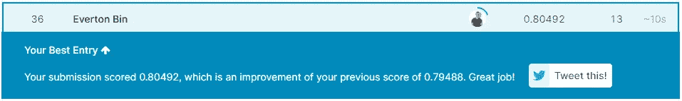

图 19。Kaggle 排名(图片由作者提供)

## 5.5 挑战

在训练和测试不同的模型和方法时，最大的挑战是计算能力，尤其是我个人笔记本上的可用内存。

因为我决定使用整个数据集，而不是它的随机子集，所以训练一些算法需要几个小时，特别是考虑到参数调整方法。

在其中一次尝试中，我决定测试神经网络分类器，在超过 12 个小时后，在参数调整回合中没有显示出改进，我取消了这次试验。

虽然像 LightGBM 这样的轻量级算法可以很好地执行，但更高的计算能力将允许不同和更复杂的方法。

# 6.结论

这个项目代表了一个巨大的挑战，尤其是因为要考虑的数据量和不同的特性。

此外，它是**真实数据**，这意味着它在许多方面类似于任何公司的普通数据科学项目的挑战。

除了评估不同算法的学习曲线，我还必须说，在这个项目的开发过程中，我自己的学习曲线呈指数增长，而且远远没有过度拟合，尽管收敛仍在进行中——这是必须的，因为作为数据科学家，我们需要将持续学习作为一种生活方式。

该项目有很大的改进空间，其中一些将被列为可能的方法:

*   代替使用所有的特征(在删除具有高比例缺失值的特征之后)，可以进行特征重要性分析，仅选择与任务更相关的特征；
*   含有大量缺失值的观测值可以删除；
*   在数据转换期间，许多步骤可以不同的方式进行:数值插补可以遵循不同的规则，而不是中值插补，或者缺失值可以根据其他特征进行推断；
*   分类特征不一定需要对其缺失值进行估算，相反，它们可以被转换为虚拟变量，缺失值将被间接考虑。如果他们持有一些信息，这可能代表结果的改善；
*   当缩放数字特征时，可以测试不同的方法作为本项目所选标准缩放器的替代方法；
*   可以测试不同的算法和超参数调谐技术；
*   可以开发更多的特征工程，以提供隐藏的信息或突出代表不同客户的重要方面。

关于这个项目，我想强调几件事:

*   令人着迷的是，有多少数据可以告诉人们，特别是在客户细分项目中，使我们有可能了解他们住在哪里，他们赚多少钱，他们喜欢什么，以及他们如何思考；
*   开发这样一个项目不仅仅是应用技术，还包括保持好奇心和提出正确的问题；
*   比找到正确问题的正确答案更重要的是理解这些信息的价值，以及利用这些信息可以做些什么。

*感谢您的阅读！*

*如果你想查看为这个项目开发的笔记本，可以在这里* *访问* [*。*](https://github.com/evertonbin/customer-segmentation-arvato)