# 在线零售中的客户细分

> 原文：<https://towardsdatascience.com/customer-segmentation-in-online-retail-1fc707a6f9e6?source=collection_archive---------3----------------------->

## 使用 python 在在线零售数据集中执行客户细分的详细分步说明，侧重于群组分析，使用 RFM 分析和聚类了解购买模式。


马库斯·斯皮斯克在 [Unsplash](https://unsplash.com?utm_source=medium&utm_medium=referral) 上的照片

在这篇文章中，我将讲述如何使用 python 对在线零售数据进行客户细分和其他相关分析。

*这会变得有点长，所以请随意一次浏览一些部分，然后再回来。*

在定义客户细分之前，让我们先来看看在线零售是如何工作的，以及相关的数据会是什么样子。当一个人走进零售店购买一些商品时，应该生成以下基本数据点:

1.  客户名称/客户 ID
2.  客户的地址/联系电话(人口统计信息)
3.  发票号码
4.  产品名称和产品代码
5.  量
6.  单价
7.  交易的日期和时间
8.  优惠券代码(如果适用)
9.  折扣金额(如果适用)

现在我们已经对零售数据的样子有了一个基本的概念，让我们来思考一个公司应该如何思考，以便制定有效的营销政策。

对于一个小公司来说，客户群通常很小，并且是单独的目标。但是，随着企业规模的增长，企业不可能对每个客户都有一种直觉。在这样的阶段，关于追求哪些客户的人类判断将不起作用，企业将不得不使用数据驱动的方法来建立适当的战略。

对于一家中大型零售商店来说，他们不仅要在获取新客户方面投资，还要在客户维系方面投资，这也是非常必要的。许多企业的大部分收入来自他们的“最佳”或高价值客户。由于公司拥有的资源是有限的，找到这些客户并锁定他们是至关重要的。同样重要的是，找到处于休眠状态/高风险的客户来解决他们的问题。为此，公司使用客户细分技术。

商业和经济学中经常使用的一个公理是帕累托原则。这也适用于理解公司的收入流。

> 根据**帕累托** **原则**，80%的结果来自任何给定事件的 20%的原因。

用商业术语来说，我们可以说 20%的客户贡献了一个公司总收入的 80%份额。这就是为什么找到这些人很重要。我将在本文后面详细解释客户细分的重要性。

现在让我们试着理解什么是客户细分，为什么它是制定有效战略的有效工具。然后，我们将研究如何进行分段。

# 了解客户细分

客户细分是根据客户的共同行为或其他属性将客户分成不同群体的过程。这些组内部应该是同质的，并且彼此之间也应该是异质的。该流程的总体目标是识别高价值客户群，即具有最高增长潜力或利润最高的客户。

从客户细分中获得的见解被用于制定量身定制的营销活动，并用于设计整体营销战略和规划。

对于一个公司来说，一个关键的考虑因素是是否要对其客户进行细分，以及如何进行细分。这将取决于公司的理念和它提供的产品或服务的类型。遵循的细分标准类型将在企业运营和制定战略的方式上产生巨大差异。这一点将在下文阐述。

1.  **零细分:** *<无差别方法>* 这意味着公司以相似的方式对待所有的客户。换句话说，没有差异化的策略，所有的客户群都是通过单一的大规模营销活动获得的。
2.  **一个细分市场:** *<聚焦方法>* 这意味着公司在严格定义的目标市场中瞄准特定的客户群体或利基。
3.  **两个或两个以上的细分市场:** *<差异化策略>* 这意味着公司针对其客户群中的两个或两个以上的群体，并为每个细分市场制定具体的营销策略。
4.  **成千上万的细分市场:** *<超细分方法>* 这意味着公司将每个客户都视为独一无二的，并为他们中的每一个人提供定制服务。

一旦公司确定了它的客户群和它要关注的细分市场的数量，它就需要决定在哪些因素的基础上对客户进行细分。

> F *企业对企业营销公司细分的参与者:*

1.  *行业*
2.  *员工人数*
3.  *位置*
4.  *市值/公司规模*
5.  *公司的年龄*

> F *消费者营销公司业务细分的参与者:*

1.  *人口统计*:年龄、性别、教育程度、民族、收入、就业、爱好等。
2.  *最近、频率和货币:*最后交易的时间段、客户交易的频率和交易的总货币价值。
3.  *行为:*既往购买行为、品牌偏好、生活事件等。
4.  *心理测验*:信念、个性、生活方式、个人兴趣、动机、优先级等。
5.  *地理位置*:国家、邮政编码、气候条件、城乡地域差异、市场可达性等。

# 为什么要细分您的客户？


照片由 [Ivan Bajalovic](https://unsplash.com/@ivanbajalovic?utm_source=medium&utm_medium=referral) 在 [Unsplash](https://unsplash.com?utm_source=medium&utm_medium=referral) 上拍摄

客户细分有许多潜在的好处。它有助于公司制定针对客户的有效战略。这对整个产品开发周期、预算管理实践以及向客户交付目标促销内容的计划都有直接影响。例如，一家公司可以生产高端产品、廉价产品或廉价替代产品，这取决于该产品是面向其收益率最高的客户、频繁购买者还是面向低价值客户群体。它还可以微调产品的特性，以满足客户的特定需求。

客户细分还有助于公司了解客户的相似性，对他们来说什么重要，什么不重要。通常，此类信息可用于为不同的客户群开发个性化的相关内容。许多研究发现，顾客欣赏这种个人关注，更有可能做出反应并购买产品。他们也开始尊重这个品牌，并感受到与它的联系。这可能会使该公司比竞争对手有很大优势。在这个世界上，每个人都有成百上千的电子邮件、推送通知、消息和广告进入他们的内容流，没有人有时间关注不相关的内容。

最后，这种技术也可以被公司用来测试他们不同产品的定价，改善客户服务，以及追加销售和交叉销售其他产品或服务。

# 如何细分您的客户？

从客户细分开始，公司需要有一个清晰的愿景和目标。可以采取以下步骤在广泛的层面上寻找客户群中的细分市场。

1.  *分析现有客户群:*了解地理分布、客户偏好/信念，查看网站搜索页面分析等。
2.  *了解每位客户:*将每位客户映射到一组偏好，以了解和预测他们的行为:他们感兴趣的产品、服务和内容。
3.  *定义细分市场机会:*一旦确定了细分市场，就应该对每个细分市场及其挑战和机会有一个正确的业务理解。整个公司的营销策略可以扩展以迎合不同的顾客群。
4.  *研究细分市场:*在巩固了不同客户细分市场的定义和业务相关性后，公司需要了解如何修改其产品或服务以更好地迎合他们。例如，它可能决定向一些客户提供比其他客户更高的折扣，以扩大其活跃客户群。
5.  *调整策略:*尝试新策略，了解时间和经济对不同细分市场客户购买行为的影响。然后应该重复这个过程，以便尽可能地改进策略。

# 入门指南

在下面的分析中，我将使用在线零售数据集，它是从 UCI 机器学习知识库中获得的。该数据包含英国注册的无店铺在线零售商的跨国交易信息。数据的链接可以在[这里](https://archive.ics.uci.edu/ml/datasets/online+retail)找到。

# 数据快照

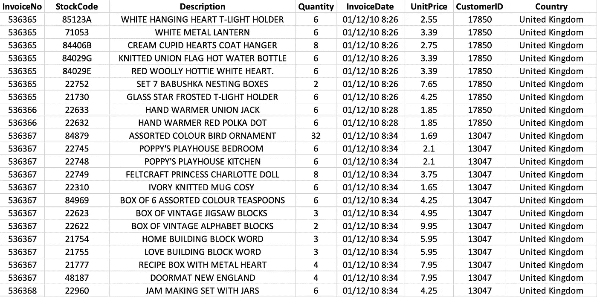

图:数据示例

# 数据属性

1.  **发票号**:发票号。名义上，分配给每笔交易的 6 位整数。如果此代码以字母“c”开头，则表示取消。
2.  **库存代码**:产品(项目)代码。名义上，一个 5 位数的整数，唯一分配给每个不同的产品。
3.  **描述**:产品(物品)名称。名义上。
4.  **数量**:每笔交易每种产品(物品)的数量。数字。
5.  **发票日期**:发票日期和时间。数字，每笔交易生成的日期和时间。
6.  **单价**:单价。数字，单位为英镑的产品价格。
7.  **客户编号**:客户编号。名义上，一个唯一分配给每个客户的 5 位整数。
8.  **国家**:国家名称。名义上，每个客户居住的国家的名称。

# 探索数据

在深入了解数据之前，从数据中删除了重复条目。该数据包含 5268 个重复条目(大约 1%)。

现在让我们看看数据中产品、交易和客户的总数，它们对应于数据中唯一的股票代码、发票号和客户 id 的总数。

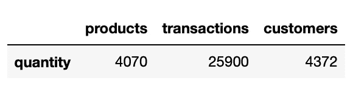

图:数据中产品、交易和客户的数量

因此，对于 4070 个产品，数据中有 25900 个交易。这意味着每个产品都可能在数据中有多个交易。数据中的产品几乎和客户一样多。

由于来自 UCI 机器学习知识库的数据描述了基于英国注册的无店铺在线零售交易的数据，让我们检查数据中来自每个国家的订单百分比。

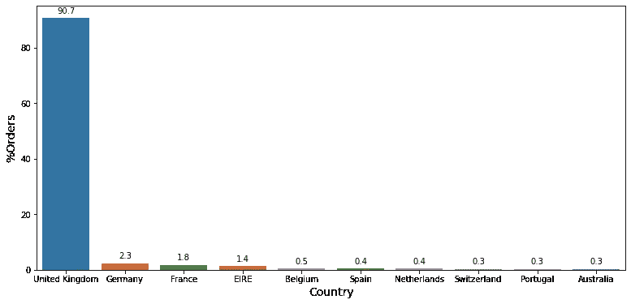

图:来自每个国家的订单百分比

上图显示了来自前 10 个国家的订单百分比，按订单数量排序。这表明，超过 90%的订单来自英国，没有其他国家甚至占数据中订单的 3%。

因此，为了分析的目的，我将采用与来自英国的订单相对应的数据。该子集将在接下来的步骤中制作，并将在需要时提及。

现在让我们看看数据中取消订单的数量。根据数据，如果发票编号代码以字母“c”开头，则表示订单已取消。

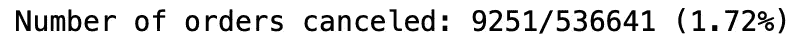

创建了一个标志列来指示订单是否对应于取消的订单。所有取消的订单都包含负数量(因为这是取消)，因此从数据中删除。

最后，我运行了一个检查，以确认在没有取消的订单中是否有任何数量为负的订单。有 1336 个这样的案例。


图:检查数据中数量为负的订单

从上图可以看出，这些情况是 CustomerID 值为 NaNs 的情况。这些病例也被从数据中删除。

现在，数据被过滤为只包含来自英国的订单，最后，通过调用。info()方法:

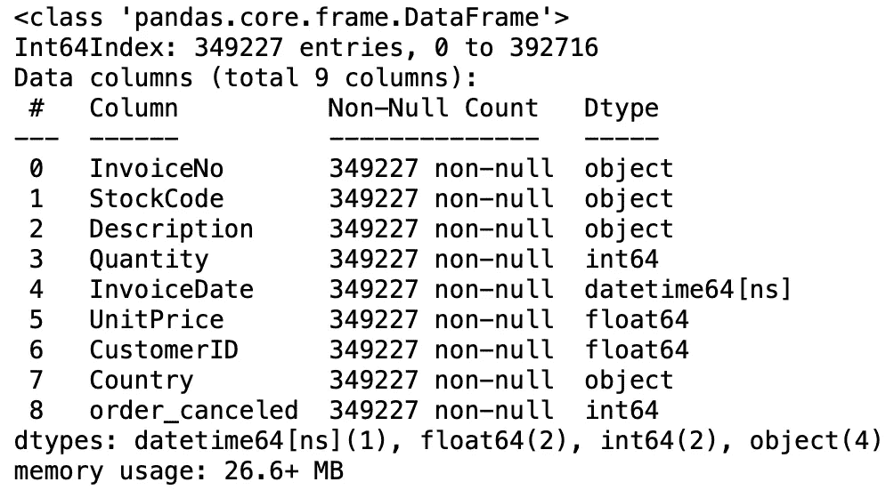

图:。最终清理数据的 info()方法输出

数据中的任何列都没有空值，数据中共有 349227 行。现在，让我们检查清理后的数据中的产品、交易和客户的数量:

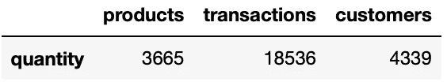

# 了解队列分析

现在让我们试着理解队列分析，这样我们就可以对我们的数据进行分析。

但是，什么是**队列**？

一个*群组*是一组随着时间推移共享相似特征的用户。群组分析将用户分成相互排斥的组，并随着时间的推移测量他们的行为。

它可以提供关于产品和客户生命周期的信息。

群组分析有三种类型:

1.  **时间分组:**它根据一段时间内的购买行为对客户进行分组。
2.  **行为群组:**它根据客户注册的产品或服务对客户进行分组。
3.  **规模群体:**指购买公司产品或服务的各种规模的客户。这种分类可以基于一段时间内的消费金额。

了解不同人群的需求有助于公司为特定人群设计定制服务或产品。

在下面的分析中，我们将创建时间群组，并查看在特定群组中在一段交易时间内保持活跃的客户。

# 深入队列分析

检查我们的数据的日期范围，我们发现它的范围从开始日期:2010 年 12 月 1 日到结束日期:2011 年 12 月 9 日。接下来，创建一个名为 InvoiceMonth 的列，通过为每笔交易取 InvoiceDate 月份的第一天来指示交易的月份。然后，提取关于交易的第一个月的信息，按 CustomerID 分组。

```
def get_month(x):
    return dt.datetime(x.year, x.month, 1)cohort_data['InvoiceMonth'] = cohort_data['InvoiceDate'].apply(get_month)
grouping = cohort_data.groupby('CustomerID')['InvoiceMonth']
cohort_data['CohortMonth'] = grouping.transform('min')
cohort_data.head()
```

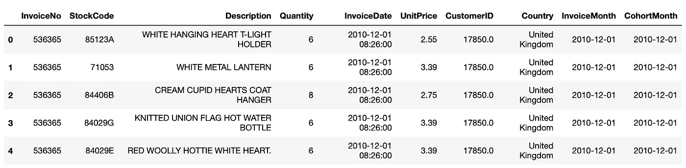

图:创建 InvoiceMonth 和 CohortMonth 列

接下来，我们需要找出 InvoiceMonth 和 CohortMonth 列在月数方面的差异。使用了以下代码:

```
def get_date_int(df, column):    
    year = df[column].dt.year    
    month = df[column].dt.month    
    day = df[column].dt.day
    return year, month, dayinvoice_year, invoice_month, _ = get_date_int(cohort_data, 'InvoiceMonth') 
cohort_year, cohort_month, _ = get_date_int(cohort_data, 'CohortMonth')
years_diff = invoice_year - cohort_year
months_diff = invoice_month - cohort_month
cohort_data['CohortIndex'] = years_diff * 12 + months_diff
cohort_data.head()
```

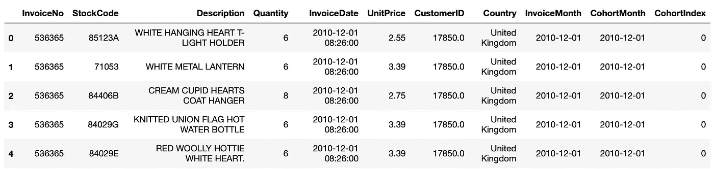

图:创建 CohortIndex 列

获得上述信息后，我们通过按 CohortMonth 和 CohortIndex 对数据进行分组并通过应用 pd 在 CustomerID 列上进行聚合来获得群组分析矩阵。Series.nunique 函数。以下是获得的群组计数:

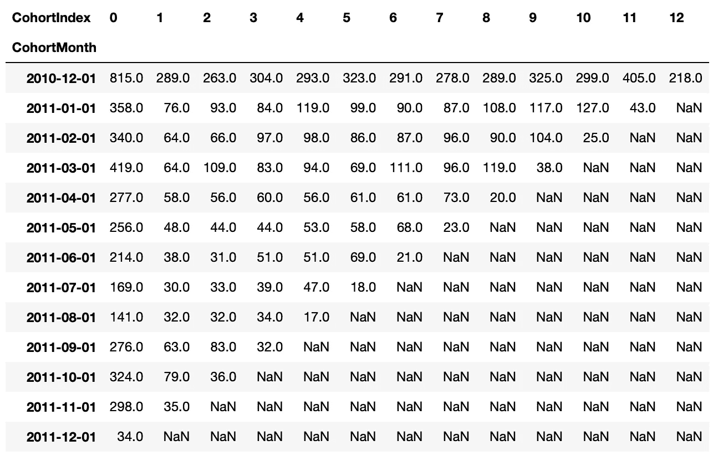

图:群组计数分析

上表告诉了我们什么？

考虑 2010 年 12 月 1 日的同月交易:对于 CohortIndex 0，这告诉我们 815 个不同的客户在 2010 年 12 月 1 日的同月交易。对于 CohortIndex 1，这表明 815 个客户中有 289 个客户在 2010 年 12 月至 2011 年 12 月期间进行了第一笔交易，并且他们在接下来的一个月中也进行了交易。也就是说，他们保持活跃。

对于 CohortIndex 2，这表明 815 个客户中有 263 个客户在 2010 年 12 月至 2011 年 12 月期间进行了第一笔交易，并且在第二个月也进行了交易。对于更高的上皮层以此类推。

现在让我们计算一下*保留率*。它被定义为活跃客户占总客户的百分比。由于每个群组中的活跃客户数量对应于 CohortIndex 0 值，因此我们将数据的第一列作为群组大小。

```
cohort_sizes = cohort_counts.iloc[:,0]# Divide all values in the cohort_counts table by cohort_sizes
retention = cohort_counts.divide(cohort_sizes, axis=0)# Check the retention table
retention.round(3) * 100# Drawing a heatmap
plt.figure(figsize=(10, 8))
plt.title('Retention rates')
sns.heatmap(data = retention,annot = True,fmt = '.0%',vmin = 0.0,vmax = 0.5,cmap = 'BuGn')
plt.show()
```

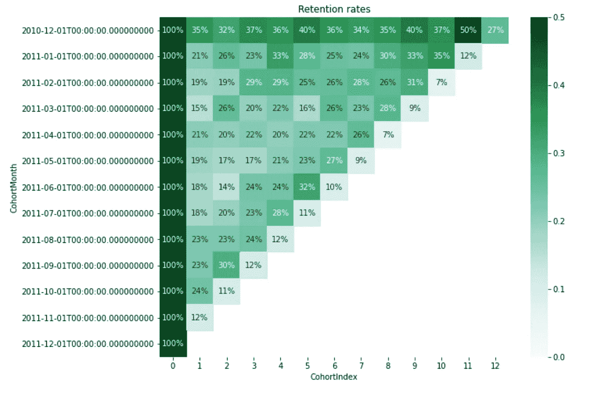

图:保留热图

从上面的保留率热图中，我们可以看到 2010 年 12 月至 2001 年 12 月的平均保留率约为 35%，最高保留率出现在 11 个月后(50%)。对于所有其他同月，平均保留率约为 18–25%。只有这个百分比的用户在给定的 CohortIndex 范围内再次进行交易。

通过这种分析，公司可以了解并制定策略，通过提供更有吸引力的折扣或进行更有效的营销等来增加客户保留率。

# RFM 分割

RFM 代表近期、频率和货币。RFM 分析是一种常用的技术，它根据客户最近一次交易的时间(最近)、去年的交易次数(频率)以及交易的货币价值(货币)来为每个客户生成和分配分数。


在 [Unsplash](https://unsplash.com?utm_source=medium&utm_medium=referral) 上由 [Austin Distel](https://unsplash.com/@austindistel?utm_source=medium&utm_medium=referral) 拍摄的照片

RFM 分析有助于回答以下问题:谁是我们最近的客户？他从我们商店购买了多少次物品？他的交易总值是多少？所有这些信息对于了解客户对公司的好坏至关重要。

获得 RFM 值后，通常的做法是在每个指标上创建“四分位数”,并分配所需的顺序。例如，假设我们将每个指标分成 4 个部分。对于新近度量，最高值 4 将被分配给具有最小新近值的客户(因为他们是最近的客户)。对于频率和货币指标，最高值 4 将分别分配给频率和货币值最高的 25%的客户。在将指标分成四分位数之后，我们可以将指标整理成一列(就像一串字符{ *像‘213’*})来为我们的客户创建 RFM 值的类别。根据我们的需求，我们可以将 RFM 指标分成更多或更少的部分。

现在让我们开始对我们的数据进行 RFM 分析。

首先，我们需要创建一个列来获取每笔交易的货币价值。这可以通过将单位值列乘以数量列来实现。让我们称之为总和。调用。describe()方法对这一列，我们得到:


图:。对 TotalSum 列使用 describe()方法

这让我们了解消费者支出在我们的数据中是如何分布的。我们可以看到平均值是 20.86，标准差是 328.40。但是最大值是 168469。这是一个非常大的值。因此，我们数据中前 25%的总和值从 17.85 快速增加到 168，469。

现在，对于 RFM 分析，我们需要定义一个“快照日期”，即我们进行分析的日期。这里，我将快照日期作为数据+ 1 中的最高日期(数据更新日期之后的第二天)。这等于日期 2011 年 12 月 10 日。(年-月-日)

接下来，我们将数据限制在一年的时间段内，以将最近值限制为最大值 365，并在客户级别上聚合数据，计算每个客户的 RFM 指标。

```
# Aggregate data on a customer level
data = data_rfm.groupby(['CustomerID'],as_index=False).agg({
'InvoiceDate': lambda x: (snapshot_date - x.max()).days,
'InvoiceNo': 'count',
'TotalSum': 'sum'}).rename(columns = {'InvoiceDate': 'Recency',                                                                     'InvoiceNo': 'Frequency','TotalSum': 'MonetaryValue'})
```

下一步，我们根据上述数据创建四分位数，并将这些分数整理到 RFM 细分列中。RFM 分数是通过将 RFM 四分位数指标相加计算出来的。

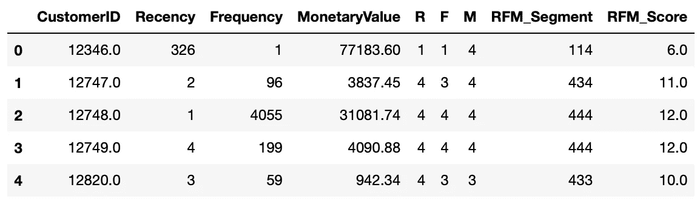

图:RFM 得分和四分位数。

我们现在可以分析我们的结果了。RFM 得分值的范围从 3 (1+1+1)到 12 (4+4+4)。因此，我们可以根据 RFM 分数进行分组，并检查与每个分数相对应的近期、频率和货币的平均值。

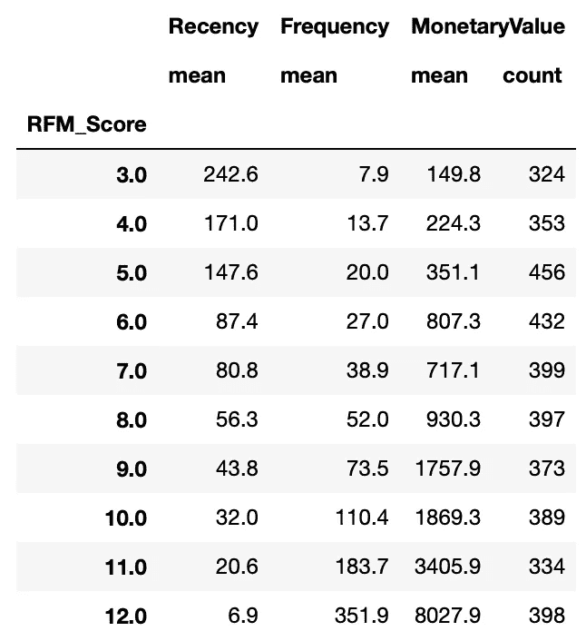

图 5:不同 RFM 分值的近期、频率和货币的平均值

正如所料，具有最低 RFM 分数的客户具有最高的新近价值和最低的频率和货币价值，反之亦然。最后，通过在我们的数据中手动创建类别，我们可以在 RFM 分数 3-12 的分数范围内创建细分市场:RFM 分数大于或等于 9 的客户可以被放在“顶级”类别中。类似地，RFM 分数在 5 到 9 之间的客户可以被归入“中等”类别，其余的可以被归入“低”类别。让我们称我们的类别为“一般 _ 细分”。分析最近、频率和货币的平均值，我们得到:

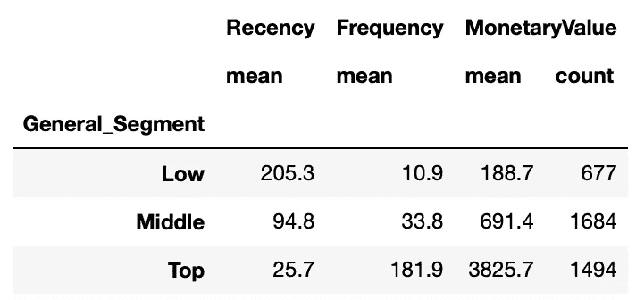

图 2:不同类别的近期、频率和货币的平均值

请注意，我们必须手动创建将客户分为“高”、“中”和“低”类别的逻辑。在许多情况下，这是可以的。但是，如果我们想正确地找出 RFM 值的分段，我们可以使用类似 K-means 的聚类算法。

在下一节中，我们将为 K-means 聚类预处理数据。

# K 均值聚类的数据预处理

K-means 是一种众所周知的聚类算法，经常用于无监督学习任务。我不打算在这里详细说明算法是如何工作的，因为网上有大量的资源。

出于我们的目的，我们需要理解算法对数据做出某些假设。因此，我们需要对数据进行预处理，使其满足算法的关键假设，即:

1.  变量应该对称分布
2.  变量应该有相似的平均值
3.  变量应该有相似的标准偏差值

让我们通过使用 seaborn 库构建近期、频率和货币值变量的直方图来检查第一个假设:

```
# Checking the distribution of Recency, Frequency and MonetaryValue variables.
plt.figure(figsize=(12,10))# Plot distribution of var1
plt.subplot(3, 1, 1); sns.distplot(data['Recency'])# Plot distribution of var2
plt.subplot(3, 1, 2); sns.distplot(data['Frequency'])# Plot distribution of var3
plt.subplot(3, 1, 3); sns.distplot(data['MonetaryValue'])
```

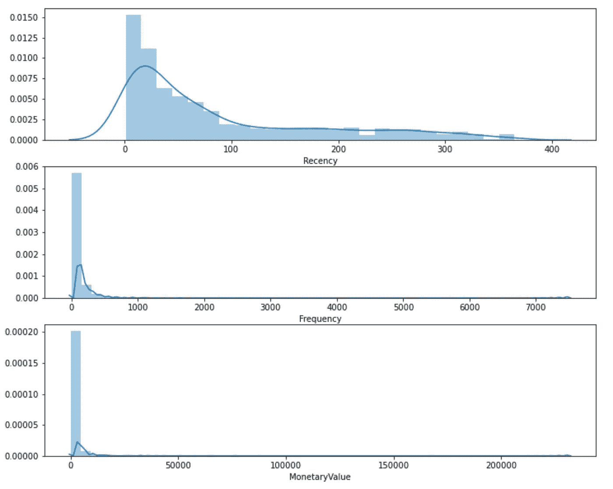

图 2:新近性、频率和货币价值指标的分布

从上图来看，所有的变量并不是对称分布的。他们都向右倾斜。为了消除偏斜，我们可以尝试以下变换:

1.日志转换
2。Box-Cox 变换
3。立方根变换

我将在这里使用对数转换。由于对数转换不能用于负值，我们需要删除它们(如果它们存在的话)。这里可以使用的一个常见做法是添加一个常数值以获得一个正值，这通常被视为每个观察变量的最小负值的绝对值。然而，在我们的数据中，我们没有任何负值，因为我们正在处理客户交易数据集。

检查最近的分布，频率和货币变量，我们得到这个称为。describe()方法:

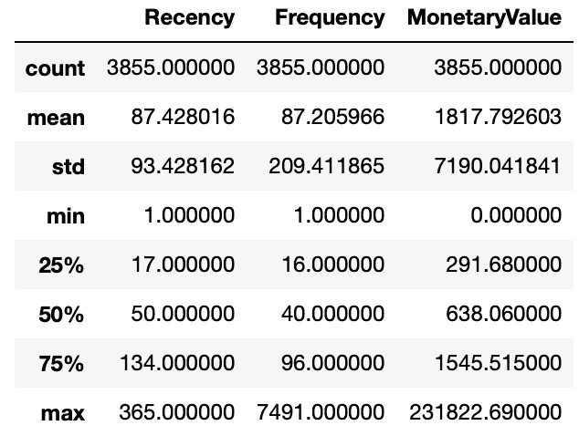

图:。关于 RFM 度量的 describe()方法

从上面的描述中，我们可以看到特定 customerID 的最小 MonetaryValue 是 0。因此，该事务没有任何意义，需要删除。检查事件:

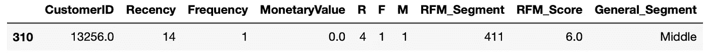

图:货币值为 0 的 CustomerID

该客户已从数据中删除。我们还看到，我们没有得到一个恒定的平均值和标准偏差值。为了检查这一点，我们将对数据进行标准化。首先对数据应用对数变换，并通过 sklearn 库中的 StandardScaler()方法传递它，我们获得了预处理的数据。现在检查对称分布的 RFM 变量的分布:

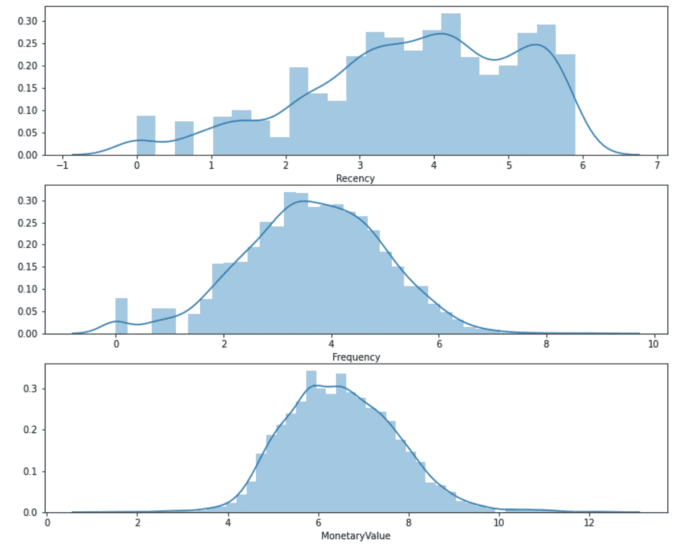

图 2:预处理数据的新近性、频率和货币价值度量的分布

从上面的图中我们可以看出，数据中已经去除了偏斜度。

# K-均值聚类

在这一节中，我们将根据标准化的 RFM 数据构建多个聚类，并尝试使用肘方法找出数据中的最佳聚类数。下面附上的是为此目的的代码。对于每个聚类，我还提取了关于聚类内平方和平均值的信息，通过这些信息，我们可以构建肘图，以在我们的数据中找到所需的聚类数。

```
from sklearn.cluster import KMeanssse = {}# Fit KMeans and calculate SSE for each k
for k in range(1, 21):

    # Initialize KMeans with k clusters
    kmeans = KMeans(n_clusters=k, random_state=1)

    # Fit KMeans on the normalized dataset
    kmeans.fit(data_norm)

    # Assign sum of squared distances to k element of dictionary
    sse[k] = kmeans.inertia_# Plotting the elbow plot
plt.figure(figsize=(12,8))
plt.title('The Elbow Method')
plt.xlabel('k'); 
plt.ylabel('Sum of squared errors')
sns.pointplot(x=list(sse.keys()), y=list(sse.values()))
plt.show()
```

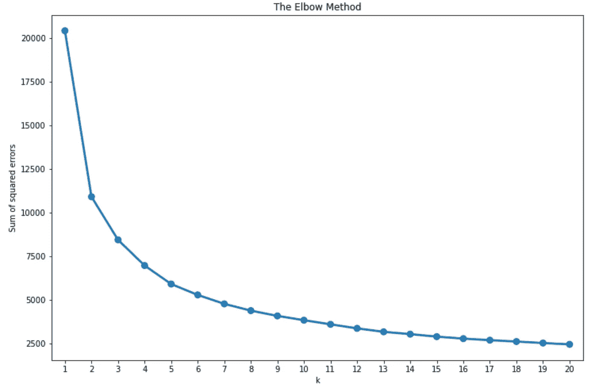

图:肘图

还可以使用轮廓分析来找到最佳的聚类数。你可以在我之前的文章[这里](/evaluating-goodness-of-clustering-for-unsupervised-learning-case-ccebcfd1d4f1)中读到更多。为了这个分析的目的，我只使用了肘图法。

从上面的图中我们可以看出，最佳的簇数是 **3** 或 **4** 。

现在让我们比较一下集群性能。为此，我计算了近期、频率和货币指标的平均值，得到以下结果:

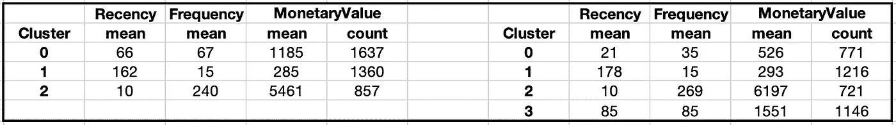

图:比较我们的数据的集群性能(3 到 4 个集群之间)

从上表中，我们可以比较 3 个和 4 个聚类数据的近期、频率和货币指标的平均值分布。使用 k=4，我们似乎可以得到更详细的客户群分布。然而，这可能不是一种视觉上非常吸引人的提取洞察力的方法。

比较聚类段的另一种常用方法是蛇形图。它们通常用于市场研究，以了解客户的看法。

让我们用下面的 4 个集群为我们的数据构建一个蛇形图。

在构建蛇形图之前，我们需要将数据转换成 along 格式，这样 RFM 值和度量名称就分别存储在一列中。链接了解 pd.melt 方法:[链接](https://pandas.pydata.org/docs/reference/api/pandas.melt.html)。

```
# Melt the data into along format so RFM values and metric names are stored in 1 column each
data_melt = pd.melt(data_norm_k4.reset_index(),
                    id_vars=['CustomerID', 'Cluster'],
                    value_vars=['Recency', 'Frequency','MonetaryValue'],
                    var_name='Attribute',
                    value_name='Value')# Building the snakeplot
plt.title('Snake plot of standardized variables')
sns.lineplot(x="Attribute", y="Value", hue='Cluster', data=data_melt)
```

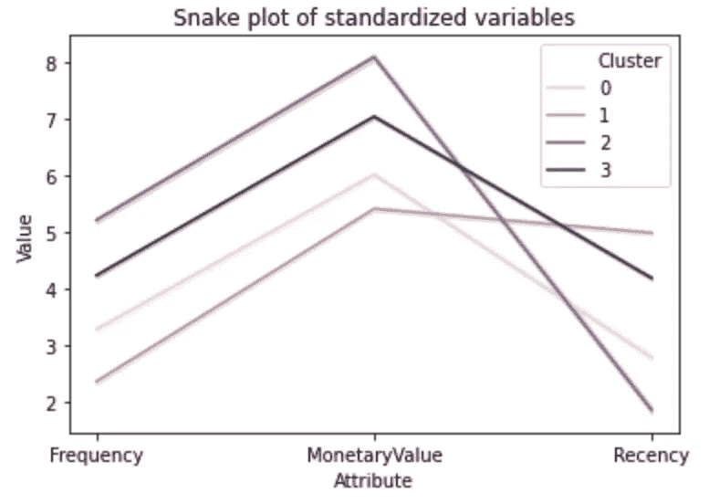

图:具有 4 个聚类的数据的蛇形图

从上面的 snake 图中，我们可以看到最近、频率和货币度量值在四个集群中的分布。这四个集群似乎是相互独立的，这表明集群的良好异质混合。

作为此分析的最后一步，我们现在可以提取每个客户的信息，这些信息可用于将客户与公司的相对重要性对应起来:

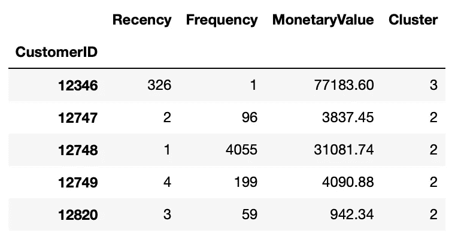

图:每个客户的 RFM 值以及聚类分配

# 最后的想法

从上面的分析中，我们可以看到我们的数据中应该有 4 个集群。为了理解这 4 个集群在业务场景中的意义，我们应该回顾一下比较 3 个和 4 个集群的集群性能的表格，以获得最近发生率、频率和货币指标的平均值。在此基础上，让我们将集群标记为“新客户”、“流失客户”、“最佳客户”和“风险客户”。

下表给出了 RFM 对每个细分市场的解释，以及建议公司在为该客户群设计营销策略时要记住的要点。

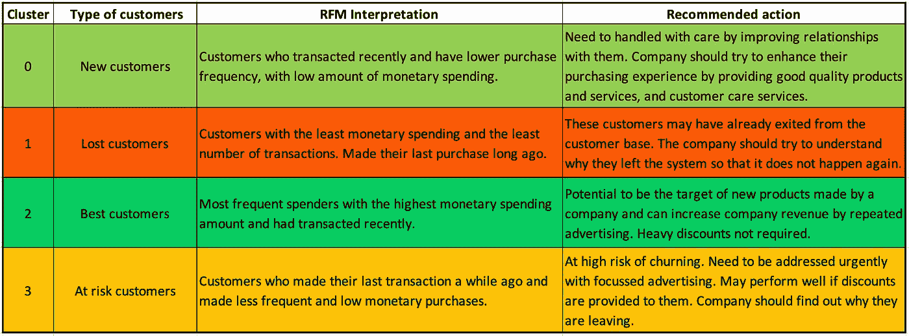

图:集群的业务解释和对每个细分市场的建议行动

# 进一步分析

*   增加了新的变量，如任期:每个客户第一次交易后的天数。这将告诉我们每个客户使用该系统多长时间了。
*   根据地理位置、人口统计和心理因素对客户进行更深入的细分。
*   整合来自谷歌分析业务帐户的数据。Google Analytics 是跟踪许多重要业务指标的重要资源，如客户生命周期价值、流量来源/媒介、每次访问的页面浏览量、公司网站的跳出率等。

*如果您喜欢这篇文章，并认为它内容丰富，请分享它以传播知识:)。谢谢大家！*

链接到该项目的 Github 资源库: [*链接*](https://github.com/rahulkhandelwal396/Customer-Segmentation/blob/main/Customer%20Segmentation.ipynb)

## *参考文献*:

[1][https://www.shopify.in/encyclopedia/customer-segmentation](https://www.shopify.in/encyclopedia/customer-segmentation)

[2][https://learn . data camp . com/courses/customer-segmentation-in-python](https://learn.datacamp.com/courses/customer-segmentation-in-python)

[3][https://looker . com/blog/creating-actionable-customer-segmentation-models](https://looker.com/blog/creating-actionable-customer-segmentation-models)

[4][https://www . business 2 community . com/customer-experience/4-types-of-customer-segmentation-all-markets-should-know-02120397](https://www.business2community.com/customer-experience/4-types-of-customer-segmentation-all-marketers-should-know-02120397)

【https://www.intercom.com/blog/customer-segmentation/ 