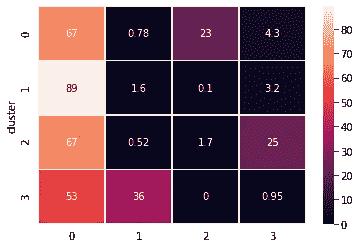

# 客户细分—第一部分

> 原文：<https://towardsdatascience.com/customer-segmentation-part-i-2c5e2145e719?source=collection_archive---------31----------------------->

## 按项目描述对在线客户进行细分

# 介绍

在 [Unsplash](https://unsplash.com?utm_source=medium&utm_medium=referral) 上由 [Charisse Kenion](https://unsplash.com/@charissek?utm_source=medium&utm_medium=referral) 拍摄的照片

客户细分是数据分析/数据科学最常见的用途之一。在这两篇文章系列中，我们将看到一个客户细分的例子。我们将使用[在线零售 II 数据集](https://archive.ics.uci.edu/ml/datasets/Online+Retail+II)，该数据集包含 2009 年 1 月 12 日至 2011 年 9 月 12 日之间英国在线零售商的交易。数据集包含 1.067.371 行关于 5.943 个客户的购买。

在线零售 II 数据集的前几行

正如我们所看到的，数据集包含可以跨越多行的发票订单。每一行代表一个特定的项目，并且包含购买数量、价格、发票日期、客户 ID 和客户国家的信息。

计划是结合两个不同的细分。

*   基于每位顾客购买的商品的细分。
*   基于最近、频率、货币价值(RFM)和国家([第二部分](https://dpanagop-53386.medium.com/customer-segmentation-part-ii-1c94bdc03de5))的细分。

在这第一部分中，我们将根据项目进行细分。在第二部分中，我们将执行 RFM 国家聚类，并将这两个细分结合起来。

该器件的完整代码可在 [Github](https://github.com/dpanagop/data_analytics_examples/blob/master/online_retail/Online_retail_Segmentation_by_buying_category.ipynb) 上找到。

# 基于项目的分段

为了执行基于项目的细分，我们将每个项目分配到特定的类别。我们可以在项目级别执行细分，但累计到类别有两个好处:

*   由于存在 5.699 个唯一项目，使用它们将意味着我们必须在高维空间(即 5.699 维空间)中工作。一般来说，高维空间在聚类时容易出现问题(例如参见“ [k-Means 优缺点](https://developers.google.com/machine-learning/clustering/algorithm/advantages-disadvantages)”中的讨论，
*   如果我们使用类别，就更容易描述集群。

遗憾的是，数据集中没有项目类别。因此，我们必须找到创造它们的方法。为此，我们将对商品的描述执行聚类。我们将使用 k-means 聚类(或者更好的是 k-means 的一种变体，称为[minibatchmeans](https://scikit-learn.org/stable/modules/clustering.html#mini-batch-kmeans))。因为 k-means 只对数值数据起作用，所以我们将描述映射到高维向量。这是通过使用:

*   tfidf 矢量器
*   计数矢量器

(在 [sklearn 的文档中](https://scikit-learn.org/stable/modules/feature_extraction.html#text-feature-extraction)你可以看到这两种方法工作的详细描述)。

这两种不同的方法将允许我们找到对产品类别建模的最佳方式。

# 预处理

需要做一些预处理。首先，我们检查描述中缺少的值，并用“NA”替换它们。然后，我们将“Description”列转换为字符串(有一个单元格是整数，这会导致后面的问题)，并创建一个具有唯一描述的列表。

此外，我们希望从我们的分析中删除常用词。找到它们的一个方法是从所有描述中创建一个词云。

预处理项目描述的代码

物品描述常用词的词云

基于词云，我们创建了停用词表。

# 使用 using 矢量器进行聚类

下面的代码使用 [TfidfVectorizer](https://scikit-learn.org/stable/modules/feature_extraction.html#text-feature-extraction) 将描述映射到向量。然后，它使用 [MiniBatchKMeans，](https://scikit-learn.org/stable/modules/clustering.html#mini-batch-kmeans)k-Means 的一种变体来执行 2，3，…，10 个簇的聚类。结果用于创建距离平方和的图形。

根据[肘方法](https://en.wikipedia.org/wiki/Elbow_method_(clustering))，聚类数最有希望的值是 4、6 和 8。下面的代码分成 4 组，然后显示每个组中描述的单词云。

使用 TfidfVectorizer 映射的 4 个聚类的词云

似乎是:

*   类别 0 是一个非常笼统的概念，
*   类别 1 是关于包的，
*   第二类是关于圣诞装饰，
*   第三类是关于其他类型的装饰。

请注意，与其他类别(分别为 275、204 和 194)相比，类别 0 包含了更多的描述(5.026)。通常，这可能表明我们应该增加集群的数量。

我们可以试着分成 6 个集群，希望大的能分成几个小的。在这种情况下，类别 0 有 4.956 个描述，其余的有 197、173、168、130 和 75 个描述。

*   类别 0 相当笼统，
*   类别 1 在这种情况下也是关于包的，
*   第二类是芳香蜡烛，
*   第三类是关于圣诞装饰，
*   类别 4 是关于其他类型的装饰，
*   第五类是关于杯子、碗和盘子。

类别之间似乎有更多的重叠。单词“杯子”出现在类别 0 中，而单词“杯子”出现在类别 5 中。单词“bowl”出现在类别 0 和类别 5 中。单词“bag”出现在类别 1 和类别 5 中。单词“christmas”同时出现在类别 1 和类别 3 中。

使用 tfidf 矢量器映射的 6 个聚类的词云

# 使用计数矢量器进行聚类

我们使用[计数矢量器](https://scikit-learn.org/stable/modules/feature_extraction.html#text-feature-extraction)重复这个过程，将描述映射到矢量。我们将省略代码片段。你可以在 [Github](https://github.com/dpanagop/data_analytics_examples/blob/master/online_retail/Online_retail_Segmentation_by_buying_category.ipynb) 上阅读代码。(非常细心的读者会注意到，在应用 k 均值/最小批量均值之前，我们没有进行缩放。这是因为项目的描述具有或多或少相同的长度)。根据肘方法，最适合集群的数字是 3 和 8。

如果我们分成 3 组，那么我们有 3 个类别，分别有 5.334、199 和 166 个描述。正如我们从单词 clouds 中看到的，类别之间有显著的重叠(esp。类别 0 和 2)。

使用计数矢量器映射的 3 个聚类的词云

似乎用 TfidfVectorizer 的四个集群更清晰。我们要用这个。请注意，**应该尝试**对不同数量的集群同时使用 TfidfVectorizer 和 CountVectorizer，用它们完成客户聚类，然后**决定**保留哪一个。(更多关于后者。)

# 客户细分—预处理

创建项目类别后，我们将它们添加到初始数据集中。我们还通过将数量乘以价格来计算每行的成本。

这样，我们就可以计算每个类别每月的总成本(支出)。在第 2 类中，11 月份有大幅增长，而其余月份接近于零。这证明了类别 2 与圣诞节相关产品有关。

我们计算每个顾客每个类别的总支出(成本)。

最后，我们将每个类别的总成本替换为所有类别总成本的百分比。注意，在某些情况下我们有负值。或许这意味着回归。因为被退回的商品应该是以前购买的，所以我们将负值改为正值。这将是 k-means 创建客户群的输入。

# 客户细分—聚类

传统上，我们缩放输入矩阵，并使用肘方法来决定客户群的数量。

请记住，根据肘形法，聚类数的最佳值是图中有肘形/角度的位置。基于此，我们可以选择 4 或 7 作为聚类数。

下面列出了创建 4 个集群和分析它们的代码。函数`cluster_profile`计算每个集群的支出百分比的中值，并用结果绘制热图。

4 个客户群的特征分析

我们看到，对于所有集群，类别 0 的支出比例都很高。此外:

*   聚类 0 具有在类别 2 中高消费的客户，
*   聚类 1 具有仅在类别 0 中高消费的客户，
*   聚类 2 具有在类别 3 中高消费的客户，
*   聚类 3 拥有类别 1 中高消费的客户。

如果我们尝试创建 6 个分类，在某些情况下，我们得到的分类 1 或分类 2 的百分比高于分类 0 的百分比。缺点是，为了实现这一点，我们必须创建客户很少的集群。

6 个客户群的特征分析

使用层次聚类，我们可以更好地了解可能的聚类数。

等级聚类树图

选择 4 个集群，我们观察到，现在，在类别 1 中具有高花费的集群(集群 3)在类别 1 中比在类别 0 中具有更高的花费。这种倒置是其较小尺寸的结果。因此，我们将选择对 4 个聚类使用 k-means。[相关信息](https://github.com/dpanagop/data_analytics_examples/raw/master/online_retail/customer_segments_buying_categories.pickle)出口泡菜。

在下一部分的[中，我们将根据 RFM 价值和客户所在国家进行客户细分。在第二部分中，我们还将把这两个分段合并成一个完整的分析。](https://dpanagop-53386.medium.com/customer-segmentation-part-ii-1c94bdc03de5)

最后，下图显示了我们使用 6 个项目类别得到的结果。在左侧，它显示了用于选择客户细分中的聚类数的肘形图。据此，聚类的最佳数量是 3 或 5。如果我们尝试 3 个集群，我们会得到一个拥有大多数客户的集群和两个小得多的集群。图像右侧是 5 个集群的分析。如您所见，结果类似于我们的 4 个分类描述的 4 个集群解决方案。不同之处在于，现在存在两个类别，其中大部分支出属于类别 0。

不管是好是坏，对于几个集群决策没有硬性规定。只有指导方针。你可以在谷歌的 colab 中运行 [jupyter notebook](https://github.com/dpanagop/data_analytics_examples/blob/master/online_retail/Online_retail_Segmentation_by_buying_category.ipynb) 进行实验并制作自己的笔记本。