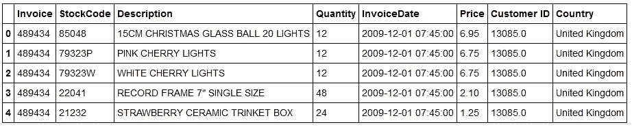
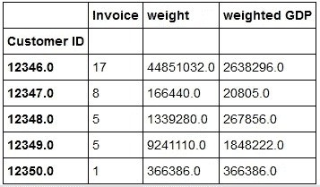
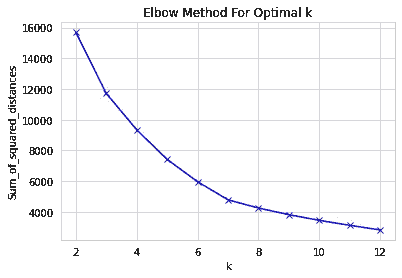
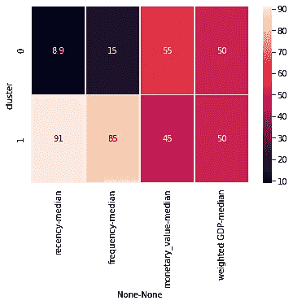
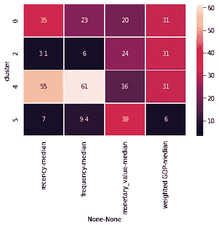
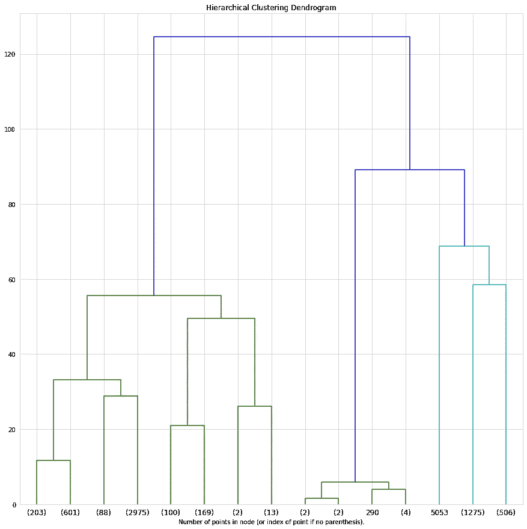
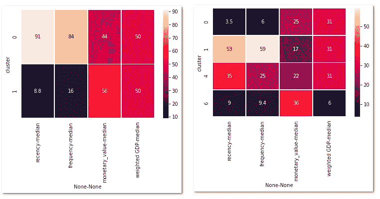
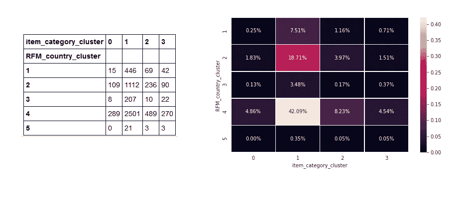

# 客户细分—第二部分

> 原文：<https://towardsdatascience.com/customer-segmentation-part-ii-1c94bdc03de5?source=collection_archive---------22----------------------->

## 按 RFM 国家对在线客户进行细分，并与第一部分相结合

哈尔·盖特伍德在 [Unsplash](https://unsplash.com?utm_source=medium&utm_medium=referral) 上拍摄的照片

客户细分是数据分析/数据科学最常见的用途之一。在这两篇文章系列的第二部分中，我们将看到一个客户细分的例子。我们使用的数据集是[在线零售 II 数据集](https://archive.ics.uci.edu/ml/datasets/Online+Retail+II)，其中包含一家总部位于英国的在线零售商在 2009 年 1 月 12 日至 2011 年 9 月 12 日之间的交易。数据集包含 1.067.371 行关于 5.943 个客户的购买。

在线零售 II 数据集的前几行

在[的第一部分中，](/customer-segmentation-part-i-2c5e2145e719)我们根据产品类别创建了一个客户细分。在第二部分中，我们将基于新近性、频率、货币价值(RFM)和原产国进行聚类。然后，我们将结合第一部分的分割结果。

在 Github 上可以找到[基于 RFM 国家的细分](https://github.com/dpanagop/data_analytics_examples/blob/master/online_retail/Online_retail_Segmentation_by_RFM_Country.ipynb)以及[结合两个细分结果](https://github.com/dpanagop/data_analytics_examples/blob/master/online_retail/Online_retail_Combine_Segmentations.ipynb)的代码。

# 新近性、频率、货币价值(RFM)

新近性、频率、货币价值(RFM)是一种分析客户价值的方法。这个名字来源于它为每个客户检查的三个方面:

*   最近:客户最近一次购买的时间。对于很久以前最后一次购物的顾客来说，最近购物的顾客更有价值。
*   频率:顾客购物的频率。顾客越频繁购买越好。
*   货币价值:顾客花了多少钱。越高越好。

Investopedia 和维基百科都有大量关于 RFM 的文章。

有几种方法来定义新近性、频率和货币价值。我们将使用以下定义:

*   **最近度**是从数据集的上次发票日期到最近发票日期(2011-12-09)的天数，
*   **频率**是从第一次开票日期到最后一次开票日期的天数除以发票数量，
*   **货币价值**是平均成本，其中成本是数量与价格的乘积。

下面列出了计算 RFM 的代码。

# 国家

在线零售 II 数据集包含每件商品运送到的国家。通过使用每个国家的 GDP，我们可以代表每个客户的财务实力。来自维基百科的 GDP 数据被用来创建一个 xlsx 文件，你也可以在 [Github](https://github.com/dpanagop/data_analytics_examples/blob/master/online_retail/GDP.xlsx) 中找到这个文件。有几个客户与两个国家有关。为了解决这个问题，对于每个客户，我们用发票数量来衡量 GDP。

每个客户加权 GDP 的计算结果

# 基于 RFM 国家 GDP 的客户细分

最后的预处理步骤是将 RFM 分析与 GDP 数据相结合。

对于聚类，我们将使用 [k 均值](https://scikit-learn.org/stable/modules/clustering.html#k-means)算法。缩放输入数据后，我们对 k (=创建的聚类数)范围执行 k 均值聚类。这将允许我们创建一个每 k 平方距离总和的图，并使用[肘形法](https://en.wikipedia.org/wiki/Elbow_method_(clustering))选择 k 的最佳值。

基于 elbow 方法，我们将检查 3 个或 7 个聚类。为了分析集群，我们创建了一个名为`cluster_profile_RFM_country.` This function 的定制函数

1.  计算每个分类的最近值、频率、货币值和加权 GDP 的中值，然后
2.  对近期、频率、货币价值和加权 GDP 的中位数求和
3.  将每个中值除以相应的和。

这样，函数`cluster_profile_RFM_country`计算对应于每个聚类的每个变量(最近、频率、货币价值和加权 GDP)的百分比。有一个选项可以从具有少量项目的分析集群中排除。

用于分析集群的函数`cluster_profile_RFM_country`

如果我们分成 3 组，我们最终得到 3 个大小分别为 4.225、1.708 和 9 个客户的集群。第三个簇的小尺寸是异常值的指示。如果我们使用前两个分类进行分析，我们会看到第一个分类包含客户

*   最近进行过交易的客户(过去 9 天与过去 91 天)，
*   花费更频繁(每 15 天比 85 天),
*   每笔交易的货币价值更高(243 比 197)

比第二组的顾客多。

聚类成 3 组时两个主要聚类的特征分析

选择 7 个分类，我们获得具有 3.549、1.547、572、247、17、9 和 1 个客户的分类。对拥有超过 100 名客户的客户进行分析，我们有

*   拥有 572 个客户的集群 4。聚类 4 包含具有最低 RFM 分数的客户(即，购物频率较低、每次交易的货币价值较低、并且比其余聚类购物时间更长的客户)
*   具有 1.547 个客户的分类 0。分类 0 包含 RFM 分数第二低的客户。
*   集群 2 有 3.549 个客户，集群 5 有 247 个客户。这些包含具有最佳 RFM 分数的客户。两者的区别在于，集群 5 的客户与 GDP 低于其他集群的国家相关。

我们可以说，这四个集群可以按 RFM 国家分数(从最好到最差)排列如下:

集群 4 < cluster 0 < cluster 5 < cluster 2\. (Cluster 5 has higher monetary value than cluster 2 but contains customers from countries with lower GDP. Thus we prioritize cluster 2).

Cluster 5 has customers from countries with a lower GDP than the rest.

Profiling of the four major clusters when clustering in 7 groups

Using hierarchical clustering we can gain a better understanding of the possible number of clusters.

We see hierarchical clustering verifies the selection of splitting into 3 or 7 clusters. Profiling major clusters in both cases, we see that the results are similar to k-Means.

Profiling major clusters in hierarchical clustering. To the left two major clusters when clustering into 3 groups. To the right four major clusters when clustering into 7 groups.

We will use the clustering solution into 7 clusters with k-Means. The [相关信息](https://github.com/dpanagop/data_analytics_examples/raw/master/online_retail/customer_segments_RFM_country.pickle)与 pickle 一起导出。

# 将结果与第一部分合并

最后，我们结合项目类别分割和 RFM 国家分割的结果。代码可以在 [Github](https://github.com/dpanagop/data_analytics_examples/blob/master/online_retail/Online_retail_Combine_Segmentations.ipynb) 上找到。

这个过程很简单。

1.  **导入两段数据。**

2.**将可视为离群值的小聚类合并为一个。**

即，在 RFM 国家细分中，有三个集群，每个集群的客户少于 20 个。如果我们将它们与项目类别细分相结合，那么产生的群体将包含非常小比例的客户。我们要把这些合并成一个。给定的机会，我们将重新命名集群，使具有最低 RFM 分数的集群将是第一个(保持与离群值合并到最后)。

3.将这两个分段结合起来。

4.**创建两个细分的交叉列表。**

两个部分的交叉列表。左侧，每组的客户数量。每组客户的正确百分比。

5.**形容由此产生的顾客群体。**

这里，我们将重点关注几个客户群。根据他们的个人资料，我们可以试着给每个群体起一个名字。

*   **“高价值普通客户”**:最大的细分市场有 2.501 家(占总数的 42.09%)。它包含属于商品类别分类的分类 1 和基于 RFM 国家分类的分类 4 的客户。这意味着该细分市场中的顾客从一般商品类别中购物(即他们不关注包、装饰品或圣诞商品)，并具有相对较高的 RFM 分数。
*   **“高价值圣诞购物者”**:项目类别群 0 和 RFM-国家群 4 中的细分。在我们的商品类别聚类中，我们发现聚类 0 对应于倾向于购买更多圣诞商品的客户。该细分市场包含 289 名(4.86%)客户。
*   **“高价值装饰爱好者”**:项目类别组 2 和 RFM-国家组 4 中的细分。在我们的项目类别聚类中，我们发现聚类 2 对应于偏好包的客户。该细分市场包含 489 名(8.23%)客户。
*   **“低价值装饰爱好者”**:项目类别组 2 和 RFM-国家组 1 中的细分。该细分市场包含 69 名(1.16%)客户。我们可以将项目类别群 2 和 RFM 国家群 2 中的客户添加到该细分市场中。这样，该细分市场将包含 305 个(5.13%)客户。
*   **“高价值包包爱好者”**:项目类别组 3 和 RFM-国家组 4 中的细分市场。在我们的项目类别聚类中，我们发现聚类 2 对应于具有装饰偏好的客户。该细分市场包含 270 名(4.54%)客户。
*   **“低价值包包爱好者”**:项目类别组 3 和 RFM-国家组 1 中的细分。该细分市场包含 42 名(0.71%)客户。我们可以将该细分市场和客户分配到项目类别分类 1 和 RFM 国家分类 2 中。这样，该细分市场将包含 132 个(2.22%)客户。

# 最后的话

我们对客户细分的两部分介绍到此结束。在真实的场景中，会提供每个片段的更详细的描述。对于每个细分市场，我们会计算几个 KPI，如下所示:

*   每段总成本，
*   每个客户的平均成本
*   每个客户每次交易/发票的平均成本
*   每个客户的交易/发票数量
*   每个客户的平均频率
*   每个客户的国家分布

所有这些信息都将用于为每个部分规划具体行动。不幸的是，这超出了我们的职位范围。我希望你能有机会在现实生活中看到它。