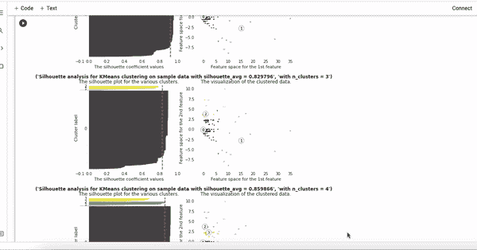

# 客户细分:Python 中的无监督机器学习算法

> 原文：<https://towardsdatascience.com/customer-segmentation-unsupervised-machine-learning-algorithms-in-python-3ae4d6cfd41d?source=collection_archive---------3----------------------->

## 使用 DBSCAN 和 K-means 对客户行为进行聚类

拍摄者:Lama Alzahrani

客户细分是根据共同特征将客户分成不同群体的过程，这样公司就可以有效而恰当地向每个群体进行营销。根据客户在行为和习惯上的相似性对他们进行细分。在这个项目中，我和我的团队实现了两个无监督的机器学习算法:K-means 和 DBSCAN。与一家快递公司合作。我们的目标是根据客户的各种行为和特征对他们的客户进行细分，以便公司能够以更适合每个客户的方式对每个细分市场进行营销。

这个杰出的团队由四名成员组成:

*   [**扎拉什布利**](https://www.linkedin.com/in/zarah-shibli)
*   [T5【瓦伊德】阿尔图尔基 ](http://linkedin.com/in/wajd-alturki)
*   [**马沙埃尔·阿尔哈桑**](http://linkedin.com/in/mashael-alhassan-1444a11a1)
*   [**喇嘛阿尔扎拉尼**](https://www.linkedin.com/in/lama-ali-2b8b76203/)

我们将向您介绍我们的思考过程，以及我们是如何对客户进行聚类的，使用了哪些功能以及实施了哪些方法来获得预期的结果。本文分为六个部分:

1.  商业问题。
2.  数据探索。
3.  数据准备。
4.  模型实现。
5.  结果。
6.  未来的工作。

# **业务问题:**

任何公司和企业的首要目标是了解他们的目标客户。他们的消费者如何操作和使用他们的服务。每个消费者使用公司服务的方式可能不同。我们要解决的问题是定义这个快递公司的消费者。来定义这些消费者使用公司服务的特定行为和方法。

# **数据探索:**

我们很幸运地得到了一个初创快递公司的数据集。该数据集是私有数据集，因此我们不会链接它。记录的数据是在六个月的时间内收集的数据。它分为三张表用户，支付和订单。

图 1:订单数据表列和数据类型

下面是订单数据表，给出了我们经常使用的数据类型的概念。订单数据表包含 2604 条记录和 26 列。用户包含 4663 条记录和 12 列，而付款数据表包含 3169 条记录和 6 列。

为了在开始实施我们的机器学习算法之前了解更多的数据，我们创建了一些 ed a 图。

图 2:订单状态

**用户最常使用该应用服务的产品是什么？**

图 3:订单饼图

**注册用户的时间线是多少？**

图 4:注册用户随时间变化的线形图。

# **数据准备:**

我们首先检查是否有任何丢失的值。

图 5:订单数据表中缺少的值。

如图所示，有 6 列缺少数据点。下面的代码将演示我们如何处理丢失的值。

接下来，为了便于分析，我们决定将订单分成 6 个不同的类别，如下图所示。

图 6:将订单分成 6 类。

考虑到要处理三个数据表，我们使用 pandas dataframe 读取每个数据表，然后将这三个数据表合并成一个 dataframe。

图 7:将 3 个数据帧合并成一个。

# **模型实现:**

最初，在我们决定走客户细分路线之前，我们计划实现一个受监督的机器学习算法。然而，我们后来意识到，鉴于这个数据集，挑选一个最优目标作为监督算法的基础并不是一个合适的方法。经过几个小时的头脑风暴，我们决定使用两种聚类算法进行客户细分:K-means 和 DBSCAN。此外，我们决定测试这两种不同的模型。

导入的库:

然后，我们继续为两种聚类算法选择我们的特征。我们选择了与买家相关的最受影响的特征，如`**Number of Orders**`、`**Total amount paid by this buyer**`、`**Number of orders paid Cash**`、`**Number of Orders paid by Card**`、`**Number of orders paid using STCPay**`和`**Count of unique product categorical ordered.**`

*注:STCPay 是一种在沙特阿拉伯使用的数字钱包。类似 Apple Pay。*

*注意:聚类算法和 EDA 是在两个不同的 google colab 表上进行的，这就是 dataframe 名称与上图不同的原因。*

下一步是缩放数据并使用 PCA 降低维度。

我们决定在训练模型之前减少特征的数量。我们使用主成分分析技术进行特征约简。首先，我们创建了 **Scree plot** 来帮助我们选择 PCA 的最佳元件数量。

图 8:碎石图。

如图 8 所示，我们的 PCA 的最佳组件数是 3，它最好地描述了数据。保留 80%的数据方差。

成功选择了正确数量的组件后，就可以根据我们选择的功能来安装包含 3 个组件的 PCA 了。

## **K-均值:**

现在，我们开始使用 K-mean 算法构建我们的聚类模型。K-mean 算法最重要的参数是聚类数。因此，我们应该决定我们的数据中有多少个聚类。有许多方法可以选择 K-mean 算法的最佳聚类数，在这个项目中我们应用了两种方法，称为**肘方法**和**轮廓分析法**。

## 1.弯头方法:

肘形法是用于确定 k 的最佳值的常用方法。该方法使用误差平方和来计算聚类内数据点之间的方差。要选择的最佳 k 值是曲线上的拐点。**正如我们在肘图中看到的，我们模型的最佳 k 值是 5。**

图 9: K 均值弯管图

## 2.轮廓分析方法:

该方法计算聚类中每个数据点的平均轮廓值，该值表示数据点与其自身聚类的相似程度。该度量的范围从-1 到 1。值为 1 表示样本远离相邻聚类。负值指的是可能被分配到错误聚类的样本。

下面的 GIF 说明了剪影分析方法的思想，剪影图上的每一行表示散点图中的一个数据点，X 轴表示剪影系数值。红线表示聚类中所有样本的平均轮廓系数值。具有高轮廓系数值的聚类是最佳选择。最后，从轮廓系数的结果，我们决定用 **5 集群**。

图 10:轮廓分析

在实施肘部和轮廓分析方法之后，我们开始构建具有 5 个聚类的 K-mean 算法。

下面是 K-means 创建的聚类的 3D 散点图。

图 11:K 均值聚类 3D 图

## 数据库扫描:

对于检测数据集中的异常值和异常值，DBSCAN(基于密度的带噪声应用程序空间聚类)是最有效的。DBSCAN 的两个决定性参数是 eps 和 min_samples。

eps 是确定数据点邻居的距离。如果点之间的距离小于或等于 eps，则这些点是邻居。为了确定 eps 的正确值，使用了 3 种方法:sklearn 的最近邻居、k-距离肘图和 eps 可视化。eps 的最佳值在最大曲率点。

min_samples 是形成聚类的点数。它是基于领域知识和数据集的大小来确定的。给定数据集的维数，选择 min_samples。一个很好的经验法则是 minPts >= D + 1，因为我们的数据集是 3D 的，所以 min_sample=4。对于较大的数据集，最小点> = D*2。

DBSCAN 中有 3 个主要的数据点:核心点、边界点以及 DBSCAN 擅长检测的离群点。核心点是 eps 半径内的点。边界点是可从核心点访问的点，并且具有较少数量的 min_samples。离群点是指不是核心点或边界点的点。

图 12:DBSCAN 3D 绘图

为了获得关于 eps 值的信心，我们再次采用肘图法和eps 可视化图。

图 13:Eps 弯管图

让我们放大图:

图 14:缩放的 eps 弯管图

图 15:Eps 可视化图形

如肘图和 eps 可视化图所示，eps 的最佳值为 1。

# 结果:

使用聚类计数为 5 的 K-means 算法，我们看到，与其他 4 个聚类相比，聚类 3 中的客户更喜欢使用 STCPay 而不是卡或现金支付。相比之下，聚类 0 中的客户最喜欢用现金支付。聚类 0 的订单数量也最多，有 2072 个订单，而聚类 1 有 93 个订单，是 5 个聚类中订单数量最少的。就利润而言，聚类 0 为应用程序带来的利润最多，其次是聚类 3、2、1 和 4。

使用聚类计数为 5 的 DBSCAN 算法，我们看到，与其他 4 个聚类相比，聚类 3 中的客户更喜欢使用 STCPay 而不是卡或现金支付。相比之下，聚类 0 中的客户最喜欢用现金支付。聚类 0 也具有最高的订单数量，有 2053 个订单，而聚类 2 有 26 个订单，是 5 个聚类中订单数量最少的。就利润而言，聚类 0 为应用程序带来的利润最多，其次是聚类 1、2、3 和 2。

一些**可操作的见解**发现交付公司可以执行:

*   从 K-mean 结果可以看出，聚类 1 中的买家创建的订单数量比其他聚类中的买家创建的订单数量多，在 6 个月中平均有 46 个订单。这是买家的大量订单，所以有可能这些账户是注册为买家的店铺。我们在 DBSCAN 的 cluster -1 中观察到同样的情况，个人买家在 6 个月内平均有 10 个订单。
*   大多数买家用现金支付。在这种情况下，可能买家不知道通过应用程序可以使用不同的支付方式。因此，营销团队应该通过提供不同的支付方式来阐明应用程序的力量。

有关代码及其实现的更多信息，请访问我们的 github 资源库:

 [## ZarahShibli/客户细分

### 客户细分是根据共同特征将客户分组的过程，因此公司可以…

github.com](https://github.com/ZarahShibli/Customers-Segmentation.git) 

或者你可以查看我们的仪表盘，查看我们发现的全部信息:[https://customer-segmentation-tuwaiq-2.herokuapp.com/](https://customer-segmentation-tuwaiq-2.herokuapp.com/)

*注意:仪表板是一个 Dash 应用程序仪表板，托管在 Heroku 云服务器上，加载可能需要几分钟。*

# 未来工作:

考虑到收集的数据是六个月的数据，模型会更加稳健，可以绘制更多的数据点。未来可以通过输入更多数据来优化算法。公司现在可以适当地向每个细分的客户营销，并向不同的客户细分显示不同的广告。

# 资源:

[https://sci kit-learn . org/stable/auto _ examples/cluster/plot _ DBS can . html # sphx-glr-auto-examples-cluster-plot-DBS can-py](https://scikit-learn.org/stable/auto_examples/cluster/plot_dbscan.html#sphx-glr-auto-examples-cluster-plot-dbscan-py)

[https://towardsdatascience . com/DBS can-algorithm-complete-guide-and-application-with-python-scikit-learn-d 690 cbae 4c 5d](/dbscan-algorithm-complete-guide-and-application-with-python-scikit-learn-d690cbae4c5d)

[https://towards data science . com/how-to-use-DBS can-effectively-ed 212 c 02e 62](/how-to-use-dbscan-effectively-ed212c02e62)

[https://medium . com/@ tarammullin/DBS can-parameter-estimation-ff 8330 E3 a3 BD](https://medium.com/@tarammullin/dbscan-parameter-estimation-ff8330e3a3bd)

[https://towards data science . com/DBS can-clustering-explained-97556 a2 ad 556](/dbscan-clustering-explained-97556a2ad556)

 [## 为 DBSCAN 选择 eps 和 minPts 的程序

### 感谢您为交叉验证提供答案！请务必回答问题。提供详细信息并分享…

stats.stackexchange.com](https://stats.stackexchange.com/questions/88872/a-routine-to-choose-eps-and-minpts-for-dbscan) 

[https://towards data science . com/how-DBS can-works-and-why-should-I-use-it-443 B4 a 191 c 80](/how-dbscan-works-and-why-should-i-use-it-443b4a191c80)

[https://www . coursera . org/lecture/build-regression-class ification-clustering-models/silhouette-analysis-33 ieo](https://www.coursera.org/lecture/build-regression-classification-clustering-models/silhouette-analysis-33ieO)

[https://sci kit-learn . org/stable/auto _ examples/cluster/plot _ k means _ silhouette _ analysis . html](https://scikit-learn.org/stable/auto_examples/cluster/plot_kmeans_silhouette_analysis.html)