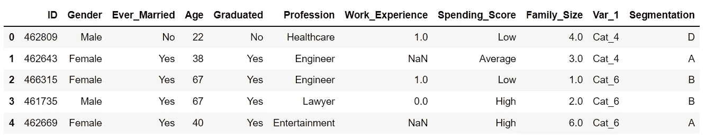
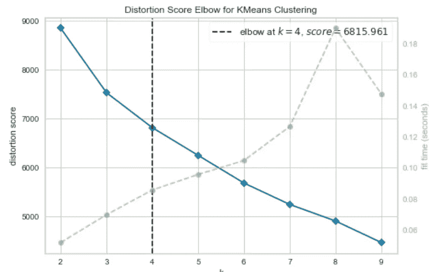
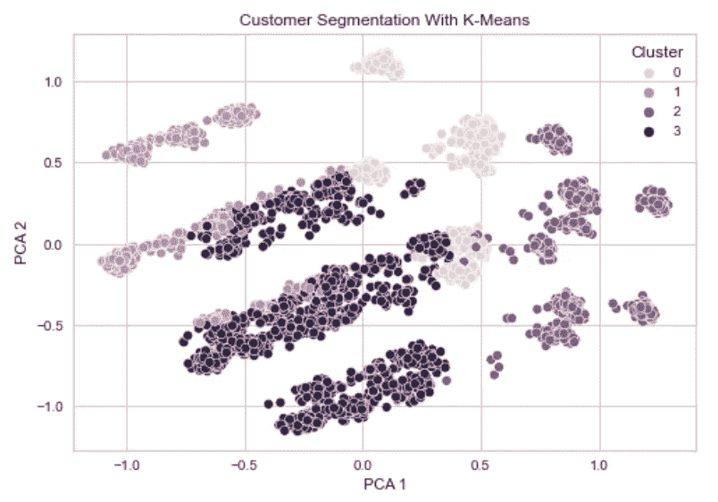
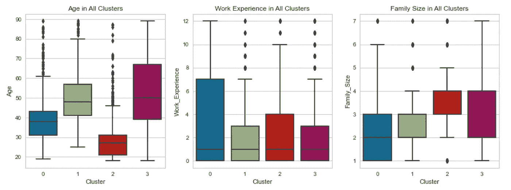
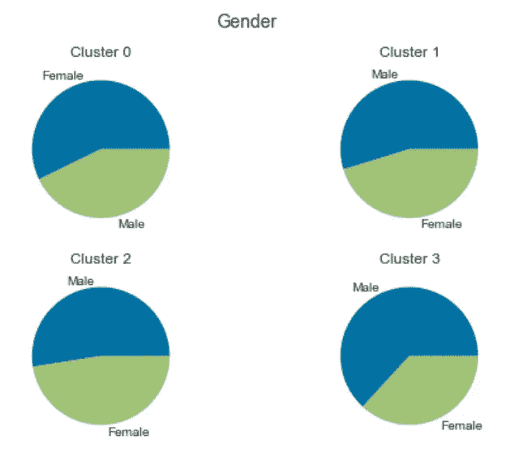
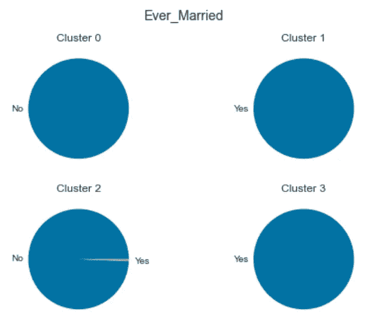
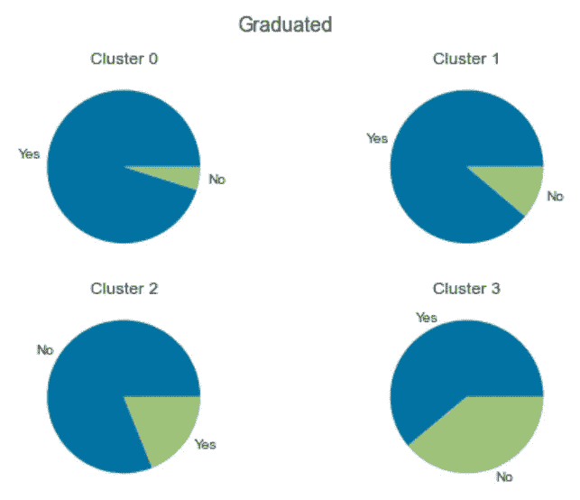
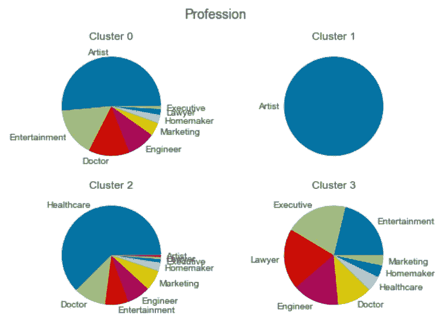

# 利用聚类进行客户细分

> 原文：<https://towardsdatascience.com/customer-segmentation-with-clustering-933caa4c9ea3?source=collection_archive---------15----------------------->

## 了解如何利用消费者数据优化销售和营销策略

照片由[从](https://www.pexels.com/@shvets-production?utm_content=attributionCopyText&utm_medium=referral&utm_source=pexels)[派克斯](https://www.pexels.com/photo/empty-shopping-cart-on-yellow-background-7195232/?utm_content=attributionCopyText&utm_medium=referral&utm_source=pexels)拍摄制作

假设您与销售和营销团队一起工作，以达到您公司预先设定的目标。

虽然你的公司在创造收入和留住客户方面做得很好，但你不能不认为它可以做得更好。

就目前的情况来看，广告、促销和特别优惠在所有客户中是同质的，这是一个严重的问题。以一种他们不会接受的方式与客户接触，就等于浪费你的广告预算。

毕竟，你不希望你的公司把有限的预算花在给大学生发尿布优惠券或给老年妇女打游戏机广告上。

你需要的是针对每一类客户定制你的方法，以充分利用你的营销投资。

这就引出了一个问题:你如何正确区分你的消费者群体中的人？

这就是集群发挥作用的地方。

有了贵公司精心收集的消费者数据，您就有办法执行聚类分析，将您的消费者分成适当的群体，并为每个群体定制您的营销策略。

通过针对不同类型的客户量身定制的方法，您将能够从广告和促销投资中获得最大收益。

在这里，您将深入了解数据科学如何帮助企业细分消费者群体。

在下面的案例研究中，将使用 k-means 聚类算法来寻找将客户分组的最佳方法。

# **案例分析**

目标是使用客户数据来计算如何将消费者群体划分到理想的集群组中。

数据(无版权保护)可以在这里访问[。](https://www.kaggle.com/vetrirah/customer)

下面的数据集预览显示了为每个客户提供的信息。

代码输出(由作者创建)

# 数据预处理

我们对数据集进行预处理，以便将其输入到聚类算法中。这需要:

*   移除不需要的功能
*   删除丢失的值
*   移除异常值
*   编码分类特征

之后，数据将经过标准化和主成分分析(PCA)。对数据进行标准化可以确保机器学习模型不会偏向任何特征，而 PCA 会降低数据集的维度以减轻过度拟合。

# 构建聚类模型

接下来，我们需要为这批消费者确定理想的集群数量。这可以通过[弯头法](https://www.geeksforgeeks.org/elbow-method-for-optimal-value-of-k-in-kmeans/)轻松确定。

虽然可以手动执行 elbow 方法，但使用 [yellowbrick](https://www.scikit-yb.org/en/latest/) 库可以简化很多，它可以用一行代码构建可视化的情节。

代码输出(由作者创建)

肘方法表明，将我们的消费者分为四类是理想的。

让我们创建一个 k 均值聚类模型，将每个客户分配到四个聚类之一。

为了可视化聚类的结果，我们可以绘制一个散点图。

代表客户的点的坐标将基于前两个 PCA 分量。

代码输出(由作者创建)

# 解释

来自[像素](https://www.pexels.com/photo/bearded-man-presenting-in-front-of-people-7414039/?utm_content=attributionCopyText&utm_medium=referral&utm_source=pexels)的[罗德尼制作](https://www.pexels.com/@rodnae-prod?utm_content=attributionCopyText&utm_medium=referral&utm_source=pexels)的照片

在这一点上，你可能想拍拍自己的背，但工作还没有完成。

问问你自己:在这一点上你真正学到了什么？

即使你已经把你的消费者分成了几个组，分组的方式有任何意义吗？

如果你不能解释你的算法形成的集群，你所有的努力都是徒劳的。对于你向其展示发现的人来说，一组没有明确特征的集群与一组随机产生的集群没有什么不同。

只有当你能解释你的客户是如何划分的，聚类分析才有意义。这可以让你了解每个群体，然后相应地为每个群体制定营销策略。

我们可以使用箱线图从年龄、工作经验和家庭规模的角度来比较每个集群。

代码输出(由作者创建)

我们可以使用饼图来比较每个集群在性别、婚姻状况、毕业状况、职业和支出分数方面的差异。

为了方便起见，我们可以创建一个函数，根据给定的特性生成比较集群的饼图。

比较集群的饼图如下所示。

性别:

代码输出(由作者创建)

婚姻状况:

代码输出(由作者创建)

毕业状态:

代码输出(由作者创建)

职业:

代码输出(由作者创建)

支出分数:

代码输出(由作者创建)

基于视觉图表，消费者群体主要按照年龄、婚姻状况、职业和购买力进行细分。

我们现在可以确定每个集群的定义特征。

第 0 类:来自艺术和娱乐领域的单身人士，购买力较低。

第一类:中年、已婚、购买力一般的艺术界人士。

第二类:没有受过高等教育、购买力低的年轻单身人群。

第三类:年长的已婚人士，有高薪工作和高购买力。

既然我们已经了解了每个集群的人口构成，我们最终可以针对每个客户群创建一个强大的营销策略。

此外，任何新客户都可以被分配到一个集群，并会收到最适合他们的广告和特别优惠。

# 结论

照片由来自 [Pexels](https://www.pexels.com/photo/black-and-white-laptop-2740956/?utm_content=attributionCopyText&utm_medium=referral&utm_source=pexels) 的 [Prateek Katyal](https://www.pexels.com/@prateekkatyal?utm_content=attributionCopyText&utm_medium=referral&utm_source=pexels) 拍摄

数据能够帮助改善决策的程度令人震惊。

通过利用包含客户个人详细信息的数据集，我们能够有效地将客户划分为具有明确特征的群体。

您现在知道了集群的可用性及其在帮助企业做出决策方面的作用。

希望，作为一个更大的画面的一部分，这个演示给了很多关于为什么企业对与数据处理相关的职位有如此高的需求的洞察力。

在合适的人手中，数据可以用来显著优化业务模式，提高客户满意度和保留率，并最大限度地提高利润率。现在的行业都认识到了这一点，这也是为什么你现在可以看到很多数据分析师、数据科学家、数据工程师等职位的招聘信息。

对于希望在竞争激烈的市场中茁壮成长的企业来说，雇佣数据从业者至关重要。

我祝你在数据科学的努力中好运！

# 参考

维特里拉。(2020).客户细分(第 1 版)。2021 年 11 月 7 日从 https://www.kaggle.com/vetrirah/customer[检索。](https://www.kaggle.com/vetrirah/customer)