# 使用 Python 进行客户细分

> 原文：<https://towardsdatascience.com/customer-segmentation-with-python-31dca5d5bdad?source=collection_archive---------20----------------------->

## 学习用 Python 构建用于客户细分的 K-Means 聚类算法


Unsplash 上的粘土银行图像

# 介绍

客户细分对于企业了解其目标受众非常重要。不同的广告可以基于他们的人口统计特征、兴趣和富裕程度被策划并发送给不同的受众分群。

有许多无监督的机器学习算法可以帮助公司识别他们的用户群，并创建消费者细分市场。

在本文中，我们将研究一种流行的无监督学习技术，称为 K-Means 聚类。

该算法可以接收未标记的客户数据，并将每个数据点分配到聚类中。

K-Means 的目标是将所有可用的数据分组到彼此不同的非重叠子组中。

这意味着每个子组/聚类将由区别于其他聚类的特征组成。

K-Means 聚类是数据科学家帮助公司进行客户细分的常用技术。这是一项重要的技能，大多数数据科学面试将测试你对这种算法的理解/你将它应用到现实生活场景的能力。

在本文中，您将了解以下内容:

*   K 均值聚类的数据预处理
*   从头开始构建 K-Means 聚类算法
*   用于评估聚类模型性能的指标
*   可视化构建的集群
*   解释和分析构建的集群

## 先决条件

你可以在这里下载本教程[的数据集。](https://www.kaggle.com/vjchoudhary7/customer-segmentation-tutorial-in-python)

确保在开始之前安装以下库:pandas、numpy、matplotlib、seaborn、scikit-learn、kneed。

一旦你完成了，我们就可以开始建立模型了！

## 导入和读取数据框

运行以下代码行以导入必要的库并读取数据集:

```
# Imports

import pandas as pd
import numpy as np
import matplotlib.pyplot as plt
import sea
from kneed import KneeLocator
from sklearn.datasets import make_blobs
from sklearn.cluster import KMeans
from sklearn.metrics import silhouette_score
from sklearn.preprocessing import StandardScaler
from sklearn.decomposition import PCA
from mpl_toolkits.mplot3d import Axes3D

# reading the data frame

df = pd.read_csv('Mall_Customers.csv')
```

现在，让我们看看数据帧的头部:

```
df.head()
```

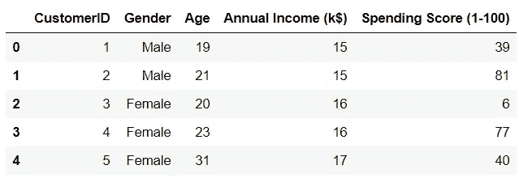

作者图片

数据集中有五个变量。CustomerID 是数据集中每个客户的唯一标识符，我们可以删除这个变量。它没有为我们提供任何有用的集群信息。

由于性别是一个范畴变量，它需要被编码并转换成数字。

所有其他变量在输入到模型中之前都将按正态分布进行缩放。我们将用平均值 0 和标准差 1 来标准化这些变量。

## 标准化变量

首先，让我们对数据集中的所有变量进行标准化，使它们的规模大致相同。

你可以在这里了解更多关于标准化[的信息。](https://www.youtube.com/watch?v=mnKm3YP56PY)

```
col_names = ['Annual Income (k$)', 'Age', 'Spending Score (1-100)']
features = df[col_names]
scaler = StandardScaler().fit(features.values)
features = scaler.transform(features.values)
scaled_features = pd.DataFrame(features, columns = col_names)
scaled_features.head()
```

现在，让我们看看数据帧的头部:

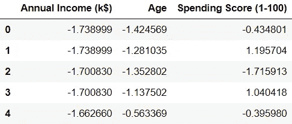

作者图片

我们可以看到所有的变量都被转换了，现在以零为中心。

## 一个热编码

变量“性别”是分类的，我们需要将其转换成数字变量。

这意味着我们需要为每个类别替换数字。我们可以用 pd.get_dummies()对熊猫做这件事。

```
gender = df['Gender']
newdf = scaled_features.join(gender)

newdf = pd.get_dummies(newdf, prefix=None, prefix_sep='_', dummy_na=False, columns=None, sparse=False, drop_first=False, dtype=None)

newdf = newdf.drop(['Gender_Male'],axis=1)

newdf.head()
```

让我们再看一下数据帧的头部:

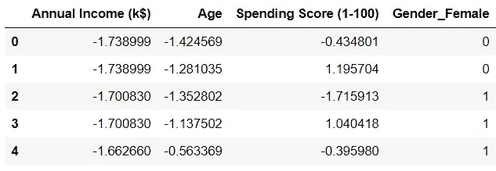

作者图片

我们可以看到性别变量被改变了。您可能已经注意到，我们从数据框中删除了' *Gender_Male* '。这是因为不再需要保留变量了。

'*性别 _ 男性*的值可以从'*性别 _ 女性*，'(*即如果'性别 _ 女性'为 0，那么'性别 _ 男性'将为 1，反之亦然*)。

要了解更多关于分类变量的一键编码，你可以观看[这个](https://www.youtube.com/watch?v=6WDFfaYtN6s) YouTube 视频。

## 构建聚类模型

让我们构建一个 K 均值聚类模型，并将其应用于数据集中的所有变量。

然后，我们将在肘形图中可视化聚类模型的性能。

肘图将告诉我们，在构建模型时，应该使用多少个理想的聚类。

你可以在这里了解更多关于选择最佳集群数量和肘方法[的信息。](https://www.geeksforgeeks.org/elbow-method-for-optimal-value-of-k-in-kmeans/)

```
SSE = []

for cluster in range(1,10):
    kmeans = KMeans(n_jobs = -1, n_clusters = cluster, init='k-means++')
    kmeans.fit(newdf)
    SSE.append(kmeans.inertia_)

# converting the results into a dataframe and plotting them

frame = pd.DataFrame({'Cluster':range(1,10), 'SSE':SSE})
plt.figure(figsize=(12,6))
plt.plot(frame['Cluster'], frame['SSE'], marker='o')
plt.xlabel('Number of clusters')
plt.ylabel('Inertia')
```

可视化模型的性能:

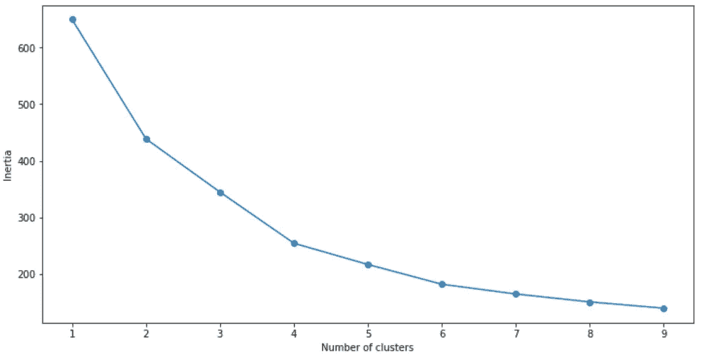

作者图片

根据上面的肘图，我们可以看到最佳的集群数是 **4** 。

现在，让我们看看另一个聚类指标。

## 轮廓系数

轮廓系数或轮廓分数是用于评估由算法创建的聚类质量的度量。

轮廓分数范围从-1 到+1。轮廓分数越高，模型越好。

轮廓分数测量同一聚类内所有数据点之间的距离。这个距离越小，轮廓得分越好。

它还测量对象和最近簇中的数据点之间的距离。这个距离越高越好。

轮廓分数越接近+1 表示聚类性能越好，轮廓分数越接近-1 表示聚类模型越差。

让我们计算我们刚刚建立的模型的轮廓分数:

```
# First, build a model with 4 clusters

kmeans = KMeans(n_jobs = -1, n_clusters = 4, init='k-means++')
kmeans.fit(newdf)

# Now, print the silhouette score of this model

print(silhouette_score(newdf, kmeans.labels_, metric='euclidean'))
```

这款的剪影评分大概在 **0.35** 左右。

这是一个不错的模型，但我们可以做得更好，并尝试获得更高的集群分离。

在我们尝试这样做之前，让我们将刚刚构建的集群可视化，以了解模型的表现如何:

```
clusters = kmeans.fit_predict(df.iloc[:,1:])
newdf["label"] = clusters

fig = plt.figure(figsize=(21,10))
ax = fig.add_subplot(111, projection='3d')
ax.scatter(newdf.Age[newdf.label == 0], newdf["Annual Income (k$)"][newdf.label == 0], df["Spending Score (1-100)"][newdf.label == 0], c='blue', s=60)

ax.scatter(newdf.Age[df.label == 1], newdf["Annual Income (k$)"][newdf.label == 1], newdf["Spending Score (1-100)"][newdf.label == 1], c='red', s=60)
ax.scatter(newdf.Age[df.label == 2], newdf["Annual Income (k$)"][newdf.label == 2], df["Spending Score (1-100)"][newdf.label == 2], c='green', s=60)
ax.scatter(newdf.Age[newdf.label == 3], newdf["Annual Income (k$)"][newdf.label == 3], newdf["Spending Score (1-100)"][newdf.label == 3], c='orange', s=60)

ax.view_init(30, 185)
plt.show()
```

上述代码的输出如下:

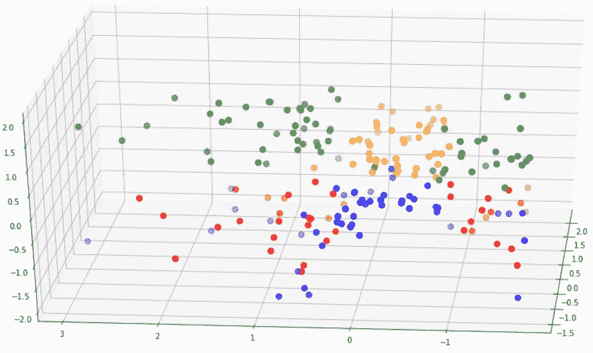

作者图片

从上面的图表中，我们可以看到集群分离并不太大。

红色的点与蓝色混合，绿色的点与黄色的点重叠。

这一点，以及剪影分数向我们表明，该模型的表现不是太好。

现在，让我们创建一个比这个模型具有更好的聚类可分性的新模型。

## 构建聚类模型#2

对于这个模型，让我们做一些特征选择。

我们可以使用一种叫做主成分分析(PCA)的技术。

PCA 是一种帮助我们降低数据集维度的技术。当我们在数据帧上运行 PCA 时，会创建新的组件。这些组件解释了模型中的最大方差。

我们可以选择这些变量的子集，并将它们包含在 K-means 模型中。

现在，让我们对数据集运行 PCA:

```
pca = PCA(n_components=4)
principalComponents = pca.fit_transform(newdf)

features = range(pca.n_components_)
plt.bar(features, pca.explained_variance_ratio_, color='black')
plt.xlabel('PCA features')
plt.ylabel('variance %')
plt.xticks(features)

PCA_components = pd.DataFrame(principalComponents)
```

上述代码将呈现以下图表:

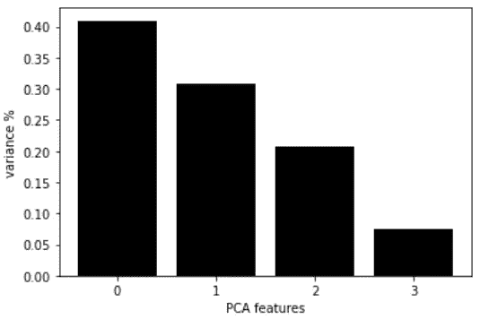

作者图片

这张图表向我们展示了每个 PCA 成分，以及它的方差。

基于这种可视化，我们可以看到前两个主成分分析解释了大约 70%的数据集方差。

我们可以将这两个部分输入到模型中。

让我们使用前两个主要成分再次构建模型，并决定要使用的聚类数:

```
ks = range(1, 10)
inertias = []

for k in ks:
    model = KMeans(n_clusters=k)
    model.fit(PCA_components.iloc[:,:2])
    inertias.append(model.inertia_)

plt.plot(ks, inertias, '-o', color='black')
plt.xlabel('number of clusters, k')
plt.ylabel('inertia')
plt.xticks(ks)
plt.show()
```

上面的代码将呈现下面的图表:

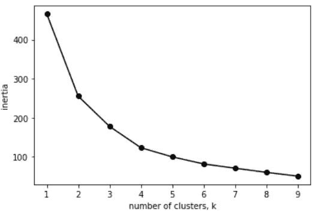

作者图片

同样，看起来最佳的集群数量是 **4。**

我们可以用 4 个聚类来计算该模型的轮廓分数:

```
model = KMeans(n_clusters=4)
model.fit(PCA_components.iloc[:,:2])

# silhouette score
print(silhouette_score(PCA_components.iloc[:,:2], model.labels_, metric='euclidean'))
```

这个模型的剪影得分是 **0.42，**比我们之前创建的模型要好。

我们可以像之前一样直观地看到该模型的集群:

```
model = KMeans(n_clusters=4)

clusters = model.fit_predict(PCA_components.iloc[:,:2])
newdf["label"] = clusters

fig = plt.figure(figsize=(21,10))
ax = fig.add_subplot(111, projection='3d')
ax.scatter(newdf.Age[newdf.label == 0], newdf["Annual Income (k$)"][newdf.label == 0], newdf["Spending Score (1-100)"][newdf.label == 0], c='blue', s=60)
ax.scatter(newdf.Age[newdf.label == 1], newdf["Annual Income (k$)"][newdf.label == 1], newdf["Spending Score (1-100)"][newdf.label == 1], c='red', s=60)
ax.scatter(newdf.Age[newdf.label == 2], newdf["Annual Income (k$)"][newdf.label == 2], newdf["Spending Score (1-100)"][newdf.label == 2], c='green', s=60)

ax.scatter(newdf.Age[newdf.label == 3], newdf["Annual Income (k$)"][newdf.label == 3], newdf["Spending Score (1-100)"][newdf.label == 3], c='orange', s=60)

ax.view_init(30, 185)
plt.show()
```

## 模型 1 与模型 2

让我们比较这个模型和第一个模型的聚类可分性:

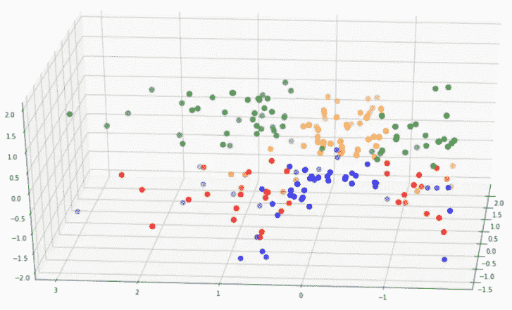

模型 1

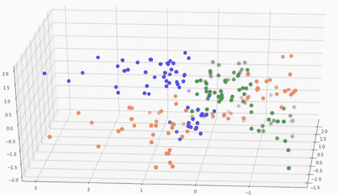

模型 2

请注意，第二个模型中的聚类比第一个模型中的聚类分离得更好。

再者，第二个模特的剪影评分高了很多。

出于这些原因，我们可以选择第二个模型来继续我们的分析。

## 聚类分析

现在，我们已经完成了这些不同的集群的构建，让我们试着解释它们，看看不同的客户群。

首先，让我们将聚类映射回数据集，并查看数据框的头部。

```
df = pd.read_csv('Mall_Customers.csv')
df = df.drop(['CustomerID'],axis=1)

# map back clusters to dataframe

pred = model.predict(PCA_components.iloc[:,:2])
frame = pd.DataFrame(df)
frame['cluster'] = pred
frame.head()
```

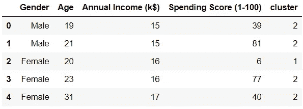

作者图片

请注意，数据框中的每一行现在都被分配给了一个聚类。

为了比较不同分类的属性，让我们找出每个分类中所有变量的平均值:

```
avg_df = df.groupby(['cluster'], as_index=False).mean()
avg_df.show()
```

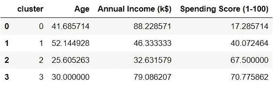

作者图片

如果我们把它们形象化，我们就能更容易地解释这些集群。运行这四行代码，得到每个变量的不同可视化效果:

```
sns.barplot(x='cluster',y='Age',data=avg_df)
sns.barplot(x='cluster',y='Spending Score (1-100)',data=avg_df)
sns.barplot(x='cluster',y='Annual Income (k$)',data=avg_df)
```

## 消费得分 vs 年收入 vs 年龄

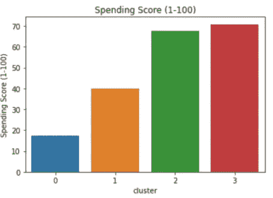

作者图片

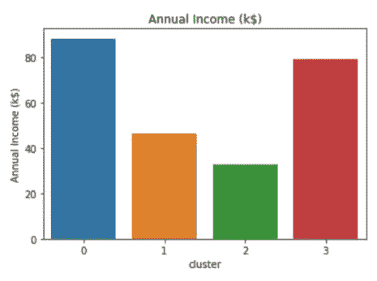

作者图片

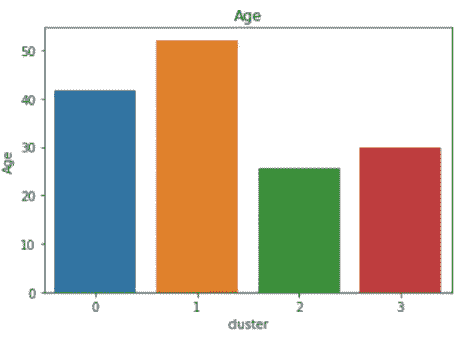

作者图片

## 性别分类

```
df2 = pd.DataFrame(df.groupby(['cluster','Gender'])['Gender'].count())
df2.head()
```

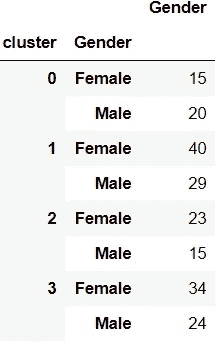

作者图片

## 每个细分市场的主要属性

群集 0:

*   平均年收入高，支出低。
*   平均年龄在 40 岁左右，性别以男性为主。

群组 1:

*   中低收入，平均消费能力。
*   平均年龄在 50 岁左右，性别以女性为主。

第二组:

*   平均收入低，支出分数高。
*   平均年龄在 25 岁左右，性别以女性为主。

第三组:

*   平均收入高，消费得分高。
*   平均年龄在 30 岁左右，性别以女性为主。

值得注意的是，计算中值年龄可以更好地了解每个聚类中的年龄分布。

此外，女性在整个数据集中的比例更高，这也是大多数聚类中女性数量多于男性的原因。我们可以找到每个性别相对于整个数据集中的数字的百分比，从而让我们更好地了解性别分布。

## 围绕每个集群构建人物角色


照片由 [Unsplash](https://unsplash.com/s/photos/machine-learning?utm_source=unsplash&utm_medium=referral&utm_content=creditCopyText) 上的 [h heyerlein](https://unsplash.com/@heyerlein?utm_source=unsplash&utm_medium=referral&utm_content=creditCopyText) 拍摄

既然我们知道了每个集群的属性，我们就可以围绕它们构建角色。

作为数据科学家，能够围绕您的分析讲述一个故事是一项重要的技能。

这将有助于你的客户或利益相关者更容易理解你的发现。

下面是一个基于创建的集群构建消费者角色的示例:

## 第 0 类:节俭的消费者

这个角色由对金钱非常谨慎的中年人组成。

尽管与所有其他群体中的个人相比，他们的平均收入最高，但他们的支出却最少。

这可能是因为他们有经济责任——比如为孩子的高等教育存钱。

建议:促销、优惠券和折扣代码将吸引这一细分市场的个人，因为他们倾向于减少支出。

## 群组 1:几乎退休

这部分人由一群老年人组成。

他们挣得更少，花得更少，可能正在为退休存钱。

建议:针对这些人的营销可以通过脸书来完成，这吸引了年龄较大的人群。向这部分人群推广医疗保健相关产品。

## 集群 2:粗心的买家

这一部分是由较年轻的年龄组组成的。

这部分人中的个人最有可能是第一批就业者。与所有其他细分市场相比，他们赚的钱最少。

然而，他们是非常高的消费者。

这些热情的年轻人享受着美好的生活方式，并且倾向于入不敷出。

建议:由于这些都是年轻人，他们花钱很多，向他们提供旅游优惠券或酒店折扣可能是个好主意。为他们提供顶级服装和化妆品品牌的折扣对这个细分市场也很有效。

## 集群 3:高度富裕的个人

这部分人是由中年人组成的。

这些人努力工作积累了大量财富。

他们也花大量的钱去过好的生活方式。

这些人可能刚刚组建家庭，过着以婴儿或家庭为中心的生活方式。向这些人推销婴儿或儿童相关产品是个好主意。

建议:由于他们巨大的消费能力和他们的人口统计，这些个人可能会寻找购买或投资的财产。他们也比其他群体更有可能申请住房贷款，并做出严肃的财务承诺。

# 结论

我们已经成功地建立了一个用于客户细分的 K-Means 聚类模型。我们还探索了集群解释，并分析了每个集群中的个人行为。

最后，我们看了一些可以根据集群中每个个体的属性提供的业务建议。

您可以使用上面的分析作为将来任何集群或细分项目的起始代码。

本帖最初发表于[此处](https://www.natasshaselvaraj.com/customer-segmentation-with-python/)。