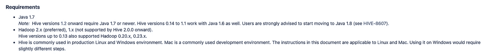

# 使用基于 Hadoop 的组件定制气流容器

> 原文：<https://towardsdatascience.com/customize-airflow-container-with-hadoop-based-components-127e89763c21?source=collection_archive---------29----------------------->

## 在为您的用例构建或修改 docker 映像时，您需要知道什么

照片由[德鲁·科林斯](https://unsplash.com/@drewjohncollins?utm_source=medium&utm_medium=referral)在 [Unsplash](https://unsplash.com?utm_source=medium&utm_medium=referral)

# 介绍

最近，我一直致力于建立一个数据管道，将数据从关系数据库管理系统(RDBMS)传输到 Hadoop 生态系统(HDFS)。在有限的时间资源下，我必须在七天内从头开始完成数据管道。此外，我得到的建议是，它应该在三天内完成整个事情。

当时，我对 Hadoop 生态系统配置和 docker 几乎一无所知。我知道什么是分布式系统的概念，但是我自己配置它几乎是不可能的。更容易被之前没有经历过的事情吓到。我想这是很正常的事情。

## 要求

我深吸了一口气，通读了他们给出的所有业务和技术要求，这些都是对数据管道的要求。

*   使用广泛的数据框架(如 Apache Spark、Apache Sqoop 或其他大数据框架)构建数据管道。
*   用 Apache 气流编排数据管道。
*   为附加的特别查询传递所有业务需求。
*   使其易于使用 Docker 或 Kubernetes 进行部署。

## 我有多少知识

总之下面是我接这个项目之前的经历。

*   听说过 dockerization 这个概念，但从来没用过。幸运的是，[的 docker 教程](https://docs.docker.com/get-started/)相当精湛。半天之内很容易就能跟上并适应这个项目。
*   对于编排部分，幸运的是，我刚刚从 Udacity 获得了[数据工程 Nanodegree，所以我熟悉气流以及如何作为初学者使用它。如果你对这门课程感兴趣，可以在我的 GitHub](https://www.udacity.com/course/data-engineer-nanodegree--nd027?utm_source=gsem_brand&utm_medium=ads_r&utm_campaign=8305564469_c&utm_term=84142984263&utm_keyword=data%20engineering%20nanodegree_e&gclid=Cj0KCQjwvr6EBhDOARIsAPpqUPGoCNmgqGdrI3SfFCl9KymbPmE3Qyur0NMN2hoGfAZ5fmsBl3ITm4kaAjZxEALw_wcB) 上查看[项目内容和我的评论。](https://github.com/Pathairush/data_engineering)
*   关于 Apache Spark，我对 pyspark 比较熟悉，之前在我的数据分析项目中使用过。对于其他像 Sqoop 和 Hive 这样的组件，我要做在职学习，达到他们的技术要求。

在项目开始时，我乐观地认为我可以在规定的时间内完成这件事，但现实生活并不像我想象的那么容易。

# 你将面临的问题

由[塞巴斯蒂安·赫尔曼](https://unsplash.com/@officestock?utm_source=medium&utm_medium=referral)在 [Unsplash](https://unsplash.com?utm_source=medium&utm_medium=referral) 上拍摄的照片

## 发展环境

当我在 Udacity 参加课程时，他们为我配置了所有的开发环境。我可以直接把代码写到提供的 IDE 上，专心使用 Spark 或者 Airflow 之类的工具。

不幸的是，对于这个项目，我必须自己复制那些环境。首先，我尝试在我的计算机的虚拟环境中安装每个组件。但是我认为不可能将这个项目转移到具有这些复杂依赖关系的另一个实例中。

那是码头工人来救我的地方。我们可以用 docker 构建和封装所有的依赖关系和配置，并轻松地将其转移到另一个实例中。

构建开发环境可以像输入`docker compose up -d`命令一样简单。配置被放在一个单独的`yaml`文件中，以便在开发环境中轻松地添加、修改或删除组件。

## 然而，困难的部分是连接 docker 内部的所有东西

当我提到技术需求时，数据管道应该由 Spark、Sqoop 或其他框架等大数据框架组成。

这意味着您必须在同一个 docker 环境中拥有 airflow、spark 集群、hive 集群和 sqoop 集群，并通过 docker 网络将它们连接起来。

Airflow 为您提供了很大的灵活性，可以与提供商的运营商协调 spark、hive 或 sqoop 工作。 ***但是您必须先在 airflow docker 中安装所有这些组件才能激活此功能。***

然而，当我转移这个项目时，我对修改 docker 容器和配置 Hadoop 组件的了解有限。我通过艰难地将工作从气流容器提交给其他组件来解决这个问题。

## 简单介绍一下我当时的选择

这里有三种方法将作业从气流提交到另一个容器

1.  在 Apache airflow 中与[提供商的运营商](https://airflow.apache.org/docs/apache-airflow-providers/index.html)一起提交。这是配置 airflow DAGs 并将任务提交给另一个实例的最推荐方式。
2.  用`SSHOperator`提交。这意味着您将 airflow to SSH 告知另一个实例，并从本地环境运行该命令。对于这种方法，目标实例或集群应该安装 SSH 组件来访问另一个位置。
3.  用`BASHOperator`提交。我转移项目时就是这么做的。要创建您的 airflow 实例，可以访问`docker exec`命令，从本地 airflow 环境提交作业到另一个实例，不需要 SSH。

在我看来，当时我会选择第一选择和第二选择。

> 不幸的是，我从 docker hub 中提取的 docker 映像没有安装我想要构建数据管道的所有东西，我无法在 7 天内将所有东西分类。

所以我只能选择第三种。这是我心中的一个结，当我有时间的时候，我会重新讨论这个问题，并使它按照我的预期工作。

## 这就是为什么我一直写到现在。

保罗·埃施-洛朗在 [Unsplash](https://unsplash.com?utm_source=medium&utm_medium=referral) 上的照片

今天，在我花了一些时间学习和重新学习 docker 配置之后。我来这里是为了给你们提供一个定制 docker 容器的实现来达到你们的目的。在我的例子中，要创建一个基于气流的组件，docker 可以将任务提交给另一个 Hadoop 组件。

> 你可以在我的 GitHub 上找到所有的源代码[。](https://github.com/Pathairush/airflow-hive-spark-sqoop)

对于实现，本博客不会一行一行地介绍代码，但 ***会重点介绍您应该关注的基本部分，以及配置这些内容以使其适用于您的用例*** 的附加材料。我会告诉你将来可能会面临的问题，并处理它，而不是马上解决它。

# 让我们从基于 Hadoop 的组件开始。

这里我们将安装以下组件 [Hadoop](https://hadoop.apache.org/) 、 [Apache Spark](https://spark.apache.org/) 、 [Apache Sqoop](https://sqoop.apache.org/docs/1.4.6/SqoopUserGuide.html) 和 [Apache Hive。](https://hive.apache.org/)

你可以在上面提到的 Github 的一个`/docker/hadoop`文件夹中找到安装部分的源代码。

要构建任何 docker 映像，您需要一个`dockerfile`库来配置安装在 docker 中的所有必要的东西。

Hadoop docker 文件示例。作者要点。

通常，docker 文件将以`FROM`语句开始。这个模式是你应该彻底理解的第一部分。

## 这一部分最重要的是

有一个 [docker hub](https://hub.docker.com/) ，在那里你可以找到很多来自可靠来源的有用的构建图像。为了利用创建的图像的力量，你可以把它放在`FROM`语句中，作为你的 docker 图像的基础。这里我使用`python:3.6-stretch`图像作为构建我的自定义图像的基础。

如果你查看 docker hub 中的 python 库，你会发现 docker hub 内部有很多`tags`。每个标签指的是构建映像的版本。

例如，这里的单词`stretch`意味着这个映像的底层 OS 版本是 Debian 9。如果你浏览到 docker hub，看到一个类似`buster`的标签，这意味着这个映像是从 Debian 10 构建的。

> **了解每个标签的不同细节是这里的重点。**

因为无论您稍后安装什么，都将取决于您之前构建的基础映像。我选择`python:3.6-stretch`的原因是它与我们需要安装的`JAVA8`兼容，这样我们就可以使用 Hadoop 组件。

开始用的时候只选择最新的，不知道后面会有很多依赖问题。这是我犯的一个巨大的错误。

对于 docker 文件的其他部分，都是关于运行`bash`命令来安装东西。例如，您可以使用`RUN`命令顺序安装 Hadoop 组件。您可以使用`ENV`命令设置 docker 中使用的环境变量。还会有其他有用的命令，比如`ADD`和`COPY`。您可以参考本文件了解更多详情。

## 开始前

为了节省您的时间，我建议您在构建任何映像之前研究每个组件的兼容性。例如，您应该知道哪个 Hive 版本与 Hadoop 3.2.1 版本兼容。在制作映像之前列出所有的依赖项将为您节省大量时间。

范例配置单元要求:作者截图。

## 有用的资源

对于安装指南，我认为有两个资源非常重要

1.  第一个资源是每个组件的官方网站。官方文档将告诉您如何完整地构建每个部分，但它没有涵盖您在安装过程中可能面临的所有边缘情况。
2.  第二个源是 GitHub 源，用于构建与您的用例相似的映像。这是一种更简单的方法，从经过良好测试的代码中寻找，并根据您的工作调整它们构建图像的方式。例如，当我安装 Hadoop 组件时，我会参考来自 [pavank 的 GitHub](https://github.com/pavank/docker-bigdata-cluster) 和 [cordon-thiago 的 GitHub](https://github.com/cordon-thiago/airflow-spark) 的模式。感谢您的巨大贡献。

## 分步解决

您可以尝试一个接一个地构建组件，然后在最后将它们合并到一个 docker 文件中。该过程将帮助您确保您的问题仅出在集成部分，而不是安装部分。

这部分会花很多时间来来回回把所有的问题整理出来。一旦你成功建立了 docker 形象，不要太早庆祝。您将需要测试 docker 镜像中的命令行是否如您所期望的那样工作。

## 要记住的事情

请记住，我们稍后将使用这个基于图像来构建一个气流容器。此外，我需要你知道，使气流容器使用 Hadoop 组件不同于配置 Hadoop 集群。

假设您想要创建一个 spark 集群或 hive 集群来处理数据。将有一个额外的配置要做。例如，如果您想创建一个 spark 集群，您需要提供至少三个容器:一个 spark 主容器和两个 spark 工作容器。dockerfile 配置将不同于我们在这里为气流容器安装的配置。

维奥拉。现在，我们已经在 docker 映像中安装了所有的 Hadoop 组件。我们可以在以后安装气流组件时参考它。干得好，伙计们。

# 让我们安装气流。

docker 的好处是，你可以基于另一个图像构建一个图像。这种能力使得基于图像可以被重用用于许多不同的目的。

我们将使用最近构建的基于 Hadoop 的容器来安装额外的气流组件。

> 这听起来很无聊，但基本概念是一样的。

你可以在上面提到的 Github 的一个`/docker/airflow`文件夹中找到安装部分的源代码。

在这里，我遵循从[帕克尔的气流 docker](https://github.com/puckel/docker-airflow) 安装气流的模式。这是一个气流容器，从 docker hub 拉起超过 1000 万次。拉取请求的数量似乎是构建气流图像的可靠来源。

## 理解底层的依赖关系是你所需要的

如果你还记得这一点，我之前提到过我们构建的底层图像。你会发现 puckel 的原始 docker 图像是从`python:3.7-slim-buster`开始构建的，但我们将其改为`python:3.6-stretch`。

这是我们修改气流运行的底层操作系统的地方。

有了这个小变化，我要说当时很多麻烦都找上我了。问题可能来自任何来源。`apt-get`、`pip`或者`airflow`本身。

简而言之，我花了整整两天的时间来解决所有的依赖问题。它花费的时间比我想象的要多得多，我敢打赌，对任何人来说，这都是一个非常烦人的过程。

## 反复试验

一些问题可以通过更多的`apt-get`或`pip`安装来解决，但是对于一些问题，您可能需要重新考虑您构建的底层映像是否需要改变。这里没有快速的胜利。

即使我可以构建 docker 映像，有时，airflow webserver 也无法在容器内运行，并永远在重启循环中继续。

大量的谷歌搜索和 StackOverflow 是现在唯一能救你的东西。我花很多时间一个一个解决问题。

我完全理解为什么很多更新的工具不会在技术发布的第一天到来。气流版本的微小变化可能会无缘无故地毁掉一切。

最终，努力是有回报的。我们得到了一个包含基于 Hadoop 的组件的气流容器。要跳过所有这些过程，您可以从我的 docker hub 中提取图像。但是我鼓励你从头开始构建这个图像。

## 至少你学到了一些新东西。

它可以帮助你学习很多重要的东西，并让你有能力在未来解决问题，而不是等待别人为你更新图像。

你将有权添加或删除你想要的东西，使你的 docker 图像更容易操作和维护。

## 下一步是什么

下一个任务是将构建的映像插入到数据管道项目中。不幸的是，数据管道仍在审查过程中，我认为它仍然不能与大家分享。

所以，我们稍微等一下，我会写一下把这个 docker 镜像拿来做一个数据管道的过程。

# 最终想法

路易斯·汉瑟在 [Unsplash](https://unsplash.com?utm_source=medium&utm_medium=referral) 上拍摄的照片

我承认，当你设计一个新项目的原型时，docker 让你的生活变得更加容易。但是当你必须生产它的时候。会有很多你必须知道的检查清单。依赖问题是其中最主要的问题。

docker 的另一个好处是，你把一切都写成代码；因此，您可以为新的底层计算机架构快速构建 docker 映像，并使用 Git 命令更改配置和保存每个版本。

我鼓励每个人都使用 docker，而不是在虚拟环境中安装许多东西，并产生一个可重复的问题。

要将环境或数据管道从一个实例迁移到另一个实例，或者使其可再现，需要许多技术和最佳实践来使其尽可能平稳。这个领域有很多东西要学。

在我看来，当你是一名数据科学家或数据分析师时，拥有这些技能是非常令人印象深刻的。我们通常会忽略这些东西，更多地关注我们的 Jupyter 笔记本。这项技能将拓展你的专业知识，帮助你独立完成更令人兴奋的项目。

## 帕泰鲁什·西达

***如果你喜欢这篇文章，并希望看到更多这样的东西。***

*   在[媒](http://padpathairush.medium.com)上关注我，或者在 [LinkedIn](https://www.linkedin.com/in/pathairush-seeda-b7a62ab6/) 上联系我。