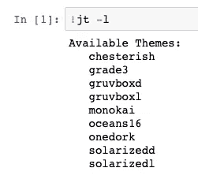
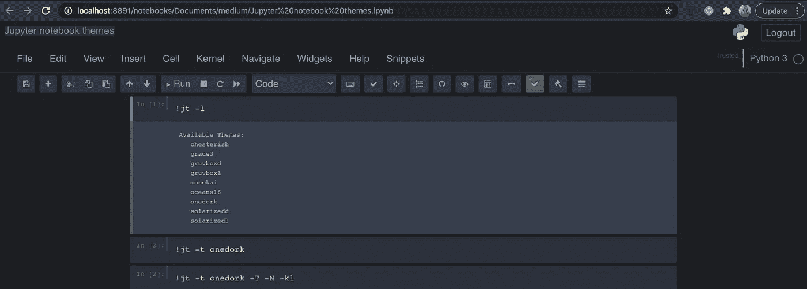

# 定制您的 Jupyter 笔记本

> 原文：<https://towardsdatascience.com/customize-your-jupyter-notebooks-6687f23838b?source=collection_archive---------28----------------------->

## Jupyter 笔记本主题


图片来自 [Pixabay](https://pixabay.com/?utm_source=link-attribution&utm_medium=referral&utm_campaign=image&utm_content=1851071) 的[像素](https://pixabay.com/users/pexels-2286921/?utm_source=link-attribution&utm_medium=referral&utm_campaign=image&utm_content=1851071)

**简介**

Jupyter Notebook 是一个很棒的编程环境，通常是用 python 编码的数据科学家或数据分析师最受欢迎的选择。不幸的是，它的默认设置不允许您在标准编程环境(如 PyCharm 或类似工具)中进行定制。

Jupyter 笔记本主题试图缩小这种差距，让你用主题让笔记本看起来更漂亮，功能更强大。在本文中，我将带您了解 Jupyter 笔记本主题的安装过程，并向您展示一些最重要的功能。

**安装**

Jupyter Notebook themes 是一个开源库，可以通过 pip install 安装。只需在命令行中键入以下代码:

```
pip install jupyterthemes
```

这将触发最新版本的安装。一旦完成，你应该能够在主题之间切换，调整笔记本中使用的字体，或者定制情节的风格。我们将在接下来的章节中详细介绍这些特性。

**改变主题**

安装完成后，您可以正常启动 Jupyter 笔记本，并从笔记本内部检查主题。

为了列出所有可能的主题，您可以使用以下代码:

```
!jt -l
```



正如你所看到的，目前有九个主题可用。为了切换主题，您可以使用以下命令:

```
!jt -t <theme_name>
```

让我们选择 *onedork* 主题。

```
!jt -t onedork
```

你会发现主题并没有立即改变。有些人报告说，他们可以重新加载页面，然后看到效果。从我个人的经验来看，我必须重启 Jupyter Notebook 才能改变主题。只需停止笔记本并再次启动它。这是它在加载时应该看起来的样子。


现在，你可以玩不同的主题，选择你最喜欢的一个。

你会注意到，默认情况下，标准 GUI 的某些部分在主题设置中是不可见的。我指的是下图的部分。


为了切换主题但保持标准的 GUI 外观，您可以使用以下代码变体。

```
!jt -t <theme_name> -T -N -kl
```

用 *onedork* 主题，这些会喜欢的。

```
!jt -t onedork -T -N -kl
```

重新启动 Jupyter 笔记本应该会得到类似下面截图的结果。



为了将笔记本恢复到默认设置，您可以使用此代码。

```
!jt -r
```

请注意，我已经在 Jupyter 笔记本中显示了正在执行的命令，但是您也可以在终端窗口中不带感叹号地使用它们。

**设置绘图风格**

一旦你使用了主题，你会注意到用 Matplotlib 库创建的图形看起来不是最好的。例如，这是一个创建折线图的简单代码。

```
import matplotlib.pyplot as plt
%matplotlib inlinebp_x = np.linspace(0, 2*np.pi, num=40, endpoint=True)
bp_y = np.sin(bp_x)# Make the plot
plt.plot(bp_x, bp_y, linewidth=3, linestyle="--",
         color="blue", label=r"Legend label $\sin(x)$")
plt.xlabel(r"Description of $x$ coordinate (units)")
plt.ylabel(r"Description of $y$ coordinate (units)")
plt.title(r"Title here (remove for papers)")
plt.xlim(0, 2*np.pi)
plt.ylim(-1.1, 1.1)
plt.legend(loc="lower left")
plt.show()
```

这是在没有定制的情况下使用 *onedork* 主题在笔记本中创建的情节截图。


这绝对不符合你选择的主题。事实证明，为了定制 Matplotlib 以匹配主题，您需要在笔记本顶部添加两行额外的代码。

```
from jupyterthemes import jtplot
jtplot.style()
```

一旦您运行了相同的图表代码(上面的两个代码行被添加到笔记本的顶部)，您应该会看到图表现在与主题的当前样式相匹配。


这样看起来好多了！

实际上，您可以更改图表样式，以匹配您想要的任何主题。

```
from jupyterthemes import jtplot
jtplot.style(<theme_name>)
```

如果您没有为样式函数提供参数主题，它将使用笔记本中当前加载的主题。

注意与主题设置不同，无需通过更改 Matplotlib 绘图样式来重新启动笔记本。

**改变字体**

Jupyter 笔记本主题不仅允许你改变主题，还可以对笔记本中使用的字体做一些额外的定制。

当用 jt 命令加载一个主题并添加一些额外的参数时，你可以改变字体。您可以自定义…

*   用于代码的字体(-f)及其大小(-fs)，
*   用于笔记本的字体(-nf)及其大小(-nfs)，
*   用于文本/降价的字体(-英尺)及其大小(-英尺)。

**总结**

在本文中，您已经学习了如何使用 Jupyter 笔记本主题定制您的标准 Jupyter 笔记本。我们仔细检查了库的安装细节，并设置了主题，包括图形和字体定制。

你现在应该可以自己尝试了。

快乐定制！

*最初发布于 aboutdatablog.com:* [用 Jupyter 笔记本主题](https://www.aboutdatablog.com/post/customize-your-jupyter-notebooks-with-jupyter-notebooks-themes)，*定制你的 Jupyter 笔记本 2021 年 1 月 20 日。*

*PS:我正在 Medium 和*<https://www.aboutdatablog.com/>**上撰写深入浅出地解释基本数据科学概念的文章。你可以订阅我的* [***邮件列表***](https://medium.com/subscribe/@konkiewicz.m) *每次我写新文章都会收到通知。如果你还不是中等会员，你可以在这里加入**[***。***](https://medium.com/@konkiewicz.m/membership)**

**下面是一些你可能会喜欢的帖子**

**</top-9-jupyter-notebook-extensions-7a5d30269bc8>  </top-8-magic-commands-in-jupyter-notebook-c1582e813560>  </introduction-to-f-strings-3822ed8683cc>  </9-things-you-did-not-know-about-jupyter-notebook-d0d995a8efb3> **