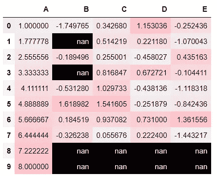
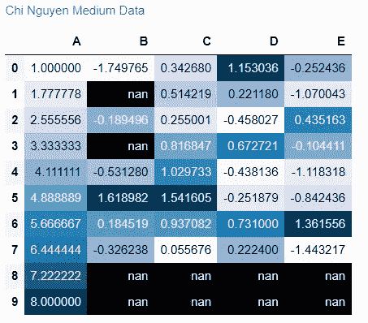

# 定制您的熊猫数据框以进行有效的数据分析

> 原文：<https://towardsdatascience.com/customize-your-pandas-data-frame-for-effective-data-analysis-ffa8b98630fb?source=collection_archive---------16----------------------->

## 使用 Pandas Styler 增强您的分析


照片由[丹尼尔·库鲁维拉](https://unsplash.com/@d_kuruvilla?utm_source=medium&utm_medium=referral)在 [Unsplash](https://unsplash.com?utm_source=medium&utm_medium=referral) 上拍摄

# 介绍

Pandas 是一个强大的数据操作和分析包，我相信这个库对你们很多人来说并不陌生。然而，有时当我以表格形式分析数据时，我观察到的都是简单的数字，很难注意到值的特征。我想，如果我能在我的 Pandas 数据框中应用更多的可视化组件或条件格式，那就太好了。

幸运的是，我找到了 ***Styler 对象。*** 这个表格可视化工具真的让数据框很有诱惑力，信息量大，很多情况下容易跟踪。

# Styler 对象是什么？

数据加载到数据框后，我们可以设置表格的样式。Styler 下的基本动作机制是制作一个 HTML 表格，应用 CSS 样式来管理颜色、背景、字体等不同属性。`DataFrame.style`属性返回一个 ***样式器*** 对象。它支持 Jupyter Notebook 中的自动渲染，因为它定义了一个`_repr_html_`方法。

让我们看看 ***Styler*** 可以对我们的数据表做些什么。

首先，让我们创建一个简单的数据，这样我就可以详细解释这个有效的工具。在我的数据集中，您可以看到产品名称和价格，以及购买这些产品的人的名单。


图 1:数据框架——作者图片

# 隐藏列

如果我不需要**“owner”**列，并且想暂时从数据中隐藏它，我可以使用`hide_columns()`方法。

```
df.style.hide_columns('price')
```

正如你所看到的，下面的结果已经隐藏了**【拥有者】**列。

***输出:***


图 2:隐藏的所有者列—作者图片

# 突出显示空值

注意空值在分析中很重要。为了观察这些空值，我们可以突出显示它们以便于观察。`highlight_null`在这种情况下使用属性。例如，在我的数据集中，我可以看到我的表数据没有 Mike 购买的产品名称。

```
df.style.highlight_null(null_color="yellow")
```

**输出:**


图 3:突出显示空值—作者图片

# **突出显示最小/最大值**

如果我想知道谁购买的最多或最少，我可以在列表中用`highlight_min`和`highlight_max`突出显示最小/最大购买金额。

让我们看看谁花钱最多:

```
df.groupby('owner').agg({'price':'sum'}).reset_index().style.highlight_max(color = 'green') 
```

***输出:***


图 4:突出最大价值——作者图片。

以 669 的消费金额，罗斯是购买最多的人。

同样，通过应用`highlight_min`，很明显珍是花费最少的人。

```
df.groupby('owner').agg({'price':'sum'}).reset_index().style.highlight_min(color = 'red')
```

***输出:***


图 5:突出显示最小值——作者图片。

# 突出显示分位数

您也可以突出显示由分位数定义的值。例如，在这种情况下，我想突出显示所有产品价格的 90%百分比值。我可以用`highlight_quantile`做到

```
df[['price']].style.highlight_quantile(q_left=0.9, axis=None, color='yellow') 
```

***输出:***


图 6:突出显示 90%的分位数值——作者图片

# 创建热图

热图有助于使用颜色阴影显示值。颜色阴影越强烈，数值越大。您可以选择使用背景渐变或文本渐变方法自定义热图。

例如，要为包含 5 个不同类别 A、B、C、D、E 中的值的数据集创建热图:


图 7:数据集 df3 -作者图片

首先，我们可以应用`style.background_gradient`我们甚至可以结合 ***seaborn*** 来获得更好的颜色。

```
import seaborn as sns
cm = sns.light_palette("pink", as_cmap=True)
df3.style.background_gradient(cmap=cm) 
```

***输出:***



图 8:热图渐变背景—作者图片

如果我们不想用背景颜色定制我们的表格，我们可以考虑使用`text_gradient`方法。

```
cm = sns.light_palette("green", as_cmap=True)
df3.style.text_gradient(cmap=cm)
```

**输出:**


图 9:文本渐变—作者图片

# 创建条形图

现在您可以让`df.style.bar`以零值为中心，并且您可以将一个列表`[color_negative, color_positive]`传递给这些值以获得您的条形图。

我会以负/正条形图的形式展示我的价值观。看这个，是不是很容易区分正负价值。

```
df3.style.bar(subset=['A', 'B'], align="zero", color=['pink', 'lightgreen'])
```

**输出:**


图 10:正负条形图

# 添加标题

在分析报告中，通常有许多数据框。为了了解每个数据帧描述的内容并区分它们，可以添加标题以获得更详细的信息。

例如，我想将我的热图表命名为**“Chi Nguyen Medium Data”**。我可以通过使用`style`的`set_caption`属性来实现

```
df3.style.set_caption("Chi Nguyen Medium Data").background_gradient()
```

***输出:***



图 11:添加的标题——作者的图片

# 用你自己的方式设计

尽管有许多方法可用于设置数据框的样式，但在某些情况下，您将需要自己的自定义函数来完成任务。让我们用一个例子来看看如何创建你的函数。

在我的数据集中，我想说明所有大于其列平均值的值。我将用蓝色突出显示较大的值，用粉色突出显示较小的值。下面是我如何定义我的函数并返回结果。

```
#Define function
def mean_greater(m):
    greater = m > m.mean()
    return ['background-color: lightblue' if i else 'background-color: pink' for i in greater]#Apply function
df3.style.apply(mean_greater)
```

***输出:***


图 12:突出显示值

# 结论

虽然设计数据框架只是分析中非常小的一步，但我相信灵活定制不同的设计方法可以帮助提高我们的分析速度，并为我们提供更全面的观察和数据见解。

从最容易的，看似最不重要的开始，一点一点地积累你的技能，这从来都不过分。

# 参考

[](https://pandas.pydata.org/docs/user_guide/style.html#Styler-Functions) [## 表格可视化- pandas 1.3.4 文档

### 本节演示如何使用 Styler 类可视化表格数据。有关可视化的信息，请使用…

pandas.pydata.org](https://pandas.pydata.org/docs/user_guide/style.html#Styler-Functions)