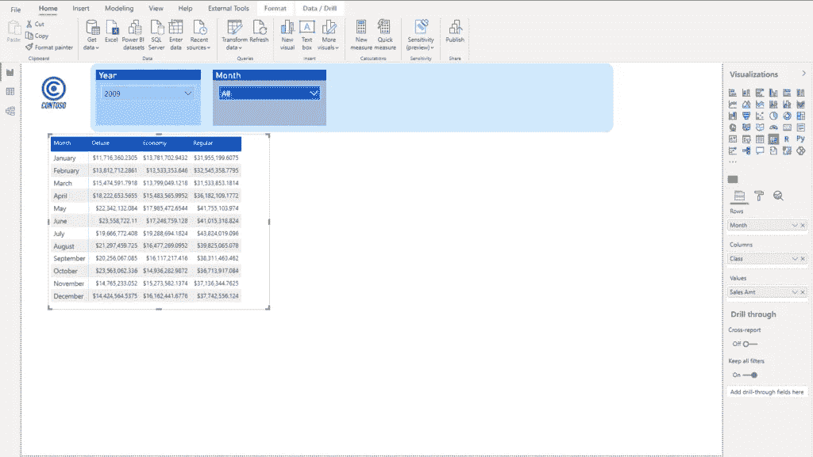
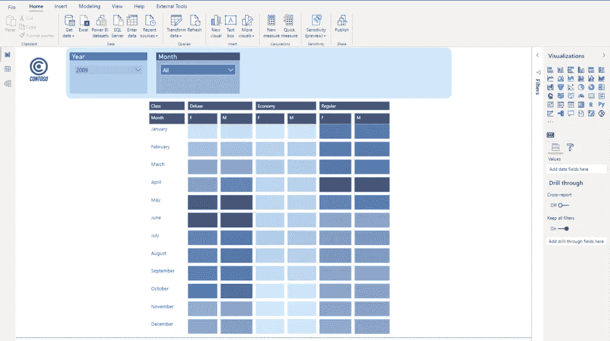

# 在 Power BI 中定制 Google Analytics 可视化

> 原文：<https://towardsdatascience.com/customizing-google-analytics-visual-in-power-bi-7b36378d02e2?source=collection_archive---------43----------------------->

## 您是否曾经想要在 Power BI 中创建自己的自定义视觉效果？几乎没有创意，学习如何模仿谷歌分析仪表板众所周知的视觉“外观和感觉”


作者图片

我是强力 BI 的超级粉丝，我也不隐瞒！我非常喜欢 Power BI 的一点是它有非常大的视觉效果集合，既有内置的，也有来自应用程序资源市场的定制视觉效果。

老实说，很难想象您的数据故事没有 Power BI 视觉效果支持的场景！然而，我最近接到一个请求，说我已经有了如何向用户讲述这个故事的想法，但我找不到一种恰当的方式来交流数字！

对，就是这个道理！我的想法是使用类似谷歌分析仪表板的视觉效果，看起来很简单，但同时也很强大:


谷歌分析仪表板—作者图片

这种视觉效果能让你快速洞察最相关的趋势。没有数字，什么都没有——只是像“热图”一样的东西，所以你可以在几秒钟内发现你的网站访问量最大的时候！

我已经写了如何将普通的矩阵视觉转换成这样，但是这次我需要一个额外的图层。

## 方案

请求是显示在一年的特定时间哪个品牌级别(豪华、普通或经济)的销售额最高。但是，作为一个附加层，报告消费者需要看到按性别细分的数字，并根据结果，在一年的选定时期内，针对各自的性别创建特殊的营销活动。

让我们使用一个样本 Contoso 数据库来说明真实的用例。这是开始时的样子:



作者图片

## 构建解决方案

如你所见，这只是一个普通的旧矩阵，显示每个月的总销售额，按品牌类别细分。让我们首先将性别信息添加到我们的矩阵中，并从这个角度来看这些数字:


作者图片

我已经在矩阵的列中添加了性别，但是为了在视觉本身中看到它们，我需要右击矩阵并选择*扩展到下一级*。一旦我这样做了，我就能看到每个品牌类别中按性别分列的数字:


作者图片

好了，现在我们准备开始变魔术了:)

第一步是从我们的报告中排除空白性别(这可以通过过滤器轻松实现),打开格式窗格，直接进入条件格式，并打开*背景颜色*属性:


作者图片

一旦打开背景色，Power BI 将自动应用一些渐变颜色，但我们需要对其进行更多控制，因此我们将转到高级控制，并为最低和最高值定义我们的颜色:


作者图片

我们需要做的下一件事是对字体颜色属性应用完全相同的步骤:


作者图片

嘣！我们接近了我们想要复制(或者模仿，如果你喜欢那样)的谷歌分析视觉:


这已经让人想起了谷歌视觉分析——作者图片

## 抛光溶液

首先，让我们确保所有的列长度相同，不管矩阵单元格中出现的是什么值。为了实现这一点，我将使用来自**力量匕家伙** 的[这个非常酷的技巧。](https://www.youtube.com/watch?v=fwQojt8rus0)

诀窍是创建一个虚拟的 DAX 度量来保存固定数量的相同字符，确保打开列标题下的自动调整列宽属性，然后将该度量放入矩阵行，然后关闭自动调整列宽，最后删除虚拟度量！

```
Dummy = REPT("0",10)
```

REPT 函数将重复您传递的文本，重复的次数由您在第二个参数中指定。在我的虚拟测量中，我放了 10 个零:


作者图片

现在，我需要打开“值”下的“在行上显示”属性:


作者图片

我知道这看起来很奇怪，但不要担心，我们会很快调整它！关闭自动调整列宽功能，并从矩阵中删除虚拟度量值:


作者图片

我们现在 100%确定我们的列将具有相同的宽度，尽管各个单元格中的值是相同的！

现在让我们在这些单元格之间创建一些空间！转到网格，打开垂直和水平网格，增加网格厚度(我已经把 8，但你可以根据你的需要调整)。现在，我的视觉效果看起来几乎和谷歌分析仪表板中的一模一样:



作者图片

这多酷啊！我可以很快识别趋势，并立即得出一些结论:例如，五月和六月是豪华班的摇摆月，而普通班在上半年的表现相当好！最棒的是，我可以在 3 秒钟内识别出这些趋势！

让我们做一个更漂亮的，而不是字母 F 和 M 的性别，创建漂亮的图标。你如何实现这一点？转到 Customer 表(或任何保存性别数据的表)并创建一个新列:

```
Gender Icons = IF(Customer[Gender]="M","♂","♀")
```

这里的诀窍是使用图标而不是字母:对于女性图标，只需在键盘上按 ALT+12，而对于男性图标，则需要按 ALT+11。就这么简单！IF 函数将检查性别列的值，并根据条件是否满足，分配一个适当的图标。

这是我们的最终解决方案:


作者图片

如果你问我，那看起来比我们的开始报告页更酷！不仅仅是它看起来更花哨、更现代，它还能让您在几秒钟内讲述一个数据故事！当然，如果您的用户需要检查准确的数字，数字仍然在那里，如果您将鼠标悬停在这些漂亮的蓝色数据条上，您会看到工具提示会像一个魔咒一样工作:


作者图片

## 结论

老实说，我有点失望 Power BI 没有为您提供开箱即用的可视化，这将带来与 Google Analytics visual 相同的体验。或者，至少我不知道它的存在:)

然而，通过一点点创意和一些小调整，我们能够复制谷歌分析视觉的“外观和感觉”。或者，让我大胆地说: ***我们刚刚创建了一个自定义的电源 BI 视觉***

感谢阅读！