# 自定义 NetworkX 图表

> 原文：<https://towardsdatascience.com/customizing-networkx-graphs-f80b4e69bedf?source=collection_archive---------2----------------------->

## [数据科学](https://towardsdatascience.com/data-science/home)

## 您的一站式网络购物中心

图论是一个非常有效的数据科学工具，它允许你可视化和理解复杂的交互。作为开源项目的一部分，我从许多主要来源收集了信息，以构建纽约市专业剧院灯光设计师之间的关系图。

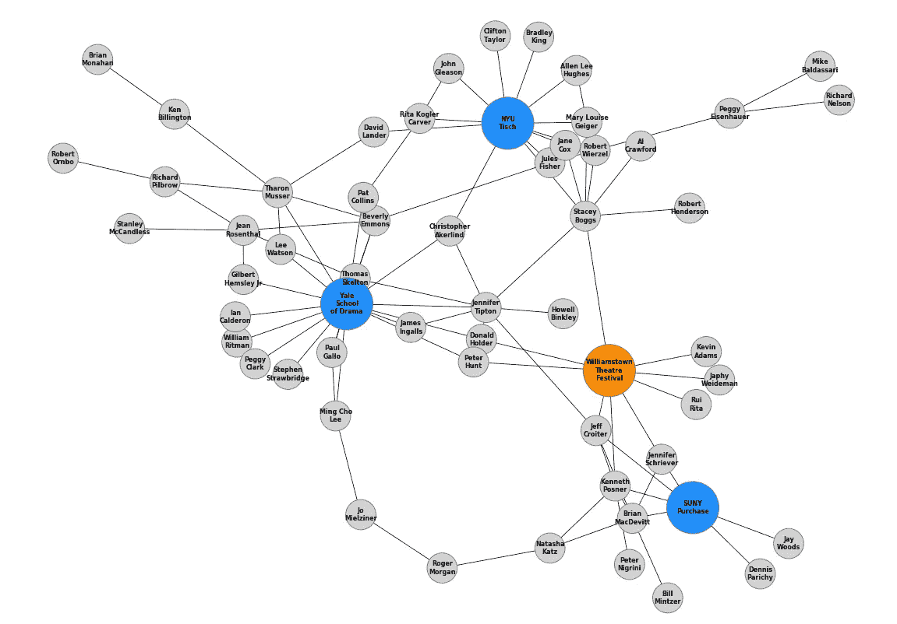

作者图片

我使用了 NetworkX，这是一个用于构建图形的 Python 包，它有大部分可用的缺省值，但是利用 matplotlib 允许我们定制图形的几乎每一个可以想到的方面。我知道我脑子里想的是什么样子，但是在花了很多时间搜索文档和 StackOverflow 之后，我决定创建这个一站式商店来存放我学到的如何改变的所有东西！现在，您也可以构建易读的图表来帮助可视化复杂的关系。

# 创建网络 x 图

我们将从制作基本图形开始！有几种方法可以做到这一点。我发现最简单的方法是从熊猫数据框中指定边缘。什么是优势？嗯，图是用节点和边构建的。一个节点代表某个对象，可能是一个人或组织，一条边代表从一个节点到另一个节点的实际连接。所以在下面的例子中，“A”、“B”、“C”和“D”是节点，它们之间的线是边。

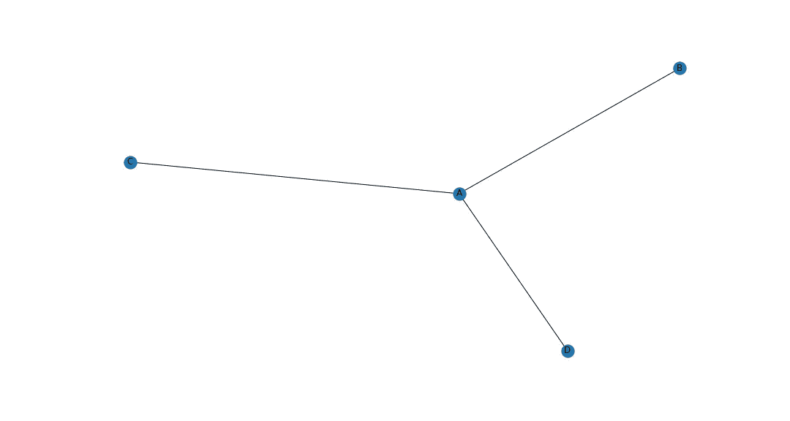

作者图片

# 节点颜色

我们也可以很容易地改变所有节点的颜色。您会注意到这样一种模式，即在全局范围内改变图形的特性非常简单(使用。draw()方法)。

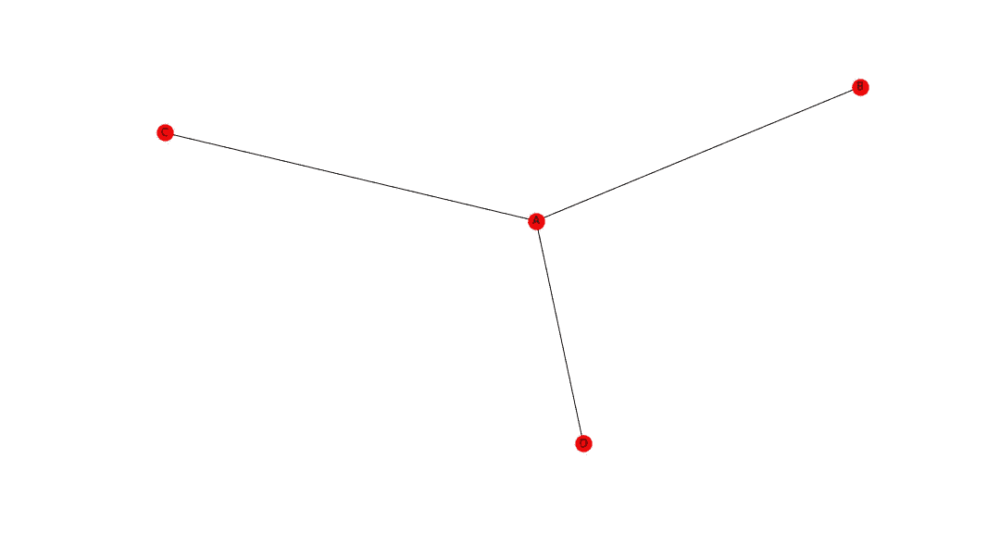

作者图片

# 按节点类型划分的节点颜色

但是，假设我们想按类型具体地改变节点的颜色，而不是全局地改变。这需要一点设置，但一旦到位，我们可以快速添加新的类型，并自动相应地着色。基本上，我们创建另一个数据帧，指定节点 ID 和节点类型，并使用 pd。Categorical()方法来应用色彩映射表。

所以现在我们的字母节点是蓝色的，数字节点是橙色的！

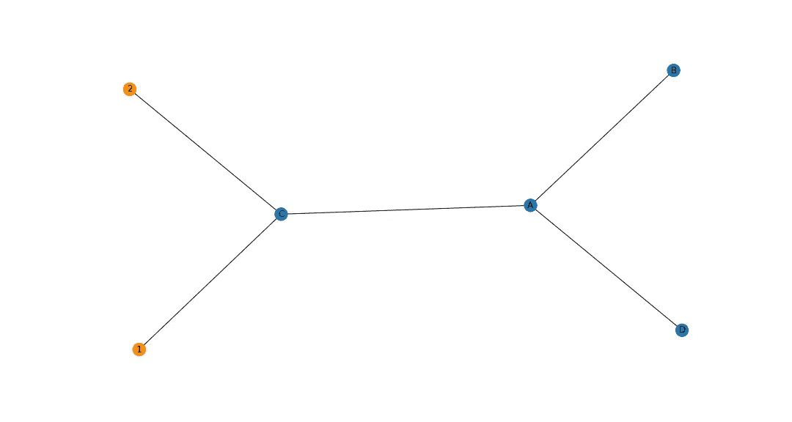

作者图片

# 节点大小

通过。draw()方法—只需指定 node_size！

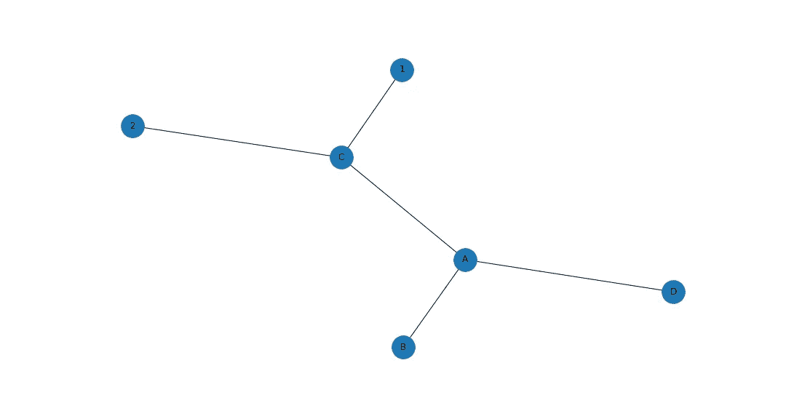

作者图片

# 按节点类型划分的节点大小

我们可以通过类型改变节点大小，就像我们可以改变颜色一样！我发现这对于将人与组织联系起来非常有用，因为组织有许多相关的人，所以将他们想象成以人为辐条的枢纽是有意义的。

因此，我们将根据我们的节点颜色按类型示例进行构建，但是我们将传入一个节点大小列表，引用用于选择节点颜色的节点类型，而不是 node_size 的单个关键字参数。

如果有人在挣扎，这是一个理解逻辑的列表

对于数据帧中的每个节点，如果该节点的类型不是“字母”，则将节点大小设置为 4000，否则将节点大小设置为 1000。结果是任何不是字母的东西都将是一个更大的节点。目前只有两种节点类型，这可能有点过了，但以后会更好地扩展。

```
node_sizes = [4000 if entry != 'Letter' else 1000 for entry in carac.type]
```

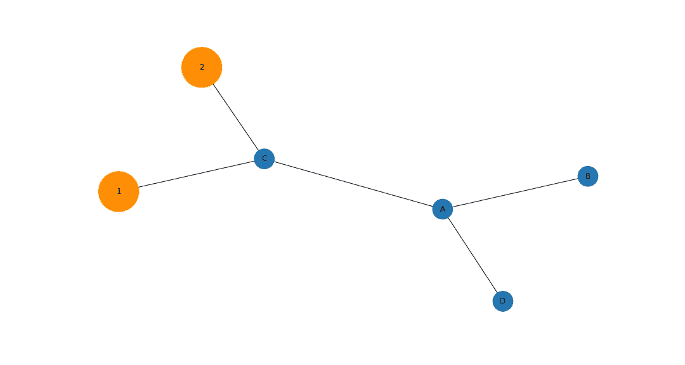

作者图片

# 手动节点大小

如果我们不需要按类型改变节点大小，而只是想引起对特定节点的注意，我们可以手动指定一个大小列表。这些需要与节点存储的顺序相同，所以调用 G.nodes()来生成一个列表。一些有代表性的尺寸标在下面，这样你就可以知道它们的相对尺寸。我发现 5000 英镑是一个很好的中间值，名字和姓氏都很合适。

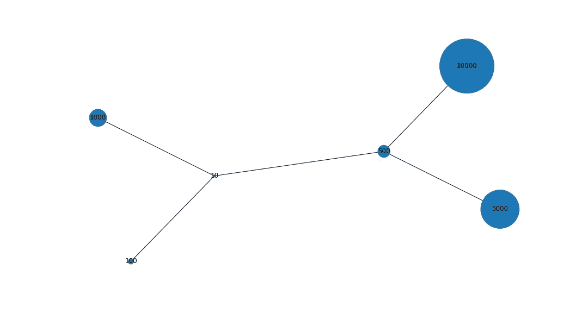

作者图片

# 边缘宽度

现在我们已经讨论了节点属性，我们可以移动到边。设置全局边的大小或颜色与设置节点一样简单，只需在。draw()方法。

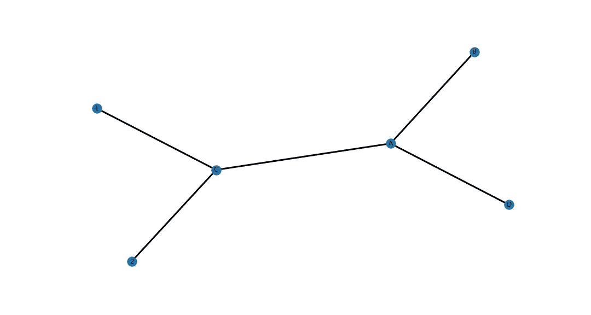

作者图片

# 边缘颜色

通过传入属性列表而不是单个值，可以单独而不是全局地给边着色或调整大小。因此，下面我们有边 _ 颜色和边 _ 宽度，将通过循环。

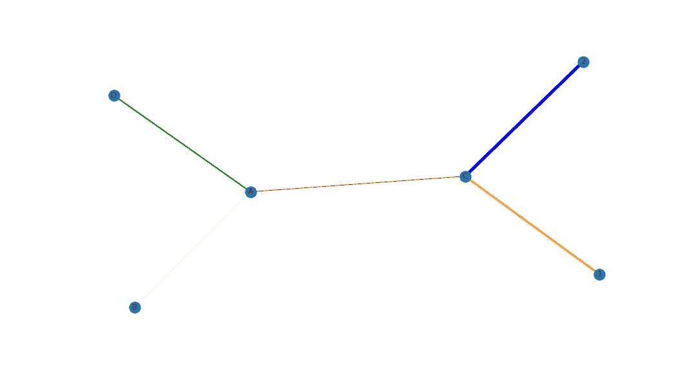

作者图片

# 节点边框颜色

最后，我们还可以用一个容易混淆的关键字“edgecolors”给节点添加一个彩色边框，这个关键字和“edge_color”是不一样的。这可以用来帮助澄清和分离节点，您可以在下面的示例图中看到。

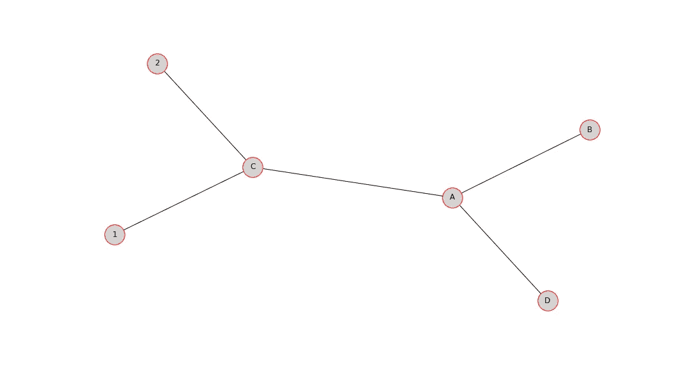

作者图片

# 图表布局

图表最重要的一个方面是它的布局。这将最终决定图表的可读性和有用性。NetworkX 有许多决定布局的选项，我在下面介绍了其中最流行的 4 个。缺省值是 spring_layout，它在上述所有情况下都被使用，但是根据您的使用情况，其他的也有优点。我建议尝试几种，看看哪种效果最好。

> [你可以在这里查看布局文档](https://networkx.org/documentation/stable//reference/drawing.html)。

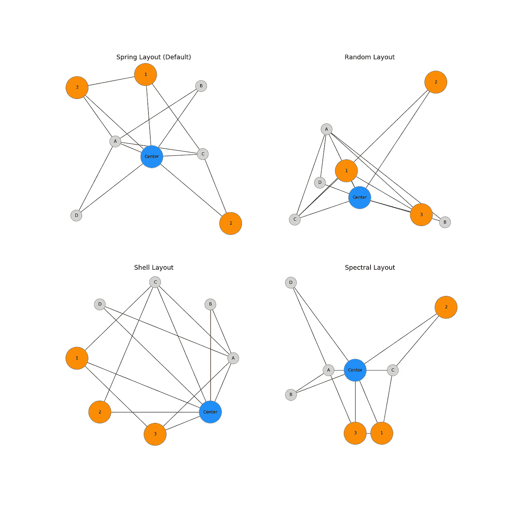

作者图片

# 一个示例网络—将它连接在一起

这里有一个完全实现的例子，来自我上面描述的项目。我创建了一个杰出的专业灯光设计师与剧院设计领域一些杰出的大学和组织的关系图。目标是确定个人关系如何影响紧密结合的剧院设计师世界。

你会注意到文本本身也可以被修改。代码都在下面，但是你可以使用像 font_size 和 font_weight 这样的关键字。此外，在节点标题中接受换行符“\n ”,这通常会增加可读性。例如，John Gleason 的节点在数据帧中被列为“John \ nGleason”。

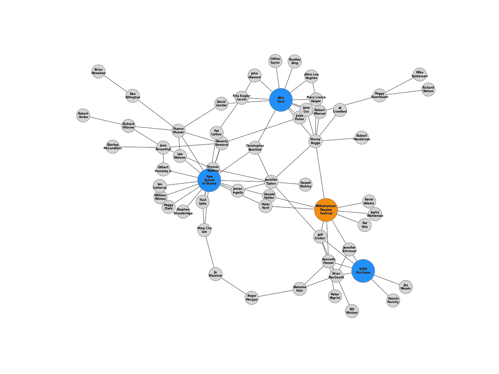

作者图片

# 结论

我希望本指南为您提供了如何定制 NetworkX 图形的大多数方面以增加可读性的工作示例。NetworkX 是一个非常强大的包，虽然它的缺省值非常好，但是随着项目的扩展，您会希望注意到不同的信息。这可以通过多种方式实现，但改变节点大小和颜色、边宽和图形布局是一个很好的起点。

# 连接

我一直在寻找连接和探索其他项目！你可以在 [GitHub](https://github.com/ArenCarpenter) 或 [LinkedIn](https://www.linkedin.com/in/aren-carpenter/) 上关注我，并在[媒体](https://arencarpenter.medium.com/)上查看我的其他故事。我也有一个[推特](https://twitter.com/ArenCarpenter)！