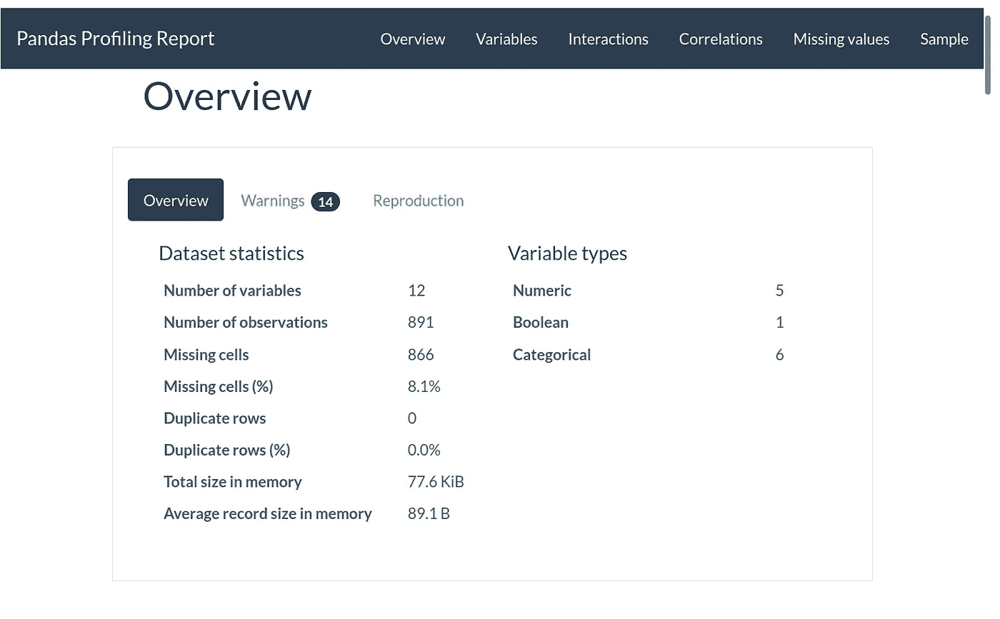

# 为熊猫简介带来定制

> 原文：<https://towardsdatascience.com/customizing-pandas-profiling-summaries-b16714d0dac9?source=collection_archive---------20----------------------->

## [*小窍门*](https://towardsdatascience.com/tagged/tips-and-tricks)

## 利用视觉类型系统获取乐趣和利润

如果您以前使用过 [pandas-profiling](https://github.com/pandas-profiling/pandas-profiling) ，您可能会观察到列汇总对于数据中每个要素的数据类型是唯一的。然而，直到最近还不可能定制这些摘要，所以，如果你想自动计算一系列形状优美的几何图形的平均表面积，或者一系列电子邮件地址中的域名集，你就没有运气了——直到现在。

最近完成的 pandas-profiling 到 [visions](https://github.com/dylan-profiler/visions) 类型系统的迁移带来了完全可定制的类型检测逻辑、摘要算法，并且是包括定制渲染在内的端到端报告定制的第一步。在这篇博文的剩余部分，我将向你展示如何开始使用 visions，并使用 pandas-profiling 轻松定制你的数据摘要。

# 对排版的简单介绍

默认的 pandas-profiling 类型系统由四种基本数据类型组成:

*   种类
*   日期时间
*   布尔代数学体系的
*   数字的

从技术上讲，还有第五种总括类型，称为不支持不适合其他四种类型的任何对象(这些通常是复杂的对象，如列表)。如果你想检查它的实现，检查一下在`pandas_profiling.model.typeset`中找到的`ProfilingTypeSet`对象。


作者图片

注意:你需要安装`pydot`和`pygraphviz`来重现这些情节

这些排版可以是复杂的，也可以是简单的，只要你的用例需要。想区分整数和浮点数？字符串中的 URL？文件中的图像？您的数据还有什么特别之处吗？你可以在 pandas-profiling 中找到这些类型中的大多数，在 [visions](https://dylan-profiler.github.io/visions/visions/api/types.html) 中有更多可用的，如果没有，编写自己的代码通常只是几行代码。类型和类型系统的完整介绍可以在这里找到。

# 自定义摘要

首先，让我们下载泰坦尼克号数据集的副本，并将`Survived`字段转换为布尔值。


现在我们有了一些数据，我们可以使用 pandas-profiling 来创建一个配置文件报告。



作者图片

这里没有惊喜，只是标准的熊猫概况工作流程。除了普通的 html 报告，我们可以通过报告上的`description_set`属性直接检查由 pandas-profiling 计算的汇总值。让我们来看看我们对`Survived`属性的总结。

```
{'n_distinct': 2,
 'p_distinct': 0.002244668911335578,
 'is_unique': False,
 'n_unique': 0,
 'p_unique': 0.0,
 'type': Boolean,
 'hashable': True,
 'value_counts_without_nan': False    549
 True     342
 Name: Survived, dtype: int64,
 'n_missing': 0,
 'n': 891,
 'p_missing': 0.0,
 'count': 891,
 'memory_size': 1019}
```

这里有很多有用的信息:内存使用情况、序列值是否可散列、缺失值计数等。默认情况下，每个布尔序列都会收到一个相同的摘要——现在，多亏了摘要器，我们可以自定义这些结果！

# 总结者

在幕后，`pandas-profiling`使用一个`PandasProfilingSummarizer`对象为概要文件报告生成摘要。这些汇总器将数据类型(如 Boolean)映射到用于创建最终汇总的汇总函数列表。

您可以直接从这个摘要器中复制上面的摘要，如下所示:

```
{'n_distinct': 2,
 'p_distinct': 0.002244668911335578,
 'is_unique': False,
 'n_unique': 0,
 'p_unique': 0.0,
 'type': Boolean,
 'hashable': True,
 'value_counts_without_nan': False    549
 True     342
 Name: Survived, dtype: int64,
 'n_missing': 0,
 'n': 891,
 'p_missing': 0.0,
 'count': 891,
 'memory_size': 1019}
```

为了定制摘要，我们需要为排版中的每种数据类型指定一系列要调用的函数。类型在很大程度上支持算术，正如您自然期望的那样，将两种类型加在一起，如`Boolean + Unsupported`，会产生包含 Boolean 和 Unsupported 的排版。

将这些结合在一起，让我们编写一个总结器，计算所有数据类型的每个序列的长度，另外，计算布尔型的概率`True`。

尽管这看起来很复杂，但本质上它只是跟踪一系列不同数据类型上调用的函数。在幕后，summarizer 对象负责将汇总函数组合在一起，以产生一个最终结果，并附加一个“type”值来指示使用了哪个汇总。

```
{'type': Boolean, 'length': 891, 'probability_true': 0.3838383838383838}
```

```
{'type': Unsupported, 'length': 891}
```

虽然摘要器现在是完全可定制的，但是相关的 html 渲染还没有更新以显示定制的统计数据，所以请注意将来的其他更新。

# 自定义配置文件报告摘要

虽然你现在可以在 pandas 中定制概要——根据你的心的内容进行描述，但是在大多数情况下，你将会修改或者添加默认的概要，而不是从头开始构建一个。这也很简单，只需将你想要的任何新功能添加到它的关联类型中！让我们更新默认的 PandasProfilingSummarizier，以包含`new_boolean_summary`函数，并运行一个具有新功能的报告

```
{'n_distinct': 2,
 'p_distinct': 0.002244668911335578,
 'is_unique': False,
 'n_unique': 0,
 'p_unique': 0.0,
 'type': Boolean,
 'hashable': True,
 'value_counts_without_nan': False    549
 True     342
 Name: Survived, dtype: int64,
 'n_missing': 0,
 'n': 891,
 'p_missing': 0.0,
 'count': 891,
 'memory_size': 1019,
 'probability_true': 0.3838383838383838}
```

瞧，就这样，我们能够将`probability_true`计算插入到我们的配置文件报告中。

# 结论

到目前为止，我们对 visions 提供的定义高级数据类型和支持用户定义功能的灵活性非常满意。我们很高兴很快开始推出更多这些功能，包括对定制渲染的支持，并渴望收集反馈。你是如何使用定制的类型和摘要的，或者你有什么有趣的用例值得添加到熊猫档案中？如果有，请在下面评论分享！