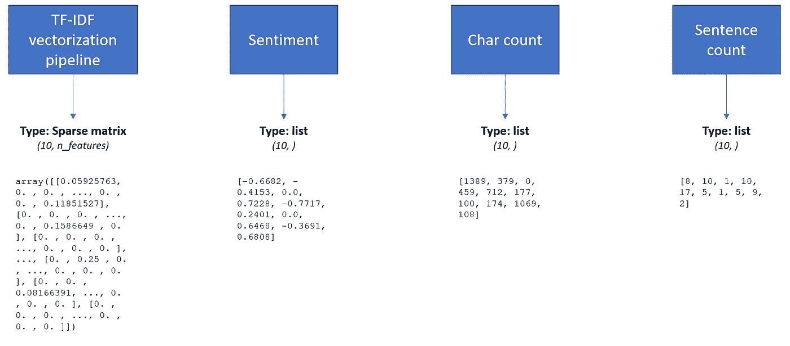
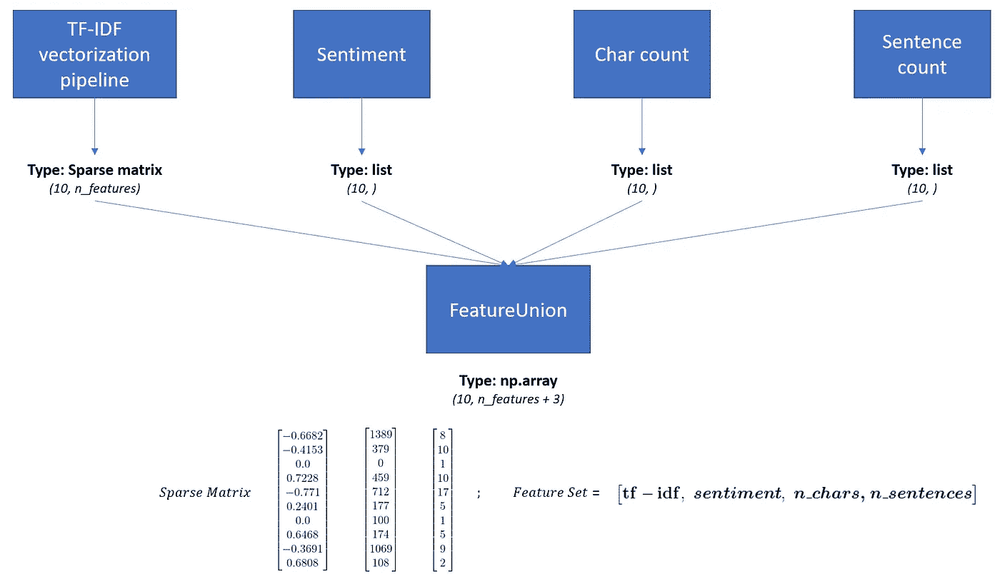
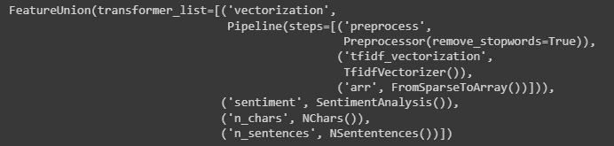
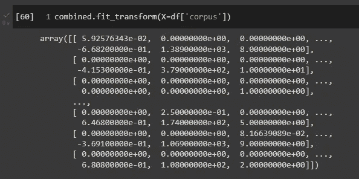
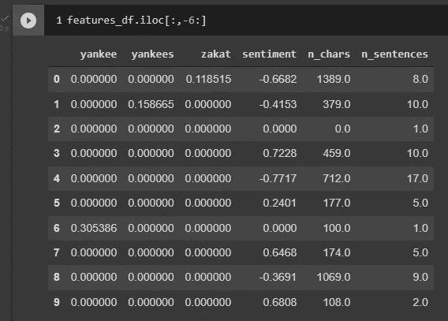

# 使用 BaseEstimator、TransformerMixin 和 FeatureUnion 定制您的 Sklearn 管道

> 原文：<https://towardsdatascience.com/customizing-sklearn-pipelines-transformermixin-a54341d8d624?source=collection_archive---------8----------------------->

## *如何为 Sklearn 管道创建自定义转换器*

[阿瑟尼·托古列夫](https://unsplash.com/@tetrakiss?utm_source=unsplash&utm_medium=referral&utm_content=creditCopyText)在 [Unsplash](https://unsplash.com/s/photos/transformer?utm_source=unsplash&utm_medium=referral&utm_content=creditCopyText) 上的照片

Scikit-Learn 最常用和最受欢迎的特性之一是*管道*。虽然它们的使用是可选的，但是它们可以用来使我们的代码更干净，更容易维护。管道接受*估算器*作为输入，它们是从[sk learn . base . base estimator](https://scikit-learn.org/stable/modules/generated/sklearn.base.BaseEstimator.html)继承的类，并且包含 *fit* 和 *transform* 方法。**这允许我们使用 Sklearn 默认不提供的功能定制管道。**

我们将讨论 *transformers* ，对输入进行转换的对象。我们将继承的类是 TransformerMixin，但是也可以从 ClassifierMixin、RegressionMixin、ClusterMixin 和其他类扩展来创建一个定制的估计器。阅读[此处](https://scikit-learn.org/stable/modules/generated/sklearn.base.BaseEstimator.html)的所有可用选项。

我们将使用文本数据的数据集，我们希望对其应用转换，例如:

*   文本预处理
*   TF-IDF 矢量化
*   创建附加功能，如情感、字符数和句子数

这将通过使用 Pipeline 和 [FeatureUnion](https://scikit-learn.org/stable/modules/generated/sklearn.pipeline.FeatureUnion.html) 来完成，后者是一个 Sklearn 类，它组合了来自不同来源的特性集。

# 数据集

我们将使用 Sklearn 提供的数据集 *20newsgroups* ，快速访问大量文本数据。出于演示的目的，我将只使用 10 个文本的样本，但该示例可以扩展到任何数量的文本。

让我们导入数据集

# 文本特征的创建

我们将构建包含这些信息的特性集

*   应用预处理后使用 TF-IDF 进行矢量化
*   与 NLTK 的感悟。维德
*   文本中的字符数
*   课文中的句子数量

我们的流程不使用管道，而是用单独的代码块顺序应用所有这些步骤。管道的美妙之处在于，排序是在单个代码块中维护的——管道本身变成了一个估计器，能够在一条语句中执行所有操作。

让我们创建我们的函数

我们的目标是创建一个独特的特征集，以便为某项任务训练一个模型。我们将使用管道和 FeatureUnion 把我们的矩阵放在一起。

# 如何合并不同来源的要素

TF-IDF 矢量化将创建一个稀疏矩阵，该矩阵将具有维度*n _ documents _ in _ corpus***n _ features*，情感将是单个数字，以及 n_chars 和 n_sentences 的输出。**我们将获取每个步骤的输出，并创建一个包含所有输出的矩阵，这样我们就可以根据我们设计的所有功能训练一个模型**。我们将从这样的模式开始

事物的初始状态。图片作者。

并达到这个最终的表现

FeatureUnion 的工作原理。图片作者。

该特征集将被用作我们模型的训练向量。

## 从 BaseEstimator 和 TransformerMixin 继承的类

为了让我们的过程继续下去，我们需要定义类以及它们将在管道中做什么。让我们从创建一个 DummyEstimator 开始，我们将从它继承 init、fit 和 transform。DummyEstimator 是一个方便的类，它让我们不必编写多余的代码。

DummyEstimator 将从四个类继承:SparseToArray 的*预处理器*、*感知分析*、 *NChars* 、*内容*和*。*

如您所见，DummyEstimator 只允许我们定义转换函数，因为其他所有类都从 DummyEstimator 继承了其 *init* 和 *fit* 。

现在让我们看看如何实现矢量化管道，**，它将考虑到我们的文本预处理。**

剩下要做的就是应用 FeatureUnion 将这些片段组合在一起

特征联合的步骤和估计量。图片作者。

让我们在语料库上检查一下 *fit_transform* 的输出

FeatureUnion 的输出-四个数据源合并在一个矩阵中。图片作者。

输出似乎是正确的！虽然不是很清楚。我们通过将组合的特征集插入数据帧来结束本教程

结果如下(出于可读性的原因，我在这里截断了结果)

熊猫数据框架中的联合特征集。图片作者。

**我们现在有了一个数据集，可以随时提供给任何训练模型**。用[*sk learn . preprocessing . standard scaler*](https://scikit-learn.org/stable/modules/generated/sklearn.preprocessing.StandardScaler.html)*或类似的东西进行实验，并使 n _ chars 和 n_sentences 正常化，这将是有用的。我将把这个练习留给读者。*

# *结论*

*我们已经看到了 Sklearn 中的 **BaseEstimator** 、 **TransformerMixin** 和 **FeatureUnion** 类的基本操作可以为我们的定制项目做些什么。*

*它使我们能够创建定制的预处理类，并在管道中连接特性集。*

***这种方法提高了生产率和干净的代码**并且可以帮助整个团队构建脚本和笔记本。*

*我希望你今天学到了新的东西，并且在你的代码库中应用了这些原则！😀*

# *推荐阅读*

*对于感兴趣的人来说，这里有一个我为每个与 ML 相关的主题推荐的书籍列表。在我看来，有一些必不可少的书籍对我的职业生涯产生了巨大影响。
*免责声明:这些是亚马逊会员链接。我会收到亚马逊为你推荐这些项目的一小笔佣金。你的体验不会改变，你也不会被收取更多费用，但它将帮助我扩大业务规模，围绕人工智能制作更多内容。**

*   ***ML 简介** : [*自信的数据技能:掌握处理数据的基本原理，为你的职业生涯增压*](https://amzn.to/3WZ51cE) 作者:基里尔·叶列缅科*
*   ***sk Learn/tensor flow**:[*使用 Scikit-Learn、Keras 和 TensorFlow*](https://amzn.to/3jseVGb) 进行动手机器学习*
*   ***NLP** : [*文本即数据:机器学习和社会科学的新框架*](https://amzn.to/3l9FO22) 作者贾斯汀·格里默*
*   ***sk Learn/PyTorch**:[*用 py torch 和 Scikit 进行机器学习——Learn:用 Python 开发机器学习和深度学习模型*](https://amzn.to/3wYZf0e) 塞巴斯蒂安·拉什卡著*
*   ***数据即** : [*用数据讲故事:商务人士数据可视化指南*](https://amzn.to/3HUtGtB) 科尔·克纳弗利克著*

# *有用的链接(我写的)*

*   ***学习如何用 Python 执行顶层探索性数据分析** : [*用 Python 执行探索性数据分析——一步一步的过程*](/exploratory-data-analysis-in-python-a-step-by-step-process-d0dfa6bf94ee)*
*   ***学习 TensorFlow 的基础知识**:[*tensor flow 2.0 入门—深度学习入门*](https://medium.com/towards-data-science/a-comprehensive-introduction-to-tensorflows-sequential-api-and-model-for-deep-learning-c5e31aee49fa)*
*   ***用 Python 中的 TF-IDF 进行文本聚类** : [*用 Python 中的 TF-IDF 进行文本聚类*](https://medium.com/mlearning-ai/text-clustering-with-tf-idf-in-python-c94cd26a31e7)*

***如果你想支持我的内容创作活动，欢迎点击我下面的推荐链接，加入 Medium 的会员计划**。我将收到你投资的一部分，你将能够以无缝的方式访问 Medium 的大量数据科学文章。*

*<https://medium.com/@theDrewDag/membership>  

# 密码*