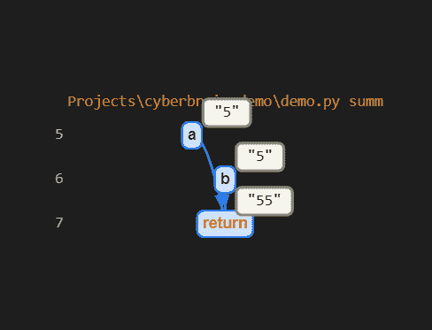
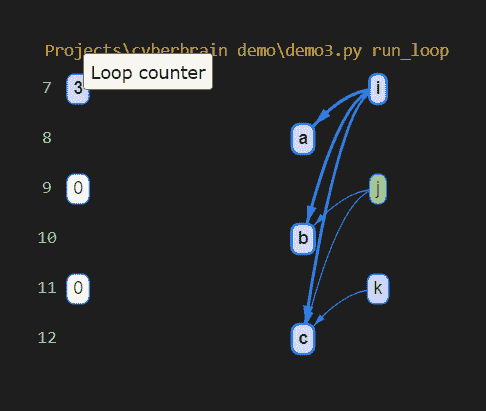

# CyberBrain:像专家一样调试 Python 程序

> 原文：<https://towardsdatascience.com/cyberbrain-debugging-python-programs-like-a-pro-dbedbfa25800?source=collection_archive---------10----------------------->

## Python 调试被重新定义


乔希·里默尔在 [Unsplash](https://unsplash.com?utm_source=medium&utm_medium=referral) 上的照片

> 调试这个词意味着修复程序中潜在的错误。调试的基本步骤包括识别缺陷的存在、隔离缺陷的来源、确定缺陷的原因、确定缺陷的修复方法、应用修复方法并进行测试。— [计算机编程原理/维护/调试，WikiBooks](https://en.wikibooks.org/wiki/Computer_Programming_Principles/Maintaining/Debugging)

# 介绍

上面几行清楚地显示了我们在大多数情况下是如何执行调试的。从头开始一次不犯错误地编写一个完整的程序几乎是不可能的(如果可以的话，嗯……)。当我们谈论调试时，我们试图解决一系列关于程序为什么不工作的错误。在 Python 中，我们会遇到这些类型的错误:

**1。编译失败(语法错误)**

**2。异常退出**

**3。程序运行但给出错误结果**

**4。程序是正确的，但消耗大量资源。**

**第一个**可以通过**参考文档**或语言定义来解决，因为错误在用户干扰方面是不符合逻辑的，**异常退出**需要对代码进行彻底的**审查以寻找任何异常，最后一个需要对底层**数据结构**的**良好理解**以优化代码，使其达到最佳状态。第三个错误是大多数情况下最常遇到的错误，我们花了相当多的时间来修复它们。本文主要解决这个错误。**

# 现状

每当我们的程序遇到错误，这些是我们目前遵循的一些常见方法:

**1。使用 Print()语句:**调试代码最明显、最快捷的方法之一是打印中间变量，并检查代码是否按顺序执行。几乎每个人都使用打印语句来调试他们的代码，Python 的开发者**吉多·范·罗苏姆**也支持这一点。请参见下面的示例:


作者图片

您一定已经猜到了这段代码中的错误，但是假设您没有猜到。如果您运行此程序，将会得到以下输出:

```
Enter number one: 5
Enter number two: 5
55
```

程序运行了，但输出是错误的。要解决这个问题，你可以**简单地打印变量 a 和 b 的类型为**。

```
<class 'str'>
```

因为它们是字符串，所以它们被**连接起来**。给它们加上 int 函数就能解决这个错误。

```
Enter number one: 5
Enter number two: 5
10
```

一个简单的 print 语句可以完成这项工作，但是在这种情况下，您需要知道将语句放在哪里。在探索我们的交互式解决方案时，我们将**重温这个例子**。

**2。日志记录:**这是一种可配置的技术来捕获 bug。与打印语句相比，它还易于管理并提供更丰富的上下文。但是这里的问题是一样的。我们需要知道需要在哪里引入日志记录。

**3。调试器:**这是最强大的调试方法，为用户提供了很多特性。调试器的一个额外优势是他们不需要熟悉代码。在打印和日志记录中，您需要知道代码哪里出了问题，但是调试器可以更容易地指出根本原因。但是调试器需要很大的努力，而且你实际上需要知道如何使用它们。

如果所有这些都有这样或那样的问题，那么解决方案是什么？这就是我向你介绍**赛博大脑**的地方。

# 网络大脑

<https://github.com/laike9m/Cyberbrain>  

考虑到上述所有情况，市场上没有一个工具像调试器一样强大，也没有一个工具像打印语句一样易于使用。我们想要一个工具，它需要最少的努力，但仍然提供更丰富的信息。CyberBrain 旨在通过可视化程序的内部工作来提供这一点。该库的设置分为两步:

**1。通过 pip 命令安装库:**

```
pip install cyberbrain
```

**2。安装 VSCode 扩展:**目前库只支持 VSCode IDE 和 GitPod。我觉得大部分开发者用的都是 VSCode(如果没有，尽快切换！)，而且安装扩展也不是一件难事。搜索并安装该扩展:


现在我们已经准备好调试我们的程序了。让我们把这个应用到我们上面讨论的例子中:


我在函数 summ()上添加了一个名为 **@trace** 的装饰器。这个**装饰器**允许 cyber brain**追溯函数中的所有变化**并呈现一个交互式树状可视化:


上面程序的输出

你还会得到一个开发者的工具窗口( **Chrome Dev Tools** )，它带有一个打开的控制台，显示所有的变量值和用户完成的悬停。它还**截断所有变量**，这些变量包含较大的值，很难在图表上显示。

现在让我们使用这个**交互式**树来解决这个 bug。悬停在树上，看看你有没有发现什么值得注意的东西？**你能发现这个错误吗？**



作者图片

> 对，a 和 b 的值用引号括起来，这意味着它们保存字符串类型的值，因此函数返回的结果是这两个字符串的串联！

让我更正代码，并查看代码修改后的树:


代码修改后的输出

如你所见，现在**的值不在引号内，结果是正确的。**这意味着它们是**数值，因此加法给出了正确的结果！让我们考虑另一个问题来更好地可视化一个程序。这个程序在 [creator Github repo](https://github.com/laike9m/Cyberbrain/blob/master/examples/twelve_days/twelve.py) 中也有:**


作者代码

运行代码后，您将得到如下输出:


上面代码的输出

现在让我们理解这一点:

最初，**行变量**是由**接受参数 day 和 ordinal 形成的。**然后使用**旧的线条变量 state、day 和 gifts 变量**得到了另一个线条变量 state。并且在最后，这个**结果行变量在没有其他变量介入的情况下被修改**以返回变量行的最终状态**。这种解释只是基于上面的图表，我不知道代码在做什么。在比较了代码的作用和树返回的结果之后，所有的事情都有了意义！**

这个库的另一个功能是，如果你的函数中有一个循环，那么你可以看到每一步的变量，也可以修改计数器的值！



循环计数器可以由用户定义

# 结论

这都是关于图书馆网络大脑的。我想提到的几点是**库正在大量开发中**而 v1.0 尚未发布。目前，**不支持异步**和多线程程序。你不能在你的程序中多次使用@trace decorator。这意味着它现在只能跟踪一个函数，但是这个库的开发者已经计划在即将到来的版本中包含所有这些特性。

如果你喜欢我的写作方式，想要更多的文章，那么一定要关注我的社交网站，这样你就不会错过我的新文章。此外，您可以联系我寻求任何疑问、疑问或潜在的机会！

1.LinkedIn—[in/kaustubh-Gupta/](https://www.linkedin.com/in/kaustubh-gupta/)

2.推特— [@Kaustubh1828](https://twitter.com/Kaustubh1828)

3.GitHub — [kaustubhgupta](https://github.com/kaustubhgupta)

4.中— [@kaustubhgupta1828](https://medium.com/@kaustubhgupta1828)

**参考:这篇文章受到了这个演讲的启发:** [“让我们重新思考调试”——laike 9m(py cascades 2021)](https://www.youtube.com/watch?v=eXlTVrNZ67Q)

**我的其他文章:**

</deploying-python-github-actions-to-marketplace-d07790e9817d>  </creating-interactive-jupyter-notebooks-and-deployment-on-heroku-using-voila-aa1c115981ca>  </build-dashboards-in-less-than-10-lines-of-code-835e9abeae4b>  </run-python-code-on-websites-exploring-brython-83c43fb7ac5f> 