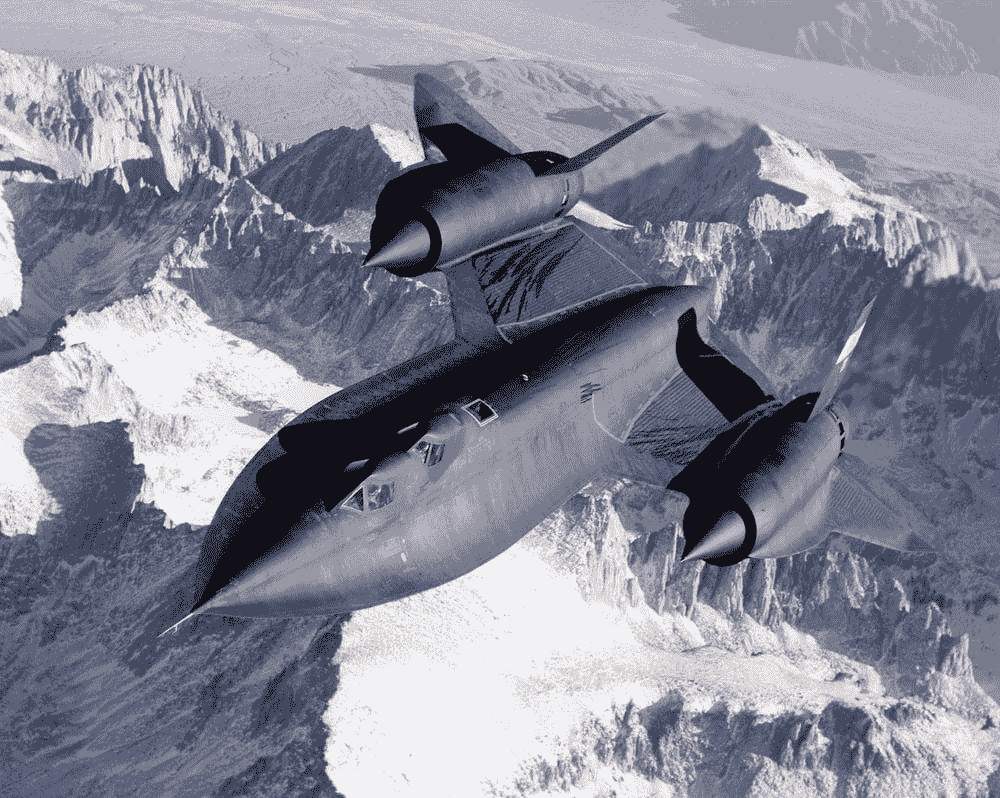

# 6 个步骤使熊猫数据帧操作速度提高 100 倍

> 原文：<https://towardsdatascience.com/cython-for-data-science-6-steps-to-make-this-pandas-dataframe-operation-over-100x-faster-1dadd905a00b?source=collection_archive---------13----------------------->

## 用于数据科学的 Cython:将 Pandas 与 Cython 结合起来，实现令人难以置信的速度提升


看起来没那么快，让我们加速吧！(图片由[西奥多·伦奎斯特](https://unsplash.com/@umbriferous)在 [unsplash](https://unsplash.com/photos/6Ox3fPG-qvo) 上拍摄)

在本文中，您将了解如何改进 Panda 的 df.apply()函数，使其速度提高 100 倍以上。本文采用了 Pandas 的标准`dataframe.apply`函数，并对其进行了一点升级，将执行速度从 3 分钟提高到 2 秒*。在本文结束时，您将:*

*   理解 df.apply()为什么慢
*   了解如何通过 Cython 加速应用
*   知道如何通过将数组传递给 Cython 来替换 apply
*   能够多进程处理你的 Cython-function 来挤出最大的速度
*   用你的代码总是比他们的快得多这一事实来烦扰你的同事

在我们开始之前，我强烈推荐阅读这篇关于 Python 为何如此缓慢的文章。它帮助您理解我们在本文中试图解决的问题类型。也可以查看 [**这篇关于 Cython 入门的文章**](https://mikehuls.medium.com/getting-started-with-cython-how-to-perform-1-7-billion-calculations-per-second-in-python-b83374cfcf77) 。

## 熊猫不是已经挺快的了吗？

没错，它是建立在用 c 写的 Numpy 上的，速度非常快。然而，Df.apply 将 Python 函数应用于数组。[慢 Python 函数是*不是*快](https://mikehuls.medium.com/why-is-python-so-slow-and-how-to-speed-it-up-485b5a84154e)。这是我们试图解决的问题的一部分。另一方面，Python 中也会出现循环。首先，我们将进行设置，然后我们将通过 6 个步骤来解决这些问题。

# 设置

这种类型的教程总是与实际的例子一起工作得最好，所以对于这个项目，我们将想象我们有一个网上商店。因为我们已经有 1700 万客户，所以我们决定开一家实体店，这样客户就可以取货了，节省了我们的送货成本。我们已经选好了几个地点，但哪个是最好的呢？我们决定**我们最好定居在离我们所有客户的平均距离最短的地方。**

我们想要计算每个位置的平均距离，但是我们都很忙，不想花很长时间等待距离计算完成。

> 我们的目标是优化计算所有客户到某个位置的平均距离。

## 加载数据

为此，我们从数据库(使用 [**this article**](https://mikehuls.medium.com/dramatically-improve-your-database-inserts-with-a-simple-upgrade-6dfa672f1424) )将 1700 万客户全部加载到一个 dataframe 中(隐藏所有不必要的列):

```
customer_id          lat        lon
          0    52.131980    5.510361
          1    52.438026    6.815252
          2    51.238809    4.447790
          3    51.163722    3.588959
          4    52.559595    5.483185
```

## 距离计算功能

以下函数可用于计算地球上两点之间的球面距离。

## 安装依赖项

剧透警告:我们要用 Cython 来解决这个问题。我们使用 CythonBuilder 来负责编译、构建和打包我们的包。安装时使用:

```
pip install cython
pip install cythonbuilder
```

安装后，调用`cybuilder init`。这将在您的根目录下创建一个名为`ext`的文件夹。如果您不熟悉使用终端，请查看本文[](https://mikehuls.medium.com/terminals-consoles-command-line-for-absolute-beginners-de7853c7f5e8)**。**

****

**我们将通过 6 个步骤从这个到高超音速喷气式飞机(图片由高清[历史](https://unsplash.com/@historyhd)在 [Unsplash](https://unsplash.com/photos/2MUqdhKBMzw) 上提供)**

# **计算平均距离**

**我们已经选择了一个我们想要计算平均顾客距离的位置。我们将用 **6 个步骤**来解决这个问题。在每一步中，我们将改进我们的代码并实现更快的速度。我们将从 Python 开始，逐渐增加更多的 Cython 和其他优化。**

## **第一步。纯 Python**

**我们将把距离计算函数`df.apply`到我们的数据帧中，将结果赋给一个新列，最后，对该列进行平均。**

**这是可行的，但还有很多可以改进的地方。该功能在**大约 3 分钟**后结束。这将是我们的基准:**

```
[1_purepy]  17M rows   179037ms
```

## **第二步。糖化**

**在这一部分，我们将把 Python 代码放在 Cython 文件中。在`ext/pyxfiles`中新建一个名为`geopack.pyx`的文件。如果这个文件夹还不存在，你可能忘了调用`cybuilder init`。只需将您的 Python 函数复制并粘贴到这个新文件中，如下所示(不要忘记导入):**

**接下来，我们需要编译、构建和打包这个模块。幸运的是，使用 CythonBuilder 非常容易。调用`cybuilder build`来做这件事。然后我们可以从 CythonBuilder 创建的`ext`文件夹中导入并使用如下功能:**

**像这样简单！这段代码在 2.7 分钟内完成，虽然我们还没有优化任何东西，但已经快了一点。让我们看看我们的基准，并开始优化。**

```
[1_purepy]  17M rows   179037ms
[2_pyINcy]  17M rows   163102ms      (x1.098)
```

## **第三步。使最佳化**

**在这一步，我们正在优化我们的 Cython 代码。大多数情况下，我们只是添加类型，这样代码就可以被编译，而不必通过[解释器](https://mikehuls.medium.com/why-is-python-so-slow-and-how-to-speed-it-up-485b5a84154e)。让我们看看下面的新功能，然后经历所有的变化。**

****第 1 行和第 2 行**
我们现在正在导入 Cython 函数。这些稍微快一点**

****第 4–7 行** 这些是编译器指令；它们告诉编译器避免某些检查。当我们使用循环时，我们避免检查无、零除和一些与边界和回绕有关的检查。查看[文档](https://cython.readthedocs.io/en/latest/src/userguide/source_files_and_compilation.html#compiler-directives)了解更多信息。**

****第 8 行** 首先，我们不是用`def`而是用`cpdef`来定义我们的函数。这使得 C 和 Python 都可以访问该函数。然后我们定义我们的返回类型(在`cpdef float`中的`float`部分)。最后，我们键入我们的输入(比如`double lat1`)。**

****第 11–13 行** 添加我们在此函数中使用的变量类型。**

****结果**
在我们调整了函数之后，我们再次调用`cybuilder build`来更新我们的包。当我们运行这个新函数时，我们发现我们的代码变快了，大约 2.4 分钟就完成了:**

```
[1_purepy]  17M rows   179037ms
[2_pyINcy]  17M rows   163102ms      (x1.098)
[3_optiCy]  17M rows   148108ms      (x1.209)
```

**我们已经削减了 17%的执行时间，但这还远远不够。**尽管优化了函数，df.apply()仍然很慢的原因是所有的循环都发生在 Python 中。**所以让我们来把这个循环中化吧！**

## **第四步。循环的细胞化**

**我们将在 Cython 中创建一个新函数，该函数将接收两个数组(所有客户的纬度和经度，以及两个浮点数(store-lat 和 store-long)。**

**这个函数唯一要做的就是遍历所有的数据，并调用我们之前定义的函数(第 20 行)。执行`cybuilder build`并运行该函数，如下所示:**

**当我们运行这个新函数时，我们在 ***2.3 秒*** 内完成。这是一个相当惊人的速度升级！在下一部分，我们将发现如何挤出更多的速度。**

```
[1_purepy]  17M rows   179037ms
[2_pyINcy]  17M rows   163102ms      (x1.098)
[3_optiCy]  17M rows   148108ms      (x1.209)
[4_CyLoop]  17M rows     2346ms     (x76.327)
```

## **第五步。细胞聚集**

**因为我们对平均距离感兴趣，并且我们已经在 Cython 中包含了循环，所以我们不必返回数组。我们可以在上一步创建的 Cython 函数中计算平均值。这也将简化我们的功能:**

**我们像这样直接调用我们的函数**

```
avgdist = geopack.calculate_mean_distance(
    store_lat,
    store_lon,
    df['lat'].to_numpy(),
    df['lon'].to_numpy()
)
```

**这节省了一点时间:**

```
[1_purepy]  17M rows   179037ms
[2_pyINcy]  17M rows   163102ms      (x1.098)
[3_optiCy]  17M rows   148108ms      (x1.209)
[4_CyLoop]  17M rows     2346ms     (x76.327)
[5_CyAggr]  17M rows     2225ms     (x80.468)
```

## **第六步。使用多个 CPU 并行处理**

**我们有多个 CPU，对吗？那么为什么不用一些呢？在下面这段优雅的代码中，我们使用一个进程池将工作分配给多个进程。每个进程同时运行，使用不同的 CPU。**

***流程需要一些时间来初始化，所以要确保你有足够的工作来让启动成本物有所值。阅读* [***这篇文章***](https://mikehuls.medium.com/advanced-multi-tasking-in-python-applying-and-benchmarking-threadpools-and-processpools-90452e0f7d40) *来学习更多关于 Python 中多任务处理的知识。***

**当我们执行上面的代码并让所有的 CPU 同时处理手头的任务时，我们得到了最终的结果；我们能从这项任务中挤出的最大速度:**

```
[1_purepy]  17M rows   179037ms
[2_pyINcy]  17M rows   163102ms      (x1.098)
[3_optiCy]  17M rows   148108ms      (x1.209)
[4_CyLoop]  17M rows     2346ms     (x76.327)
[5_CyAggr]  17M rows     2225ms     (x80.468)
[6_CyProc]  17M rows     1640ms    (x109.169)
```

**如你所见，我们已经将这项任务的速度提高了近 110 倍；消除了超过 99%的纯 Python 执行时间。请注意，为了实现这一惊人的速度提升，我们需要做的事情有:**

*   **将我们的函数复制到 Python 中**
*   **添加一些类型**
*   **添加一个处理循环的简单函数**
*   **添加 4 行来处理多重处理。**

**还不错！现在让我们来计算最佳距离。**

## **使用我们的优化函数来计算我们商店的最佳位置。**

**我们现在可以执行下面的代码来最终得到我们的答案:**

**默认的`.apply()`方法将在大约 **9 分钟**内计算到我们 3 个位置的平均距离。由于我们新的、优化的、多处理的功能，我们只需等待大约 **5 秒**！以下结果表明，格罗宁根是开设我们商店的最佳城市！**

```
Amsterdam:  115.93 km avg
Utrecht:    111.56 km avg
Groningen:  102.54 km avg
```

****

**现在我们的巡航速度比老鼠快了 100 倍，达到了 3.3 马赫(图片由 [NASA](https://unsplash.com/@nasa) 在 [Unsplash](https://unsplash.com/photos/Tquhp9Kqkzk) 上拍摄)**

# **结论**

**这篇文章建立在 [**这篇**](https://mikehuls.medium.com/getting-started-with-cython-how-to-perform-1-7-billion-calculations-per-second-in-python-b83374cfcf77) 的基础上。我希望已经展示了您可以将 Python 编码的简易性与 C 的高效性结合起来，相对容易地改进某些 pandas 操作，并实现令人难以置信的速度提升。关于为什么 Python 函数如此缓慢的更多信息，请查看 [**这篇文章**](https://mikehuls.medium.com/why-is-python-so-slow-and-how-to-speed-it-up-485b5a84154e) 。**

**我希望一切都像我希望的那样清楚，但如果不是这样，请让我知道我能做些什么来进一步澄清。同时，看看我的其他关于各种编程相关主题的文章，比如:**

*   **[Python 为什么这么慢，如何加速](https://mikehuls.medium.com/why-is-python-so-slow-and-how-to-speed-it-up-485b5a84154e)**
*   **【Cython 入门:如何在 Python 中执行>每秒 17 亿次计算**
*   **[编写自己的 C 扩展来加速 Python x100](https://mikehuls.medium.com/write-your-own-c-extension-to-speed-up-python-x100-626bb9d166e7)**
*   **[Python 中的高级多任务处理:应用线程池和进程池并进行基准测试](https://mikehuls.medium.com/advanced-multi-tasking-in-python-applying-and-benchmarking-threadpools-and-processpools-90452e0f7d40)**
*   **[绝对初学者的虚拟环境——什么是虚拟环境，如何创建虚拟环境(+示例](https://mikehuls.medium.com/virtual-environments-for-absolute-beginners-what-is-it-and-how-to-create-one-examples-a48da8982d4b))**
*   **创建并发布你自己的 Python 包**
*   **[创建您的定制私有 Python 包，您可以从您的 Git 库 PIP 安装该包](https://mikehuls.medium.com/create-your-custom-python-package-that-you-can-pip-install-from-your-git-repository-f90465867893)**
*   **[使用 FastAPI 用 5 行代码创建一个快速自动记录、可维护且易于使用的 Python API](https://mikehuls.medium.com/create-a-fast-auto-documented-maintainable-and-easy-to-use-python-api-in-5-lines-of-code-with-4e574c00f70e)**
*   **[通过简单的升级大大提高您的数据库插入速度](https://mikehuls.medium.com/dramatically-improve-your-database-inserts-with-a-simple-upgrade-6dfa672f1424)**

**编码快乐！**

**—迈克**

***又及:喜欢我正在做的事吗？* [*跟我来！*](https://mikehuls.medium.com/membership)**