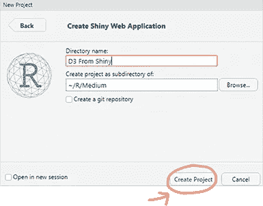
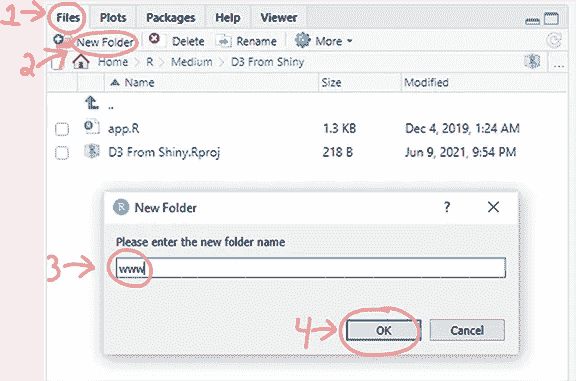
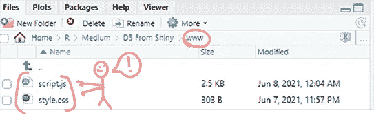
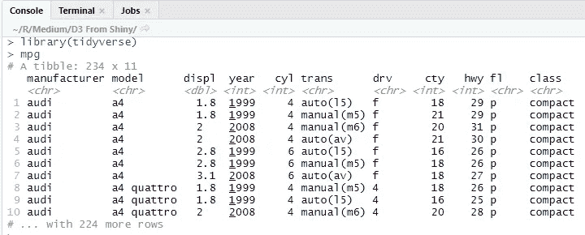
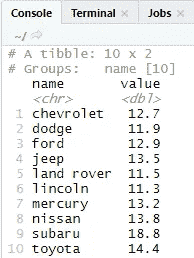
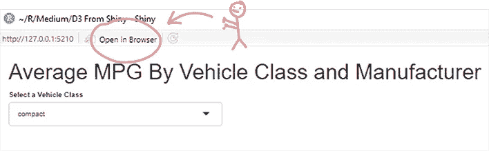
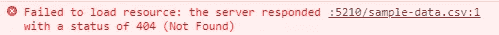
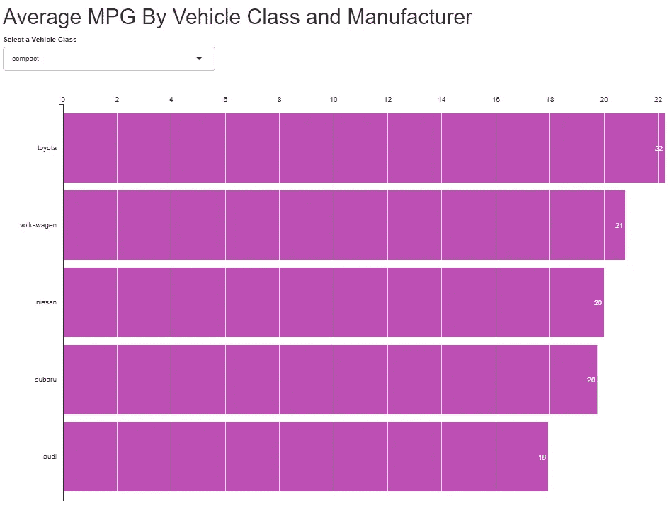
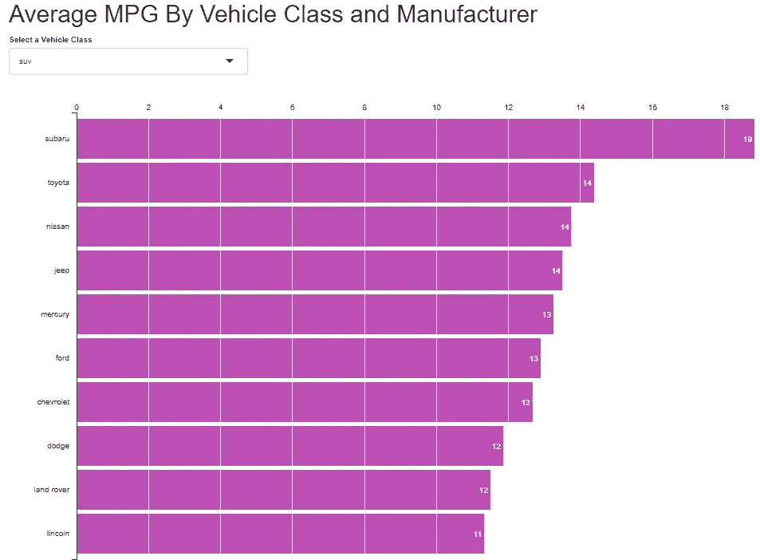

# D3 和 R，天作之合

> 原文：<https://towardsdatascience.com/d3-and-r-a-match-made-in-heaven-ff0bf82efe9a?source=collection_archive---------11----------------------->

## 一步一步的教程，使用你自己的数据，将 D3 Gallery 例子转换成 R 闪亮的应用程序


尼古拉斯·卡佩罗在 [Unsplash](https://unsplash.com?utm_source=medium&utm_medium=referral) 上拍摄的照片

# D3 的问题，以及 R 如何帮助。

你已经看到了华丽的 D3 图表画廊。你已经在纽约时报网站上看到了惊人的信息图表。也许，你受到了启发，浏览了一些 D3 教程，买了一个在线课程或一本书。最有可能的是，当你得知这个冷酷的事实时，你沮丧地举起了双手:

D3 很难。像，真的很难。

你可能想从图库中选择一幅令人惊叹的图表，并将其用于你的项目。然而，在你的道路上有许多障碍:

*   D3 不能在真空中运行。它需要由服务器来呈现。
*   即使你让图库实例运行，你也不想用他们的数据，你想用*你的*数据。
*   D3 讨厌你。

我有好消息要告诉你:有一种方法可以把 D3 带给有 R 的人，R 闪亮的库把 R 代码变成一个 web 应用程序，充当 web 服务器。事实证明，D3 需要一个网络服务器来使它焕发生机。我们将从 D3 图库中取出其中一张图表，并在 Shiny 中运行。我们还将使用 R 的令人敬畏的 Tidyverse 包来分割我们自己的数据，并给用户参数来改变 D3 图形。

# 为什么要使用 D3 呢？

为什么要将 D3 和 R 一起使用呢？R 不是已经有 35 个图形包了吗？为什么我不用 ggplot2 来代替呢？是什么让 D3 如此特别。

答案很简单，D3 不仅仅是另一个图形库。事实上，D3 *根本不是*图形库！它是一个 JavaScript 库，可以操作 HTML 并制作 SVG(web 使用的可缩放图像)。或许可以打个比方。

如果 excel graphs 是一辆现代汽车，那么 ggplot2 可能就是一辆法拉利。D3 将是制造法拉利的工厂。D3 可以构建构成一个伟大图形的所有小组件，并将它们拼凑成一个有凝聚力的形状。

这里有几个你可能想考虑 D3 而不是 R 的其他图形包的原因:

*   r 的图形库是你头脑的盒子。他们给你所有这些生活准则。你想把那个标签放在酒吧中间，上下倾斜 56 度，字体是你在黑暗网上盗版的吗？不，你不能这么做。
*   D3 没有盒子住。没有规则。你可以做出你想要的最丑的图形。继续把标签放在那里，D3 不在乎。
*   如果可以用 300 行 JavaScript 代码制作条形图，为什么要用 3 行 ggplot2 代码呢？我们不偷工减料。这就是数据科学。

既然我已经把你卖了，是时候去工作了。我们将从 D3 图库中取出[这个例子](https://bl.ocks.org/mbostock/1389927)并修改它，直到它达到我们想要的效果。例子是 D3 创始人自己做的条形图；迈克·博斯托克。

我知道条形图并不令人兴奋。但是如果你能让 R 提供一个 D3 条形图，那么你也能让 R 提供一个梯度增强，反向传播，力导向的径向旭日 D3 图。摇滚起来。

# 步骤 0:安装我们需要的 R 包

我们将需要这个教程的 3 R 包。如果您已经安装了这些，请跳到步骤 1。如果没有，继续从 R 控制台运行下面的代码来安装它们。

他们是做什么的？Shiny 会做我们的 web 应用，Tidyverse 会把数据切片切块，jsonlite 会把我们的数据变成 json 这是 D3 喜欢的格式。

# **第一步:创建闪亮的应用**

在 RStudio 中，通过进入文件->新项目->新目录-> shiny Web 应用程序，创建一个新的 Shiny 应用程序。输入应用程序的名称，并选择项目所在的文件夹。最后点击“创建项目”。



*作者图片*

就像你面前有一个闪亮的应用程序一样！接下来，您需要在项目目录中创建一个名为“www”的文件夹。您可以从 windows 文件系统或直接从文件窗格中的 RStudio(默认情况下，位于 RStudio 的右下角)执行此操作



*作者图片*

什么是 www 文件夹？这就是 web 文件的去处(html、css、javascript)。猜猜什么是 D3 脚本？

最后，让我们清除这个例子。删除 UI 和服务器函数中的所有内容，这样我们就有了一个全新的、空白的开始。让我们添加我们将在本教程中使用的所有包。

## **初始 app。R:**

# **第二步:各就各位，各就各位。**

现在我们有了一个存放 D3 文件的地方，是时候把东西放到正确的位置了。大多数 D3 例子有 2 到 4 个文件。典型的有:

*   html 文件
*   css 文件
*   javascript 文件
*   数据(通常是 json 或 csv)

这些有的时候都是分开的，有的时候是合在一起的。在我们的例子中，只有一个包含 css 和 javascript 的 html 文件和一个存储数据的 csv 文件。我们需要把这些分开。我们不需要创建一个 html 文件，因为这就是我们的 UI 在 Shiny 复制中的功能。但是我们确实需要整理 CSS 和 JavaScript

打开你选择的代码编辑器(VS Code，Sublime，Notepad，随便什么)，将 CSS 复制到一个新文件中。将此文件以“style.css”的名称保存到 www 文件夹中。这是您想要的代码:

## **style . CSS:**

接下来，您将看到两个脚本部分。第一个只有这一小段代码:

这个脚本告诉您的应用程序“哟！我们用的是 D3”。对于一个闪亮的应用程序，我们真的不需要 index.html 文件。这就是我们的 UI 函数所模拟的！所以这是放置这些类型的脚本的好地方，尤其是那些在标签中的。当我们这样做的时候，让我们继续调用我们的 CSS 文件，这样我们的应用程序就知道当它想要变得时尚的时候在哪里可以看到它！

最后但同样重要的是实际的 D3 代码。这是所有东西之间最后的标记。把它放到一个名为“script.js”的新文件中，这个文件位于 *www* 文件夹中。

## 初始 script.js

如果你已经做到这一步，我们都准备好了！不要担心 csv 文件，而不是使用它，我们将带来我们自己的数据！我们的 www 目录现在应该是这样的:



*作者图片*

# **第三步:制作前端**

现在是时候为我们的应用程序创建用户界面了。在我们的例子中，我们将使用“mpg”数据集中内置的 Tidyverse 包。该数据集列出了许多流行的汽车品牌和型号及其燃油效率指标。下面是 ui 函数的最终代码:

“标题面板”功能做你想做的，它为我们的应用程序创建一个标题。“选择输入”功能创建一个下拉列表，其中包含一些车辆尺寸选项。这是我们将用来改变 D3 图的输入。

最后，我们有一个“uiOutput”函数，它在寻找一个叫做“d3”的东西。每当你在 ui 函数(tableOutput、plotOutput 等)中看到‘Output’这个词，就意味着 UI 函数正在从服务器函数中寻找一个对象。在我们的例子中，它将是一个名为 d3 的 renderUi 输出对象。我们将在下一步建造它。

你现在可以运行这个项目，并得到一个超级无聊的应用程序，它有一个标题和一个下拉列表。卑微的出身。

# **第四步:构建后端**

服务器功能是每一个闪亮的应用程序最好的部分。这是你研究数据科学的地方。这也是您从堆栈溢出粘贴代码并希望它工作的地方。现在想来，那两件事是一样的。

在我们开始构建服务器函数之前，让我们看一下数据集。在 RStudio 控制台中，键入以下内容并按 enter:

下面是结果。这是 mpg 数据集。我们将获取这个有 234 行的数据集，并获得每个制造商的平均城市英里数。这将使我们减少到 15 行数据，我们将绘制图表。查看“级别”字段(紧凑型、suv 等。)?这是我们将在 ui 函数中与下拉菜单挂钩的字段。当用户选择“suv”时，我们的服务器功能将只过滤生产 suv 的制造商的数据。



*作者图片*

我们将使用 R 精彩的 Tidyverse 库来完成这种分组和聚合。我不想太深入地学习如何用 Tidyverse 分割数据，这本身就值得写一篇文章。我将向您展示代码，并简要描述其工作原理。从控制台运行以下命令:

结果:



*作者图片*

这段代码在做什么？这其实很简单。这是 Tidyverse 语法，从上到下读。“%>%”语法是 Tidyverse 库将代码块的当前状态链接到下一个状态的方式。你可以把它想成‘然后做这个…’。在英语中是:

```
Take the mpg dataset. 
Filter to where the records in the class column = 'suv'.
Create a new column called avgCity that is the average of city mpg
Reduce the columns to just manufacturer and avgCity 
Remove all duplicate records
Rename manufacturer to 'name' and avgCity to 'value'
```

既然您已经理解了这一点，那么是时候向您展示 Shiny 中服务器函数的完整代码了。

## 最终的服务器功能

让我从上到下解释一下。

默认情况下，服务器函数只有输入和输出。我必须将 session 添加到这个参数列表中。session 参数将允许 Shiny 从服务器函数向 web 页面发送信息。在我们的例子中，我们试图将 R 中的数据放到 www 文件夹中的 JavaScript 代码中。这个参数就是导致这种情况发生的原因。

observeEvent 函数在我们的 ui 函数中监视我们的下拉菜单，回想一下，我们给了它一个输入 id“vehicle class”。如果下拉列表发生变化(比如从“suv”变为“compact”)，这个 observeEvent 函数将会注意到这种变化，使当前的事务状态无效，并重新运行这个代码块来确定新的事务状态。最终，它将更新我们的 D3 图。

下一个代码块与我们上面运行的 Tidyverse 示例相同，只有一个小的变化:

我们没有将类别硬编码为“suv ”,而是将其映射到 vehicleClass 下拉列表中。当您将下拉列表从紧凑型车更改为 suv 时，我们对 mpg 数据集的过滤器也会发生变化。

现在我们使用 jsonlite 库。这只是获取我们聚合和过滤的数据的状态，并将其转换成 json 格式。D3 喜欢 json，所以我们喜欢 json。

这就是神奇的调味汁！这一小段代码获取我们的 json 有效负载，并跨会话发送它，以便我们的 D3 JavaScript 可以使用它！r 正在向我们的 www 文件夹发送一条消息，说“哟！下面是数据！用它做些奇妙的事情吧！!"

最后我们有了这一小段代码。回想一下我们的 UI 函数有这个 *uiOutput("d3 ")？*同样，我们可以从用户界面向服务器发送信息(通过输入$id 语法)，我们也可以从服务器向用户界面发送信息。在本例中，我们创建了一个名为“output$d3”的对象，这只是一个 html 行，上面写着“在网页中呈现这个 JavaScript 代码”。脚本的名字叫“script.js”，也就是我们命名的或者 D3 脚本！

现在这个例子还不能运行。尽管 R 现在将我们的数据以 json 格式发送到我们的 D3 脚本，但是我们的 D3 脚本还没有配置为接受它。直到现在，我们终于准备好冒险进入名为 D3 的黑暗森林深处。

这是我们完成的应用程序。r:

# **第五步:D3**

2000 字后，我们做到了。我们已经爬到了 R 山的山顶，只为发现面前的 D3 山这个庞然大物。我们是会绝望，像我们前面的许多人一样回头，还是会勇往直前，去一个书呆子从未去过的地方。

好吧，让我们不要对此大惊小怪。我们真的只需要改变一些事情就可以了。我假设如果你真的读到这里，你会更愿意复制/粘贴到痛苦的结局。

当 Mike Bostock 发布这个 D3 条形图代码时，他认为阅读它的人足够聪明，知道它的意思，因此他没有留下任何有用的评论来告诉我们它是如何工作的。我将假设阅读我的新版本代码的人是一个白痴，并明确地告诉你它是做什么的。为什么？

1.  我是个好人。
2.  阅读我的代码的白痴 99%是我，6 个月后，在我忘记了一切之后。我知道未来的我很忙，有自己的生活，也很重要。我的文档和代码注释是现在的我送给未来的我的小礼物。

首先运行应用程序。该应用程序将实际上拉起来，你可以改变下拉菜单，并注意到没有什么变化。为了解决 D3 的问题，我们需要点击“在浏览器中打开”,然后在 Chrome 中检查代码。



*作者图片*

通过在浏览器中右键单击并转到“inspect”或简单地点击 cntrl + shift + j 来打开 Chrome 检查器。单击控制台选项卡，您将看到以下错误:



这是因为我们的 D3 有这样一段代码:

我们不想使用示例“sample-data.csv”文件。我们想使用由 Shiny 的 session 对象发送的数据。我们可以通过将整个 D3 脚本封装在一个用于接收“jsondata”类型消息的函数中来解决这个问题。

如果您还记得，我们的服务器函数发出了这种类型的消息(' jsondata ')，并且包含保存我们的 mpg 数据的 json 有效负载:

换句话说，Shiny 是以 json 的形式广播我们的 mpg 数据，D3 是监听它的。如果 Shiny 改变了数据集(比如通过改变输入)，它将广播这个数据集的新版本，D3 将监听这个改变并提取它。

这个函数真的是让 Shiny 和 D3 对话的神奇酱。一旦您将整个 D3 脚本封装在这个很酷的函数中，您就可以删除调用 csv 的代码。我们还想做一些改变，使我们的图形在用户界面上看起来更好，并正确映射我们的数据。在这里，我将向您展示 D3 脚本的完整、最终和注释版本。这些评论将注释所有这些变化的含义。

## 最终的 script.js 文件:

您将会看到，除了少数例外，代码并没有被修改太多。我现在用#d3Graph 的 html id 做几件事。你将会遇到的问题是，当数据失效(当你改变下拉菜单)并且一个新的版本从 Shiny 发送到 D3 时，每次发生这种情况时，都会生成一个新的图形。你最终会得到一页新的图表，一张一张地叠在一起。我在 d3 上添加了几行代码，为我们的图添加了一个 id。每次我们的函数运行时，它都会删除解决问题的旧图。

代码的另一个值得注意的变化是，我将我们的数据设置为等于来自脚本顶部的 jsondata 消息处理程序的消息:

我还修改了页边距，以确保 D3 不会将我们的图表放在离浏览器边缘太近的地方，给我们一些喘息的空间:

最后一个改变是把条形从蓝色变成紫色。我是通过打开“style.css”文件并修改条形填充值来实现的:

# **第六步:运行应用**

现在我们终于可以运行应用程序了:



*作者图片*

更改下拉列表将会更新图表！



*作者图片*

就是这样！现在你明白了如何将 D3 gallery 示例转换成闪亮的 likes 格式。您可以将自定义数据从 R 发送到 JavaScript，并制作漂亮的图形。

下面是 Github 上的[完整项目！只需下载它，并在 R 中打开它。自述文件将告诉您 R 的版本和我用来创建它的库。](https://github.com/KendonDarlington/D3FromShiny)