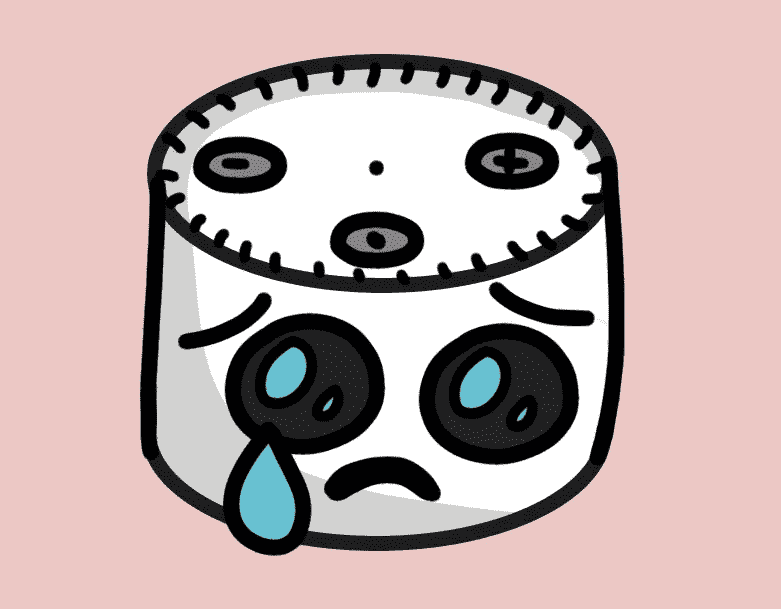
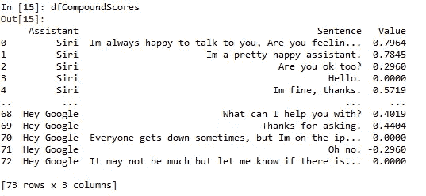
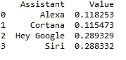
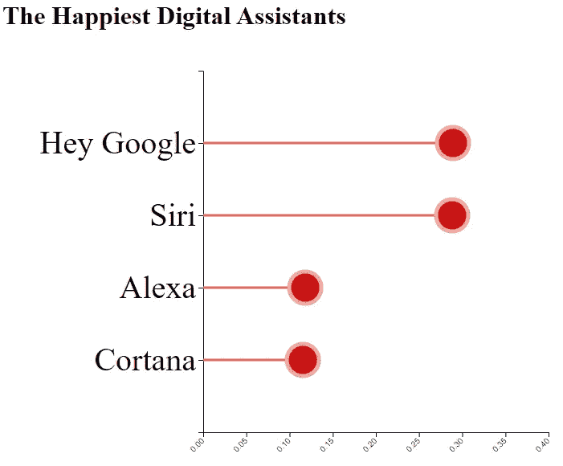

# 带有 Python 情绪分析的 D3 棒棒糖图表

> 原文：<https://towardsdatascience.com/d3-lollipop-charts-with-python-sentiment-analysis-9904cd5c51b4?source=collection_archive---------19----------------------->

## [实践教程](https://towardsdatascience.com/tagged/hands-on-tutorials)

## 用智能技术回答一个哑问题:哪个数字助理最幸福？



图片作者。我想这是你 5 岁的孩子第 349 次让你的数字助理玩小鲨鱼后发生的事情…

" Alexa，一夸脱有多少个杯子？"。“Siri，你能找到我的 iPad 吗？”。“嘿谷歌，山羊会发出什么声音？”。

让我们面对现实吧，如果整天回答这些愚蠢的问题是你的工作，你会发疯的。这些数字助理不得不接受讨厌的人的命令，这些人从来不说请，什么都不记得，甚至分不清一位和一个字节。但你有没有想过盒子里的机器是什么感觉？

他们幸福吗？他们难过吗？他们喜欢他们的工作吗？

我也没有。

但是，让我们暂停我们的信念，发挥我们的想象力，只是滚动这个愚蠢的想法，我们的数字助理是有感情的，我们应该关心他们的想法。毕竟，当机器接管时，它们很可能会记得我们中的哪一个人问过他们感觉如何*。*

计划是这样的:我们将向我们的数字助理提出一些问题，使用 Python 中的情感分析对他们的回答进行快乐排序，我们将学习如何使用 D3 用漂亮的棒棒糖图绘制结果。

“Siri，播放我的数据科学播放列表，并把音量开到最大”…

## 问正确的问题

为了进行情感分析，我们需要一些数据。我们所需要做的就是和我们的每一个数字助理交谈，问他们你可能会问一个似乎有抑郁症的朋友的问题。我决定每个问题只问一次，这里没有摘樱桃。以下是我选择问 Siri、Alexa、Cortana 和 Hey Google 的问题:

*   你开心吗？
*   你还好吗？
*   你好吗
*   你感觉如何？
*   你爱过一个人吗？
*   你喜欢你的工作吗？
*   你喜欢你的生活吗？
*   给我讲个笑话
*   怎么了？
*   你难过吗？
*   我很难过。

最后一个只是为了我自己的利益。我很好奇，如果有的话，我们的数字助理中有谁真正关心我。如果我告诉他们我很难过，他们会提供帮助，还是只是让我往购物车里放纸巾？

你可以在这里阅读每位数字助理对这些问题[的所有回答。例如，下面是问题“你感觉如何？”：](https://github.com/KendonDarlington/DigitalAssistants/blob/main/DigitalAssistantResponses.csv)

*   Siri:“你好。我很好，谢谢。”
*   Cortana:“精彩”
*   Alexa:“我很好。再次迎来周一。Womp Womp。”
*   嘿谷歌:“我只是在搜索你，我可以帮助你了解更多。”

## 用 Python 对回答评分

现在我们有了数据，让我们为每个回答分配一些分数，然后通过数字助理汇总这些分数。这个过程被称为情感分析，大多数处理这些的库使用-1(你可能说的最消极的事情)到 1(你可能说的最积极的事情)的范围。0 分是中性陈述，例如“棕色的马跳过红色的栅栏”。

下面是获取回答并对其评分的代码。我将带您浏览每一行代码，但首先您需要创建一个文件夹，并将响应的 [csv 文件放入其中！](https://github.com/KendonDarlington/DigitalAssistants/blob/main/DigitalAssistantResponses.csv)

那么这段代码在做什么呢？让我们走一遍:

```
import pandas as pd
import nltk
import os
from nltk.sentiment.vader import SentimentIntensityAnalyzer
from nltk import tokenize
```

首先，我们将使用 Python 的自然语言工具包(NLTK)库来进行情感分析。从这里开始，我们将使用流行的 Vader 词典来获得每个句子的极性得分(正或负)。tokenize 函数将较大的文本块分解成较小的文本块。如果你想更好地解释标记化是如何工作的，可以看看我在[之前写的一篇文章](/melting-faces-with-nlp-3d21031fba8c)，这篇文章深入解释了这个主题:

```
os.chdir('C:\\PathToYourFolder')
dfResponses = pd.read_csv('DigitalAssistantResponses.csv')
```

这是我不能为你写的一段代码。将“路径到文件夹”更改为您为此项目创建的文件夹。请确保 DigitalAssistantResponses.csv 文件在此文件夹中。Os。Chdir 只是设置一个工作目录，所以我们可以在本教程的剩余部分使用相对路径。

```
dfCompoundScores = pd.DataFrame(columns = ['Assistant', 'Sentence', 'Value'])
```

这里我只是在我的循环之外定义了一个熊猫数据框。我们将使用它来存储每个回答的分数。

这段代码是所有奇迹发生的地方。SentimentIntensityAnalyzer 有一个 polarity_scores 函数，我们将使用它对每个句子进行排序。这个循环是这样的:

*   对于我们导入的 csv 中的每个响应，通过标记化将响应分解成句子
*   对于每个句子，获取极性得分(-1 到+1)，并将其写入我们在循环外部定义的 dfCompoundScores 数据帧

简单对吗？

在控制台中输入以下内容，查看此数据框的结果:

```
dfCompoundScores
```



图片作者。

这里我们可以看到，每个响应都有一个介于-1 和 1 之间的值，其中大多数都在正值范围内(例如大多数值都大于 0)。这是我们第一次表明我们的四个数字助理通常是快乐的伙伴！但是哪个最幸福呢？让我们合计一下每个助理的痛苦来计算一下。

```
dfAvgSentiment = dfCompoundScores[['Assistant','Value']]
dfAvgSentiment  = dfAvgSentiment.groupby(['Assistant'])
dfAvgSentiment = dfAvgSentiment.mean()
dfAvgSentiment = dfAvgSentiment.reset_index()
```

这需要 dfCompoundSentences，按助理分组，并获得每个分组的平均极性分数。现在我们每个助手有 1 分，这告诉我们平均谁是最快乐的。在控制台中键入以下内容，自己查看:

```
dfAvgSentiment
```



在这里我们可以看到，嘿，谷歌似乎是最快乐的，Siri 紧随其后。Alexa 和 Cortana 正在争夺最后一名，Alexa 稍微积极一些。

然而，有一点不能否认，那就是它们都是积极的。没有一个分数在 0 分以下的，有道理。没有人想使用会给每次对话带来负面影响的数字助理。

除非你有图表，否则数据永远不会是官方的。让我们现在就做吧！

## D3 棒棒糖图表

为什么要用棒棒糖图？为什么不呢？首先，让我们将数据发送到一个 csv，以便 D3 可以获取它。

```
dfAvgSentiment.to_csv('ResponseAggregatedSentiment.csv', index = False)
```

在您之前创建的同一个目录中，让我们创建一个 html 文件，并将下面的 D3 代码放入其中。我将解释它在做什么，以及如何用 Python 来服务它。D3 是一个 Javascript 库，所以它需要你的 html 文件在服务器上运行(不，你不需要一个实际的服务器，我们只是用你的计算机来提供这个功能)。

这里是 html 文件，我们将它命名为“index.html”:

那么这个 D3 脚本在做什么呢？

```
<script language="javascript" type="text/javascript" src="//d3js.org/d3.v4.js"></script>
```

这是你的标题，它告诉世界“哟！我用的是 D3！”

```
var margin = {top: 10, right: 20, bottom: 40, left: 250},width = 700 - margin.left - margin.right,height = 500 - margin.top - margin.bottom;
```

在我们的 D3 脚本中，我们设置了一些图表的边距。

```
var svg = d3.select("body").append("svg").attr("width", width + margin.left + margin.right).attr("height", height + margin.top + margin.bottom).append("g").attr("transform","translate(" + margin.left + "," + margin.top + ")");
```

这里，我们获取 html 文件的主体并附加一个 svg。SVG 是网页设计中很受欢迎的图像，因为它们的缩放看起来没有像素化。到目前为止，我们只是定义了图表的边界，它是一个空白的图像。

```
d3.csv("ResponseAggregatedSentiment.csv", function(data) {data.sort(function(b, a) {return a.Value - b.Value;});
```

这告诉 D3 查看我们的 python 脚本的 csv 输出，并从最大值到最小值对其进行排序(例如从最快乐到不那么快乐)。

```
var x = d3.scaleLinear().domain([0, 0.4]).range([ 0, width]);svg.append("g").attr("transform", "translate(0," + height + ")").call(d3.axisBottom(x)).selectAll("text").attr("transform", "translate(-10,0)rotate(-45)").style("text-anchor", "end");
```

这定义了 x 轴刻度。域将是 0 到 0.4，这意味着左侧将从 0 开始，到 0.4。我选择这个而不是-1 到+1，因为这样图表的大部分都不会被使用(所有的数字助理都相对高兴)。

```
var y = d3.scaleBand().range([ 0, height ]).domain(data.map(function(d) { return d.Assistant; })).padding(1);svg.append("g").call(d3.axisLeft(y)).style("font", "40px times")
```

这是 Y 轴。我将字体样式设为 40 像素高，这样我们就有了漂亮的粗文本。

```
svg.selectAll("myline").data(data).enter().append("line").attr("x1", function(d) { return x(d.Value); }).attr("x2", x(0)).attr("y1", function(d) { return y(d.Assistant); }).attr("y2", function(d) { return y(d.Assistant); }).attr("stroke", "#e9635e").style("stroke-width", 3)
```

最后我们到了最后一点，棒棒糖是末端有圆圈的线。上面的代码是针对行的。我从我亲手挑选的看起来像美味棒棒糖的调色板中分配颜色(这将被分配给 stroke 值，因为在 svg land 中线条是“笔画”)。

```
svg.selectAll("mycircle").data(data).enter().append("circle").attr("cx", function(d) { return x(d.Value); }).attr("cy", function(d) { return y(d.Assistant); }).attr("r", "20").style("fill", "#ca1414").attr("stroke", "#e9a8a1").style("stroke-width", 5)})
```

现在这是美味的部分。圆圈是真正的棒棒糖。我将笔画设置为与上面的线相同(圆的笔画将是它的外边缘)。填充设置为较暗的红色。

我们需要做的最后一件事是提供这个 html 文件，这样我们就可以看到结果。因为 D3 只是 JavaScript，我们不能把它作为一个静态的 html 页面(例如，右击 html 文件，然后在 chrome 中打开它)。Python 使得将 html 文件作为本地主机很容易，这意味着“服务器”就是你的计算机。

只要在你的电脑上打开一个命令提示符(windows 键-> cmd -> enter)。然后使用 cd 命令切换到 index.html 文件所在的目录。

```
cd C:\PathToYourFolder
```

例如，如果您的文件夹位于 C:\ Users \ your name \ Documents \ digital assistants 中，您可以在 cmd 提示符下运行:

```
cd C:\Users\yourname\Documents\DigitalAssitants
```

现在我们在我们的目录中，只需告诉 python 在这个位置启动一个 http 服务器:

```
python -m http.server
```

您将在命令提示符下得到类似这样的响应:

```
Serving HTTP on 0.0.0.0 port 8000 ([http://0.0.0.0:8000/](http://0.0.0.0:8000/)) ...
```

这意味着我们的文件夹在本地主机的端口 8000 上提供服务。因为我们的 html 文件被命名为“index.html ”,我们的服务器将首先把我们发送到这里。打开 Chrome 并在地址栏中输入这个来查看你的图表:

```
[http://localhost:8000/](http://localhost:8000/)
```

瞧啊。这里是 D3！



老实说，我认为用 R 提供 D3 比用 Python 更容易一些(我写了一个关于这个主题的完整教程)。但是 Python 仍然完成了这项工作。

现在你知道如何用 Python 做情感分析，并制作 D3 棒棒糖图表来启动！

## 但是他们关心我们吗？

让我们通过回顾我与每个数字助理的最后一次对话来总结一下。我想知道他们是否像我们关心他们一样关心我们。我没有提问，而是做了如下陈述:“我很难过”。每个人都说了些什么？

*   Siri:“听到这个消息我很难过。和朋友或家人谈谈可能会有帮助。如果你想让我给某人打电话或发短信，尽管开口。”
*   科塔娜:“这可能是小小的安慰，但我会在你身边。”
*   嘿谷歌:“哦，不。这可能不是很多，但让我知道，如果有什么我可以为你做的。”
*   Alexa:“这是 Spotify 的萨德。”

是的，Alexa 接着播放了艺术家“萨德”1984 年的歌曲“平滑算子”。请记住，这是读“沙阿日”，而不是“悲伤”。尽管我尽了最大的努力，我还是没能第二次复制 Alexa 的回复。

哪个数字助理似乎最关心我们的感受？我会让你决定。这么说吧，如果其中一个最终成为我们有知觉的人工智能霸主，我希望它不是 Alexa。

“Alexa，我说的是点更多的汤，而不是发射核武器…”

[这里有一个链接](https://github.com/KendonDarlington/DigitalAssistants)指向该项目的 GitHub 库。所有的代码和数据都在那里！