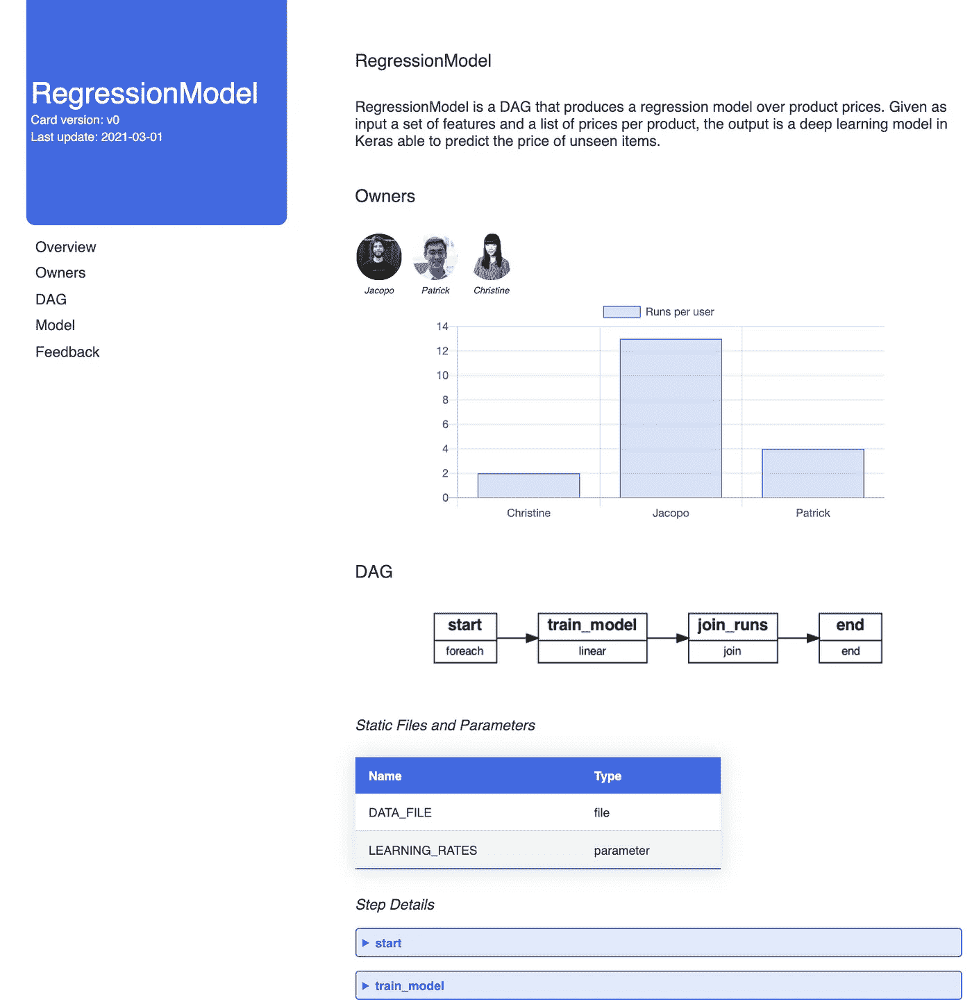
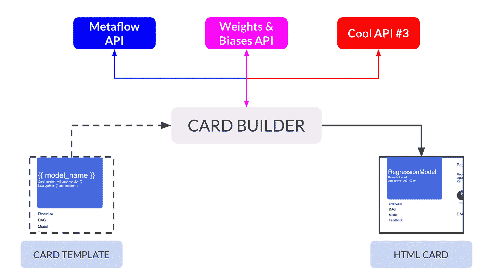
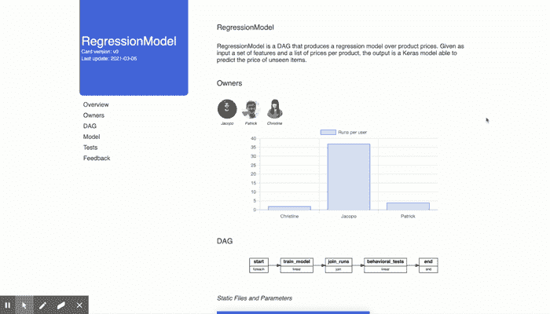

# “DAG 卡”是新的“模型卡”

> 原文：<https://towardsdatascience.com/dag-card-is-the-new-model-card-70754847a111?source=collection_archive---------15----------------------->

## [行业笔记](https://towardsdatascience.com/tagged/notes-from-industry)

## 从 Metaflow 自动生成 DAG 卡，灵感来自用于机器学习模型的[谷歌卡](https://modelcards.withgoogle.com/about)。

## 介绍

> “模仿是阿谀奉承的最早形式****——王尔德(可能是在模仿别人)****

**S 软件在[吃世界](https://a16z.com/2011/08/20/why-software-is-eating-the-world/)，人工智能在吃软件。然而，仍然有相对较少的人能够理解机器学习模型的行为——事实是，即使是人工智能专家也很难理解别人建立的模型，特别是如果它不是文献中的精炼模型，而是每天服务于数百万请求的实际 API。因此，问题是紧迫的:我们如何使模型易于为组织内外的更广泛的受众所理解？**

**玛格丽特·米歇尔*等人*的一篇[肥*论文](https://arxiv.org/abs/1810.03993)。在 2019 年引入了*模型卡的概念，*总结我们对给定模型的了解的“一页纸”:当然是输入和输出，但也包括测试集的准确性、偏差和限制、使用的最佳实践等。正如他们的[人脸检测](https://modelcards.withgoogle.com/face-detection)页面恰当地举例说明的那样，卡片被认为是“所有人的[参考，不管专业知识](https://modelcards.withgoogle.com/about)”:ML 工程师将找到关于架构和量化性能的指针，pm 将阅读优势和弱点以想象新的用例，营销人员将获得其能力的鸟瞰图。**

> **我们非常喜欢这个想法，以至于我们决定自己动手做一个元流卡生成器，从代码和注释中自我记录 ML 管道。**

**为了打造我们自己的卡片，我们对最初的想法做了一些调整(主要是因为我们专注于 B2B，以及仅限内部的受众):**

*   **虽然 Google 样本卡非常可爱，但是我们想要生成没有手工操作的可读卡片；换句话说，我们希望从我们的代码中自动构建*卡片；***
*   **Google 模型卡主要满足 B2C 用例，当一个模型通过公共接口在全球范围内大规模可用时；对我们来说，cards 主要面向成长中的公司的内部受众，他们很难跟踪新的特性，重要的领域知识需要进入模型，并且培训和测试中涉及到一些服务/框架；**
*   **最后，虽然模型肯定是人工智能乐队的主唱，但他们不是孤立生活的[单子](https://en.wikipedia.org/wiki/Monadology):对我们来说，ML 工作几乎是“ML 管道”不变的同义词，或者更好，是“ **ML DAG** ”:鉴于[我们为 ML DAG 选择的工具是 Metaflow](/noops-machine-learning-3893a42e32a4) ，我们的卡生成器可以被认为是运行在现有 Metaflow 类之上的“插件”。**

**为了对我们正在构建的东西有个感觉，这是我们的 DAG 卡样本的截图:**

****

**DAG 卡的一瞥，显示了所有者、任务、输入文件和参数。附带的[代码](https://github.com/jacopotagliabue/dag-card-is-the-new-model-card)展示了如何通过编程从一个元流类中生成这样一张卡片【作者截图——原始 Google card [此处](https://modelcards.withgoogle.com/face-detection)】。**

**现在，*让我们再次让文档变得伟大*！**

**【*书呆子注意*:复制*这篇*帖子的代码在 [Github](https://github.com/jacopotagliabue/dag-card-is-the-new-model-card) 上分享:都是 WIP 和手绘，但是如果有兴趣的话，我们实际上可以构建一个合法的 PyPI 包！]**

# **先决条件**

**这篇文章假设你知道为什么 [Metaflow](https://metaflow.org/) 很棒，[Weights&bias](https://wandb.ai/site)很酷，以及它们是如何结合在一起的:如果你错过了第一季，你可以从[我们的试点文章](/noops-machine-learning-3893a42e32a4)开始(注意，今天的 DAG 只是之前的[一个](https://github.com/jacopotagliabue/no-ops-machine-learning/tree/main/serverless)的精简版)。**

**浏览一下[自述文件](https://github.com/jacopotagliabue/dag-card-is-the-new-model-card/blob/main/README.md)，但是你基本上只需要确保你已经:**

*   ****Metaflow** 启动并运行，最好配置为使用基于 [AWS 的设置](https://docs.metaflow.org/metaflow-on-aws/metaflow-on-aws)；**
*   **一个关于**权重&偏差**的账户，带有一个有效的 API 密钥。**

# **等等，为什么是卡片而不是合并页？**

**我们知道你的同事会怎么说:**

> **“我们当然有模型 XYZ 的文档！你查过合流吗？”**

**令人不安的事实是，*是的，我们检查了*，但我们还是一无所知。虽然 [Confluence](https://www.atlassian.com/software/confluence) (以及类似的解决方案)是在公司内部共享知识的不可或缺的工具，但根据我们的经验，它很少能很好地用于 ML DAGs(尤其是对于新的、仍在变化的功能)。从拥有 ML 管道的人(也就是说，最终对其行为负责的人)的角度来看，我们认为 DAG 卡比 Confluence 页面具有关键优势:**

*   **构建和更新 Confluence 页面是典型的手工工作。最重要的是，DAG 的 360 度视图涉及接入不同的服务和 API，因此涉及复杂的授权层、领域知识等。；DAG 卡是以编程方式构建的，并且可以在例如每个训练周期结束时进行更新。**
*   **合流页面本来就是静态的**:**模型一直在变化，但是我们都容易忘记改变合流。DAG 卡仅仅依赖于回购协议中的内容:如果开发人员和测试人员更新文件和注释(*作为良好编码实践的一部分，他们无论如何都应该这样做*，卡将反映所有最新的变更；******
*   ******Confluence 页面不是**交互式的**:虽然*当前的* DAG 卡也不是交互式的，但是不难扩展布局以包括一个测试界面(就像 *Google cards 做的那样*);******
*   *******最后，但绝对不是最不重要的*，Confluence 页面可能会或可能不会以与我们的 DAG 卡相同的精神写成“**”:如果 pm 写页面，我们就将模型创建者从其理论消费中分离出来；如果 ML 工程师编写页面，他们可能倾向于只强调某种类型的信息。虽然当然不存在防弹解决方案(因为人类事务倾向于抵制愚蠢的标准化)，但我们相信 DAG 卡指向了正确的方向，因为鼓励工程师以全面的方式(定量和定性)解释他们的工作具有巨大的价值。通过首先要求 DAG 背后的人努力思考他们的代码*到底*做了什么——它的缺点、要监控的 KPI、无论如何都要做好的特殊情况——我们相信我们可以培养更大的*所有权意识*并防止许多错误在生产中出现。从某种意义上来说，我们的方式是老方式:“[传刑的人要挥剑](https://www.youtube.com/watch?v=PTzbOA6cTYM)”。********

# ******以编程方式构建卡片******

******卡片生成器脚本非常简单。鉴于:******

*   ******一个 HTML ( [Jinja](https://jinja.palletsprojects.com/en/2.11.x/templates/) )模板；******
*   ******一个元流类(以及实例化[客户端](https://docs.metaflow.org/metaflow/client)的配置文件)；******
*   ******重量和偏差 API 键；******

******构建器将调用相关的服务，获取关于 DAG 和模型的信息，美化一堆 JSONs，最后组成一个静态 HTML 页面供用户使用。******

************

******卡片生成器使用一个 [Jinja 模板](https://jinja.palletsprojects.com/en/2.11.x/api/#basics)并通过调用来自 Metaflow、Wandb 和其他服务的 API 来填充插槽:输出是一个简单的静态 HTML 页面[图片由作者提供]。******

******当端到端地运行代码时，最终结果是一个类似 Google 的卡片，在一个地方收集了大量关于我们的元流 DAG 的信息:******

************

******显示最终 DAG 卡的动画 GIF 图片由作者提供—原始截屏[此处](https://drive.google.com/file/d/142SWOht_B_PW8LTcKbw1lfmJfz1v4fYK/view)******

******特别是，我们将内容分为五个主要部分:******

*   ********概述**:DAG 的高层描述(即 Python 类的 *docstring* )。******
*   ********所有者**:包含 DAG 开发者/所有者的部分，以及显示他们之间运行分布的图表。******
*   ********DAG**:DAG 的可视化描述，以及带有步骤细节的可折叠部分(通过元流自身表示构建)。******
*   ********模型**:可折叠的部分，报告最近 *K* 运行的度量，云存储的路径(对于希望恢复精确工件的 ML 工程师)，架构草图，以及损失/时期图表。******
*   ********测试**:在代码检查(例如，向量大小)和一般定量测试(例如，准确性)之上，行为测试被设计为对模型定性行为的“健全性检查”，并在被认为对部署很重要的案例上探测性能(例如，在一个小的但是关键的输入集上的模型性能)。解释我们的测试哲学超出了范围([这是一篇关于 NLP 测试的伟大论文](https://arxiv.org/pdf/2005.04118.pdf)！)，我们只是注意到 DAG 卡可以报告重要用例的预测，这是 ML/QA 工程师在构建管道时指定的。更复杂模型的一个自然延伸是通过输入空间的划分(比如，按性别、种族和年龄划分的贷款违约概率)来分解准确性:尽管人类分析是无与伦比的，但行为测试就像是防止明显(但仍不罕见)错误的强大保障。******

******MVP 很简单，您应该能够扩展它，以包含更多的数据和/或更多的服务:Jinja 模板可以像俄罗斯娃娃一样构成，提供了一种将 UI 扩展到更多用例的原则方法。******

******虽然我们发布了工作代码来开始讨论，但我们从[精益的角度](https://www.amazon.com/dp/B004J4XGN6/ref=dp-kindle-redirect?_encoding=UTF8&btkr=1)来处理这个问题——这基本上意味着只需最少的努力来完成我们的卡:请确保查看[自述文件](https://github.com/jacopotagliabue/dag-card-is-the-new-model-card)中的一些技术“积压”,并让我们知道您是否希望看到这个实验产生更好的东西！******

******虽然“[每个人都想做模型工作](https://research.google/pubs/pub49953/)”，但我们确实相信，在一个正常运转的人工智能组织中，记录和共享信息同样重要:(模型)*知识确实是力量*(是的，既然你问了，[法国是培根](https://franceisbacon.com/))。******

# ******再见，太空牛仔******

******如有疑问或反馈，请[连线](https://www.linkedin.com/in/jacopotagliabue/)分享你的 MLOps 故事(所有中媒观点均为本人观点)。如果你想合作并把这个想法扩展成一个完整的一揽子计划，请伸出援手！******