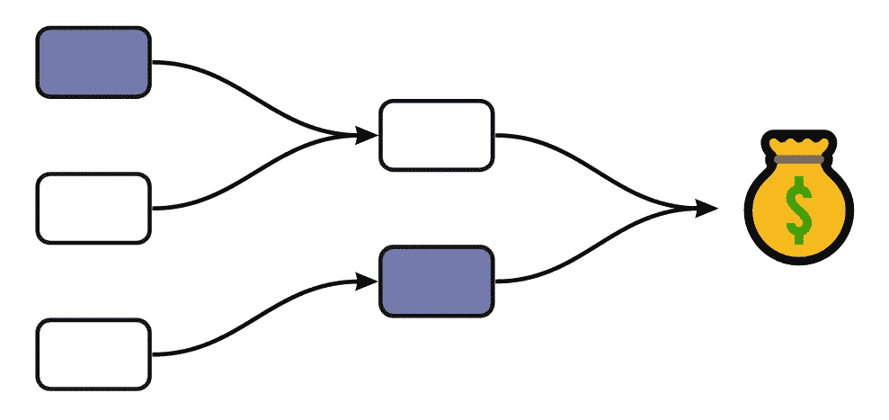

# DAG 工厂——更好的通风方式

> 原文：<https://towardsdatascience.com/dag-factories-a-better-way-to-airflow-9aa3cf003169?source=collection_archive---------16----------------------->

## 气流编年史

## 使用动态生成的 Dag 来缩放气流



信用:由我们自己的团队建立

如果你一直在寻找一个工作流管理平台，我猜你已经遇到了 [Apache Airflow](https://airflow.apache.org/) 。这个被广泛使用的项目最初来自 Airbnb，现在打着 Apache 的旗号，是许多数据团队的首选工具。Airflow 允许您以声明的方式编写复杂的工作流，并提供许多开箱即用的操作员来完成复杂的任务。

在[飞轮软件](https://flywheelsoftware.com?utm_source=article&utm_medium=medium&utm_campaign=tameem)，我们大量使用气流进行复杂的 ETL 管道、机器学习管道和统计分析。此外，我们还管理多个气流部署，并运行运行大量工作负载的大型多租户气流集群。随着我们开始将气流推向极限，我们最近对如何部署到气流集群进行了改造，我敢说找到了更好的利用气流的方法。

我们的主要目标是摆脱部署 airflow 的声明式格式，更多地转向动态生成 Dag 以实现灵活性和可扩展性——允许我们只需修改一个功能标志，就可以快速更改 airflow 上运行的内容。这导致了 DAG 工厂的出现。

> DAG 工厂—使用工厂模式和 python 类，根据系统的动态输入自动生成 DAG。

背景故事讲够了，是时候进入激动人心的部分了。为了做好准备，在本文中，我们将假设我们想要在 airflow 中执行两个复杂的任务——process _ message & process _ invoices。

# 图片前

在我们开始新的设置之前，重要的是快速了解一下在气流中通常是如何实现的。一种可能的方法是为你的每个项目准备一个单独的文件夹。您可以在每个项目文件夹中复制 Dag，或者将所有共享 Dag 放在一个**shared _ Dag**文件夹中。然后，您的部署管道可以从 monorepo 中选择正确的 Dag，将其推送到每个气流集群。实际上，文件结构可能类似于下面的代码片段。

随着您的项目开始增长，DAGS 和部署过程的复杂性将会迅速增加。在多租户集群中，您需要为气流多次复制相同的 DAG，以便为每个租户单独考虑它们。

# 后图— DAG 工厂

现在，有了 DAG 工厂，您可以获得一个更好的组织结构，它可以整合跨项目或租户的重复代码。通过将代码抽象成负责生成 DAG 对象的 python 类，我们使设置更加可配置。最棒的是，看起来玛丽·近藤对我们的 monorepo 进行了一次扫描，删除了所有不能引发欢乐的东西。

**快速组件故障** 🕺🏽

*   **项目/ <名称> /config.py —** 从气流变量或集中配置存储中获取配置的文件
*   **项目/ <名称> /main.py —** 核心文件，我们将在其中调用工厂方法来生成我们想要为项目运行的 Dag
*   **dag_factory —** 文件夹，其中包含我们工厂模式中的所有 dag，以及一组标准化方法的格式。

## 动态配置

这种架构的第一步是让我们的气流集群与我们平台上的集中式配置存储进行对话。这允许 airflow 从平台上的其他服务中动态获取配置，比如我们的 web 应用、特性标志或其他业务逻辑。我们不会深究商店本身，但这通常是通过使用 [Etcd](https://etcd.io/) 、[consult](https://www.consul.io/)等工具，或者构建自己的瘦配置 API 来完成的。

在气流端，与配置存储的通信发生在 **config.py** 文件中。我们可以很容易地获取气流变量或使用配置存储的 API 获取配置。随着这些值的变化，气流将自动重新获取并重新生成 Dag。

## 工厂

移动到核心部分，我们所有的繁重工作都在 **dag_factory** 文件夹中完成。 **DAGFactory()** 类负责在工厂中映射我们支持的 Dag，并基于提供的键动态调用正确的模块。

dag_factory.py

正如您在上面的要点中所看到的， **create()** 函数只是返回一个正确映射的 dag 构建器类，可以像这样轻松地调用它:

```
factory = DAGFactory(config.environment)
factory.create('ProcessMessages', config.process_messages)
```

为我们的 **process_invoices** 和 **process_messages** 任务生成 Dag 的 python 类遵循特定的格式，以便从 DAGFactory 触发。每个文件都有以下标准化结构:

*   **init()** —设置全局& dag 特定配置参数。
*   **build() —** 构建并返回实际的 DAG 对象及其下的所有任务。这是定义任务实际功能的地方。

作为一个例子，在这个片段中，我们看一下 **process_messages** 工厂。它定义了两个任务，使用 **KubernetesPodOperators** 来获取和处理消息。这个 DAG 现在可以通过我们的 factory **create()** 方法用不同的变量多次调用——为我们提供同一个 DAG 的动态变化。

## 把所有的放在一起

一切最终都汇集在`**projects/<project_name>/main.py**`文件中——剩下要做的就是调用我们工厂上的 build 方法，并在父对象下重新配置那些返回的 DAG 对象。在这个例子中，我们可以看到调用工厂方法来生成 DAG 对象是多么容易。然后，我们只需使用可靠的子 DAG 操作器将它们添加到主 DAG 中。

打电话给 DAG 工厂

一旦一切就绪，该设置还允许我们运行具有多租户 DAG 工作负载的单个集群。让我们假设我们的配置存储返回`client_config`,这是多个客户端的配置数组。我们可以简单地遍历我们的客户端配置，并调用我们的工厂为每个客户端构建多个 Dag 的变体，如下一个片段所示。🤯

# 底线

就像任何其他工具一样，一旦你开始扩大规模，就必须停下来，重新思考如何改进或优化。我们需要一种更加动态和配置驱动的方法来处理气流，这使我们建立了 dag 工厂，希望这将有助于使用气流的更广泛的社区。对于我们来说，我们的气流集群可以自动构建 Dag 来监听配置变化，从而支持我们扩展多租户气流集群。

# 喜欢谈论技术或数据？

你很幸运，我也是！如果你想聊聊前沿技术、企业家精神或创业的风险，可以在推特(Twitter)或 LinkedIn 上找到我。