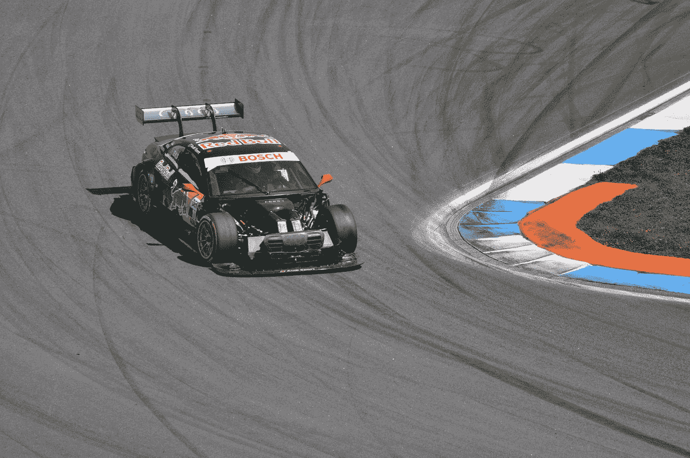

# 自动驾驶赛车戴乐

> 原文：<https://towardsdatascience.com/daile-the-self-driving-racecar-558a1dd6cd24?source=collection_archive---------43----------------------->

照片由 [MiRo Am](https://unsplash.com/@miroam?utm_source=medium&utm_medium=referral) 在 [Unsplash](https://unsplash.com?utm_source=medium&utm_medium=referral) 上拍摄

# 概观

*   介绍
*   什么是戴乐？
*   挑战
*   下一步是什么？
*   结束语
*   关于我

# 介绍

用艾尔顿·塞纳的话说，“如果你不再追求现有的差距，你就不再是一名赛车手，”作为一名机器学习工程师、偶尔的赛车迷和超级书呆子，我发现了一个非常有趣的差距:虚拟自动驾驶赛车的实现少得惊人。我已经找到了一些关于它的视频和简短的文章，但远没有我第一次梦想建造自己的时候所期望的那么多。

不过，这也说得通。赛道是非常动态的环境，即使你不与其他车手竞争，比赛本身也绝不简单。我自己，一个人类和**而不是**机器人，并不特别快，尽管我在驾驶模拟器上呆了几百个小时。但这似乎是一个有趣的项目，即使它悲惨地失败了，也将是一个学习一些新技术的机会，也许是别人令人敬畏的自动驾驶赛车想法的起点。

进入我的尝试去缺口:戴乐。

# 什么是戴乐？

简单地说，戴乐(以戴尔·恩哈特命名)是一个 PyTorch 模型，可以使用控制器输入来玩赛车模拟器 Assetto Corsa (AC)。他查看过去 60 帧的游戏画面，分析屏幕上的图像和相应的遥测数据，并决定是否转弯、加速或刹车。虽然他只接受了几个小时的我自己的驾驶数据训练，但他经常以新颖的方式对他以前见过的情况做出反应。为了证明这一点，你可以看到他正在尝试我最喜欢的马里奥赛车道，婴儿公园。

戴乐尝试婴儿公园

不太简化的版本是，戴乐是一个卷积递归神经网络(CRNN)，ResNet18 用作图像编码器，一个处理编码图像和遥测数据的 2 层 LSTM，以及一个决定下一帧应该使用什么控制器输入的输出层。然后，戴乐使用 Python 的 [pyvjoy](https://github.com/tidzo/pyvjoy) 绑定将这些输入发送给 vJoy，这些输入经过 Steam 的大画面控制器设置并进入 AC。

当然，在戴乐能够做出正确的决定之前，他必须接受训练。为此，我创建了两个自定义工具:

1.  play_together.py:一个数据收集例程，允许汽车控制权在戴乐和人类玩家之间传递(灵感来自 sethbling 的 [MariFlow](https://www.youtube.com/watch?v=Ipi40cb_RsI) )。
2.  一个(可选的异步)数据采集(DAQ)系统，允许自定义采样率。同步数据收集阻止了戴乐在 play_together 例程中进行推理，从而导致了更差的性能。以非阻塞的方式捕获数据似乎在大多数方面都是一种直接的改进。

戴乐，在这个时间点上，是在一个纯粹的监督下接受训练的；向他展示随机批次的 60 帧序列(间隔 1/15 秒)，并要求他预测第 60 帧应该使用什么输入。因此，他只在训练中看到的赛道上表现出智力的迹象。有人可能会说，这意味着戴乐只是过度适应了他以前看过的曲目，但我认为情况并非如此，因为赛道上的概率空间相当大，他甚至在非常类似于他应该熟悉的情况下也表现出了新奇的行为。

一旦戴乐训练完毕，就该在赛道上测试他了。我已经创建了一个戴乐类，它允许实例化模型的一个特定版本(如果你已经训练了几个不同的版本),并使在轨实时推理变得没有痛苦。推理运行时使用 OpenCV 窗口随时向用户显示戴乐的输入。

戴乐在红牛圈的最后一个弯道和第一个弯道超车

# 挑战

在戴乐的发展过程中，一直存在着几个关键的挑战，其中大部分与绩效有关。准备好一个功能原型是相当简单的，但是优化远远占据了我这个项目的大部分时间。作为一名大学生，我有一台用了五年的游戏台式机，没有钱在线租赁 GPU，我不得不在紧张的约束下工作。

## 框定这个问题是困难的。

这应该是分类问题还是回归问题？有许多方法可以实现这一点，但最终我选择将它作为一个回归任务。我知道你可以很容易地将不同的转向、制动和加速度值绑定，并将其作为一个分类问题，但回归对我来说似乎更自然。整体哪个好？虽然我已经实现了训练和测试这两种框架的代码，但不幸的是，我缺乏有效研究这两种框架的资源。

## **实时数据采集很复杂。**

我发现，在 Assetto Corsa 这样的资源密集型模拟中，创建一致的数据流相当困难。我最初的数据采样技术在真空中测试时工作得非常完美——当游戏没有运行时，它捕捉了屏幕截图和我的控制器输入，没有任何延迟或错误——但当实际获取这个项目的数据时，它完全崩溃了。控制器输入特别麻烦，因为在一次测试运行后，对数据的快速调查显示，记录的控制器输入并没有反映我的真实输入。

罪魁祸首是我捕捉截图的方式。每次我抓取屏幕时，我的数据采集脚本中的其他所有东西都会停止，等待它完成。我通过创建一个 data_recorder 类来解决这个问题，这个类*异步*捕获它需要的所有数据，这意味着它不再阻塞数据获取过程的其余部分。

## **视频培训很耗时。**

众所周知，视频数据的训练成本很高。这种介质数据丰富，预处理起来很麻烦(与表格数据相比)，而且消耗内存的速度非常快。此外，对于这种格式，创建 PyTorch 数据加载器比我通常使用的表格数据更复杂。我很快就感受到了所有这些事情的影响:随着我的数据集变大，训练时间也随之膨胀。我尽可能地优化这个过程，但是我被迫开始通宵训练戴乐。我有让培训比现在更有效的想法，但是还没有时间去实施。

## 实时推理要求很高。

我的电脑需要以高帧率同时运行 Assetto Corsa 和戴乐。因为戴乐是在每秒 15 帧的数据上训练的，任何低于这个帧速率的显著下降都会导致不稳定的行为。然而，与此同时，我发现，不管 Assetto Corsa 在推理时间的帧率如何，用每秒 15 帧以下的数据训练戴乐都会导致不稳定的行为。

# 下一步是什么？

## 监督戴乐

我和戴乐还远没有结束。即使在他目前的监督形式下，我也觉得有很多需要优化和改进的地方。我想收集更多的训练数据，真正测试我设计的架构能够真正学习的极限。戴乐已经展示了良好的决策技巧，即使我收集的数据非常有限。有了更多的数据，我感觉他会进一步提高。

## 无人监管的戴乐

然而，一旦我在这个项目的迭代中用尽了我的想法，我想继续进行强化学习方法。我已经看到[塞斯布林的《玛丽克》](https://youtu.be/Tnu4O_xEmVk)和[约什的《轨道狂热 AI》](https://www.youtube.com/watch?v=i1XqbUrarEg)取得了难以置信的成功。我知道这个阶段将需要比监督戴乐更重的计算，但我希望在我准备好进入下一个阶段时，能够获得更好的培训资源！

# 结束语

总的来说，戴乐是对我技能的一次令人兴奋的测试，这个项目融合了我喜欢的许多东西:机器学习、软件工程、赛车和项目管理。这迫使我去设计、再设计、再设计系统，使它们一致、模块化、高效。与此同时，工作也是一种乐趣——第一次成功地看到戴乐感觉就像魔术一样。我希望在这样的项目上花更多的时间。

感谢您花时间阅读这篇文章！如果你对这个项目有任何疑问，请在评论中留言或在 LinkedIn 上联系我。你可以在我的[戴乐 GitHub repo](https://github.com/ladothlak/self-driving-NASCaiR) 中找到我的作品的可自由发布和修改的代码。

# 关于我

一年半前，在本田漫长的实习结束时，我决定将我的职业道路从专注于设计的机械工程完全转向机器学习工程。我一直对计算机科学充满热情，尽管我没有正式学习过它，而且我已经编码很多年了，所以这种转变更多的是焦点的改变，而不是整体的范式转变。尽管如此，我还是需要投入一些认真的自学时间来学习机器。我花了很多周末和工作日的晚上去上 Udacity 和 Udemy 的课程，从计算机视觉到网页设计(因为许多 ML 产品都是基于网络的)，这让我在当地医院开始了我的第一次 ML 研究员实习。

从那以后，我开始攻读硕士学位，提交了第一篇论文发表，现在我正式在俄亥俄州立大学学习计算机科学课程。现在，和戴乐一起，我从零开始创建了我的第一个公开可用的 ML 项目(即没有预先制作的项目大纲或手持指南)。