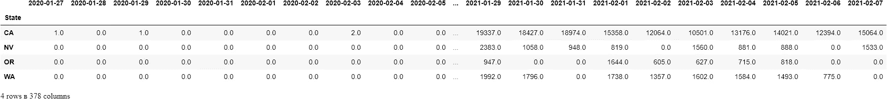
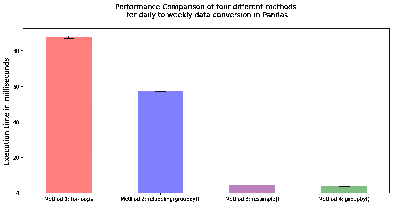

# 在 Pandas 中将每日数据转换为每周数据

> 原文：<https://towardsdatascience.com/daily-to-weekly-pandas-c0557b12f052?source=collection_archive---------2----------------------->

## 将每日数据转换为每周数据的实践教程

在这篇文章中，我将展示 4 种不同的方法来将熊猫的每日数据转换为每周数据，并比较它们的性能。


作者图片

## 挑战

最近，在我的一个研究生班里，我被要求使用熊猫和 Jupyter 笔记本来评估去年美国各县的新冠肺炎每日病例。面临的挑战是以每周数据而不是每天数据的形式呈现调查结果。作为一个使用 Pandas 的初学者，这个简单的任务一开始让我望而生畏，但是在完成这个任务的过程中，我开发了 4 种不同的方法来将每日数据转换成每周数据。

本文使用的 csv 文件可在[usafacts.org](https://usafacts.org/visualizations/coronavirus-covid-19-spread-map/)网页上公开获得。

```
import os
import numpy as np
import pandas as pd
import time

cases = pd.read_csv('covid_confirmed_usafacts.csv')
```

首先，让我们准备好要处理的 cvs 文件:

*   为了简化输出，我们将只关注四种状态下的案例总数:CA、or、WA 和 NV。因此，可以删除不需要的县和州标识列。
*   我们的评估周将于周一开始，周日结束。因此，对应于日期范围的开始/结束周的日期的列也可以被删除。对于本出版物，使用的数据文件包含从 2020 年 1 月 22 日到 2021 年 2 月 7 日的数据。
*   原始 csv 文件中的数据是新冠肺炎病例的累计，需要转换为新病例。这是通过对按状态分组的数据帧应用 sum()和 diff()函数来实现的。
*   最后，01/26/2020 是数据帧中第一个星期一之前的一个星期日，是不完整周的一部分。只有在计算出新病例数后，才能删除它，这样第一个星期一的新病例数据才不会丢失。

```
cases_states = cases.query("State == 'CA' | State == 'OR' | State == 
                           'WA' | State == 'NV'")
cases_states_filtered = cases_states.drop(columns = ['countyFIPS', 
                       'StateFIPS','County Name',  
                       '2020-01-22','2020-01-23', '2020-01-24', 
                       '2020-01-25'])
cases_states_daily_total = cases_states_filtered.groupby('State').sum()
new_cases_daily_total = cases_states_daily_total.diff(axis = 1)
new_cases_daily_total = new_cases_daily_total.drop(columns =  
                                                   ['2020-01-26'])
display(new_cases_daily_total)
```



## 方法 1:使用 Python for 循环。

据我所知，在 Pandas 中使用 Python for-loops 迭代数据并不是将每日数据转换为每周数据的最有效方式。仅仅用 Python for-loops 循环并没有利用 Pandas 提供的任何内置功能，这是完成手头任务最慢的方式。然而，在这个旅程的开始，for-loops 似乎是将每日数据列转换为每周数据列的最简单的方法，所以我从实现一个函数开始。

函数 new_case_count()接受 DataFrame 对象，对其进行迭代，并将索引(字符串格式的日期)转换为 Pandas Datetime 格式。基于日期的星期几，计算每周的新案例数并存储在列表中。该函数返回每个州的每周新病例计数列表。

为简单起见，这种方法和其他方法的输出只显示最近 5 周的数据。

```
def new_case_count(state_new_cases):
    first_Monday_found = False
    week_case_count = 0
    week_case_counts = []
    for index, value in state_new_cases.items():
        index_date = pd.to_datetime(index, format='%Y/%m/%d', 
                                    exact = False)
        index_day_of_week = index_date.day_name()
        if not first_Monday_found and index_day_of_week != 'Monday':
            continue
        first_Monday_found = True
        week_case_count += value
        if index_day_of_week == 'Sunday':
            week_case_counts.append(week_case_count)
            week_case_count = 0
    return week_case_counts

# converting list to DataFrame object
new_cases_weekly_total_method_1 =  
                 pd.DataFrame(new_case_count(new_cases_daily_total))display(new_cases_weekly_total_method_1.tail(5))
```


## 方法 2:重新标记和 groupby()。

我下一次将每日数据转换为每周数据的尝试不涉及任何 for 循环。然而，它仍然是四种方法中第二慢的方法。

函数 rename_columns_dates()接受 Series 对象并将索引(字符串格式的日期)转换为 Pandas Datetime 格式。日期被重新标记为当前周的星期一的日期，格式为“%Y/%m/%d”，后跟分隔符(%符号)和当前日期与当前周的星期一的偏移量。该函数返回一个表示新日期标签的字符串。例如，对于星期一 2021/01/25，返回字符串将是“2021/01/25%0”，对于星期二 2021/01/26，返回字符串将是“2021/01/25%1”，依此类推。

接下来，通过在分隔符(%)处拆分数据标签，并对以同一个星期一作为日期的组的值求和，每周对新案例进行分组。

```
def rename_columns_dates(new_cases_index):
    index_date = pd.to_datetime(new_cases_index, format='%Y/%m/%d', 
                                exact = False)  
    index_day_of_week = index_date.day_name()
    offset_from_monday = 0
    if index_day_of_week == 'Tuesday':
        offset_from_monday = 1
    elif index_day_of_week == 'Wednesday':
        offset_from_monday = 2
    elif index_day_of_week == 'Thursday':
        offset_from_monday = 3
    elif index_day_of_week =='Friday':
        offset_from_monday = 4
    elif index_day_of_week == 'Saturday':
        offset_from_monday = 5
    elif index_day_of_week == 'Sunday':
        offset_from_monday = 6

    # new_date is a class of Pandas.Timeframe   
    new_date = index_date - pd.Timedelta(days = offset_from_monday)
    return (new_date.strftime('%Y/%m/%d') + '%' + 
                              str(offset_from_monday))

new_cases_weekly_total = new_cases_daily_total.rename(rename_columns_dates, axis = 'columns')

# grouping new cases weekly by splitting data labels at delimiter (%) and summing the values for the same Mondaynew_cases_weekly_total_method_2 = new_cases_weekly_total.groupby(new_cases_weekly_total.columns.str.sp
                               lit('%').str[0], axis=1).sum()display(new_cases_weekly_total_method_2.T.tail(5))
```


## 方法 3:重采样()。

这个方法使用了一个 resample()函数。我在 Medium 上看到两篇文章[在这里](https://raj26kumar.medium.com/convert-daily-data-to-weekly-data-without-losing-names-of-other-column-using-python-pandas-e2aa001a3691)和[在这里](https://medium.com/@sharath.ravi/convert-daily-data-to-weekly-data-using-python-pandas-6c73abcfb5f7)，介绍如何使用重采样()将每日数据转换为每周数据。在对数据框架做了一些修改后，我让这个方法运行起来。

如本文结尾所示，它是四个中第二快的。

```
new_cases_daily_total_modified = new_cases_daily_total.T.reset_index()

new_cases_daily_total_modified = 
new_cases_daily_total_modified.assign(Weeks =                                     new_cases_daily_total_modified['index']).drop(columns = 'index')

new_cases_daily_total_modified['Weeks'] =  
new_cases_daily_total_modified['Weeks'].astype('datetime64[ns]')

new_cases_weekly_total_method_3 = new_cases_daily_total_modified.resample('W-Mon', label='left',                                                                          closed = 'left', on='Weeks').sum()display(new_cases_weekly_total_method_3.tail(5))
```


## 方法 4: groupby()。

这种方法的想法是在阅读了 [stackoverflow](https://stackoverflow.com/questions/46607027/pandas-sum-of-every-n-columns) 上的建议后产生的。我很高兴您可以在一行中一次按 7 对列进行分组。然而，这种简单性的代价是失去日期标签，取而代之的是数字索引，在本例中是 0–53。

为了解决这个问题，我想到了使用 pd.period_range()函数创建一个所需的日期范围，将日期范围转换为序列，并将其添加到现在有每周数据的 DataFrame 中。函数的作用是:返回一个固定频率的 PeriodIndex。这种格式的日期周期如下所示:“星期一日期/星期日日期”。您可以保持原样，或者用分隔符('/')将字符串分开，只让星期一日期标记一周的开始。

这种方法被证明是四种测试方法中最快的方法。

```
new_cases_groupby_total_method_4 = new_cases_daily_total.groupby([[i//7 for i in range(0,378)]], 
                                axis = 1).sum().T

date_range = pd.period_range(start = '2020-01-27', end =  
                             '2021-02-07', freq = 'W-SUN')
date_range = date_range.map(str)
date_range = date_range.str.split('/').str[0]

date_range = pd.Series(date_range)

new_cases_weekly_total_method_4 = 
         new_cases_groupby_total_method_4.assign(Weeks = date_range)print('DataFrame after groupby():')
display(new_cases_groupby_total_method_4.tail(5))

print('date_range Series:')
display(date_range.tail(5))

print('Final Dataframe:')
display(new_cases_weekly_total_method_4.set_index(['Weeks']).tail(5))
```


`DataFrame after groupby()`

```
date_range Series:

49    2021-01-04
50    2021-01-11
51    2021-01-18
52    2021-01-25
53    2021-02-01
dtype: object
```


`Final Dataframe`

## 绩效评估:

测量每种方法的执行时间。我使用%%timeit 在 Jupyter 笔记本上测量执行时间，方法是将%%timeit 放在每个方法单元格的顶部。为了比较这四种方法的性能，我在 Jupyter 笔记本上连续运行了 10 次。

重要的是要记住，10 次运行的样本量非常小，这只是对方法性能的快速浏览。

结果数据已被转换为数据帧。计算平均值和标准偏差。

```
data_milliseconds = {'Method 1: for-loops':[87.00, 88.3, 88.2, 87.3,
                    86.8, 87.1, 86.8, 87.2, 89.1, 87.5], 
                    'Method 2: relabeling/groupby()':[56.8, 57.2, 
                    57.2, 56.8, 56.7, 56.9, 56.9, 56.7, 57.0, 57.1],
                    'Method 3: resample()':[4.6, 4.61, 4.56, 4.53, 
                    4.5, 4.52, 4.54, 4.49, 4.55, 4.51],
                    'Method 4: groupby()':[3.52, 3.51, 3.51, 3.47, 
                    3.6, 3.47, 3.53, 3.5, 3.45, 3.46]} 

methods_performance = pd.DataFrame(data_milliseconds).T
methods_performance['Mean'] =  
                   methods_performance.loc[:,'0':].mean(axis = 1)
methods_performance['Std'] = methods_performance[0:].std(axis = 1)

display(methods_performance)
```


## 结论:

*   重要的是要记住，样本大小只是 Jupyter 笔记本文件的 10 次运行。
*   方法 4 (groupby()方法)是四种方法中最快的。
*   方法 4 的运行速度是方法 1 (for-loop 方法)的大约 25 倍，是方法 2 (relabeling/groupby()方法)的大约 16 倍。
*   方法 3(重采样()方法)的运行速度几乎与方法 4 (groupby()方法)一样快，而方法 4 的运行速度快 1.3 倍。
*   虽然我预计方法 1 和 2 比方法 3 和 4 慢，但我惊讶地发现方法 4 是所有方法中最快的。

```
import matplotlib.pyplot as plt 

plt.figure(figsize=(13,6))
methods_performance['Mean'].plot(kind = 'bar',  
                   yerr=methods_performance['Std'], align='center',
                   alpha=0.5, color=['red', 'blue', 'purple',  
                   'green'], ecolor='black', capsize=10)
plt.xticks(rotation = 0)
plt.ylabel('Execution time in milliseconds', fontsize=14);
plt.title('Performance Comparison of four different methods\n for  
          daily to weekly data conversion in Pandas\n', fontsize=14)
plt.show()
```



感谢您的阅读，

月形蝴蝶

注:我用 [jupyter_to_medium](https://www.dexplo.org/jupyter_to_medium) 发表这篇文章。