# DALL E by OpenAI:从文本中创建图像

> 原文：<https://towardsdatascience.com/dall-e-by-openai-creating-images-from-text-e9f37a8fe016?source=collection_archive---------20----------------------->

## 创造性人工智能的又一个里程碑

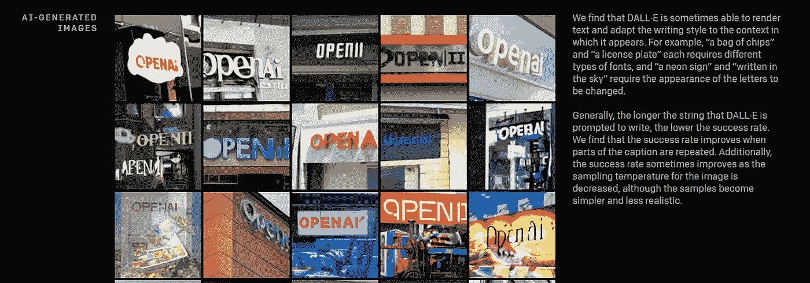

作者截图(本文使用截图经 OpenAI 批准)

今天是 2021 年 1 月 5 日，OpenAI 已经报告了另一项人工智能突破。2020 年，他们至少通过两个里程碑影响了人工智能世界: [GPT-3](/gpt-3-creative-potential-of-nlp-d5ccae16c1ab?source=friends_link&sk=f27e91b137d80f24236e1dc9f2d49f85) ，一个强大的自然语言处理模型，和一个音乐生成器[点唱机](/jukebox-by-openai-2f73638b3b73?sk=003ba0e0d6416a4456c7a890fddf9461)。

在 [Transformer](/transformers-141e32e69591) 的驱动下，这两种不同媒体的方法创造了连贯而令人信服的输出——文本和音乐。OpenAI 还尝试了视觉媒体——例如，在 [ImageGPT](https://openai.com/blog/image-gpt) 中。

现在，一颗新星出现在生成式人工智能方法的地平线上: [DALL-E](https://openai.com/blog/dall-e/) 。以超现实主义者萨瓦尔多·达利和科幻动画《瓦力》命名，这个变形金刚语言模型代表了一个多模态神经网络

> 为了更好地理解世界，人工智能系统通过几种方式学习概念，主要是文本和视觉领域。( [OpenAI](https://openai.com/blog/tags/multimodal/) )

我想这是避免 AGI 索赔的好方法。甚至 OpenAI 也意识到，通往 AGI 的路还很长(正如这些人在经历了围绕 GPT-3 的炒作后所说的那样):

事实上，AGI 需要一个全能和多媒体的方法。但是 DALL E 是迈向这个目标的一大步。

DALL E 做了它被描述要做的事情:从文本提示创建图像。这是 GPT-3 的 120 亿参数，可以使用文本-图像对从文本中生成图像。

变压器驱动的神经网络已经是一种势不可挡的现象。即使我们可以讨论“理解”，概念的“理解”也是极其重要的。提醒 GPT-3 由烤面包机写的[情书](https://medium.com/merzazine/love-letters-written-by-a-toaster-e9e795c6409f?sk=33dab8b8228a95cf0b65077c839dceba):


作者截图

在这种情况下，GPT-3 明白了:

*   情书的本质
*   烤面包机的功能和特点
*   将两个概念结合成一个“Gesamtkunstwerk”

通过你的提示，你不只是“编程”变压器驱动的模型。你把你的要求传达出去，就像传达给一个设计机构——结果可能会让你开心、被吸引，或者让你烦恼(这是一个品味问题)。

DALL E 完美地完成了它的工作——当我们可以用“完美”这个形容词来形容这种创造性的方法时。

在展示 DALL E 的博客中，你可以看到模型的运行——各种背景的预渲染图像。你甚至可以在交互模式下在一些预定义的参数之间进行选择。

例如，这里有一个提示:

```
A [store front] that has the word [openai] written on it
```

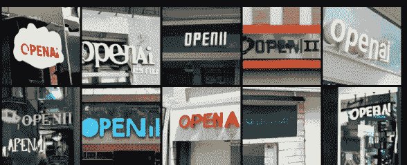

作者截图

将第二个参数(word)改为“Skynet ”,我们得到另一组图像:

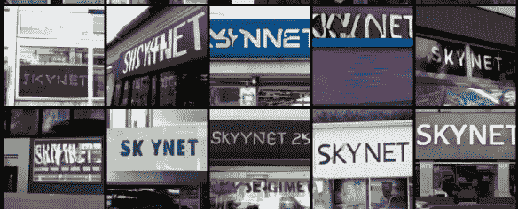

作者截图

或者:剪辑

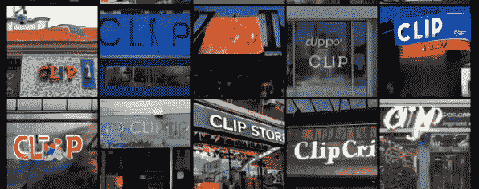

作者截图

你看，任务是如何被接受和实现的——以各种风格和视觉效果，基于预先训练的模型。

Text2Img 确实有其他方法，但 DALL E 每次都胜出:

对物体、形状和颜色的实验证明了这种神经网络的能力。

使用提示

```
an [armchair] in the [shape] of [avocado/pikachu/japanese mapple]
```

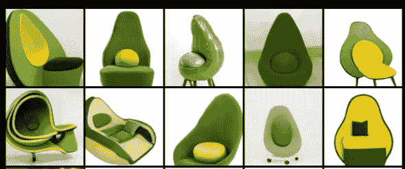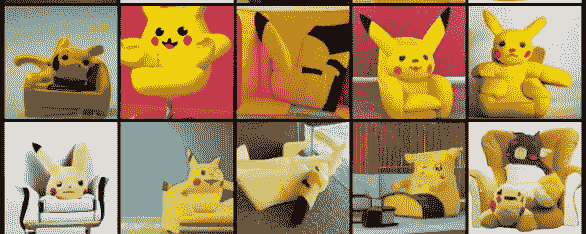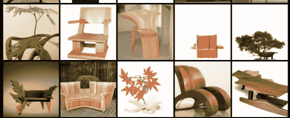

作者截图

你会得到具有惊人风格连贯性的照片般真实的图像，以及同一主题中的多样性。

有趣的是，DALL E 无需额外训练，就能完美配合零距离视觉推理。

下面是一个使用文本和图像的更复杂的提示:

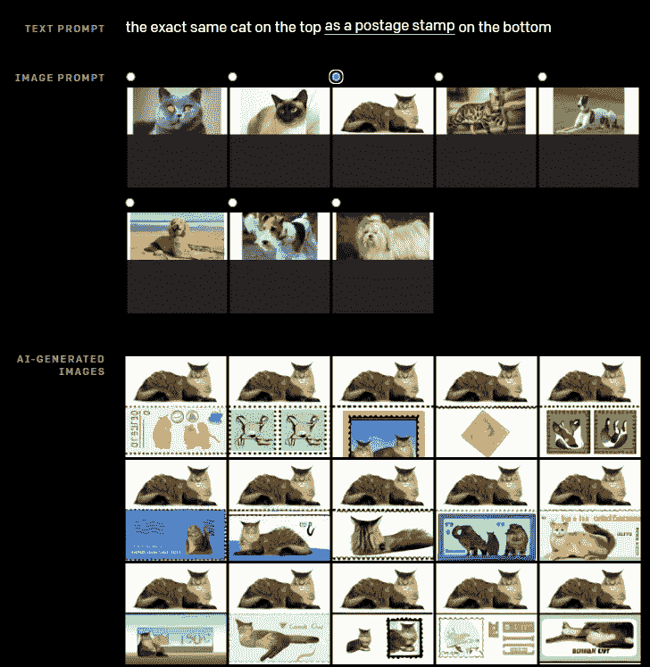

作者截图

你看到同样的猫，邮票，和各种各样的颜色和图案。

恰如其分的设计，该系统可以识别风格和情绪的图像特征。

举个例子，我们以猫头鹰为表情符号。

下面是一只**困惑的猫头鹰**:

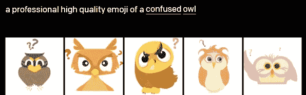

作者截图

一只沮丧的猫头鹰:

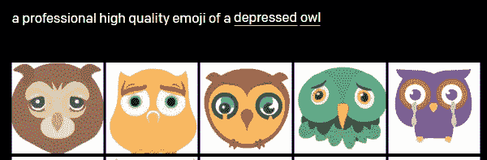

作者截图

一只快乐的猫头鹰:

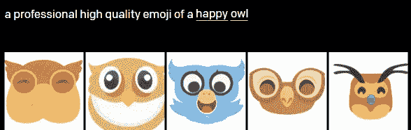

作者截图

一只困倦的猫头鹰:

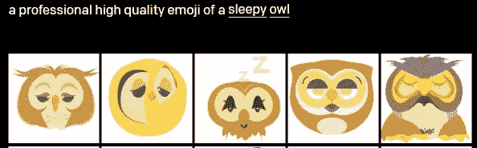

作者截图

DALL E 还具有基于预训练的时间风格知识，例如，来自不同时期的设备的视觉表示:

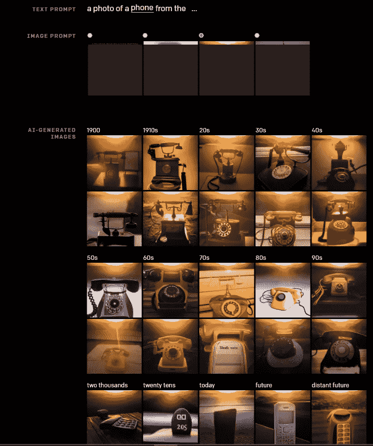

作者截图

这里甚至还有地理和文化知识。例如，系统可以生成地标的图像，并结合风格转换的图像提示:

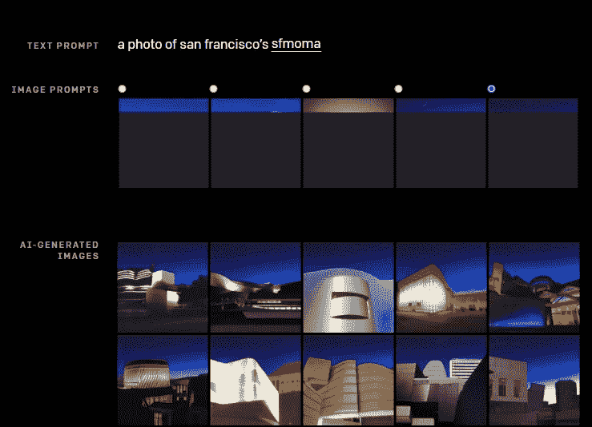

作者截图

在这里你可以看到各种科幻 MOMA 幻觉与“夜空”的图像提示。

事实上，即使 AGI 仍然在未来，DALL E 无疑是向它迈出的一大步——理解人类的要求，应用自己的知识，生成逼真和独特的图像，它为艺术、设计和讲故事的各种方法开辟了新的途径。

现在，只要它一上市，我就迫不及待地想试用它。因为已经了解了 GPT 3 号的能力，我可以毫无顾忌地说——这是一次令人兴奋的经历。