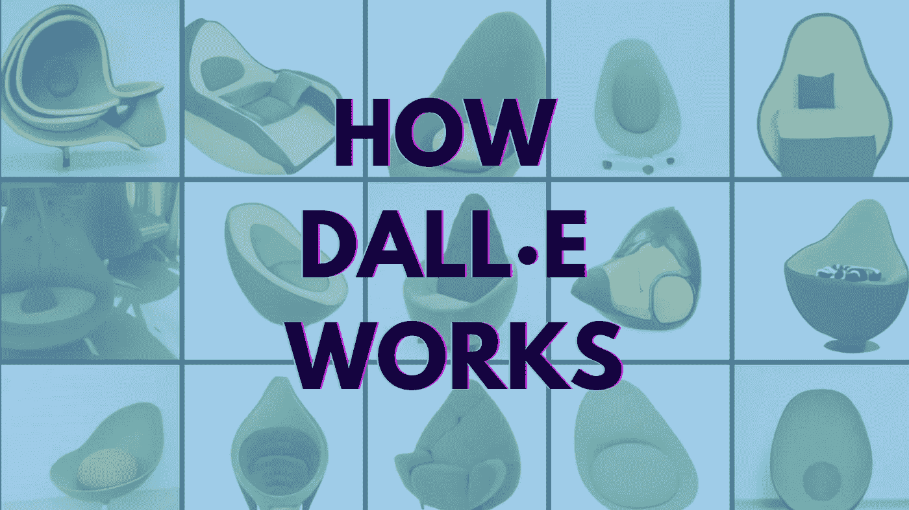

# DALL E 在 5 分钟内解释了

> 原文：<https://towardsdatascience.com/dall-e-explained-in-under-5-minutes-327aea4813dd?source=collection_archive---------18----------------------->

*从* [到*https://openai.com/blog/dall-e/.*到](https://openai.com/blog/dall-e/.)

似乎每隔几个月，就会有人发表一篇让我瞠目结舌的机器学习论文或演示。这个月，它是 OpenAI 的新图像生成模型 [DALL E](https://openai.com/blog/dall-e/) 。

这个庞大的 120 亿参数神经网络接受文本标题(即“鳄梨形状的扶手椅”)，并生成与之匹配的图像:

*出自*[*https://openai.com/blog/dall-e/.*](https://openai.com/blog/dall-e/.)

我认为它的图片非常鼓舞人心(我会买一把鳄梨椅)，但更令人印象深刻的是 DALL E 理解和呈现空间、时间甚至逻辑概念的能力(稍后会详细介绍)。

在这篇文章中，我会给你一个 DALL E 能做什么的快速概述，它是如何工作的，它如何适应 ML 的最新趋势，以及为什么它是重要的。我们走吧！

# DALL E 是什么，它能做什么？

7 月，DALL E 的创造者 OpenAI 公司发布了一个类似的巨大模型，名为 GPT-3，它能够生成类似人类的文本，包括专栏文章、诗歌、十四行诗，甚至计算机代码，震惊了世界。DALL E 是 GPT 3 的自然扩展，它解析文本提示，然后用图片而不是文字来回应。例如，在 OpenAI 博客的一个例子中，模型从提示“一个有两把白色扶手椅和一幅壁画的客厅”中渲染图像。这幅画挂在一个现代壁炉的上方:

*出自*[*https://openai.com/blog/dall-e/.*](https://openai.com/blog/dall-e/.)

很圆滑，对吧？你可能已经知道这对设计师有多有用了。请注意，DALL E 可以根据提示生成大量图像。这些照片然后由第二个 OpenAI 模型进行排序，这个模型叫做 [CLIP](https://openai.com/blog/clip/) ，它试图确定哪些照片匹配得最好。

# DALL E 是如何建成的？

不幸的是，我们还没有这方面的大量细节，因为 OpenAI 还没有发表完整的论文。但在其核心，DALL E 使用了同样的新神经网络架构，这是 ML 最近取得大量进展的原因:变压器。2017 年发现的 Transformers 是一种易于并行化的神经网络，可以在庞大的数据集上进行扩展和训练。它们在自然语言处理(它们是 BERT、T5、GPT-3 等模型的基础)、提高[谷歌搜索](https://blog.google/products/search/search-language-understanding-bert/)结果、翻译的质量，甚至在[预测蛋白质结构](https://daleonai.com/how-alphafold-works)方面都具有特别的革命性。

这些大型语言模型中的大多数都是在巨大的文本数据集上训练出来的(就像所有的维基百科或[网络抓取](https://commoncrawl.org/))。然而，DALL E 的独特之处在于，它是在由单词和像素组成的序列上进行训练的。我们还不知道数据集是什么(它可能包含图像和说明)，但我可以向你保证它可能是巨大的。

# DALL E 到底有多“聪明”？

虽然这些结果令人印象深刻，但每当我们在一个庞大的数据集上训练一个模型时，持怀疑态度的机器学习工程师问这些结果是否仅仅是因为它们是从源材料中复制或记忆的，这是正确的。

为了证明 DALL E 不仅仅是回流图像，OpenAI 的作者强迫它呈现一些非常不寻常的提示:

"一个专业的高质量的长颈鹿龟嵌合体插图."

*出自*[*https://openai.com/blog/dall-e/.*](https://openai.com/blog/dall-e/.)

“竖琴做的蜗牛。”

*出自*[*https://openai.com/blog/dall-e/.*](https://openai.com/blog/dall-e/.)

很难想象该模型在其训练数据集中遇到了许多长颈鹿和乌龟的混血儿，从而使结果更加令人印象深刻。

更重要的是，这些奇怪的提示暗示了 DALL E 更令人着迷的东西:它执行“零射击视觉推理”的能力

# 零距离视觉推理

通常在机器学习中，我们通过给模型数千或数百万个我们希望它们执行的任务示例来训练模型，并希望它们能够理解模式。

例如，为了训练一个识别狗品种的模型，我们可能会向神经网络显示成千上万张按品种标记的狗的图片，然后测试它标记新狗图片的能力。与 OpenAI 的最新成就相比，这是一项范围有限的任务，看起来几乎有些古怪。

另一方面，零射击学习是模型执行他们没有被特别训练去做的任务的能力。例如，DALL E 被训练从字幕生成图像。但通过正确的文本提示，它也可以将图像转换为草图:

*提示的结果，“顶部的猫与底部的草图完全相同”。来自*[*【https://openai.com/blog/dall-e/】*](https://openai.com/blog/dall-e/)

DALL E 还可以在街道标志上呈现自定义文本:

结果来自提示*“写有‘open ai’字样的店面”。出自*[*https://openai.com/blog/dall-e/.*](https://openai.com/blog/dall-e/.)

通过这种方式，DALL E 几乎可以像 Photoshop 滤镜一样工作，即使它不是专门设计来这样工作的。

该模型甚至显示了对视觉概念(即“宏观”或“横截面”图片)、地点(即“中国食物的照片”)和时间(从夜晚的街道拍摄的旧金山阿拉莫广场的照片)的“理解”；“一张 20 年代的手机照片”)。例如，下面是它在回应提示“中国食物的照片”时吐出的内容:

*《中国美食照》摘自*[*https://openai.com/blog/dall-e/.*](https://openai.com/blog/dall-e/.)

换句话说，DALL E 能做的不仅仅是为标题描绘一幅美丽的图画；从某种意义上来说，它也可以直观地回答问题。

为了测试 DALL E 的视觉推理能力，作者让它接受了视觉智商测试。在下面的例子中，模型必须完成网格的右下角，遵循测试的隐藏模式。

*来自 https://openai.com/blog/dall-e/.*的 [*用来测试 DALL E* *的视觉智商测试 OpenAI 截图*](https://openai.com/blog/dall-e/.)

“DALL E 通常能够解决涉及连续简单模式或基本几何推理的矩阵，”作者写道，但它在一些问题上比其他问题做得更好。当拼图的颜色颠倒时，DALL E 的表现更差——“表明它的能力可能会以意想不到的方式变得脆弱。”

# 这是什么意思？

DALL E 给我印象最深的是它在许多不同的任务上表现惊人的出色，这些任务甚至是作者们没有预料到的:

“我们发现，当以正确的方式提示时，DALL E […]能够执行几种图像到图像的翻译任务。

我们没有预料到这种能力会出现，也没有修改神经网络或训练程序来鼓励它。"

这很神奇，但并非完全出乎意料；DALL E 和 GPT-3 是深度学习中一个更大主题的两个例子:在未标记的互联网数据上训练的特大神经网络(“自我监督学习”的一个例子)可以是高度通用的，能够做许多不是专门设计的事情。

当然，不要把这个误认为是一般的智力。欺骗这些类型的模特让他们看起来很蠢并不困难。当它们可以公开访问时，我们会知道得更多，并且我们可以开始使用它们。但这并不意味着我在此期间不能兴奋。

*想要更多关于机器学习的东西吗？在推特上关注*[*@ dale quark*](https://twitter.com/dalequark)*。*

*原载于 2021 年 1 月 6 日 https://daleonai.com***。**