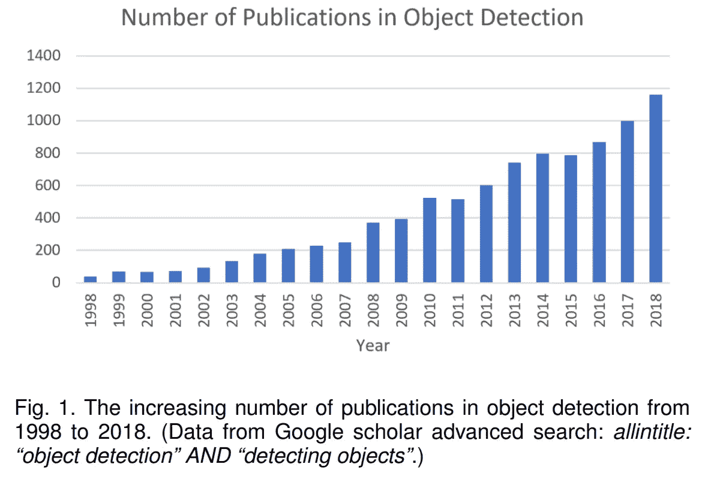
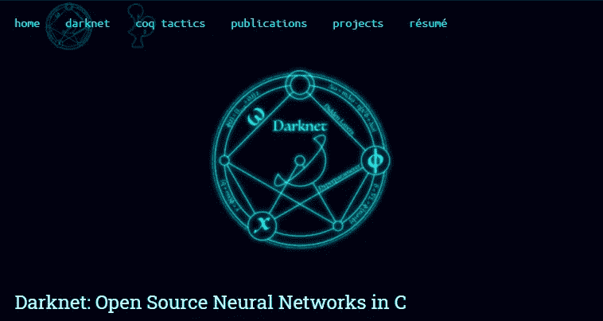
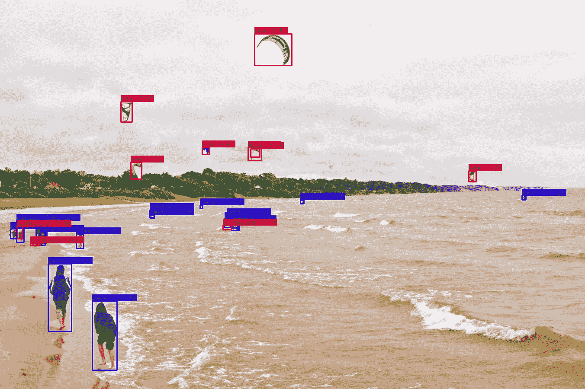
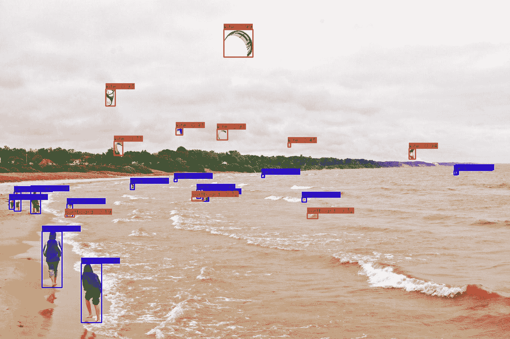

# Darkeras:使用 Darknet 预训练的权重在 keras 上执行 YOLOv3/YOLOv4 对象检测

> 原文：<https://towardsdatascience.com/darkeras-execute-yolov3-yolov4-object-detection-on-keras-with-darknet-pre-trained-weights-5e8428b959e2?source=collection_archive---------19----------------------->

## 宇宙中的一切都是相互联系的。

基于卷积神经网络的目标检测已经成为计算机视觉中的一个主要课题，因为它吸引了该领域的众多研究人员。各种先进的方法可以分为两大类:一级对象检测器(例如 SSD、YOLOv1-v5、EfficientDet、RetinaNet)和两级对象检测器(例如 R-CNN、快速 R-CNN、更快 R-CNN、级联 R-CNN)。虽然两级对象检测器旨在提高检测精度，但是已经开发了一级对象检测方法，试图平衡精度和推理速度之间的折衷，因此，由于它们可应用于需要上述折衷平衡的现实世界问题，所以它们正受到更多的关注。

图来自[论文:物体探测 20 年:一项调查](https://arxiv.org/abs/1905.05055)

在几十种精英方法中， [Joseph Redmon](https://pjreddie.com/) 的 YOLO(你只看一次)被认为是该领域最强大、最经典的方法之一。虽然 Joseph 宣布由于一些个人原因，他停止了他的项目，该项目是物体检测的一个重要里程碑，但他将 YOLO 项目的领导特权交给了 Alexey Bochkovskiy，Alexey 在 2020 年推出了 YOLOv4。你可以通过[官网](https://pjreddie.com/darknet/)或者 github repo [darknet](https://github.com/AlexeyAB/darknet) 来看看这个项目。

图片来自[暗网网站](https://pjreddie.com/darknet/)

以上只是你可能关心(也可能不关心)的一条信息。现在我们回到带你来这里阅读这篇文章的原因，标题:“Darkeras:用 Darknet 预训练的权重在 keras 上执行 YOLOv3/YOLOv4 对象检测”。你们可能知道如何使用暗网，其他人可能是 Tensorflow-Keras 的专业人员。在我使用这两个框架的经验中，Darknet 是为对象检测而创建的，因此，在这项任务中，它应该被优化并产生比 Tensorflow-Keras 更好的结果。这就像一个对一件事情了解很深的人和另一个对事情了解很广的人。在这个场景中，暗网是第一个深入了解 YOLO 的人。但是，Darknet 并不是为用户定制太多而设计的！例如，你可以改变网络架构、超参数，但你不能或很难做一些高级学习方法，如知识提炼、基于提示的学习或特征图分析，但 Tensorflow-Keras 可以。为了利用这两个家伙的美丽价值，我写了这篇文章，并为你们提供了一个工具，用于转换 Darknet 训练的权重并在 Tensorflow-Keras 上执行对象检测。你可以在这里看我的项目。

该项目的说明如下:

# 属国

*   OpenCV
*   张量流 2.3.0
*   Keras 2.4.0

# 支持的型号

*   YOLOv3
*   YOLOv4

# 如何使用

*   将从官方 Darknet [网站](https://pjreddie.com/darknet/yolo/)下载的预训练权重或您训练的权重放入“权重”文件夹(如果您使用在您定制的数据集上训练的模型，请更改笔记本中的 NUM_CLASS 和 ANCHORS)
*   运行 YOLOv3: darkeras-yolov3.ipynb
*   运行 YOLOv4: darkeras-yolov4.ipynb

# 检测结果

*   投入

图片来自 [Github](https://github.com/tranleanh/darkeras-yolov4)

*   YOLOv3

图片来自 [Github](https://github.com/tranleanh/darkeras-yolov4)

*   YOLOv4

图片来自 [Github](https://github.com/tranleanh/darkeras-yolov4)

玩得开心！

该项目经常更新。

# 结论

在这篇文章中，我介绍了 Darkeras，这是一个用 Python 编写的工具，用于将在 Darknet 软件上训练的权重文件转换为 keras 框架。该项目旨在使用在 Darknet 软件上训练的权重，在 Tensorflow-Keras 框架中支持高级学习方法，如知识提炼、基于提示的学习或特征图分析。

欢迎读者访问我这个项目的 [github](https://github.com/tranleanh/darkeras-yolov4) repo 和分享机器学习相关事情的脸书粉丝页:[潜入机器学习](https://www.facebook.com/diveintomachinelearning)。

感谢您抽出时间！