# 时间序列预测的飞镖瑞士刀

> 原文：<https://towardsdatascience.com/darts-swiss-knife-for-time-series-forecasting-in-python-f37bb74c126?source=collection_archive---------2----------------------->

## [实践教程](https://towardsdatascience.com/tagged/hands-on-tutorials)

## 一个多方法 Python 包，用于在您的时间序列上运行比赛

一步一步的教程，教你如何用*飞镖*建立一个单独的 Python 脚本——然后通过几种替代方法运行你的源时间序列，在模型中找到最适合的，类似锦标赛的。

在本例中，我们将对源数据运行五种预测方法，然后比较它们的准确性。

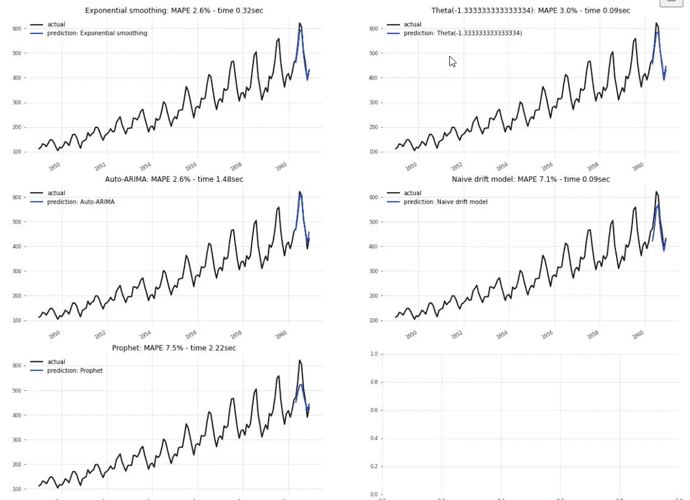

作者图片

*Darts* 嵌入了我们从更专业的 Python 包中知道的大多数广泛使用的时间序列预测方法。其中，它包装了 *facebook Prophet* 模型和 *pmdarima 的*自动 arima 包。 *Darts* 也实现了几种神经网络架构。

*   指数平滑法
*   天真的漂移+季节性预测
*   (自动)SARIMAX
*   ㈤ARIMA
*   θ方法
*   facebook 先知
*   线性回归
*   递归神经网络，如香草 RNN，LSTM 和 GRU
*   时间卷积网络 TCN
*   快速傅立叶变换 FFT
*   神经基扩展分析时间序列预测 N 拍

所有这些模型在单个库中的组合大大减少了安装和维护单独应用程序的痛苦；以及努力建立几种可供选择的预测方法。Darts 提供了一个相当全面的包，我们可以用几行代码调用多个模型，以确定最佳拟合方法或构建集合预报。

*Darts* 是由总部位于瑞士的数据分析和人工智能公司 unit8 开发的开源包。(除了安装 pip*飞镖*之外，我与 unit8 没有任何关系或联系)

# 得一个例子。省道的安装

和往常一样，您应该在尝试安装一个庞大的 Python 包之前创建一个新的虚拟环境，这个包有许多依赖项，比如 *Darts 的*。您希望避免基础环境中的现有软件包因新安装而降级或升级。

在 *Anaconda* 中创建一个虚拟环境:

*   conda create--name<your_chosen_env_name>python = 3.7</your_chosen_env_name>

请注意，我在使用 fbProphet 组件时遇到了困难，但是已经解决了。虽然我的基本环境运行在 Python 3.8.8 上，并且大多数 *Darts* 组件都接受它，但我发现我必须建立一个 Python 3.7 环境，显然是为了适应 *fbProphet* 。 *Prophet* 和 *PyTorch* 具有非 Python 依赖关系，因此如果试图并行安装所有组件时出现错误消息，安装可以在一个 *Darts* 核心包和额外组件之间进行。

关于安装的附加信息:[一个 python 库，用于时间序列的简单操作和预测。| PythonRepo](https://pythonrepo.com/repo/unit8co-darts-python-machine-learning)

将*飞镖*与*所有*其延伸部分 *fbProphet 进行 pip 安装；pmdarima* (针对 SARIMAX)；和 *PyTorch* (用于神经网络)——使用命令:

*   *pip 安装' u8darts[all]'*

如果你遇到问题，你可以先安装飞镖而不需要额外的东西:

*   *pip 安装 u8 飞镖*

然后尝试逐步添加额外内容:

*   pip 安装 *'u8darts[fbprophet]'*
*   pip 安装 *'u8darts[pmdarima]'*
*   pip 安装*' u8 飞镖【火炬】'*

*Pmdarima* 和 *PyTorch* 没有在我的机器上造成任何安装问题。

# 得了。属国

在本教程中，我们将导入七个*飞镖的*预测模型:

*   天真，
*   先知，
*   指数平滑，
*   ARIMA，我们将与 ARIMA 汽车公司合并，
*   θ法。

我们还导入了一个 *Darts* 预测准确性度量库以及 Box-Cox 转换器；以及公共领域数据集的目录，这些数据集被构建到 Darts 中，并且可以被加载而不需要处理外部文件。

在本教程中，我们将重点关注 Box & Jenkins 的经典月度航空乘客数据集。

对于预测前和预测后诊断，我还将利用从 *pmdarima* 和 *statsmodels* 导入的一些假设检验。 *Darts* 主要依靠其图表提供的视觉线索来评估时间序列属性，比如正态性。由于 Python 代码本身不容易解释图表，而是需要用户决定如何继续，所以我添加了一些测试来自动化工作流。

在 dependencies 单元格的底部，我们插入几个常量作为默认参数。最重要的常数是训练数据集的截止日期。

在我们的航空客运例子中，我选择 1957 年 5 月 1 日作为测试期的开始；它延伸到 1960 年。

# 1.数据加载和争论

在下一个单元格中，我们加载航空公司数据集。你可以看到几个源代码——都内置在 *Darts* 包中——我通过在它们前面加上注释指示符#来暂时停用它们。

与*熊猫*不同，*飞镖*不会将数据集加载到传统的数据帧中。相反，源数据被分配给变量 *ts* ，一个*时间序列*对象(第 3 行)。

如果数据集包含一个以上的序列，如果我们希望将下一步限制在多个列中的一个单变量时间序列，我们可以选择一个列并将其分配给一个 series 对象。我们的数据集只包含乘客人数，因此第 12 行将 *ts* 变量全部赋给序列变量 *series* 。

对于 Pandas 中的数据争论，我们可以通过应用函数*将这个 timeseries 对象转换成 dataframe。pd_dataframe()* (第 13 行)。

让我们回顾一下原始数据。

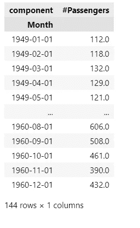

作者图片

作者图片

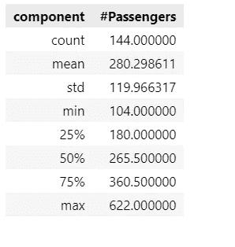

作者图片

为了处理任何丢失的数据或零，我选择应用*的*回填*方法。fillna()* 函数。

让我们绘制源数据。

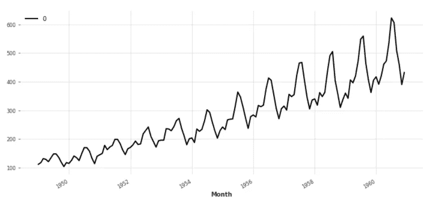

作者图片

该图在每个日历年都有一个峰值，显示了月度季节性。让我们做个测试来确认视觉线索。

# **2。诊断**

便利的是，与许多其他套装不同， *Darts* 提供了一个检查季节性的测试。它返回一个布尔值 *is_seasonal* 以及季节订单号 *mseas* (例如， *mseas* =12 表示一个日历年中的几个月)*，*，它是通过评估时间序列的相关图(ACF)找到的。

我们将把测试发现的季节性输入到预测模型中。

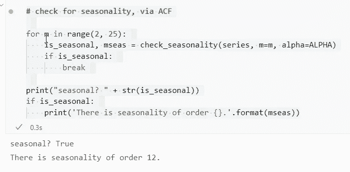

作者图片

# 3.训练和验证数据集

*Darts* 提供了几种在训练和测试(验证)数据集之间分割源数据的替代方法。

在脚本顶部的 dependencies 单元格中，我导入了 *numbers* 库。我使用 *isinstance()* 函数来检查限制器的类型，我们在依赖关系中将它定义为常量 *TRAIN* 。根据源数据的不同，*序列*可能会对数字索引、日期时间类型的日期或字符串类型的日期进行编码。

*   如果限制器不是一个数字而是一个类似“19571201”的字符串，我们需要使用 *pd。Timestamp* 方法将其转换为可识别的日期，以供*飞镖*使用。
*   如果限制器是数字， *Darts* 检查它是否是整数，例如 120——如果是，训练数据集将在该索引号之前结束，即索引#120 的行；
*   如果限定符是一个浮点数，Darts 将尝试把它解释为一个日期，例如 1957–12–1。在我们当前的例子中，我们已经通过输入 *datetime.datetime(1957，5，1)将*列车*限制器定义为一个日期时间浮点数。日期()*函数。

在我们脚本的顶部单元格中，我插入了一个常量 *TRAIN* ，在其中我设置了日期或索引，在这个日期或索引处，源数据将在训练和测试期间被分割。*序列*中的值的类型取决于源数据中的日期或索引列。在脚本中，您可以看到*火车的替代定义—* 暂时被#注释掉了—我们将用于不同的源数据。

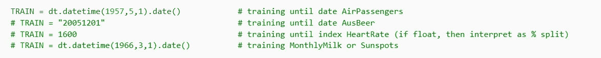

作者图片

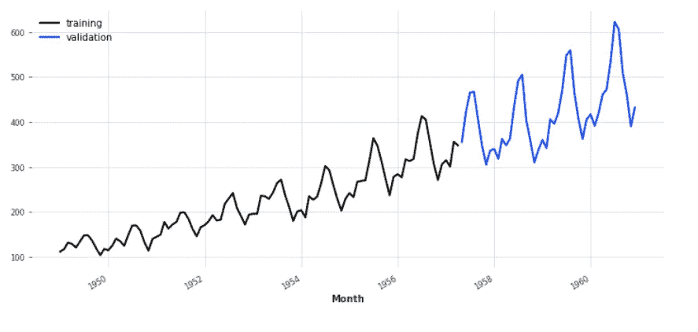

作者图片

# 4.预测

## 4.1 预测功能

我们定义了一个函数 *eval_model()* ，它将一次采用一种预测方法(并按顺序采用几个模型)并将它应用于源数据。

*eval* 函数使模型符合训练数据集，然后计算估价期的预测值(第 9-10 行)。这两行完成了大多数方法的所有预测工作。

对于*简单的*预测方法，我们需要插入一些额外的代码(第 13 -19 行)。天真的预测实际上由两种方法组成，我们将这七种方法联系在一起:天真的漂移预测和天真的季节性预测。

*   *漂移*方法只取第一个和最后一个观察值，并在它们之间画一条线。
*   *季节性*方法预测 K 步之前出现的值(其中 K 代表季节性，例如 K=12 代表月份)将在 K 步之后再次出现。
*   通过结合*漂移*和*季节性*，我们得到了一个过于简单，或者说是天真的预测，即这两种模式将继续重演。

*eval_model()* 代码单元中的第三部分计算由 *Darts* 提供的预测精度指标，并将它们收集到字典 *res_accuracy* 中。

我们将预测值 *forecast* 和指标 *res_accuracy* 组合在一个列表 *results* 中，并将该列表返回给调用预测函数的代码。

## 4.2 五种预测方法

在列表*模型*中，我们准备了所有*飞镖*模型的列表，我们希望为这些模型运行预测函数 *eval_models()* 。我们将当前的练习限制为五种可选方法。

列表理解*模型预测*遍历*模型*列表，并将每个模型馈送给 *eval_model()* 函数。

在 *model_predictions* 将模型传递给评估函数之前，我们需要为预测器设置它们特定的开始参数。为了这个目的。我们为每个预测者定义一个*模型*变量 *m_xxx* 。

***4.2a 天真预测***

***naive drift()****方法不需要参数。它只是从序列中取出第一个和最后一个值，并在它们之间画一条直线趋势线。*

*它的近亲， *NaiveSeasonal()* ，要求一个季节性参数，在我们的例子中 K = 12 个月。*Darts check _ seasonity()*函数已经确定了季节性 *mseas* ，12 在我们的例子中，我们将把它分配给 k。*

****4.2b******指数平滑****

*像 SARIMA 一样，指数平滑需要知道季节性的顺序， *mseas* ，我们已经在上面计算过了。*

****4.2c 先知****

****Facebook Prophet***模型可以在其设置中采用可选的季节性参数，但也可以自行确定季节性。*

****4.2d SARIMAX****

*对于 ***萨里玛*** ，我跳过了一个额外的环，着眼于平稳性和差异性。额外的代码在*飞镖*中并不是绝对必要的，但它是一个故障保护装置。*

*省道包裹*PMMA*自动 arima 法。它的调整算法应该在开始网格搜索其他超参数之前应用假设测试来确定差分的适当顺序。*

**Darts* 通过 *pmdarima* 为分析师提供了两种平稳性测试的选择，ADF 和 KPSS，默认为 KPSS。但是 ADF 和 KPSS 可能在差异的必要性上存在分歧，而且这种情况并不少见。ADF 检验和 KPSS 检验都不会孤立地证实或破坏平稳性。*

*KPSS 和 ADF 测试结果有四种可能的组合:*

*   *如果 KPSS 和 ADF 同意序列是平稳的(KPSS 有高 p 值，ADF 有低 p 值):认为它是平稳的。没必要区别它。*
*   *ADF 找到一个单位根；但是 KPSS 发现这个序列在一个确定的趋势附近是稳定的(ADF 和 KPSS 具有高 p 值)。那么，该序列是趋势稳定的，需要消除趋势。区别它。或者，转型可能会让它摆脱这种趋势。*
*   *ADF 找不到单位根；但是 KPSS 声称它是不稳定的(ADF 和 KPSS 具有低 p 值)。那么，这个序列是差分平稳的。区别它。*
*   *如果 KPSS 和 ADF 一致认为序列是非平稳的(p 值低的 KPSS；具有高 p 值的 ADF):认为它是非平稳的。区别它。*

*由于*飞镖*和 *pmdarima* 运行单一选择测试来确定差异的顺序，所以我在*飞镖*方法之前用*两个*测试来捕捉 ADF 和 KPSS 不一致的实例。较高的测试结果被传递给自动 ARIMA 方法。[萨里玛预测和平稳性:当时间序列像鸭子一样呱呱叫|走向数据科学](/when-a-time-series-only-quacks-like-a-duck-10de9e165e)*

*我还应用了季节性、OCSB 和 CH 的 pmdarima 检验。这些人有时也会对季节差异的必要顺序产生分歧。我们使用更高的建议。*

*我们保持 *pmdarima 的*默认方法*逐步*搜索不变，该方法使用 Hyndman 和 Khandakar 在 2008 年开发的算法([自动时间序列预测:R(r-project.org)](https://cran.r-project.org/web/packages/forecast/vignettes/JSS2008.pdf)的预测包)。该算法比全网格搜索快得多，因为它避免了在搜索空间中处理许多无意义的参数元组。[运动裤被解开——时间序列分析|走向数据科学](/sweatpants-unleashed-the-data-science-of-an-ignominious-garment-2e0c006202b0)*

****4.2eθ****

*最后，我们准备了 ***Theta*** 预测器，这是一种简单而有效的快速方法，建立在带漂移的指数平滑的基础上。*

*“Theta 方法自 1999 年问世以来，是过去二十年中最成功的单变量时间序列预测方法。该方法的成功已经在需求预测、营销和供应链预测环境中的应用中得到证明；尽管如此，在广泛的盲法经验预测竞赛中的成功也涉及到来自金融、经济和广泛应用的数千个系列，因此被证明是可推广的。θ法的优越性能最初在 2000 年的 M3 完井中得到了证明[用 Theta 方法预测— Nikolopoulos —主要参考著作—威利在线图书馆](https://onlinelibrary.wiley.com/doi/abs/10.1002/9781118445112.stat08270)*

*[用θ法进行短期负荷预测(e3s-conferences.org)](https://www.e3s-conferences.org/articles/e3sconf/pdf/2019/10/e3sconf_pe2019_01004.pdf)*

*在将 *Darts 的*微调过的 *theta* 预测器传递给我们的 *eval_model()* 函数之前，我们通过搜索 100 个可选值来调整 Theta 参数。*

****4.2f 运行预测****

*list comprehension*model _ predictions*将我们想要尝试的预测器传递给 model_eval()函数，该函数开始处理它们。*

*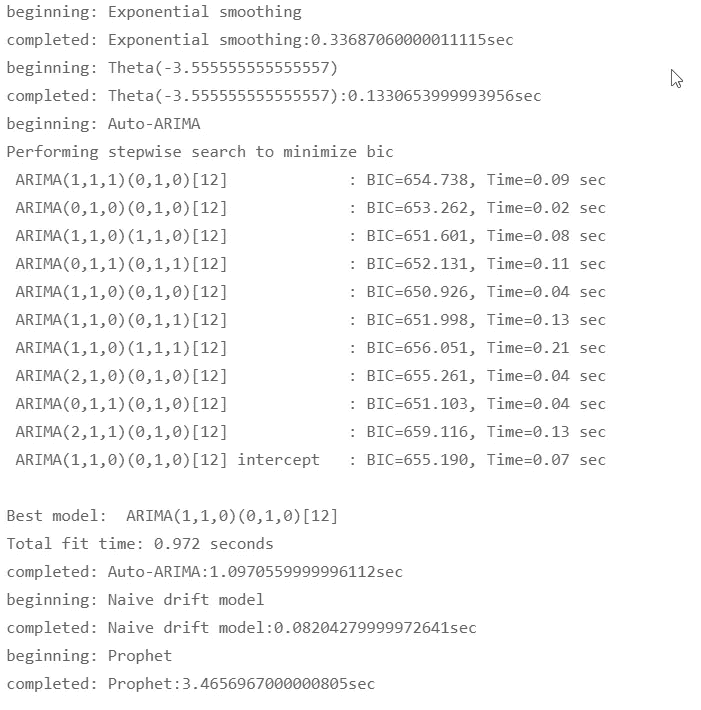*

*作者图片*

***4.3 预测方法的准确性***

**eval_model()* 函数返回每个模型的预测值和精确度指标。*

*我们在数据框架 *df_acc 中收集所有五个模型的指标。**

*我们应用于数据框架的 *.style.highlight* 方法强调了哪些预测显示出最佳和最差的准确性。*

*如果你想知道为什么 R 平方在下面显示的数据帧中显示负值:虽然 R 平方本身是一个介于 0 和 1 之间的非负数，但我颠倒了它的符号，以使它的方向，颜色编码的指导与表中的其他指标对齐。对于所有其他误差测量指标，较低的值是首选。对于 R 平方，值越高越好。在这个特定的表视图中，R 平方前面的负号使它成为“越低越好”的指标，就像其他指标一样。否则，数据帧中最小和最大值的颜色编码将会混淆。*

*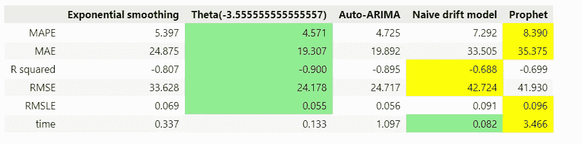*

*作者图片*

*在我们的例子中，Theta 方法在 ARIMA 之前一英寸穿过终点线:他们的度量标准相差很小。然而，Theta 方法只用了 0.13 秒就赢得了比赛，而 ARIMA 用了 1.1 秒。*

*尽管 Prophet 的处理时间是 nave 模型的 42 倍，但 Prophet 的准确性与 nave 模型几乎没有区别，如果按平均绝对百分比误差或平均绝对误差排名，Prophet 甚至排在 nave 预测的后面。根据 R 平方的测量，Prophet 和 nave 解释了时间序列中不到 70%的运动，而 Theta 和 SARIMA 反映了 90%的准确性。*

## *4.4 绘制预测结果*

*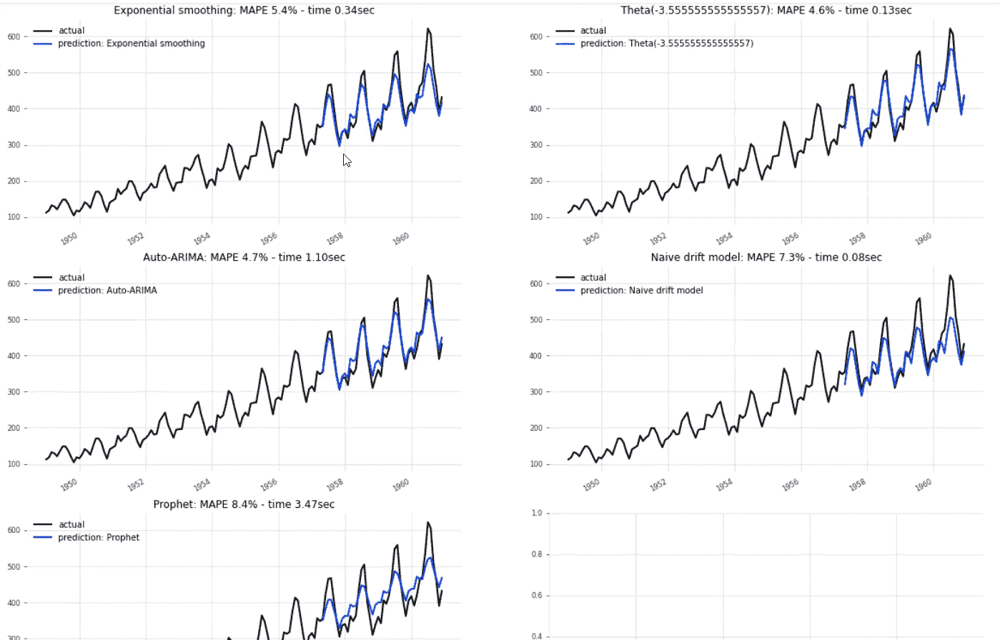*

*作者图片*

*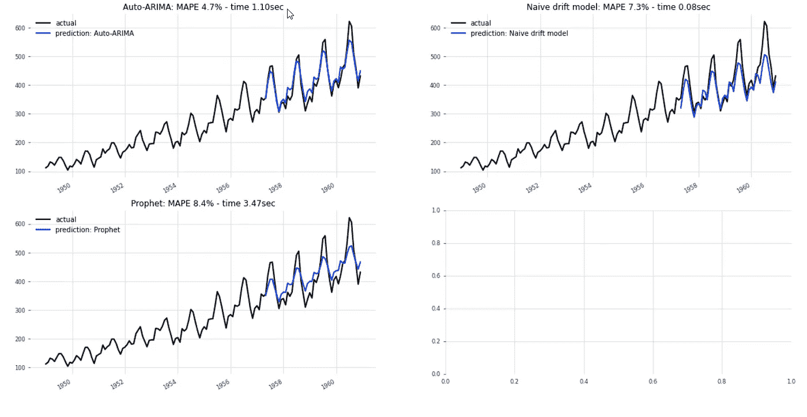*

*作者图片*

*天真的预测者(右上)和预言者(右下)的图表显示了偏见。蓝色的预测线系统地低估了黑色的实际观测值，比其他三个预测者更低估。*

***4.5 残差诊断***

**Darts* 专注于预测值、预测图和准确性指标。但是它很少提供诊断假设测试。为了增加一些精确性，我们引入了对来自 *statsmodels 的白噪声残差的 *Ljung-Box* 测试；*和*常态测试*来自 *scipy* 。*

*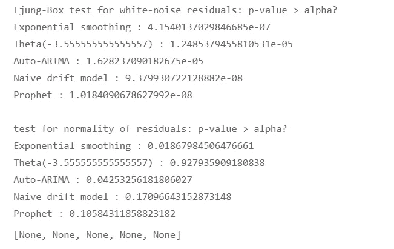*

*作者图片*

*Ljung-Box 测试研究残差是否代表白噪声。较低的 p 值(均远低于 0.05)表明它们不是，这意味着所有五个预测模型都未能识别一些本可用于提高预测准确性的信号。下面的诊断图表明一些季节性被排除在预测之外。*

*如果正态性检验的 p 值较低，则不会使预测结果无效。但是指数平滑预测的低值意味着我们不能依赖它的置信区间。*

**Darts* 提供了有用的*plot _ residuals _ analysis()*函数来可视化三个支线剧情中的残差。让我们将每个预测者的残差输入到绘图函数中。*

*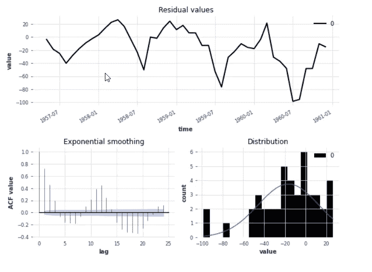*

*作者图片*

***指数平滑:***

*   *上面的 ACF 图显示了残差中的季节性信号，峰值和谷值以 12 个月为一个周期波动。这表明该模型在其预测中没有包括所有的季节性，并且在残差中浪费了一些信号。*
*   *直方图显示了偏差:其峰值不在零均值处，但它是左偏的。负均值-16.6 表示指数平滑器倾向于错误估计同一方向的观测值。*

*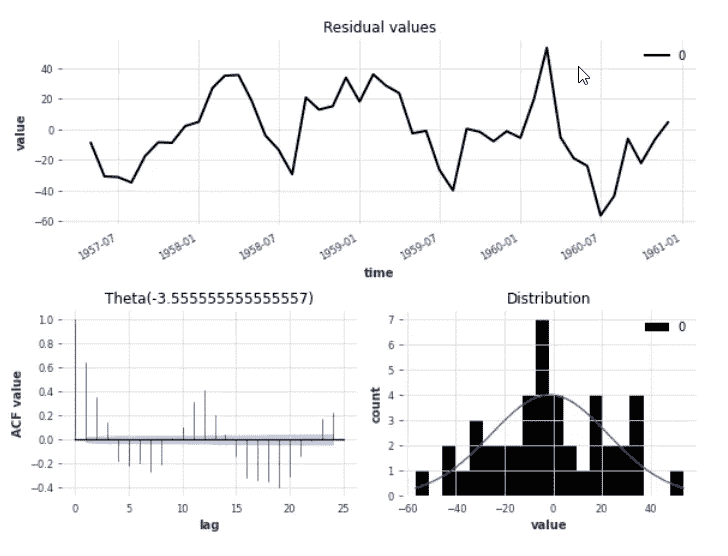*

*作者图片*

***θ法:***

*   *ACF 相关图表明，Theta 也没有将所有的季节性完全纳入其预测中。*
*   *直方图看起来比指数平滑的情况更好，平均值接近 0，意味着接近零的偏差。*

*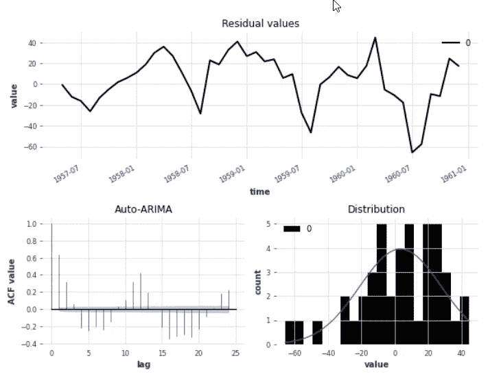*

*作者图片*

***萨里玛:***

*   *此外，SARIMA 预报员留下了一些季节性信号，而不是将其纳入其预测中。*
*   *直方图看起来有点右偏，正平均值接近 3.5，但比指数平滑器的负平均值反映的大偏差要小得多。*

*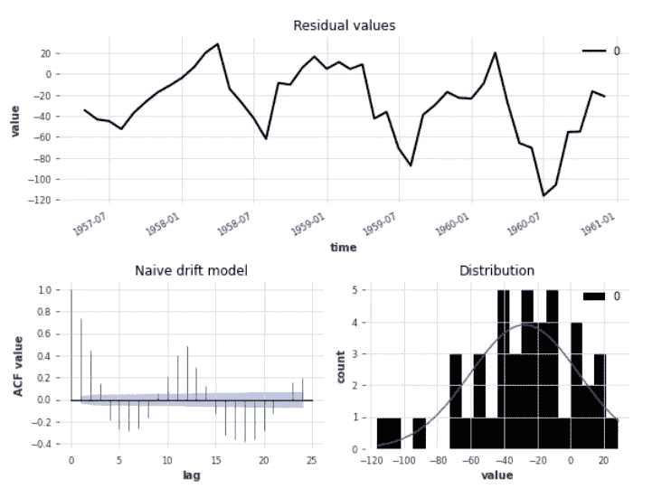*

*作者图片*

***天真的预测:***

*   *像其他预测者一样，未确定的季节性被搁置在桌面上。*
*   *直方图显示了显著的负偏差，钟形曲线峰值在-30 左右，而不是 0。天真漂移通过从实际观察值的起点到终点画一条线来计算趋势。在其他模式中，它不会抓住一个加速的趋势。*

*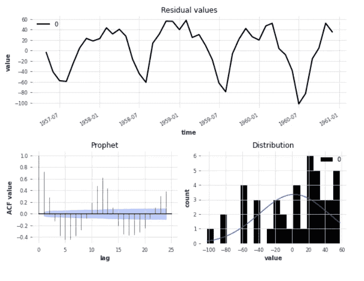*

*作者图片*

***先知:***

*   *ACF:其他模型显示的峰值和谷值并不太陡。预言者残差看起来似乎更多的季节性信号已经被放弃了。这可以解释为什么先知的 MAPE 和 RMSE 的错误几乎是西塔和萨里玛的两倍。*
*   *直方图显示了小的正偏差，平均值接近 3。这条曲线看起来不太正常，因为它有很长的尾巴，但是我们上面的测试证实了正态性，p 值为 0.10。所以置信区间会比较准确。直方图本身很容易被误解。*

*完整的 Jupyter 笔记本可以在 GitHub 上下载: [h3ik0th/Darts: Python Darts 时间系列教程(github.com)](https://github.com/h3ik0th/Darts)*

**所有图片:由作者提供，作为公共领域**