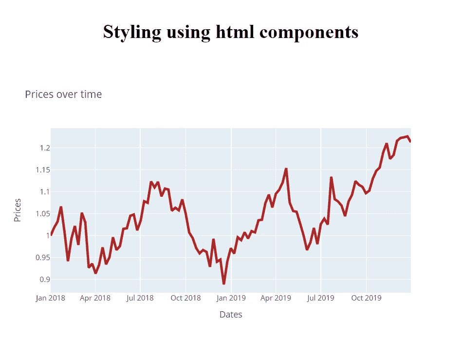
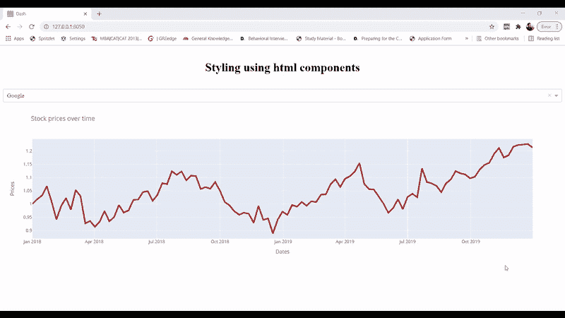

# Dash for 初学者:创建交互式 Python 仪表盘

> 原文：<https://towardsdatascience.com/dash-for-beginners-create-interactive-python-dashboards-338bfcb6ffa4?source=collection_archive---------2----------------------->

## 创建没有 html、css 和 Js 的交互式 python 仪表盘

*形象由* [*freepik*](https://www.freepik.com/) 设计

> ***想学 plotly Dash？*** *阅读下面这篇文章，对 plotly Dash 有一个基本的了解。通过遵循官方文档或查看我的* [***Udemy 课程***](https://www.udemy.com/course/plotly-dash-python-dashboards/?referralCode=52F212C8E028698C04C7) *获得深入理解，在该课程中，您将学习如何创建成熟的交互式仪表盘。*

# **什么是破折号？**

Dash 是 plotly 为创建交互式 web 应用程序而创建的 python 框架。Dash 是写在 Flask，Plotly.js 和 React.js 上面的，有了 Dash，你不用为了创建交互式仪表盘而学习 HTML，CSS 和 Javascript，你只需要 python。Dash 是开源的，使用该框架构建的应用程序可以在 web 浏览器上查看。

> 有了 Dash，你不必为了创建交互式仪表盘而学习 HTML、CSS 和 Javascript，你只需要 python。

# **仪表板的积木**

Dash 应用程序由两个构件组成:

1.  布局
2.  复试

布局描述了应用程序的外观和感觉，它定义了图形、下拉列表等元素以及这些元素的位置、大小、颜色等。Dash 包含 **Dash HTML 组件**，使用它们我们可以创建 HTML 内容并设置样式，比如标题、段落、图片等等。使用 **Dash 核心组件**创建图形、下拉菜单、滑块等元素。

回调用于为 dash 应用程序带来交互性。例如，我们可以使用这些函数来定义单击按钮或下拉菜单时发生的活动。

# **使用破折号的布局**

现在，让我们看看如何使用 plotly Dash 创建基于 web 的布局。在开始布局之前，让我们安装一些必需的包。(你可以使用 Anaconda Spyder，一个 python 开发环境**，**来运行代码。)

现在，我们将导入 dash 包，html 类的 dash_html_components，graph、dropdown 等元素的 dash_core_components，以及用于创建图表和读取股票价格数据集的 plotly 包。

(在下面的代码中)我们正在使用 dash 包初始化我们的 dash 应用程序。然后，我们正在读取 2018 年至 2019 年不同公司的股价数据。我们正在创建 stock_prices 函数，该函数返回 Google 股票价格的折线图。

(在上面的代码中)在第 16 行，我们使用 html Div 组件设置我们的布局，这是一种包装器，布局的元素(标题、图表)将在其中创建。Div 组件包含诸如 id(元素的唯一标识符)、style(用于设置宽度、高度、颜色等)和 children(相当于方括号，布局元素在其中初始化)之类的参数。

在 html 的子组件中。Div)我们正在使用 H1 函数在第 17 行创建 html H1 标题。在函数内部，我们设置函数的唯一 id(id = ' H1 ')、children 属性，使用它我们将标题和样式属性的文本设置为一个字典，在字典中我们设置样式，例如文本居中对齐，将上下边距设置为 40 像素。在第 21 行，我们使用 dash core component (dcc)来创建 graph，其中我们设置了 graph 的 id 和 figure 参数，它等于返回 plotly figure 对象的函数调用(stock_pricest())。

为了查看我们的应用程序，我们需要像在 Flask 中一样运行我们的 web 服务器。记住 Dash 是建立在烧瓶顶部的。

在运行应用程序时，您会看到应用程序运行在 [http://127.0.0.1:8050/](http://127.0.0.1:8050/) 上，这是您的本地服务器。复制这个网址并粘贴到你的浏览器中，你会看到下面的可视化。

现在，我们将使用 dash 核心组件创建一个下拉列表。使用下拉菜单，我们将能够选择谷歌，苹果或亚马逊的股票。

下拉列表是使用 Dropdown()函数创建的，该函数有以下参数

1.  id —下拉列表的唯一标识符。
2.  options 将“标签”(下拉列表中可见的文本)和“值”(dash 用于与回调通信)设置为键值对。
3.  值—下拉列表的默认选择。

# **Dash 中的回调:让它互动**

现在，让我们来看看如何创建回调函数来连接下拉列表和股价折线图。

使用@app.callback()初始化回调，后面是函数定义。在这个函数中，我们定义了在改变下拉列表的值时会发生什么。

让我们看看回调函数中的参数:

1.  **输出**:用于定义布局内的组件，当回调函数(graph_update())返回某个对象时，这些组件将被更新。输出函数有两个参数——1)component _ id 定义了我们希望用函数 graph_update 更新的组件的 id。我们想更新 dcc 中的股票价格图表。因此，我们将组件 id 设置为“line_plot”，这是我们的图形组件的 id。2)组件属性定义了将要更新的组件的属性，即 dcc 的图形属性。我们布局中的图形。
2.  **输入**:用于定义组件，其值的变化将触发回调。输入函数也将 component_id 和 component_property 作为参数。我们希望回调基于 dropdown 值的变化而被触发，所以我们将 component_property 设置为 dropdown 的' value '属性。请注意，输入是在列表中定义的。

输入函数的组件属性是下拉列表的“值”,作为函数 graph_update 中的参数。在函数内部，我们创建散点图并返回 fig 对象，该对象被传递给 dcc 的 fig 属性。图形使用回调的输出函数。

# **把所有的东西放在一起**

现在让我们在下面的代码中将布局、下拉菜单和回调函数结合起来:

下图显示了 dropdown 值的变化如何更新我们的股价折线图。

# 摘要

因此，我们研究了如何使用 plotly Dash 创建交互式仪表盘。首先，我们使用 html 组件和 dash 核心组件创建布局。然后，我们添加下拉菜单，并使用回调将它与股价折线图连接起来。

> *再次分享课程链接—* [***Plotly Dash 课程***](https://www.udemy.com/course/plotly-dash-python-dashboards/?referralCode=52F212C8E028698C04C7) *，以防你想了解更多关于 Plotly Dash 的知识。*

首先，你应该在收件箱里收到我的帖子。 [***在这里做*** *！*](https://anmol3015.medium.com/subscribe) *其次，如果你喜欢体验媒介的自己，可以考虑通过* [***报名会员***](https://anmol3015.medium.com/membership) *来支持我和其他千千万万的作家。它每个月只需要 5 美元，它极大地支持了我们，作家，而且你也有机会通过你的写作赚钱。*

## 使用 Plotly Dash 创建的仪表板示例！

<https://anmol3015.medium.com/python-dashboard-using-plotly-dash-example-1-b9cc94039b5e>  <https://anmol3015.medium.com/python-dashboard-using-plotly-dash-example-2-f4fc0cc8a24c> 