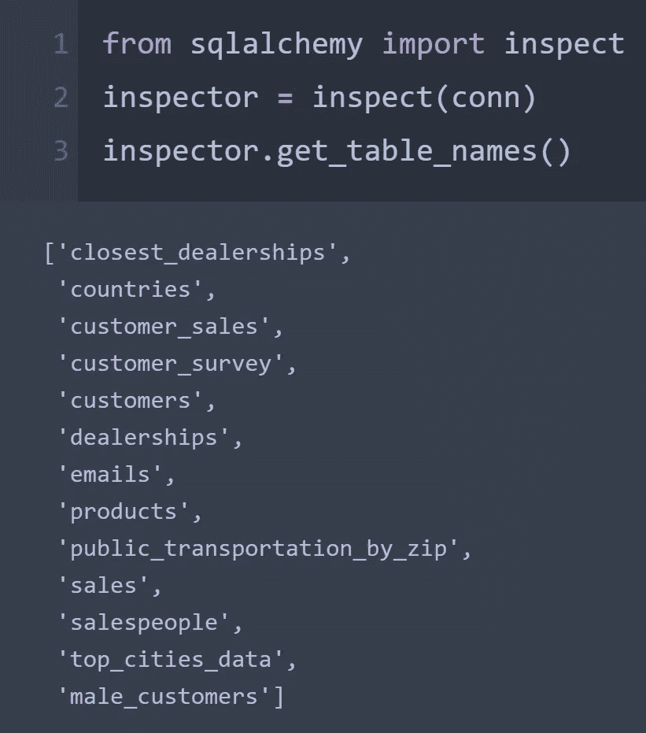
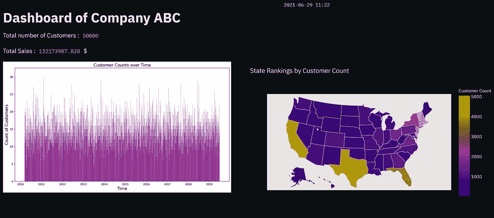
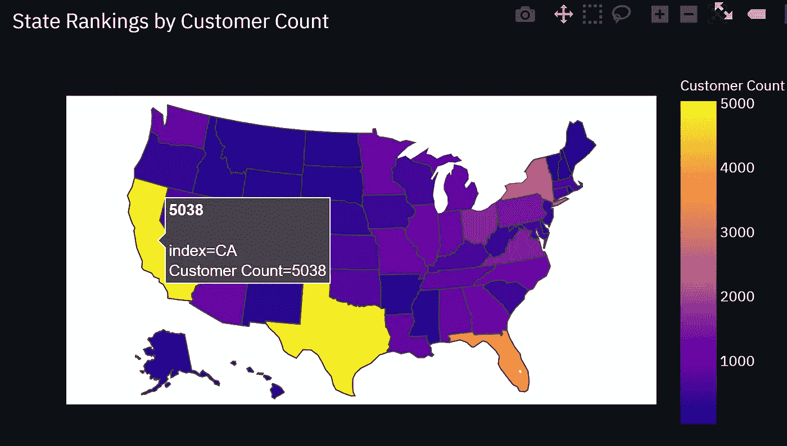
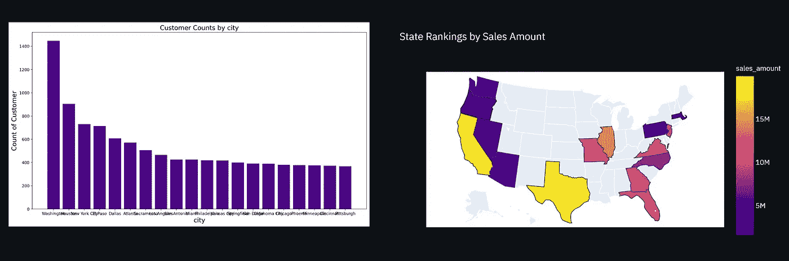
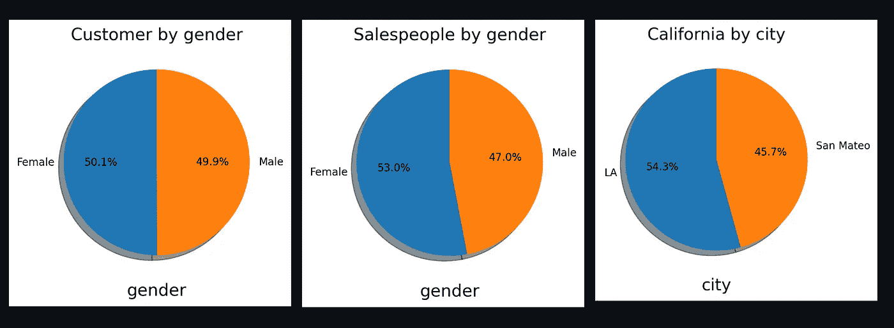
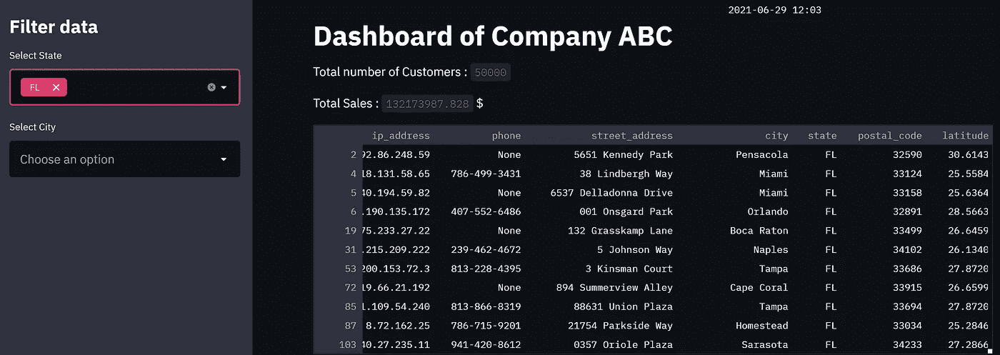

# 仪表板使用 Streamlit 和来自 SQL 数据库的数据

> 原文：<https://towardsdatascience.com/dashboard-using-streamlit-with-data-from-sql-database-f5c1ee36b51?source=collection_archive---------7----------------------->

## 来自客户和销售数据的交互式仪表板

作者图片

> **简介**

Streamlit 是用于创建强大仪表板的最新 python 库之一，也是用于机器学习和数据科学团队的开源框架。它可以用非常简单的编码生成符合行业标准且具有视觉吸引力的仪表板。我使用 streamlit 创建了一个销售仪表板，其中包含交互式视觉效果和来自 SQL 数据库的数据。在本文中，我将通过使用 SQL 获取数据来完成仪表板的创建。

> **连接数据库**

本文中的演示使用了一个名为“sqlda”的包含客户和销售数据的 SQL 数据库。这是一个 postgres 数据库。Sqlalchemy 用于创建连接和获取表。

从 python 接口调用常规的 SQL 查询来获取数据。首先，我们需要知道数据库中所有表的名称。

作者图片

似乎有几个表，但我们只对客户和销售数据感兴趣。使用常规 SQL 查询调用以下两个表来获取数据。

仪表板的界面可以被分割成我们想要的列数。例如，假设我们希望将顶行分成两列。左栏将显示仪表板的标题，右栏将显示当前日期和时间。

> **仪表盘配置**

我们还可以在两个 streamlit 占位符中显示客户总数和销售额。侧边栏可以用来过滤数据。

为自定义绘图定义了条形图、饼图和其他必要的时间序列图。

为了绘制一个互动的情节，我使用了 plotly express。当用户将光标悬停在绘图上时，它可以显示相关数据。出于演示的目的，我使用了美国州地图，然后使用由彩色多边形组成的 cloropleth 地图将州数据与地图关联起来。

然后，我们向仪表板添加更多的行，以可视化的形式显示更多的数据。有一点可以注意到，我们可以在 python 的这个接口内部执行 SQL 查询。我已经执行了两个 SQL 表的内部连接，并提取了要绘制的数据。

> **最终仪表板**

整个代码块用。py 扩展名。在 anaconda promt 中，默认目录被更改为。py 文件并执行以下命令，其中 *Streamlit-01.py* 是文件名。

> 细流运行细流-01.py

它将提供应用程序运行的主机地址。当到达主机地址时，将创建以下仪表板。

作者图片

该地图由 plotly express 生成，当光标位于任何状态时，都会显示与之相关的数据。

作者图片

此处显示了仪表板的其余部分。

作者图片

作者图片

侧边栏可以用来过滤数据。选中后，相关数据将显示在仪表板中。

作者图片

> **结论**

在本文中，我演示了使用 streamlit 创建交互式仪表板。从 SQL 数据库获取数据，并执行 SQL 查询以获得感兴趣的数据。Plotly express 是一种动态可视化数据的好方法。streamlit 与 sql 和 plotly express 的结合确实可以增强仪表板的健壮性。