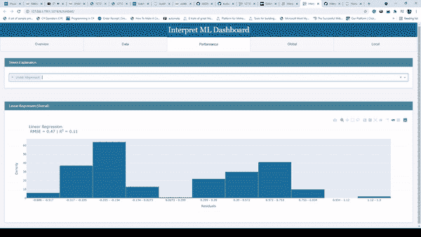
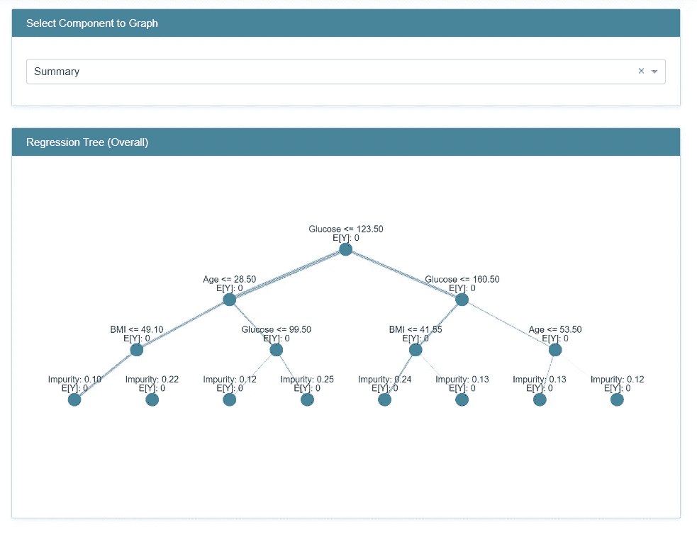
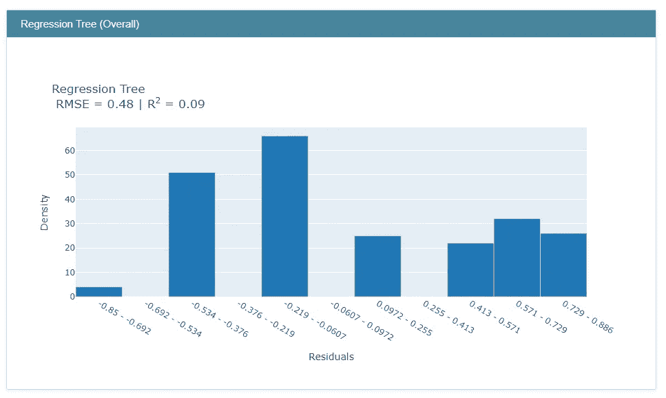
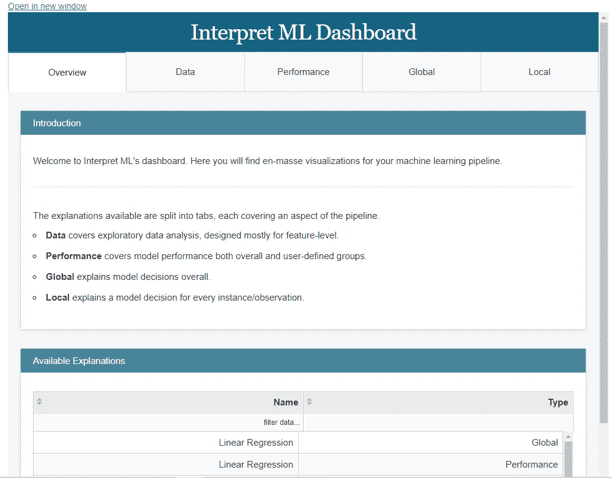

# 用于解释和比较机器学习模型的仪表板

> 原文：<https://towardsdatascience.com/dashboards-for-interpreting-comparing-machine-learning-models-ffcfb4c05152?source=collection_archive---------34----------------------->

## 使用解释为机器学习模型创建仪表板



来源:作者

随着技术的发展，数据科学领域有多种机器学习算法，这使得用户/数据科学家/ML 工程师很难根据他们正在处理的数据集选择最佳模型。

比较不同的模型可以是选择最佳模型的一种方式，但这是一个耗时的过程，我们将创建不同的机器学习模型，然后比较它们的性能。这也是不可行的，因为大多数模型是黑盒，我们不知道模型内部发生了什么，以及它将如何表现。简而言之，由于模型的复杂性和模型是黑箱，我们不知道如何解释模型。

如果不解释模型，就很难理解模型是如何表现的，以及它将如何根据提供给它的新数据来表现。这不仅有助于我们理解模型预测，也有助于我们理解它是如何达到特定预测的。

下一个大问题是如何解释这些模型和它们的行为，让我来解释一下。如果我告诉你，你不仅可以解读不同的模型，还可以比较它们的性能，会怎么样？是的，现在我们可以看到黑盒的内部，了解模型在做什么。

Interpret 是一个开源的 python 库，用于解释和分析不同机器学习模型的性能。在本文中，我们将看到如何使用 interpret 进行模型解释和可视化模型性能。在这篇文章的最后，我们将会探索一些非常酷的东西，我确信这对所有的数据科学家/ML 工程师等都非常有帮助。敬请关注。

让我们开始吧…

# 安装所需的库

像任何其他 python 库一样，我们将使用 pip 安装来安装解释器。下面给出的命令将执行安装。

```
pip install interpret
```

# 导入所需的库

接下来，我们将导入将在本文中使用的所有必需的库。我们将装载熊猫，翻译等。

```
import pandas as pd
from interpret import show
from interpret.glassbox import RegressionTree
from sklearn.model_selection import train_test_split
```

我们将在需要时导入其他功能进行解释。

# 创建机器学习模型

现在我们将创建一个机器学习模型，我们将使用解释库来解释它。如您所见，我们已经导入了用于加载数据和拆分数据的库，所以让我们首先加载数据，然后创建模型。我们将在这里使用的数据集是著名的糖尿病数据集。

```
df = pd.read_csv("Diabetes.csv")
X_train, X_test, y_train, y_test = train_test_split(df[['Pregnancies', 'Glucose','BloodPressure','SkinThickness','Insulin','BMI','DiabetesPedigreeFunction','Age']], df['Outcome'], test_size=0.3)#Creating Model
reg_tree = RegressionTree(random_state=42)
reg_tree.fit(X_train, y_train)
```

我们稍后将创建更多的模型，以便我们可以比较不同的模型。

# 使用可视化进行口译和绩效分析

现在，我们将解读模型，并观察模型的性能。

```
#global interpretation
reg_tree_global = reg_tree.explain_global(name='Regression Tree')
show(reg_tree_global)
```



来源:作者

这是模型的整体性能，您可以从下拉列表中选择不同的功能，以查看它在模型中的使用情况。这是模型的全局解释，对于局部解释(个体预测)我们可以使用局部函数。

现在让我们想象一下模型的性能。

```
reg_tree_perf = RegressionPerf(reg_tree.predict).explain_perf(X_test, y_test, name='Regression Tree')show(reg_tree_perf)
```



性能(来源:作者)

# 奖金

有趣的部分来了，在奖金部分，我将向您展示如何创建一个模型仪表板，其中包含您创建的所有模型的解释和性能。这不是很有趣吗，让我们看看我们怎么做？

为了创建仪表板，首先，让我们再创建一个模型，然后我们将分析仪表板中两个模型的性能和解释。

```
from interpret.glassbox import LinearRegression
lin_reg = LinearRegression(random_state=42)
lin_reg.fit(X_train, y_train)
lin_reg_perf = RegressionPerf(lin_reg.predict).explain_perf(X_test, y_test, name='Linear Regression')
lin_reg_global = lin_reg.explain_global(name='Linear Regression')
```

在创建了模型之后，有趣的部分来了，我们将创建一个只有一行代码的仪表板，用于分析两个模型的性能，并使用它来解释模型。

```
show([ lin_reg_global, lin_reg_perf, reg_tree_global, reg_tree_perf])
```



模型仪表板(来源:作者)

您可以通过单击仪表板上方的链接在新窗口中打开此仪表板。下面的视频探索了仪表板的不同部分。


仪表板(来源:作者)

您可以看到我们为模型解释和性能比较创建了一个仪表板是多么容易。

继续尝试不同的数据集和不同的机器学习模型。请在回复部分告诉我您的意见。

本文是与 [Piyush Ingale](https://medium.com/u/40808d551f5a?source=post_page-----ffcfb4c05152--------------------------------) 合作完成的。

# 在你走之前

***感谢*** *的阅读！如果你想与我取得联系，请随时联系我在 hmix13@gmail.com 或我的* [***LinkedIn 简介***](http://www.linkedin.com/in/himanshusharmads) *。可以查看我的*[***Github***](https://github.com/hmix13)**简介针对不同的数据科学项目和包教程。还有，随意探索* [***我的简介***](https://medium.com/@hmix13) *，阅读我写过的与数据科学相关的不同文章。**