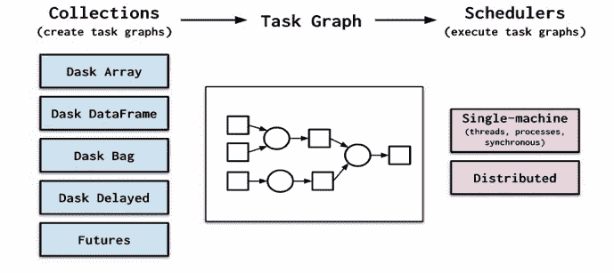
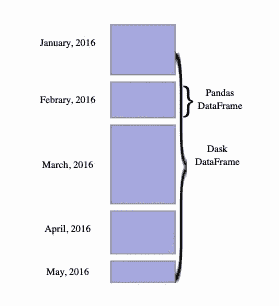
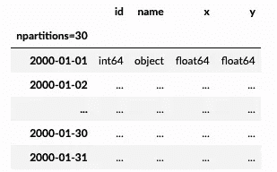
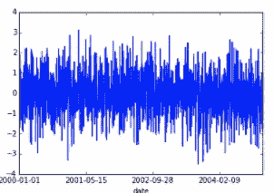

# Dask:并行计算的可扩展解决方案

> 原文：<https://towardsdatascience.com/dask-a-scalable-solution-for-parallel-computing-d1d962f227f6?source=collection_archive---------16----------------------->

## 再见，熊猫，你好，达斯克！


由 [Brian Kostiuk](https://unsplash.com/@briankost?utm_source=unsplash&utm_medium=referral&utm_content=creditCopyText) 在 [Unsplash](https://unsplash.com/s/photos/processor?utm_source=unsplash&utm_medium=referral&utm_content=creditCopyText) 上拍摄

对于数据科学家来说，大数据是一个不断增长的信息库，为了轻松处理输入和处理，强大的系统始终是一项未完成的工作。为了处理大量的数据流入，我们要么不得不求助于购买更快的服务器，这增加了成本，要么更聪明地工作，并为并行计算建立像 Dask 这样的定制库。

在我介绍 Dask 作为并行计算解决方案之前，让我们先了解一下这种类型的计算在大数据世界中意味着什么。根据定义，[并行计算](https://en.wikipedia.org/wiki/Parallel_computing)是一种计算类型，其中许多计算或进程的执行是同时进行的。简而言之，并行计算是指通过共享内存连接的多个任务执行者(或处理器)完成计算任务。

# 试用土星云(支持者)

如果你用云 GPU 免费试用 Dask，那就去看看[土星云](https://saturncloud.io/)。这是一个可扩展、灵活的数据科学平台，负责所有设置，有免费和企业选项，当然还有多集群 Dask 支持！

# **那么 Dask 是什么？**

Dask 用 Python 编写，是一个灵活的、用于并行计算的开源库。它允许开发人员与其他社区项目(如 NumPy、Pandas 和 scikit-learn)协作构建他们的软件。Dask 为分析提供高级并行性，实现规模化性能。

Dask 由两部分组成:用于优化计算和大数据集合的动态任务调度，如并行数组、数据帧和列表，它们将 NumPy、Pandas 或 Python 迭代器等公共接口扩展到大内存或分布式环境，这些环境运行在动态任务调度器之上。

# **为什么是 Dask？**

有人可能会说，有了其他同类产品，有必要改用 Dask。但是，Dask 最大的优点是易于采用。Python 用户对它很熟悉，它使用现有的 API 和数据结构，使它成为在 NumPy、Pandas、scikit-learn 和 Dask-powered 等效软件之间切换的无缝过程——所有这一切都不需要您完全重写代码或重新培训软件以进行扩展。



除了提供熟悉度，Dask 还:

灵活:使用 Dask 允许定制工作负载并与其他项目集成。

Native: Dask 通过分布式计算和对 PyData 栈的访问来扩展 Python。

敏捷:低开销、低延迟和最小串行化，Dask 为数字算法提供了令人印象深刻的敏捷

可扩展:Dask 可以在具有 1000 个内核的集群上纵向扩展，也可以在笔记本电脑上通过单个进程进行设置和运行！

响应:考虑到交互式计算，Dask 提供快速反馈和诊断来帮助人类。

# **Dask 和大数据**

虽然 Pandas 是一个强大的数据计算和分析工具，但 Dask 凭借其处理大于本地 RAM 的数据量[的能力取得了成功，而不会使系统不堪重负或影响性能。它提供了一种简单的方法来处理 Python 中的大量数据，而不需要额外的努力。](/why-and-how-to-use-dask-with-big-data-746e34dac7c3)

鉴于[在家工作的现状](https://syal-anuj.medium.com/work-from-home-how-an-ergonomic-desk-setup-will-save-you-from-medical-bills-post-quarantine-cad7201633d4)，不得不跟随更大的机器并不完全是灵活工作的定义。这就是 Dask 在笔记本电脑上无缝运行的能力和便利性发挥作用的地方。它与 conda 或 pip 一起轻松安装，并将方便的数据集的大小从“适合内存”扩展到“适合磁盘”。


*照片由*[*imgix*](https://unsplash.com/@imgix?utm_source=unsplash&utm_medium=referral&utm_content=creditCopyText)*[*Unsplash*](https://unsplash.com/s/photos/big-data?utm_source=unsplash&utm_medium=referral&utm_content=creditCopyText)*

*正如[所解释的](https://docs.dask.org/en/latest/)，Dask 具有弹性、数据本地性和低延迟。轻松的过渡让您可以在单机集群和中等规模集群之间无缝切换。对于那些已经熟悉 Pandas 的人来说，Dask 在性能和可伸缩性方面似乎是一个扩展。您可以根据需要在 Dask 数据框架和 Pandas 数据框架之间切换，以进行任何数据转换和操作。*

# *示例| Dask 数据框架基础*

*Dask 数据帧协调许多 Pandas 数据帧，沿着一个索引进行分区。*

**

1.  *创建随机数据集*

```
***import** **dask**
**import** **dask.dataframe** **as** **dd**
df = dask.datasets.timeseries()Output: **Dask DataFrame Structure:***
```

**

*2.从平面文件加载数据
我们可以使用`read_csv`函数将多个`csv`文件加载到`dask.dataframe`中。这支持文件名上的 [globbing](https://en.wikipedia.org/wiki/Glob_%28programming%29) ，并将它们按字母顺序排序。这导致所有数据的单个`dask.dataframe.DataFrame`*

```
***import** **dask.dataframe** **as** **dd**

df = dd.read_csv('employee_*.csv').set_index('id')*
```

*3.执行转换*

*Dask dataframe 遵循 [pandas](http://pandas.pydata.org/) api。我们可以进行算术、归约、选择等运算...与熊猫使用的语法相同。主要的区别是我们需要给最终结果添加一个`.compute()`。*

```
*df2 = df[df.y > 0]
df3 = df2.groupby('name').x.std()
df3Output:
Dask Series Structure:
npartitions=1
    float64
        ...
Name: x, dtype: float64
Dask Name: sqrt, 157 tasks*
```

*呼叫计算*

```
*computed_df = df3.compute()
computed_df*
```

*4.绘图输出*

```
***from** **matplotlib** **import** pyplot **as** plt
%matplotlib inlinedf.A.compute().plot()Output:*
```

**

# *示例|使用真实数据集(NYCTaxi 2013)*

*2014 年，Chris Whong 成功提交了一份 FOIA 请求，以获取 2013 年纽约市所有出租车的记录。*

```
*#Downloading and unzip
!wget  [https://storage.googleapis.com/blaze-data/nyc-taxi/castra/nyc-taxi-2013.castra.tar](https://storage.googleapis.com/blaze-data/nyc-taxi/castra/nyc-taxi-2013.castra.tar)#Reading data from files**import** **dask.dataframe** **as** **dd**
df = dd.from_castra('tripdata.castra/')
df.head()#Setup progress bar
**from** **dask.diagnostics** **import** ProgressBar
progress_bar = ProgressBar()
progress_bar.register()*
```

## *示例计算*

```
*#**How many passengers per ride?**
df.passenger_count.value_counts().compute()**#How many medallions on the road per day?** %matplotlib inline
df.medallion.resample('1d', how='nunique').compute().plot()*
```

# ***下一站…达斯克***

*现在我们知道了为什么 Dask 是一个流行的并行计算解决方案，接下来要做的就是开始使用它。一旦您从 Conda、pip 或 source 安装了 Dask，您还可以根据特定的功能添加可选的依赖项。您可以在这里找到受支持的可选依赖项列表[。](https://docs.dask.org/en/latest/install.html)*

*总之，如果你是大数据的粉丝，Dask 会让你爱上处理海量大数据。性能、可伸缩性、熟悉性和核心的流行 Python，使 Dask 成为数据量大的项目的有益工具。*

# *试用土星云(支持者)*

*如果你用云 GPU 免费试用 Dask，那就去看看[土星云](https://saturncloud.io/)。这是一个可扩展、灵活的数据科学平台，负责所有设置，有免费和企业选项，当然还有多集群 Dask 支持！*

# *寻找更多细节*

*在 youtube 上观看这个视频*

*YouTube[上](https://youtu.be/jJcnqtHuCSI) [Anuj Syal](https://www.youtube.com/channel/UCO8XsgcjqArk_mAd1VGBMfg) 的 Dask Bye Bye Pandas 入门*

# *在 Linkedin 和 Twitter 上关注我*

*如果你对类似的内容感兴趣，点击 Medium 上的“关注”按钮，或者在 Twitter 和 Linkedin 上关注我*