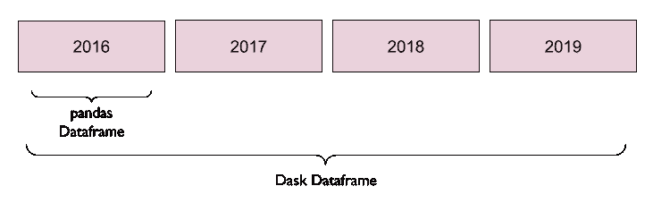
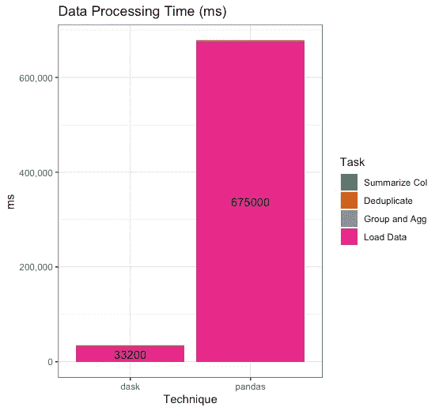
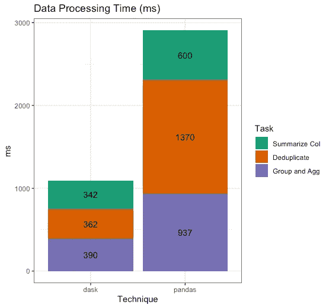

# 达斯克和熊猫:没有太多数据这回事

> 原文：<https://towardsdatascience.com/dask-and-pandas-theres-no-such-thing-as-too-much-data-284763348459?source=collection_archive---------33----------------------->


[兰斯·安德森](https://unsplash.com/@lanceanderson?utm_source=unsplash&utm_medium=referral&utm_content=creditCopyText)在 [Unsplash](https://unsplash.com/s/photos/panda?utm_source=unsplash&utm_medium=referral&utm_content=creditCopyText) 上拍照

你喜欢熊猫，但讨厌当你达到你的内存或计算资源的极限吗？Dask 让您有机会将 pandas API 用于分布式数据和计算。在本文中，您将了解它的实际工作原理，如何自己使用它，以及为什么它值得转换。

> 声明:我是 Saturn Cloud 的一名高级数据科学家，Saturn Cloud 是一个支持使用 Dask 对 Python 进行简单并行化和扩展的平台。如果你想了解更多关于土星云的信息，请登陆[网站 www.saturncloud.io](https://www.saturncloud.io) 访问我们。

# 介绍

Pandas 是 PyData 工具包中最受欢迎的工具——它使用一个用户友好且健壮的 API，使难以置信的多样化数据分析和数据科学任务成为可能。PyPi 表明熊猫在世界各地每周被下载大约 500 万次。

然而，在一些需要大量数据或异常资源密集型计算的情况下，pandas 确实难以满足数据科学家的需求。在本文中，我们将讨论一些领域，用户可能会发现 Dask 工具有助于扩展现有的 pandas 功能，而不需要更改语言或 API。

# 熊猫挑战

在我们继续之前，让我们同意:熊猫是可怕的。这个讨论实际上是关于我们如何增加熊猫的现有能力，而不是用超高能力的 Dask 功能取代所有的熊猫。如果 pandas 适用于您面前的用例，并且是完成工作的最佳方式，我们建议您使用它！

但是让我们来看看你可能需要更多的情况。

# 数据太大，无法保存在内存中(内存限制)

如果您发现自己对可能有用的数据进行了大量的缩减采样，因为它对于您正在使用的单台机器来说太大了，那么这就是您的问题。如果您可以在不将整个数据集加载到单个机器的内存中的情况下运行您的作业，那么您可以使用所有有价值的数据来完成您的工作。Dask 有真正巧妙的基础设施来实现这一点，我们稍后会讨论。

# 串行运行时计算过于密集/缓慢(计算约束)

如果您正在运行计算任务几个小时甚至几天，或者发现 pandas 的计算非常慢，以至于您正在考虑完全离开 Python 生态系统，那么这就是您面临的问题。不用抛弃 Python，让你的代码适应全新的语言或框架，比如 C++或 Java，你可以用与 pandas 基本相同的 API 应用一些 Dask 原则，并看到你的工作异常加速。我们将解释如何实现。

# 达斯克是什么？

那么，当熊猫不能满足你的需求时，我们建议你做些什么呢？达斯克。

Dask 是一个支持 Python 代码并行化的开源框架。这可以适用于各种 Python 用例，不仅仅是数据科学。Dask 设计用于单机设置和多机集群。您不仅可以对 pandas 使用 Dask，还可以对 NumPy、scikit-learn 和其他 Python 库使用 Dask。如果你想了解更多关于 Dask 可以派上用场的其他领域，有一个很棒的网站可以解释所有这些。

使用 Dask 时，您会改变计算机处理 Python 命令的方式。具体来说，在 pandas 的正常使用中，当您调用一个函数时，您的 Python 解释器会立即计算结果。创建汇总、进行计算或应用过滤器。这意味着 Python 需要所有必要的数据和足够的内存来完成这些计算。这也意味着 Python 将一次执行一个步骤，如果你有多个函数要运行，它们将连续运行。因此，你受限于你的机器可用的内存，并且**只要每一步或计算一个接一个地运行，整个工作将会花费很长时间。**

如果您的数据非常小，并且不同的计算都可以快速运行，或者矢量化，那么这可能就很好了！那熊猫就够了。但是，如果您正在处理非常大或复杂的数据，或者数据中的许多组，您可能会发现您想要同时运行多个计算。

Dask 的核心优势是一个被称为“懒求值”或“延迟”函数的原理。用 Dask 延迟一项任务可以将一组转换或计算排队，以便它可以在以后并行运行。这意味着 Python 不会评估所请求的计算，除非被明确告知。这与其他类型的函数不同，其他类型的函数在被调用时会立即进行计算。许多非常常见和方便的函数被移植到 Dask 中，这意味着它们将是懒惰的(延迟计算),甚至不需要你去问。

您可以从这种情况过渡到类似这样的情况，在可能的情况下，您的任务可以并行运行，从而极大地提高您的工作速度和效率。


[图片:Dask docs](https://dask.org/) [链接](https://github.com/dask/dask-org/tree/master/images)

# 它是如何工作的

您可以用多种不同的方式合并 Dask 功能，而无需进行重大更改或重构大量代码。

# 使用延迟功能

您可能喜欢使用 Dask 原生函数，或者您可能更喜欢在您的自定义函数上使用@dask.delayed 修饰:请参见[我们的数据科学家惰性评估指南](https://www.saturncloud.io/s/the-eager-data-scientists-guide-to-lazy-evaluation-with-dask/)以了解更多信息！

使用这些函数，您可以创建可以稍后并行运行的延迟对象，从而提高作业的效率和速度。

# 使用 Dask 数据帧延迟

另一个选择是从你的熊猫数据帧对象切换到 [Dask 数据帧](https://docs.dask.org/en/latest/dataframe.html)，这就是我们在这里要做的。这将您从一个离散的数据对象带到一个分布式的数据对象，这意味着您的数据现在可以存储在跨越工作集群的分区中。从字面上看，Dask 数据帧是分布在集群中的一组较小的 pandas 数据帧。



您可以通过以下方式创建 Dask 数据帧:

*   转换现有的 pandas 数据帧:`[dask.dataframe.from_pandas()](https://docs.dask.org/en/latest/dataframe-api.html#dask.dataframe.from_pandas)`
*   将数据直接装入 Dask 数据帧:例如，`[dask.dataframe.read_csv()](https://docs.dask.org/en/latest/dataframe-api.html#dask.dataframe.read_csv)`

除了 csv， [Dask 还内置了读取许多不同类型数据存储的功能](https://docs.dask.org/en/latest/dataframe-api.html)，包括 Parquet 和 JSON。

# 但是，这有什么好处呢？

Dask 数据帧是分布式的，因此需要在数据帧上运行的计算将分布在集群中，分散了工作负载。此外，您永远不需要一台机器来保存整个数据集，因为数据本身就是为您分发的。另外，如果你从许多不同的 CSV 或其他文件中加载数据，只需告诉 Dask 文件夹路径，它就会将所有这些文件加载到一个单独的 Dask 数据框架中，作为你的分区！

在一个命令中将整个文件夹加载到 Dask 数据帧中的示例:

> *CPU 时间:用户 202 毫秒，系统 39.4 毫秒，总计 241 毫秒
> 墙时间:33.2 秒*

这之所以如此之快，部分是因为它像其他 Dask 函数一样是延迟求值的。我们使用`.persist()`方法实际上强制集群从 s3 加载我们的数据，因为否则它只会等待我们的指令，甚至开始移动数据。我们说`.persist()`之后，它是并行运行的，所以即使加载数据还是挺快的。

相比之下，如果我们将文件夹中的文件作为常规的 pandas 数据帧加载，所有数据必须一次移动一个文件，以便我们有一个对象来处理:

> *CPU 时间:用户 2 分 13s，系统:40 s，总计:2 分 53s
> 挂壁时间:11 分 15s*

它可以工作，但是计算速度太慢了！这一切都是在假设我们的机器可以在内存中保存数据的情况下进行的，但这并不总是正确的。

# 关于……

在小数据量时，一些 pandas 函数比 Dask 更快——随着数据量的增长，Dask 的优势变得明显。这也是为什么为了小数据坚持熊猫可能往往是正确选择的原因之一。

如果您不确定您的工作是否需要 Dask，请评估您在数据加载上花费了多少时间，计算速度有多慢，以及您是否必须走捷径(缩减采样或更改分析)来完成工作。所有这些都表明你已经超出了熊猫和/或你的单机的能力。

现在，让我们来看看您可能在 pandas 中执行的一些非常常规的数据操作任务，看看它们在 Dask 中是什么样子的。我们使用的是大数据，所以这里我们应该看到 Dask 给了我们速度优势。

# 分组依据

这里我们将按列对数据进行分组，然后提取另一列的平均值。与 Dask 不同的是，我们在最后运行`.compute()`,以便触发计算并返回结果。

```
%%time
pandasDF.groupby("PULocationID").trip_distance.mean()
```

> *CPU 时间:user 938 ms，sys: 0 ns，total:938 ms
> Wall time:937 ms
> PULocationID
> 1 1.586234
> 2 8.915472
> 3 7.342070
> 4 2.695367
> 5 24.207739
> 名称:trip_distance，长度:263，dtype*

```
%%time
daskDF.groupby("PULocationID").trip_distance.mean().compute()
```

> *CPU 时间:user 36.1 ms，sys: 3.52 ms，total:39.6 ms
> Wall time:390 ms
> PULocationID
> 1.0 1.586234
> 2.0 8.915472
> 3.0 7.342070
> 4.0 2.695367
> 5.0 24.207739【T25*

# 分析列

如果我们不分组，而只计算一列的单个度量呢？同样的情况，我们的代码片段与添加的`.compute()`相同。

```
%%time
pandasDF[["trip_distance"]].mean()
```

> *CPU 时间:user 515 ms，sys 86 ms，total 601 ms
> Wall time:600 ms
> trip _ distance 3.000928
> d type:float 64*

```
%%time
daskDF[["trip_distance"]].mean().compute()
```

> *CPU 时间:user 43.4 ms，sys: 0 ns，total:43.4 ms
> Wall time:342 ms
> trip _ distance 3.000928
> d type:float 64*

# 删除重复项

这里有一个我们非常需要的，并且需要查看所有的数据删除副本。达斯克也有这个！

```
%%time
pandasDF.drop_duplicates("passenger_count")
```

> *CPU 时间:用户 1.5 s，sys: 232 ms，总计:1.73 s
> 墙时间:1.73 s*

```
%%time
daskDF.drop_duplicates("passenger_count").compute()
```

> *CPU 时间:user 24.1 ms，sys 2.22 ms，total 26.4 ms
> Wall 时间:362 ms*

# 性能比较

那么，这些例子给我们留下了什么？我们使用相同的数据和几乎相同的代码，但我们只是添加了一个 Dask 集群来增强功能。



首先，我们可以看一下我们的步骤的运行时图——但是因为 pandas 需要 11 分钟来加载数据，所以它压倒了其他所有的东西！我们的数据处理几乎看不到，就像处理运行时顶部的一个小暗条。

因此，我们可以忽略加载时间，我们可以很容易地看到熊猫的加载时间要糟糕得多，然后我们可以看到我们尝试的单个处理任务。



总的来说，通过使用 Dask，我们节省了 11 分钟的加载时间，并减少了一半以上的数据处理时间。

> 总运行时间，熊猫:677，907 毫秒
> 总运行时间，dask: 34，294 毫秒

Pandas 比 dask 多花 20 倍的时间来运行整个任务流水线。

# 费用

不过话说回来，你可能会想，“熊猫是免费的吧？”当然，在你的笔记本电脑上熊猫是免费的(尽管我认为你的时间是宝贵的！)但是在 dask 上运行这个并不像你想象的那么昂贵。此外，我们在 EC2 机器上运行我们的测试用例，所以 pandas 在这个例子中也不是自由的。

所有机器都是 r 5.2x 大型实例。[在撰写本文时，AWS EC2 的价格为每小时 0.504 美元。](https://aws.amazon.com/ec2/pricing/on-demand/)每个处理器包含 8 个 VCPU 内核和 64 GB 内存。

**Dask 集群:**
(1 个客户端+ 4 个集群工作器)
5 个 r 5.2 x 大型 x 0.504 美元/小时= 2.52 美元/小时* 34，294 毫秒(又名 0.0095 小时)= $0.02394

**熊猫:**
1 r5 . 2x large x 0.504 美元/小时= 0.504 美元/小时* 677907 毫秒(又名 0.1883 小时)= $0.0949

所以，在这个任务中，Dask 花了我们 2 美分，而熊猫花了我们 9 美分。

如果我们加上土星云向 Dask 方收取的溢价，公平地说，算术看起来是这样的。

**土星 Dask 集群:**
(1 个客户端+ 4 个集群工作器)
5 个 r 5.2 x 大型 x 1.14 美元/小时= 5.70 美元/小时* 34，294 毫秒(又名 0.0095 小时)= $0.05415

**熊猫:**
1 r5 . 2x large x 0.504 美元/小时= 0.504 美元/小时* 677907 毫秒(又名 0.1883 小时)= $0.0949

Dask 仍然只需 5 美分，比我们为熊猫支付的 9 美分还要低。速度快 20 倍，价格便宜一半——不错！

# 结论

我希望这篇文章有助于揭开从 pandas 切换到 Dask 的某些方面的神秘面纱，并鼓励读者为自己的数据科学尝试这些令人兴奋的新技术！Dask 集群比你想象的要便宜，运行速度特别快，而且如果你已经了解 pandas 和其他 PyData 库的话，非常容易使用。如果你想亲自体验一下，土星云有免费试用版！