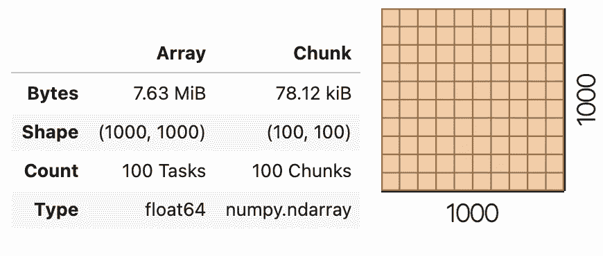
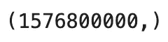
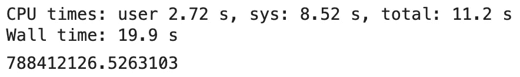
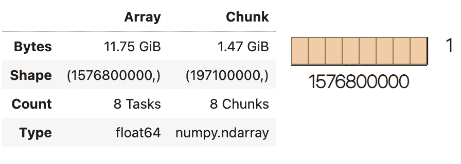
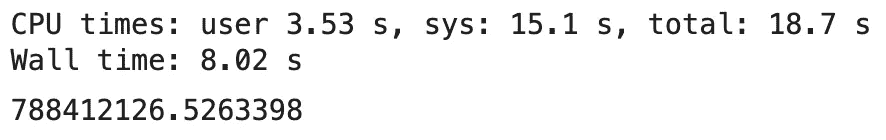
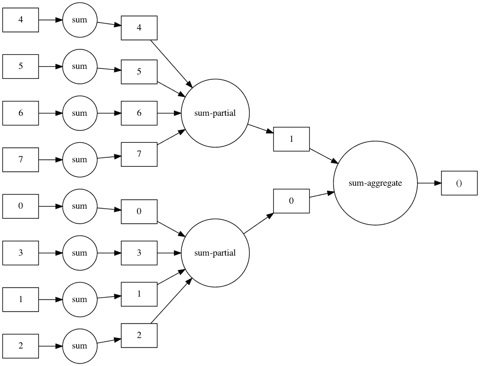

# Dask 阵列—如何轻松并行化 Numpy

> 原文：<https://towardsdatascience.com/dask-arrays-how-to-parallelize-numpy-with-ease-b33d7e9dcb59?source=collection_archive---------22----------------------->

## 并行性和块—这就是如何将 20GB 的文件放入 16GB 的 RAM 中


在 [Unsplash](https://unsplash.com/?utm_source=unsplash&utm_medium=referral&utm_content=creditCopyText) 上 [WrongTog](https://unsplash.com/@wrongtog?utm_source=unsplash&utm_medium=referral&utm_content=creditCopyText) 的照片

所以你在数据科学的支柱——Numpy 和 Pandas——方面有一些经验，但仅此而已吗？

当您的 16GB RAM 机器上有一个 20GB 的数据集要分析时会发生什么？当然，有一种方法可以成块处理数据，但这不是最优雅的选择。

达斯克前来救援。

如果您想学习 Python 和 Dask 的并行基础，可以看看我以前的文章:

</dask-delayed-how-to-parallelize-your-python-code-with-ease-19382e159849>  

这篇文章的结构如下:

*   Numpy 怎么了？
*   将 Numpy 数组转换为 Dask 数组
*   用 Dask 阵列实现并行计算
*   结论

# Numpy 怎么了？

如果你处理小数据集，什么都不用做。当出现以下情况时，事情会失控:

*   数据集大小超过可用 RAM
*   计算时间变得非常长

显而易见，第一个原因与第二个原因紧密相连。

当学习一些技术或在一个项目开始时，处理小数据集几乎总是这样。重要的是要考虑长远——提前知道未来六个月的痛点是什么。

这就是 Dask 数组比 Numpy 提供更多灵活性的地方。它们使您能够处理大于内存的对象，并且由于并行化，计算时间显著加快。

在这一点上，Dask 数组不能处理线性代数运算，所以在某些情况下这可能是一个障碍。请继续关注他们的[文档页面](https://docs.dask.org/en/latest/array.html#:~:text=Dask%20Array%20implements%20a%20subset,blocked%20algorithms%20using%20Dask%20graphs.)，因为一些“疑难杂症”可能会在未来得到解决。

现在让我们探索如何将 Numpy 数组转换成 Dask 数组。

# 将 Numpy 数组转换为 Dask 数组

Dask 数组只不过是排列成网格的 Numpy 数组的简单集合。转换过程要求您使用 Dask 的`from_array()`方法。

下面的代码片段导入两个库，创建一个 1000x1000 Numpy 的随机数数组，然后将其转换为 Dask 数组:

```
import numpy as np
import dask.array as dax_np = np.random.rand(1000, 1000)
x_dask = da.from_array(x_np, chunks=len(x_np) // 10)
```

这就是你要做的一切！如您所见，`from_array()`方法至少接受两个参数:

*   `x` —要转换的 Numpy 数组
*   `chunks` —指定如何分块数组。我们已经决定使用四个相同的块，但是你有许多选择。在笔记本中执行`da.from_array?`以查看更多选项

请记住，您应该使用整数来表示块大小，因此需要整数除法(`//`)。

如果您要查看`x_dask`变量内部的内容，您会看到以下内容:



图 1—Dask 数组的内容(图片由作者提供)

如您所见，整个 1000x1000 阵列占用大约 7.6MB 内存，单个区块的大小为 100x100，因为我们使用了 10 个大小相同的区块。每个块都是一个简单的 Numpy 数组。

您现在已经知道了转换过程是如何工作的，所以让我们来探究您应该使用 Dask 的真正原因。

# 用 Dask 阵列实现并行计算

**免责声明**:我在一台 16GB 内存的机器上运行下面的代码。如果你有更少，你可能会得到内存错误。减少`data`变量的初始大小以适应(例如，将 50 改为 20)。

想象一下，由于某种原因，您有一个 50 年期间每秒采样一次的数据序列(忽略闰年)。以下代码片段可用于构建这样一个数组:

```
data = np.random.rand(50 * 365 * 24 * 60 * 60)
data.shape
```

阵列形状如下图所示:



图 2 —数据数组形状(图片由作者提供)

如您所见，它非常庞大，因此执行任何操作都需要时间。让我们通过计算总和并跟踪运行时间来证明这一点:

```
%%timedata_sum = data.sum()
data_sum
```

结果显示如下:



图 3 —使用 Numpy 计算总和(图片由作者提供)

不是最快的——简单的算术题只需要 20 秒。达斯克可以做得更好。下面的代码片段将`data`数组转换成一个有 8 个块的 Dask 数组:

```
import dask.array as dadata_dask = da.from_array(data, chunks=len(data) // 8)
data_dask
```

这是里面的内容:



图 4 —大型 Dask 数组的内容(图片由作者提供)

如您所见，该数组非常大(几乎有 12GB)。这就是为什么即使计算最简单的运算也需要时间。理论上，将数组分成 8 个大小相等的 1.5GB 块并行处理听起来是个更好的主意。

您可以使用以下代码片段来计算数组总和:

```
%%timesum_dask_dag = data_dask.sum()
sum_dask = sum_dask_dag.compute()
sum_dask
```

请记住，在调用`compute()`之前，Dask 不会进行任何计算。我决定将结果存储在两个独立的变量中——第一个变量保存计算图，第二个变量存储计算结果。

下面是上面代码的输出:



图 5 —使用 Dask 计算总和(图片由作者提供)

现在你已经知道了——仅仅通过使用 Dask 而不是 Numpy，速度就提高了大约 2.5 倍。如果您感兴趣，可以使用下面的代码来可视化计算图:

```
sum_dask_dag.visualize(rankdir=’LR’)
```

下面是相应的可视化:



图 6 — Dask 计算图(图片由作者提供)

让我们在下一部分总结一下。

# 结论

总结一下——如果您知道数据不会变得更大，或者您需要 Dask 不支持的函数，Numpy 可以很好地工作。在其他任何情况下，Dask 都可能是明显的赢家。

我们今天只触及了皮毛，因为大部分数据分析都是用熊猫做的。这就是 Dask 数据帧发挥作用的地方，我们将在几天后探讨它们。

敬请关注。

喜欢这篇文章吗？成为 [*中等会员*](https://medium.com/@radecicdario/membership) *继续无限制学习。如果你使用下面的链接，我会收到你的一部分会员费，不需要你额外付费。*

<https://medium.com/@radecicdario/membership>  

# 了解更多信息

*   [我作为数据科学家卖掉我的 M1 Macbook Pro 的三大理由](/top-3-reasons-why-i-sold-my-m1-macbook-pro-as-a-data-scientist-abad1226f52a)
*   [如何使用 Cron 调度 Python 脚本——您需要的唯一指南](/how-to-schedule-python-scripts-with-cron-the-only-guide-youll-ever-need-deea2df63b4e)
*   [Dask 延迟—如何轻松并行化您的 Python 代码](/dask-delayed-how-to-parallelize-your-python-code-with-ease-19382e159849)
*   [如何使用 Python 创建 PDF 报告—基本指南](/how-to-create-pdf-reports-with-python-the-essential-guide-c08dd3ebf2ee)
*   [即使没有大学文凭也要在 2021 年成为数据科学家](/become-a-data-scientist-in-2021-even-without-a-college-degree-e43fa934e55)

# 保持联系

*   关注我的 [Medium](https://medium.com/@radecicdario) 了解更多类似的故事
*   注册我的[简讯](https://mailchi.mp/46a3d2989d9b/bdssubscribe)
*   在 [LinkedIn](https://www.linkedin.com/in/darioradecic/) 上连接