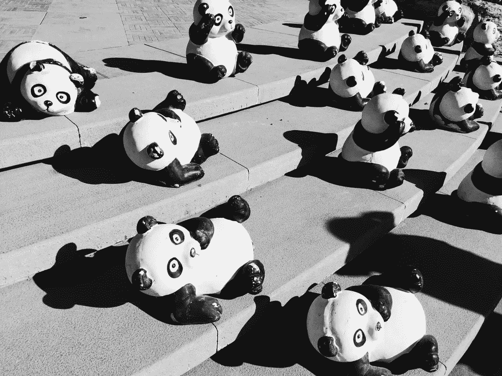
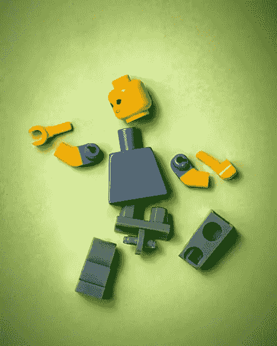

# Dask DataFrame 不是熊猫

> 原文：<https://towardsdatascience.com/dask-dataframe-is-not-pandas-6764da1291b1?source=collection_archive---------43----------------------->

## 在 Dask 中重用熊猫代码的最可靠方法

照片由 CHUTTERSNAP 在 Unsplash 上拍摄

本文是关于实践中使用 Dask 的系列文章的第二篇。本系列的每一篇文章对初学者来说都足够简单，但是为实际工作提供了有用的提示。本系列的下一篇文章是关于循环的 [*并行化，以及其他令人尴尬的使用 dask.delayed*](https://saturncloud.io/blog/dask-for-beginners/) 的并行操作

# 诱惑

您从中等大小的数据集开始。熊猫做得很好。然后数据集变得更大，因此您可以扩展到更大的机器。但是最终，您会耗尽机器上的内存，或者您需要找到一种方法来利用更多的内核，因为您的代码运行缓慢。此时，用 Dask 数据帧替换 Pandas 数据帧对象。

不幸的是，这通常不会很顺利，会导致很大的痛苦。要么是你在 Pandas 中依赖的一些方法，在 Dask DataFrame 中没有实现(我看着你呢，MultiIndex)，方法的行为略有不同，要么是对应的 Dask 操作失败，内存耗尽，崩溃(我以为不应该这样！)

Pandas 是一个为单个 Python 进程设计的库。分布式算法和数据结构是根本不同的。在 Dask 数据帧方面可以做一些工作来使它变得更好，但是单个进程和机器集群总是具有非常不同的性能特征。你不应该试图对抗这个基本的真理。

Dask 是扩展你的熊猫代码的好方法。天真地把你的熊猫数据帧转换成 Dask 数据帧不是正确的做法。根本的转变不应该是用 Dask 替换 Pandas，而是重用您为单个 Python 进程编写的算法、代码和方法。这是本文的核心。一旦你重构了你的思维，剩下的就不是火箭科学了。

**有 3 种主要的方法来利用 Dask 的熊猫代码**

*   把你的大问题分解成许多小问题
*   使用分组依据和聚合
*   使用 dask 数据帧作为其他分布式算法的容器。

# 把你的大问题分解成许多小问题

照片由杰克逊在 Unsplash 煨

一个 Dask 数据帧由许多熊猫数据帧组成。它非常擅长从那些熊猫数据帧中移动行，这样你就可以在你自己的函数中使用它们。这里的一般方法是用拆分-应用-组合的模式来表达你的问题。

*   将您的大数据集(Dask 数据框架)分割成较小的数据集(Pandas 数据框架)
*   对这些较小的数据集应用函数(Pandas 函数，而不是 Dask 函数)
*   将结果组合回一个大数据集(Dask DataFrame)

分割数据有两种主要方法:

`set_index`将使 Dask 数据帧的一列成为索引，并根据该索引对数据进行排序。默认情况下，它会估计该列的数据分布，以便最终得到大小均匀的分区(Pandas DataFrames)。

`shuffle`将把行组合在一起，这样具有相同 shuffle 列值的行就在同一个分区中。这与 set_index 不同，它没有对结果进行排序的保证，但是您可以按多个列进行分组。

一旦你的数据被分割，`map_partitions`是一个很好的方法来应用一个函数到每一个熊猫数据帧，然后把结果组合回一个 Dask 数据帧。

## 但是我有不止一个数据框架

没问题！只要你能以同样的方式分割计算中使用的所有 Dask 数据帧，你就可以开始了。

# 具体的例子

我不打算在这里写代码。我们的目标是在这个理论描述的基础上放一个具体的例子，以获得一些关于这个看起来像什么的直觉。想象一下，我有一个股票价格的 Dask 数据框架，和另一个分析师对相同股票估计的 Dask 数据框架，我想知道分析师是否正确。

1.  编写一个函数，获取一只股票的价格，分析师对同一只股票的估计，并计算它们是否正确。
2.  调用股票价格上的`set_index`,按股票行情自动收录器排序。你得到的数据帧的`index`将会有一个`divisions`属性，描述哪个滚动条在哪个分区。(B 之前的所有内容都在第一分区中，B 和 D 之间的所有内容都在第二分区中，依此类推..).使用股票价格`divisions`调用分析师估计的 Dask 数据框架上的`set_index`。
3.  使用`map_partitions`将函数应用于两个 Dask 数据帧的分区。该函数将查看每个数据帧中的分笔成交点，然后应用您的函数。

# 使用按聚合分组

图表由 Hugo Shi 绘制

Dask 拥有 Pandas [GroupBy 聚合算法](https://saturncloud.io/docs/reference/dask_groupby_aggregations/)的优秀实现。实际的算法相当复杂，但是我们在[文档](https://saturncloud.io/docs/reference/dask_groupby_aggregations/)中有详细的描述。如果你的问题符合这种模式，你就有好医生了。Dask 在 GroupBy 聚合的实现中使用了树缩减。您可能需要调整两个参数，`split_out`控制您的结果在多少个分区中结束，`split_every`帮助 dask 计算树中有多少层。这两个参数都可以根据数据的大小进行调整，以确保不会耗尽内存。

# 使用 Dask 作为其他算法的容器

照片由 Rinson Chory 在 Unsplash 上拍摄

许多库都内置了 Dask 集成。`dask-ml`与`scikit-learn`融合。`cuML`有很多常见 ML 算法的多节点多 GPU 实现。`tsfresh`用于时间序列。`scanpy`用于单细胞分析。`xgboost`和`lightgbm`都有启用 Dask 的并行算法。

# 结论

Dask 是扩展熊猫代码的好方法。天真地把你的熊猫数据帧转换成 Dask 数据帧不是正确的做法。但是 Dask 让你很容易将大数据集分解成小部分，并利用现有的 Pandas 代码。

*最初发布于 2021 年 10 月 26 日*[*https://Saturn cloud . io*](https://saturncloud.io/blog/dask-is-not-pandas/)*。*