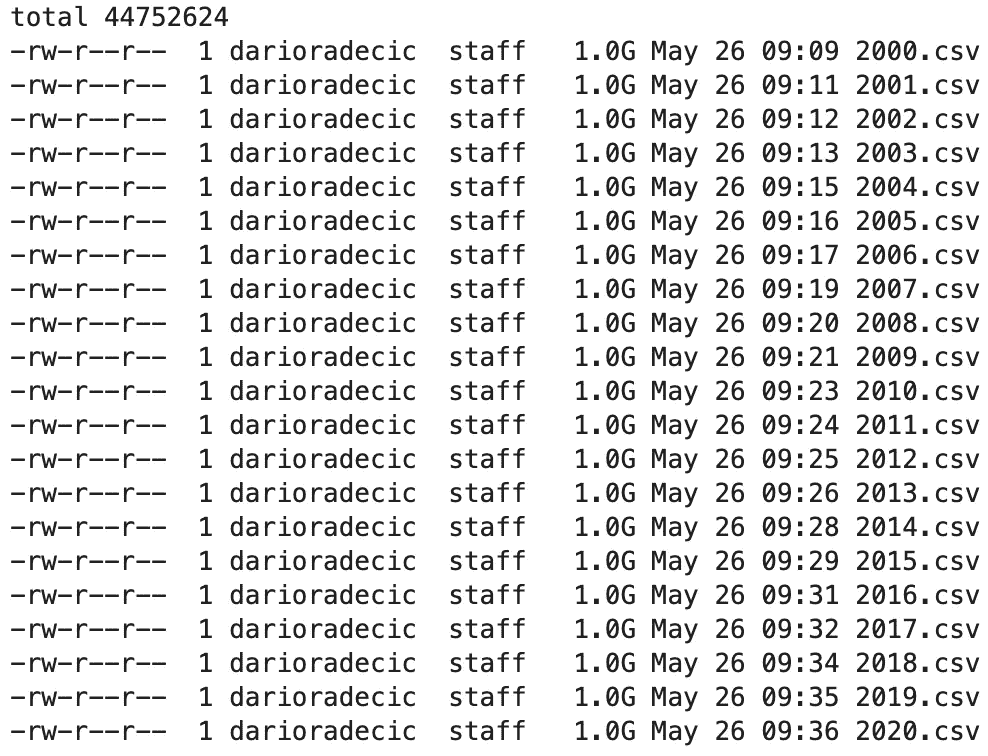
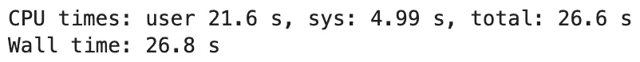
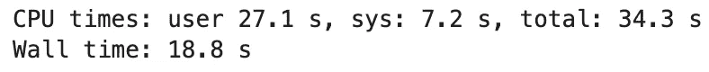
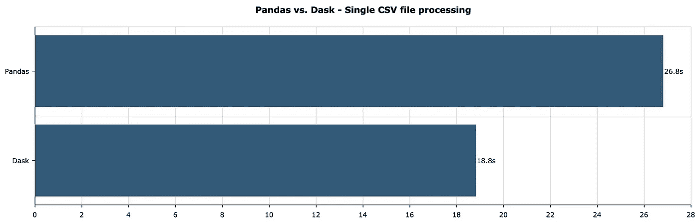
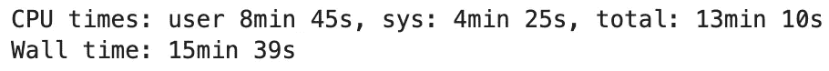
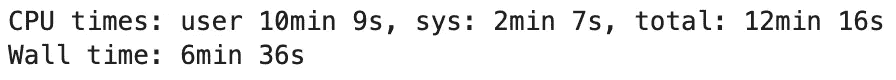
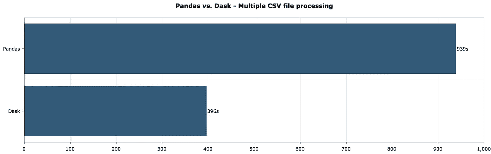

# dask data frames——如何轻松并行运行熊猫

> 原文：<https://towardsdatascience.com/dask-dataframes-how-to-run-pandas-in-parallel-with-ease-b8b1f6b2646b?source=collection_archive---------13----------------------->

## 了解如何将 20GB 的 CSV 文件放入 16GB 的 RAM 中。


由 [Elisha Terada](https://unsplash.com/@elishaterada?utm_source=unsplash&utm_medium=referral&utm_content=creditCopyText) 在 [Unsplash](https://unsplash.com/s/photos/flow?utm_source=unsplash&utm_medium=referral&utm_content=creditCopyText) 上拍摄的照片

所以你对熊猫有一些经验，你知道它最大的局限性——它不那么容易扩展。有解决办法吗？

是 Dask 数据帧。

Dask API 的大部分与 Pandas 相同，但 Dask 可以在所有 CPU 核心上并行运行。它甚至可以在集群上运行，但这是下一次的主题。

今天你将看到 Dask 在处理 20GB 的 CSV 文件时比 Pandas 快多少。运行时间值因电脑而异，因此我们将比较相对值。根据记录，我使用的是 MBP 16 英寸 8 核 i9，16GB 内存。

从头开始系列:

*   [Dask 延迟——如何轻松并行化您的 Python 代码](/dask-delayed-how-to-parallelize-your-python-code-with-ease-19382e159849)
*   [Dask 阵列——如何轻松实现 Numpy 并行化](/dask-arrays-how-to-parallelize-numpy-with-ease-b33d7e9dcb59)

这篇文章的结构如下:

*   数据集生成
*   处理单个 CSV 文件
*   处理多个 CSV 文件
*   结论

# 数据集生成

我们可以在线下载数据集，但这不是今天文章的重点。我们只对大小感兴趣，对里面的东西不感兴趣。

因此，我们将创建一个包含六列的虚拟数据集。第一列是时间戳——以一秒为间隔采样的一整年，其他五列是随机整数值。

为了使事情变得更复杂，我们将创建 20 个文件，从 2000 年到 2020 年每年一个。

开始之前，请确保在笔记本所在的位置创建一个`data`文件夹。下面是创建 CSV 文件的代码片段:

```
import numpy as np
import pandas as pd
import dask.dataframe as dd
from datetime import datetime for year in np.arange(2000, 2021):
    dates = pd.date_range(
        start=datetime(year=year, month=1, day=1),
        end=datetime(year=year, month=12, day=31),
        freq=’S’
    ) df = pd.DataFrame()
    df[‘Date’] = dates for i in range(5):
        df[f’X{i}’] = np.random.randint(low=0, high=100, size=len(df)) df.to_csv(f’data/{year}.csv’, index=False)
```

现在可以使用一个基本的 Linux 命令来列出`data`目录:

```
!ls -lh data/
```

结果如下:



图 1 —单个 CSV 文件(图片由作者提供)

如您所见，所有 20 个文件的大小都在 1GB 左右(更准确地说是 1.09)。上面的代码片段需要一些时间来执行，但是仍然比下载一个 20GB 的文件要少得多。

接下来，让我们看看如何处理和聚合单个 CSV 文件。

# 处理单个 CSV 文件

***目标:*** *读入单个 CSV 文件，按月对值进行分组，并计算每列的总和。*

用熊猫加载一个 CSV 文件再简单不过了。`read_csv()`函数接受`parse_dates`参数，该参数自动将一列或多列转换为日期类型。

这很方便，因为我们可以直接使用`dt.month`来访问月值。以下是完整的代码片段:

```
%%timedf = pd.read_csv(‘data/2000.csv’, parse_dates=[‘Date’])
monthly_total = df.groupby(df[‘Date’].dt.month).sum()
```

这是总运行时间:



图 2 —包含熊猫聚合时间的单个 CSV 文件(图片由作者提供)

对于 1GB 的文件来说还不错，但是运行时间将取决于您的硬件。让我们对达斯克做同样的事情。代码如下:

```
%%timedf = dd.read_csv(‘data/2000.csv’, parse_dates=[‘Date’])
monthly_total = df.groupby(df[‘Date’].dt.month).sum().compute()
```

和 Dask 一样，在调用`compute()`函数之前，不会进行任何处理。您可以在下面看到总运行时间:



图 3 —带有 Dask 聚合时间的单个 CSV 文件(图片由作者提供)

让我们比较一下不同之处:



图 4 —单个 CSV 文件处理 Pandas 与 Dask(图片由作者提供)

这不是一个显著的区别，但是 Dask 总体上是一个更好的选择，即使是对于单个数据文件。这是一个好的开始，但是我们真正感兴趣的是一次处理多个文件。

接下来我们来探讨一下如何做到这一点。

# 处理多个 CSV 文件

***目标:*** *读取所有 CSV 文件，按年份值分组，计算每列的总和。*

使用 Pandas 处理多个数据文件是一项单调乏味的任务。一言以蔽之，你得一个一个地读取文件，然后垂直堆叠。

想想看，一个 CPU 内核一次加载一个数据集，而其他内核则处于闲置状态。这不是最有效的方法。

这个`glob`包将帮助你一次处理多个 CSV 文件。您可以使用`data/*.csv`模式获取`data`文件夹中的所有 CSV 文件。然后，你必须一个接一个地循环阅读。最后，您可以将它们连接起来并进行聚合。

以下是完整的代码片段:

```
%%timeimport globall_files = glob.glob('data/*.csv')
dfs = []for fname in all_files:
    dfs.append(pd.read_csv(fname, parse_dates=['Date']))df = pd.concat(dfs, axis=0)
yearly_total = df.groupby(df['Date'].dt.year).sum()
```

以下是运行结果:



图 5 —包含熊猫聚合时间的多个 CSV 文件(图片由作者提供)

15 分半钟看起来很多，但你必须考虑到在这个过程中使用了大量的交换内存，因为没有办法将 20+GB 的数据放入 16GB 的 RAM 中。如果笔记本完全崩溃，请使用较少数量的 CSV 文件。

让我们看看 Dask 有哪些改进。它接受`read_csv()`函数的 glob 模式，这意味着您不必使用循环。在调用`compute()`函数之前不会执行任何操作，但这就是库的工作方式。

下面是与之前相同的加载和聚合的完整代码片段:

```
%%timedf = dd.read_csv(‘data/*.csv’, parse_dates=[‘Date’])
yearly_total = df.groupby(df[‘Date’].dt.year).sum().compute()
```

以下是运行时结果:



图 6 —带有 Dask 聚合时间的多个 CSV 文件(图片由作者提供)

让我们比较一下不同之处:



图 7 —多个 CSV 文件处理 Pandas vs. Dask(图片由作者提供)

如您所见，在处理多个文件时，这种差异更加明显——在 Dask 中大约快 2.5 倍。一个明显的赢家，这里没有争论。

让我们在下一部分总结一下。

# 结论

今天，您已经了解了如何从 Pandas 切换到 Dask，以及当数据集变大时为什么应该这样做。Dask 的 API 与熊猫 99%相同，所以你应该不会有任何切换问题。

请记住，Dask 不支持某些数据格式，例如 XLS、Zip 和 GZ。此外，不支持排序操作，因为并行执行不方便。

请继续关注本系列的最后一部分——Dask Bags，它将教您 Dask 如何处理非结构化数据。

喜欢这篇文章吗？成为 [*中等会员*](https://medium.com/@radecicdario/membership) *继续无限制学习。如果你使用下面的链接，我会收到你的一部分会员费，不需要你额外付费。*

<https://medium.com/@radecicdario/membership>  

# 了解更多信息

*   [我作为数据科学家卖掉我的 M1 Macbook Pro 的三大理由](/top-3-reasons-why-i-sold-my-m1-macbook-pro-as-a-data-scientist-abad1226f52a)
*   [如何使用 Cron 调度 Python 脚本——您需要的唯一指南](/how-to-schedule-python-scripts-with-cron-the-only-guide-youll-ever-need-deea2df63b4e)
*   [Dask 延迟—如何轻松并行化您的 Python 代码](/dask-delayed-how-to-parallelize-your-python-code-with-ease-19382e159849)
*   [如何使用 Python 创建 PDF 报告—基本指南](/how-to-create-pdf-reports-with-python-the-essential-guide-c08dd3ebf2ee)
*   [即使没有大学文凭也要在 2021 年成为数据科学家](/become-a-data-scientist-in-2021-even-without-a-college-degree-e43fa934e55)

# 保持联系

*   关注我的 [Medium](https://medium.com/@radecicdario) 了解更多类似的故事
*   注册我的[简讯](https://mailchi.mp/46a3d2989d9b/bdssubscribe)
*   在 [LinkedIn](https://www.linkedin.com/in/darioradecic/) 上连接