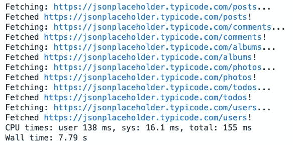
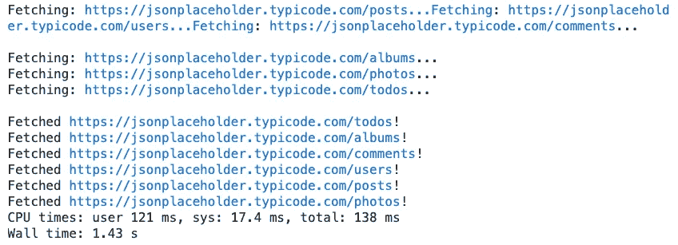
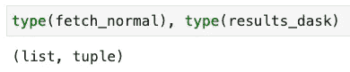
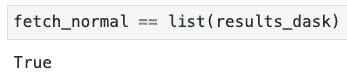

# Dask 延迟——如何轻松并行化您的 Python 代码

> 原文：<https://towardsdatascience.com/dask-delayed-how-to-parallelize-your-python-code-with-ease-19382e159849?source=collection_archive---------7----------------------->

## 用一个装饰器并行化任何函数

Jose Castillo 在 [Unsplash](https://unsplash.com/?utm_source=unsplash&utm_medium=referral&utm_content=creditCopyText) 上拍摄的照片

我们都知道 Python 不是最快的编程语言。它的 [*全局解释器锁*](https://docs.python.org/3/glossary.html#term-global-interpreter-lock) (GIL)机制一次只允许一个线程执行 Python 字节码。您可以通过更改解释器或实现基于进程的并行技术来避免这种限制。

我过去曾谈论过 Python 中的并行性，所以如果您不熟悉这个主题，请务必查看这些文章:

*   [Python 并行性:几分钟内加速 Python 代码的基本指南](/python-parallelism-essential-guide-to-speeding-up-your-python-code-in-minutes-5ec71cbd88e1)
*   [Python 中的并发性:如何用线程加速你的代码](/concurrency-in-python-how-to-speed-up-your-code-with-threads-bb89d67c1bc9)

这些方法非常有效，但是还有一个更简单的替代方法——使用 Dask 库进行并行处理。

如果你不熟悉 Dask，它基本上相当于大型数据集的熊猫。这太简单了，所以请在这里阅读更多关于库的信息。

这篇文章的结构如下:

*   问题描述
*   测试:按顺序运行任务
*   测试:用 Dask 并行运行任务
*   结论

你可以在这里下载这篇文章的源代码。

# 问题描述

目标是连接到[jsonplaceholder.typicode.com](https://jsonplaceholder.typicode.com/)——一个免费的假 REST API。

您将连接到几个端点并获取 JSON 格式的数据。总共会有六个端点。不是很多，Python 很可能在几秒钟内完成任务。对于展示并行能力来说不太好，所以我们将增加一些趣味。

除了获取 API 数据，程序还会在发出请求之间休眠一秒钟。由于有六个端点，程序应该在六秒钟内什么都不做——但是只有当调用按顺序执行时。

以下代码片段导入了所需的库，声明了一个 URL 列表和一个从单个 URL 获取数据的函数:

我们先测试一下没有并行的执行时间。

# 测试:按顺序运行任务

下面的代码片段在 Jupyter 笔记本中顺序获取数据。如果您不在笔记本环境中，请删除`%%time` magic 命令:

执行该单元格后，您将看到类似的输出:

图 1 —顺序执行(作者提供的图片)

这并不奇怪——Python 按照声明的顺序从 API 端点获取数据，大约花了 8 秒钟才完成，主要是由于调用了`sleep()`。

事实证明，这些 API 调用是独立的，可以并行调用。让我们看看接下来该怎么做。

# 测试:用 Dask 并行运行任务

我们需要稍微修改一下代码。首先要做的是用一个`delayed`装饰器包装我们的`fetch_single`函数。一旦在循环之外，我们还必须对`fetch_dask`数组中的每一项调用 Dask 的`compute`函数，因为调用`delayed`并不做计算。

下面是完整的代码:

用`delayed`装饰器包装函数的替代方法是在函数声明上方使用`@delayed`符号。随便用。

不管怎样，执行结果如下图所示:

图 2 —延迟 Dask 的并行执行(图片由作者提供)

如您所见，打印顺序不同。这是因为 Dask 被指示单独开始所有的任务。总执行时间不到 1.5 秒，其中 1 秒用于睡眠。

总的来说，进步很大。

问题仍然存在— **返回的结果是否相同？**嗯，是也不是，顺序例子中得到的值在一个列表中，而调用`compute`后得到的值在一个元组中。

下图验证了:

图 3 —数据类型比较(作者图片)

因此，我们不能直接比较数据结构，但我们可以在将第二个数据结构转换为列表后进行比较:

图 4 —内容对比(作者图片)

最终的答案是肯定的——两种方法都会得到相同的结果，但是并行化的方法花费的时间要少一些。

# 结论

对您的应用程序或数据科学管道实施并行处理需要深思熟虑。幸运的是，代码实现很简单，因为只需要两个函数。

好消息是——您可以使用 Dask 来并行处理几乎任何事情。从基本的数据集加载、统计汇总到模型训练，Dask 都可以处理。

如果您想要更高级的基于数据科学的 Dask 教程，请告诉我。

喜欢这篇文章吗？成为 [*中等会员*](https://medium.com/@radecicdario/membership) *继续无限制学习。如果你使用下面的链接，我会收到你的一部分会员费，不需要你额外付费。*

<https://medium.com/@radecicdario/membership>  

# 了解更多信息

*   [每位数据科学家必读的 3 本编程书籍](/3-programming-books-every-data-scientist-must-read-db1d3a1a284c)
*   [如何让 Python 静态类型化—基本指南](/how-to-make-python-statically-typed-the-essential-guide-e087cf4fa400)
*   [使用 Python 进行面向对象编程——您需要知道的一切](/object-orientated-programming-with-python-everything-you-need-to-know-cb0ada963756)
*   [Python 字典:你需要知道的一切](/python-dictionaries-everything-you-need-to-know-9c2159e5ea8a)
*   [介绍 f 字符串 Python 中字符串格式化的最佳选项](/introducing-f-strings-the-best-option-for-string-formatting-in-python-b52975b47b84)

# 保持联系

*   关注我的 [Medium](https://medium.com/@radecicdario) 了解更多类似的故事
*   注册我的[简讯](https://mailchi.mp/46a3d2989d9b/bdssubscribe)
*   在 [LinkedIn](https://www.linkedin.com/in/darioradecic/) 上连接
*   查看我的[网站](https://www.betterdatascience.com/)

*原载于 2021 年 4 月 19 日 https://betterdatascience.com**[*。*](https://betterdatascience.com/parallelism-with-dask-delayed/)*