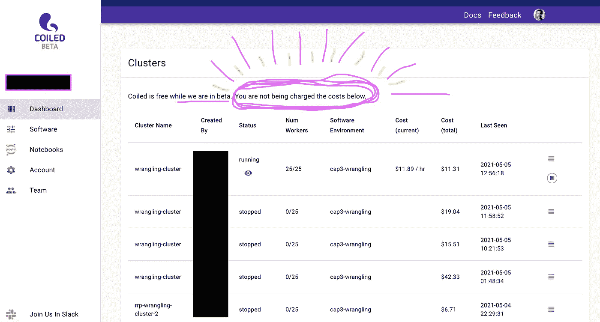

# DASK HACK:在您的员工中高效地分发大型辅助数据

> 原文：<https://towardsdatascience.com/dask-hack-efficiently-distributing-large-auxiliary-data-across-your-workers-ac64ab919f9b?source=collection_archive---------39----------------------->

## 如何围绕每个工作人员只运行一次的函数创建延迟对象

[约书亚·索特诺](https://unsplash.com/@sortino?utm_source=unsplash&utm_medium=referral&utm_content=creditCopyText)在[un plash](https://unsplash.com/?utm_source=unsplash&utm_medium=referral&utm_content=creditCopyText)上拍摄的照片

# TL；博士；医生

`once_per_worker`是一个围绕函数创建[dask . delived](https://docs.dask.org/en/latest/delayed.html)对象的实用程序，您希望每个[分布式](https://distributed.dask.org/en/latest/)工作器只运行一次。当您将一些大数据烘焙到 docker 图像中，并且需要将这些数据用作另一个 dask 操作的辅助输入时(例如，`df.map_partitions`)，这很有用。`once_per_worker`不需要在集群中的工作人员之间传输串行数据——因为数据的大小会比较慢——而是允许每个工作人员调用一次解析函数，然后在下游使用相同的解析对象。

请参见下面的用例。

<https://github.com/gjoseph92/once-per-worker>  

# 用例

在我的[阿拉伯语错误信息检测项目](https://richardpelgrim.medium.com/project-outline-detecting-arabic-misinformation-tweets-2a2839e0a4c)中，我一直在广泛使用新的[螺旋](https://coiled.io/)平台，该平台提供了一个非常用户友好且可访问的界面，可以在云中扩展 Python，以使用 Dask 处理大于内存的数据集。安装后，您可以用 4 行代码配置一个 AWS 集群，旋转它只需要 2-3 分钟，甚至不足以煮一杯咖啡！

经由 Giphy.com 的影像

我一直在测试这个平台的极限，对它的性能、可访问性和令人惊叹的支持团队印象深刻，每当我遇到任何问题时，他们都会迅速做出反应。(哦，还有有趣的额外福利——在测试版运行集群完全是免费的！)

我遇到的一个挑战是让我的阿拉伯语推文在云上得到满足。正如我在[我的上一篇文章](/arabic-nlp-unique-challenges-and-their-solutions-d99e8a87893d)中所写的，为自然语言处理预处理阿拉伯文本带来了一系列挑战；其中之一是同一个字母组合(即看起来像同一个单词)可以有许多许多不同的意思。因此，为了使我们的记号变得简单，我们需要将这个*可能的*含义的范围缩减为一个；一个叫做*消歧*的过程。为此，我们使用 **camel-tools** 库将每个单词与一个形态学数据库进行比较，并提取该单词最可能的版本及其词条。

我遇到的问题是，这个形态学数据库非常大，当试图在云中运行这个引理满足时会出现问题。

虽然形态学数据库被烘焙到 Docker 映像中，该映像被分发给 my cluster 上的所有 worker， **Dask 默认不知道每个 worker 已经有了它的副本**。因此，当我们将我们的函数映射到 Dask 数据帧中的所有分区时，它将在工人之间传输序列化数据以执行它。考虑到文件的大小，这意味着执行下面的 **map_partitions()** 调用非常慢。一个只有 36 行的 dask 数据帧样本花费了将近 10 分钟。)

谢天谢地，Dask 的维护者之一 Gabe Joseph 用这个可爱的黑客拯救了我。我将从下面的软件包回购中复制完整的描述:

> `once_per_worker`是一个围绕函数创建 [dask.delayed](https://docs.dask.org/en/latest/delayed.html) 对象的实用程序，您只希望每个[分布式](https://distributed.dask.org/en/latest/)工作进程运行一次这些函数。
> 
> 假设您的 docker 映像中有一些大型数据(因此每个工人都有一份副本)。您需要将该数据作为另一个 dask 操作的辅助输入(例如，`df.map_partitions`)。但是解析/预处理数据很慢，而且一旦加载到内存中，数据就会很大，因此每个工作线程从磁盘加载数据比在集群中的工作线程之间传输序列化数据要快。因此，您只需要为每个 worker 调用一次解析函数，然后在所有下游任务中为每个 worker 使用相同的解析对象。
> 
> 通过在`once_per_worker`中包装您的预处理函数，您得到一个延迟的对象，在一个给定的 worker 上，它将总是解析为相同的预处理对象。您的函数在您第一次*访问返回值的属性*时被调用。

下面的代码将这个包应用于我的特定用例。概括的工作流程如下:

1.  导入`once_per_worker`包
2.  在一个 **once_per_worker** 调用中包装你的预处理函数(它运行在你不想序列化和移动的大数据上)。
3.  使用预处理函数作为参数来定义映射函数。
4.  跨分区映射映射函数。

**注意:**定义 **once_per_worker** 对象很重要，这样映射函数就可以访问这个对象的*属性*。否则不会调用该对象！在我的具体用例中，**loaded _ disambiguitor**只在我访问它的**时被调用。消歧()**属性。

以这种方式处理比 dask 默认方式更快。在我的例子中，仅用 20 秒就执行了 60k 行！

图片来自 Giphy.com

非常感谢 Gabe 为这个问题写了一个补丁，也非常感谢 Dask/Coiled 的所有人的大力支持！

如果您也经常使用大于内存的数据集，那么一定要看看 Coiled——我怎么推荐都不为过！

 