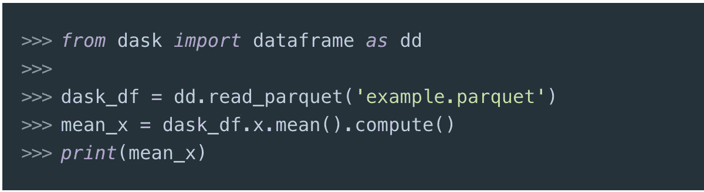
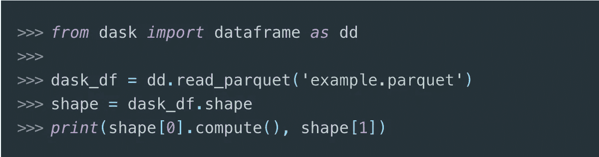
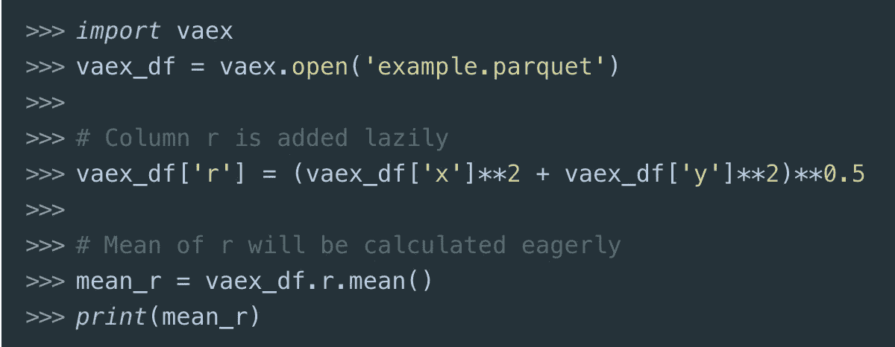
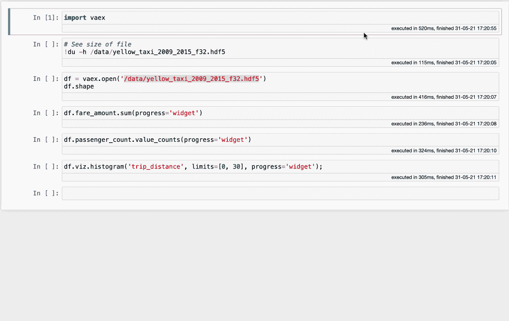

# Dask 和 Vaex 的定性比较

> 原文：<https://towardsdatascience.com/dask-vs-vaex-a-qualitative-comparison-32e700e5f08b?source=collection_archive---------12----------------------->

危地马拉阿蒂特兰湖。图片由马克·哈普尔通过 unsplash。

## 经常有人问我们 Dask 和 Vaex 相比如何。简而言之:他们没有

## 介绍

很长一段时间以来， [Pandas](https://pandas.pydata.org/) 可以说是数据科学家工具箱中最重要的库。事实上，正是熊猫的出现帮助 Python 成为如此受欢迎的编程语言，无论是对于数据科学任务还是一般情况。但是数据集继续增长，现在它们经常超过大多数机器上可用 RAM 的大小。因此，对快速有效的数据处理和分析的需求，即下一代工具的需求也在增长。

Python 生态系统中有几种流行的技术，它们经常用于在数据科学和数据工程的背景下处理大型数据集。 [Dask](https://dask.org/) 是一个开源的通用框架，用于 Python 中的并行和分布式计算。对于各种类型的计算和数据科学任务的水平扩展，它通常是首选技术。它的更高层次的 API，Dask。DataFrame 提供了最便捷的方式来绕过使用 [Pandas](https://pandas.pydata.org/) 时可能遇到的内存和性能障碍，即使是处理中等大小的数据集。

[Vaex](https://github.com/vaexio/vaex/) 是 Python 中的一个高性能 DataFrame 库，主要用于在单台机器上处理、探索和分析硬盘大小的数据集。谈到大型数据集， [Vaex](https://github.com/vaexio/vaex/) 认为，只要使用正确的方法来存储、访问和处理数据，大多数常见的数据科学和分析任务就不需要水平扩展，即添加更多的计算机/节点。

对于一般了解但不熟悉其中一种或两种技术的用户来说，它们可能看起来非常相似。当性能或内存管理成为一个问题时，这两者通常被用来取代熊猫。两者都使用惰性(或延迟)评估等概念，并行计算并采用核外算法。最重要的是，Dask 可以在集群上分布计算。所以有人可能会问:“这两个库的真正区别是什么？”或者“我何时或为何要使用 Vaex”？在接下来的内容中，我将强调这两种技术之间的主要区别，希望能够提高您对它们的理解，并使您在为您的用例选择合适的工具时能够做出更明智的选择。

## 1.Dask vs. `Dask.DataFrame` vs. Vaex

Dask 是一个通用框架，用于在集群上并行化或分布各种计算。许多流行的数据科学库，如 [scikit-learn](https://scikit-learn.org/stable/) 、 [XGBoost](https://xgboost.ai/) 、 [xarray](http://xarray.pydata.org) 、 [Perfect](https://docs.prefect.io/) 等，可能会使用 Dask 来并行化或分布它们的计算。

当许多数据科学家或工程师说“Dask”时，他们通常指的是`Dask.DataFrame`。`Dask.DataFrame`是一个建立在熊猫和 Dask 之上的 DataFrame 库。实际上，一个`Dask.DataFrame`由许多较小的 Pandas 数据帧组成，这些数据帧与 Dask 提供的通用任务调度程序相耦合。当一个计算被触发时，Dask 会把`Dask.DataFrame`分解成许多更小的熊猫数据帧，每个数据帧都做好自己的工作，最后把结果连接起来。

Vaex 是一个全新的数据帧实现，从头开始构建，能够以令人难以置信的速度处理包含数亿或数十亿行的数据帧。虽然它试图遵循熊猫设置的 API，但在它的引擎盖下隐藏着高效的核外 C++算法。再加上内存映射，它可以在一两秒钟内处理 **1.000.000.000** 行。Vaex 还可以将数据传输到您最喜欢的云存储桶，并与 [Apache Arrow](https://arrow.apache.org/) 完全兼容，允许您与 Python 领域之外的生态系统接收和共享数据。

## 2.懒惰评估

`Dask.DataFrame`和 Vaex 都支持延迟评估。然而，用户应该意识到它们在操作方式上有一些不同。在`Dask.DataFrame`中，任何需要迭代数据的操作都被延迟，直到用户明确指定应该通过调用`.compute()`方法来完成计算。例如，计算列的平均值如下所示:

如果在上面的例子中没有指定`.compute()`，一旦计算被触发，`mean_x`将只是一个占位符，等待存放结果。即使对于“简单”的操作，比如获得数据帧的形状，也需要调用`.compute()`方法:

在上面的代码块中，`x`的平均值和总和都是通过对数据的一次遍历来计算的。

Vaex 以不同的方式处理惰性评估。如果一个操作的结果将“活”在定义它的数据帧内，则该操作将被延迟。这方面的一个例子是添加一个新列，或者将两个数据帧连接在一起。另一方面，如果一个操作的结果将存在于定义它的数据帧之外，则该操作将被立即触发。这方面的一个例子是计算一列的平均值，寻找一列的唯一值，或者一个`groupby`操作。例如:

像这样的工作流对于许多需要即时反馈的数据科学家来说非常方便，尤其是在经常交互的数据探索和分析阶段。虽然 Vaex 也可以计算多个聚合或一次通过数据[的计算，但 Dask 的 API 对于这种方法更方便。](https://vaex.readthedocs.io/en/latest/tutorial.html#Parallel-computations)

## 3.处理大型数据集

能够处理大量数据是使用这两个库的常见原因。然而，他们处理这种数据的方法有点不同。`Dask.DataFrame`通过将数据分块成多个 Pandas 数据帧，然后对其进行延迟评估，克服了这一挑战。`Dask.DataFrame`也可以在集群上分布这些更小、更易管理的数据帧。这里的好处是，可以使用任意大小的集群来解决任何内存问题，并并行化计算。`Dask.DataFrame`与 Vaex 相比，更紧密地遵循 Pandas API，并提供了 Pandas 功能的更大覆盖面。坏处源于同样的原因——`Dask.DataFrame`继承了熊猫的一些包袱，比如内存饥渴。此外，将集群引入数据科学工作流会带来与其设置、管理、开发和成本相关的巨大复杂性。像 [Coiled](https://coiled.io/) 和 [SaturnCloud](https://www.saturncloud.io/s/home/) 这样的组织正试图简化这一挑战。

Vaex 完全重新思考了现代数据框架应该如何实现。这一切都从数据开始，数据在磁盘上应该是内存可映射的格式。再加上现代 SSD 磁盘的读取速度约为 5GB/s，云存储桶的读取速度约为 12.5GB/s，这使得数据的读取和处理速度令人难以置信—所有这些都在一台机器上完成，甚至是笔记本电脑！虽然性能比较超出了本文的范围，但是看看 Vaex 在超过 1.000.000.000(十亿)个样本的**上执行一些常见操作的速度有多快:**

使用 Vaex 的明显优势是难以置信的开箱即用速度，完全不需要任何特殊的系统配置或集群配置。缺点是，由于这是一个新的实现，它还没有 Pandas 提供的所有方法。

虽然任何一种性能比较都超出了本文的范围，但是如果你有兴趣的话，你应该看看这篇文章。所有的基准测试都有这样或那样的偏差，所以我鼓励你自己去尝试每一件事，使用你的数据，并根据你的需求来判断。

## 4.数据文件格式

[Apache Parquet](https://parquet.apache.org/) 是`Dask.DataFrame`的首选数据格式。对于较大的数据集，如果将数据划分到多个文件中，可以获得更好的性能。在集群上使用`Dask.DataFrame`时，数据可以集中，即位于一台机器上，或者分布在组成集群的机器上。

为了获得最佳性能，Vaex 的首选数据格式是 [HDF5](https://en.wikipedia.org/wiki/Hierarchical_Data_Format#HDF5) 和 [Apache Arrow](https://arrow.apache.org/) 。Vaex 还可以读取 Apache Parquet 文件格式。Vaex 希望所有数据都位于一台机器上。虽然它可以延迟读取分布在多个文件中的数据集，但为了获得最佳性能，最好将全部数据存储在一个文件中。像 Dask 一样，Vaex 也可以从(和到！)您喜欢的云对象存储，并可选择在本地缓存它。

这两个库都可以读取存储在 [CSV](https://en.wikipedia.org/wiki/Comma-separated_values) 、 [JSON](https://www.json.org/json-en.html) 中的数据，以及熊猫可以读取的几乎任何文件格式。但是，对于更大的数据集和更好的性能，最好将数据转换为每个库首选的文件格式。

## 5.用什么

在这一节里，很难说有什么是完全公正的。亲爱的读者，我善意但强烈地建议你自己尝试这些和任何其他库，并根据你的数据、用例和需求做出决定。考虑到这一点，以下是我个人的偏见。

Vaex 是速度最快、内存效率最高的 Python 数据帧库。它在单台机器上每秒可以处理 *1.000.000.000(十亿)行*的事实在当今业界是无与伦比的。它用于交互式探索、可视化和大型表格数据集的预处理。作为一个单机解决方案，它几乎没有增加 DevOps 开销，令人惊叹的性能使它成为各种交互式仪表盘或机器学习应用程序的优秀后端引擎。

在数据科学中仍然有大量的计算任务，在数据工程中甚至更多，这些任务不能以非核心的方式完成。例如，解析大量的 [xml](https://en.wikipedia.org/wiki/XML) 文件。这就是达斯克的闪光点。因为它是分布式计算的通用框架，所以它可以在表格数据集的领域之外很好地推广。建立在 Dask 和 Pandas 之上的 DataFrame 实现提供了一个相对于 Pandas 更加完整的 API 规范。它还提供了一种并行化和分布各种常见机器学习操作的方法，这些操作通常是用流行的 Python 库(如 Scikit-Learn 或 XGBoost)来完成的。

# 结尾部分

Dask 是一个通用工具，采用通用方法来缩放熊猫。它用小熊猫的数据帧构建了一个大的数据帧，并耦合到一个通用的任务调度框架。这提供了广阔的范围，同时为优化留下了空间。另一方面，Vaex 更专注于大型数据帧问题。这使得它更有效，但代价是一些普遍性。

Vaex 和 Dask[。DataFrame]都是优秀的数据科学库。虽然本文主要是比较和对比他们处理大型表格数据集的方法，但我可以想到多种使用这两种技术的最佳解决方案。

这两个库只是 Python 生态系统力量的一个小证明，与其他许多库一起确保我们可以解决我们遇到的任何问题。事实上，有多种方法来解决一个特定的问题只能是一件好事！

*感谢 Matthew Rocklin 为改进本文提供了有益的评论和建议。*