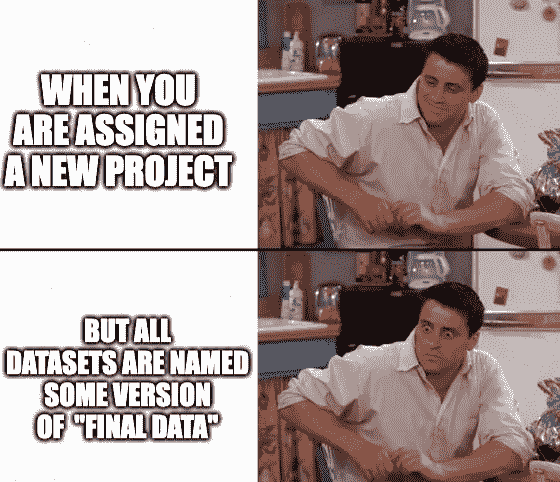
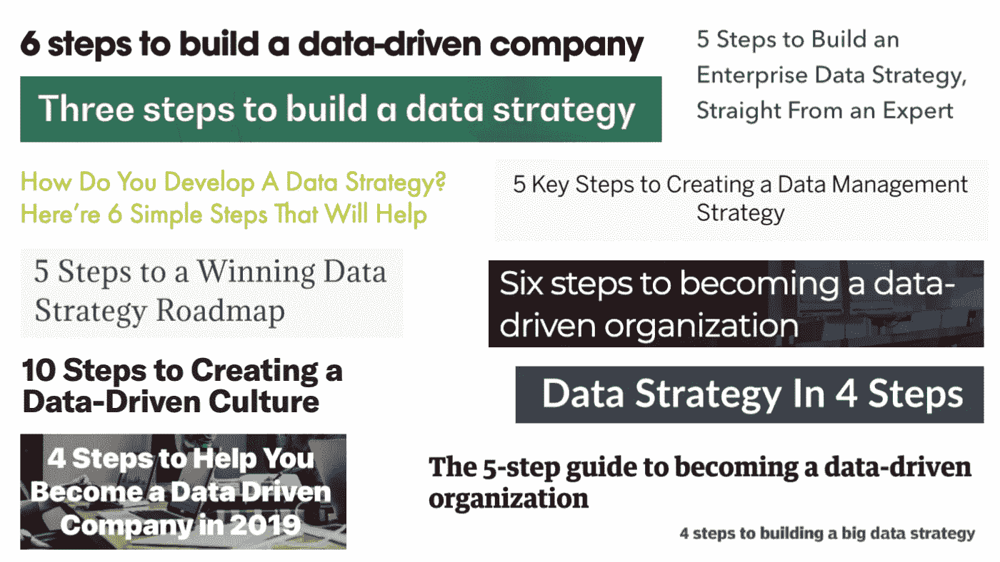
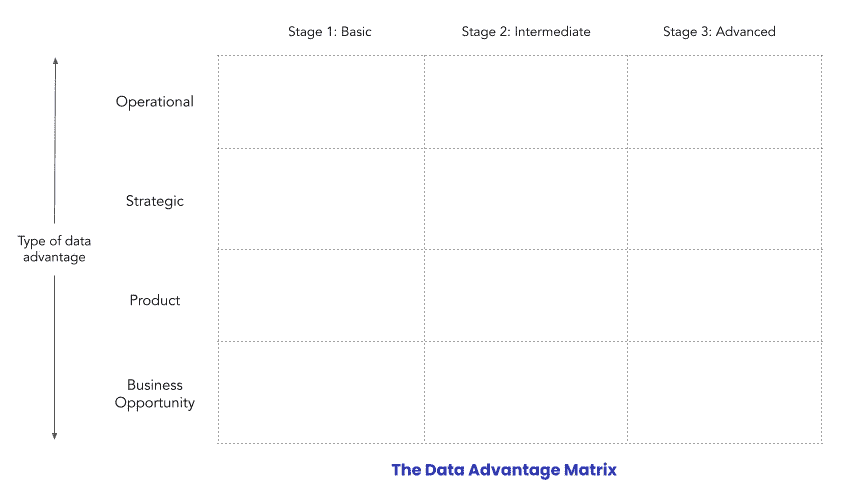
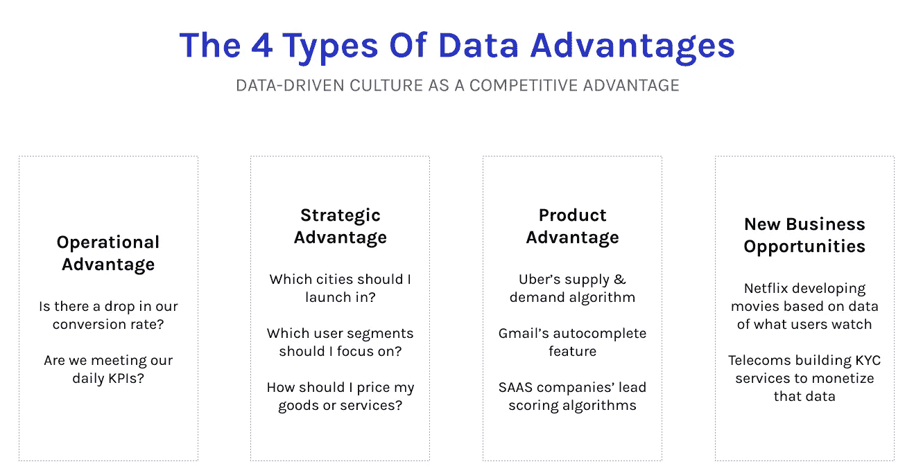
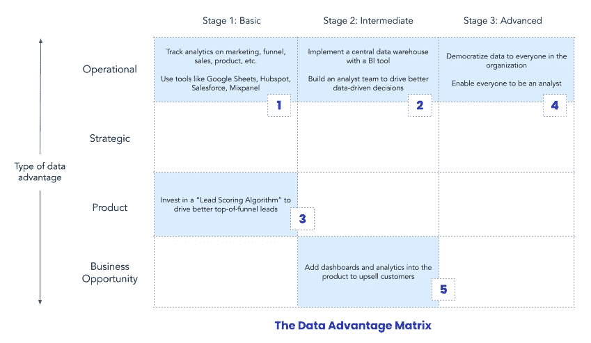
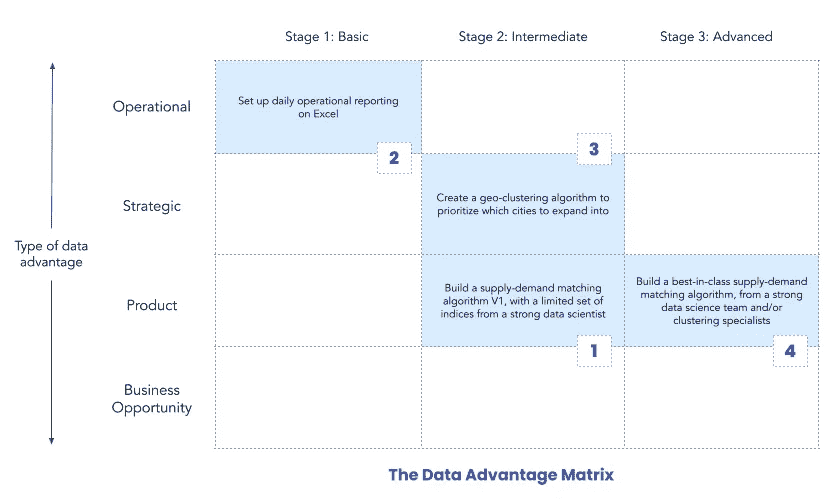
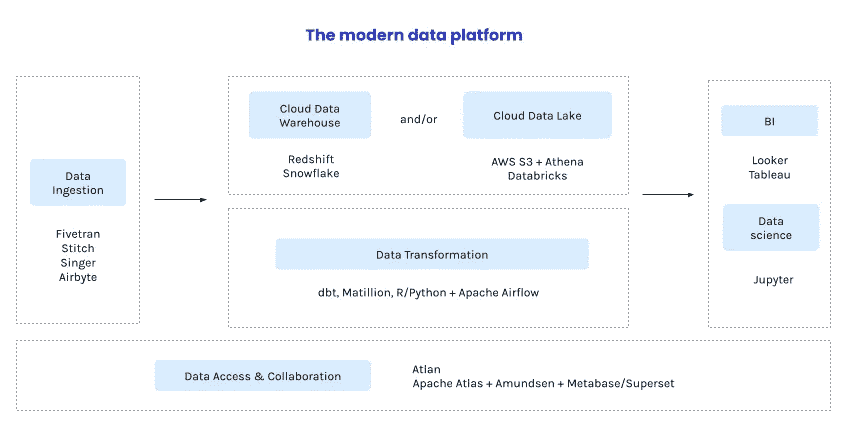

# 数据优势矩阵:思考数据策略的新方法

> 原文：<https://towardsdatascience.com/data-advantage-matrix-a-new-way-to-think-about-data-strategy-4178cd2f520a?source=collection_archive---------2----------------------->

## [行业笔记](https://towardsdatascience.com/tagged/notes-from-industry)

## **创建数据战略没有单一的途径**。以下是如何找到你的，并创造强大的数据优势。

照片由[i̇rfan·西姆萨尔](https://unsplash.com/@irfansimsar?utm_source=unsplash&utm_medium=referral&utm_content=creditCopyText)在 [Unsplash](https://unsplash.com/@irfansimsar?utm_source=unsplash&utm_medium=referral&utm_content=creditCopyText) 拍摄

作为两家数据初创公司的联合创始人，我经常收到的一个问题是，“我如何开始我的数据战略？我们从哪里开始？我们优先考虑什么？”

这是个可以理解的问题。如今，公司被大量提醒使用数据的重要性。在 NewVantage Partners 的年度调查中，连续第三年投资于数据计划的公司比例几乎是普遍的(2021 年实际上是 99%)。

虽然投资数据是理所当然的，但实际使用数据可能会感觉像是在冒险。在同一项调查中，只有 24%的公司表示他们创造了一种数据驱动的文化。

*斗争是真实的。(图片来自*[*Atlan*](https://atlan.com/)*)，他的社交团队花了太多时间为我们自己的团队创造模因。)*

确定您的数据策略远非易事。为了帮助领导者和公司找出他们的整体数据战略，我创建了一个框架，我称之为**数据优势矩阵**。

在这篇文章中，我将分解如何考虑你的数据策略，矩阵如何工作，并给出两个假设的公司将如何使用它的例子。

# 数据策略不是线性的或通用的

有大量的资源承诺了创建数据策略的一条真正的道路。“做这 5 件事，你将成为一家数据驱动的公司”或“这是将你的数据货币化的 5 个步骤”等等。

网上数据策略列表的例子。(图片由 [*图集*](https://atlan.com/) 。)

我希望事情能这么简单。

这是我从运行无数数据项目中学到的令人痛苦的事实:**没有一条创建数据策略的道路**。每家公司都是独一无二的，每项业务都是独一无二的，每个行业都是独一无二的，因此每家公司的道路都将是独一无二的。不要看其他公司做了什么，关键是检查您自己的需求，并为您的公司优先考虑最佳数据投资

你怎么知道你应该优先考虑什么？许多资源谈到关注具有最高 ROI 的项目(即这些计划将为您的公司带来的回报)。

但是，我认为这是看待您的数据策略的错误方式。因为让我们面对它，每个数据人都知道你的输入和假设驱动你的 ROI 计算的最终输出。我认为公司不应该从 ROI 的角度来划分数据项目的优先级，而应该从“优势”的角度来划分。

> *哪些数据投资将帮助您建立可持续的竞争优势，从而超越竞争对手？*

# 数据优势矩阵

数据优势矩阵可以帮助您确定您想要建立什么类型的数据优势，以及您想要将它们推进到什么程度。

它是这样工作的——行代表公司可以创造的数据优势的类型，列是每个优势的三个阶段。

*数据优势矩阵。(图片由* [*阿特兰*](https://atlan.com/) *)。)*

让我们来分解一下，从四种类型的数据优势开始:

*   **运营**:这是关于理解推动你业务的杠杆，然后利用它们来改善运营。一个关键的方面是让那些每天做决策的人可以获得和理解数据。一个例子是 Gojek 关于关键指标的[每日更新](/the-4-kinds-of-data-moats-that-your-company-can-build-c68f691b435c)，它的第一任首席执行官 Nadiem Makarim 使用它来形成对什么正在被破坏的直观感觉。
*   战略:每家公司每年都会做出几个关键的战略决策。这些决策越是由数据驱动，就越有可能推动增长或取得成功。一个例子是印度政府利用地理集群开设了 [10，000 个新的液化石油气中心](https://www.youtube.com/watch?v=C6WKt6fJiso)。
*   产品:这是公司利用数据来推动核心产品优势的时候，这种优势将他们与竞争对手区分开来。一个例子是谷歌的“[智能撰写](https://ai.googleblog.com/2018/05/smart-compose-using-neural-networks-to.html)”自动完成功能。
*   **商业机会**:这涉及到使用公司数据来发现和创造新的商业机会。一个例子是[网飞原创](https://outsideinsight.com/insights/data-drives-decision-making-netflix/)，网飞开始根据人们想看的数据制作自己的电视节目和电影。

我已经写了这四种类型的优势，所以[如果你想了解更多](/the-4-kinds-of-data-moats-that-your-company-can-build-c68f691b435c)，可以看看那篇文章。

*4 类数据优势。(图片由* [*图集*](https://atlan.com/) *)。)*

接下来，我们了解了每个数据优势的三个阶段:

*   第一阶段(**基础**):这是一个快速且不成熟的 MVP，它使用基础工具(例如 SAAS 产品、Google Sheets、Zapier)并且没有数据专家。我几乎总是建议公司在“基础”层开始新的计划，以快速部署和评估解决方案。
*   阶段 2 ( **中级**):这一层包括对数据平台工具和数据专家或团队的投资。
*   阶段 3 ( **高级**):这些是同类最佳的数据计划，每个用例或项目都有专门的团队。当您到达这一层时，您基本上就是一个案例研究，了解作为一家数据驱动型公司意味着什么。

准备好看这个了吗？让我们通过几个例子来看看两家假设的公司将如何使用数据优势矩阵来制定他们的数据战略。

# 示例 1:使用矩阵对 SAAS 软件启动的数据计划进行优先级排序

*SAAS 软件创业的数据优势矩阵示例。(图片由* [*图集*](https://atlan.com/) *)。)*

对于 SAAS 公司来说，漏斗就是一切。在漏斗的每个阶段优化指标是加速 SAAS 公司从平均增长到指数增长的原因。因此，对于任何 SAAS 的创始人来说，如果你在第一天没有建立基本的运营分析，你可能会做错一些事情。

这个虚构的 SAAS 创业公司将从矩阵的左上角开始，提供基本的运营分析。这些分析不必复杂。在第一阶段，一切都是为了做好最基本的事情——衡量每天的潜在客户数量、用户在网站上的转化、用户注册产品、最终付费的免费试用等等。

鉴于运营分析的重要性，这家初创公司很快进入第二阶段是有意义的——将其基本分析转化为更具可扩展性的东西，如集中式智能引擎。这将包括投资一个数据仓库(如[红移](https://aws.amazon.com/redshift/)或[雪花](https://www.snowflake.com/))，将所有数据集中到一个地方，添加一个 BI 工具，并雇佣第一批分析师在最重要的地方(如营销或销售)推动数据驱动的决策。

在这一点上，随着运营的分类，创业公司可以开始考虑业务的其他方面:

*   为了推动对外销售，it 部门可以投资建立一个针对竞争对手的护城河，如销售线索评分算法，以帮助销售代表专注于最佳销售线索。
*   它可以回到其核心优势，运营分析，并使超级数据驱动和民主化。
*   它甚至可以专注于一项新的优势，比如在其产品中创建一个仪表板来追加销售客户。

# 示例 2:为 cab 聚合器排定数据计划的优先级

*cab 聚合器初创公司的数据优势矩阵示例。(图片由* [*阿特兰*](https://atlan.com/) *)。)*

我们再举一个例子，一家出租车聚合创业公司。

这是一种完全不同的情况，因为一个出租车公司的整个产品依赖于供需平衡。如果客户找不到出租车，他们就不会在出租车公司找到价值。

这就是为什么 cab 聚合器会从不同于 SAAS 公司的地方开始——这是一个产品优势。它将首先投资建立一个供需匹配算法，因此它的第三或第四个雇员需要是一个强大的数据科学家，以建立适当的工具，并使其算法在第一天成为竞争优势。

接下来，在 Excel 等工具上构建基本的运营报告对公司来说可能是有意义的。那么对公司来说，考虑一些战略问题，比如如何从一个城市扩张到十个城市，可能是有意义的。由于这是一个关键问题，它可以再次跳到阶段 2——投资一位数据科学家来构建一个合适的地理聚类算法。

在此过程中，cab 初创公司可能希望升级其供需匹配算法，并建立强大的团队和一流的数据系统，使其成为先进的数据优势。

# 为您的公司使用数据优势矩阵

那么，贵公司的数据优势矩阵应该是什么样的呢？

> 从思考你希望自己的竞争优势是什么开始。什么能让你超越你的竞争对手？

列出你可以在业务中建立的所有数据优势，然后考虑你想采用哪种优势。专注于提升您的核心优势是否有意义，或者跨其他类型的数据优势推出“基本”数据计划是否更好？

确定数据投资的优先级没有简单的方法。例如，两家类似的 SAAS 创业公司可能会采取不同的方法来建立他们的数据战略和团队。当您考虑对可能的计划进行优先级排序时，从三个基本问题开始:

*   这样会创造什么样的数据优势？
*   这项计划会对我们公司产生什么影响？
*   我们要花多少努力才能到达那里？

请注意，数据优势并不总是始于第一阶段。像 cab 聚合器一样，如果数据优势对您的公司至关重要，并且可以从一开始就建立在适当的工具上，那么从阶段 2 开始可能是有意义的。当你可以从一些快速和肮脏的东西开始，弄清楚你到底需要什么，然后随着时间的推移升级，从第一阶段开始，有一个 MVP——这是我通常推荐的。

# 回顾数百个数据项目

根据我在 200 多个数据项目中与数据领导者合作的经验，我了解到为您的公司创建数据战略没有一条直线路径。最重要的一点是从基本原则开始。

> 请记住，你的业务是独一无二的，因此你为自己创造的数据护城河和优势将是世界上其他公司所不具备的。

当您考虑寻找您的数据策略时，请从基础开始。考虑你可以建立的不同类型和水平的优势，从可以产生有意义的影响的最容易获得的果实开始，并从那里继续迭代。

然后，当您开始创建这些数据计划时，请记住构建正确的基础。不要忘记投资你需要的数据工具，每当你进入第二阶段，就建立一个[现代数据平台](/the-building-blocks-of-a-modern-data-platform-92e46061165)。数据访问和协作工具在第二阶段是可选的，但是一定要确保在第三阶段之前弄清楚它们。

*现代数据平台的构建模块。* [*阅读更多。*](/the-building-blocks-of-a-modern-data-platform-92e46061165) *(图片由* [*图册*](https://atlan.com/) *)。)*

祝你一路顺风，如果你有任何问题，请留言！

**发现此内容有帮助？在我的时事通讯《元数据周刊》上，我每周都写关于活动元数据、数据操作、数据文化和我们的学习建设的文章** [**【亚特兰】**](https://atlan.com/) **。** [**在此订阅。**](https://metadataweekly.substack.com/)