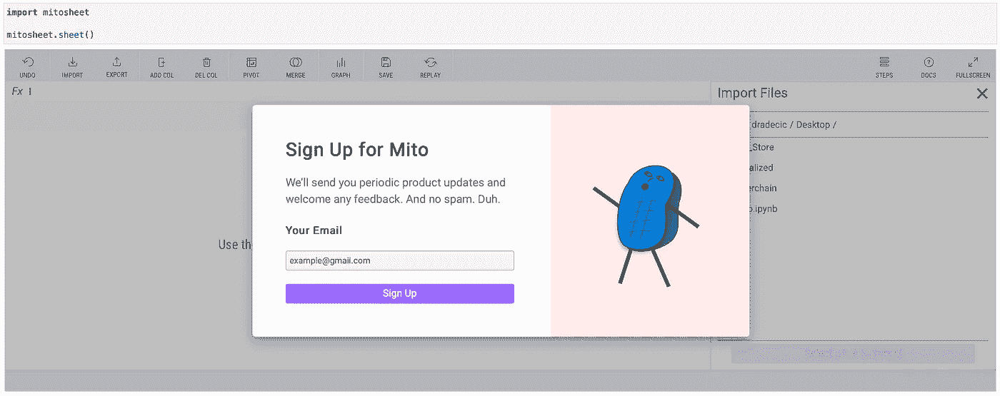
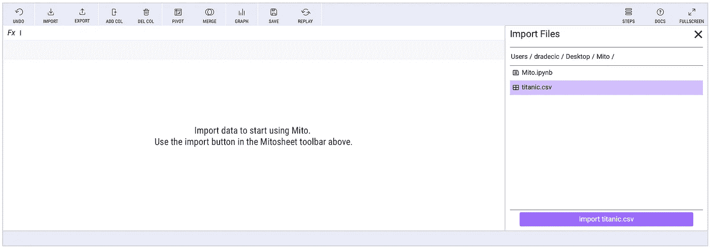
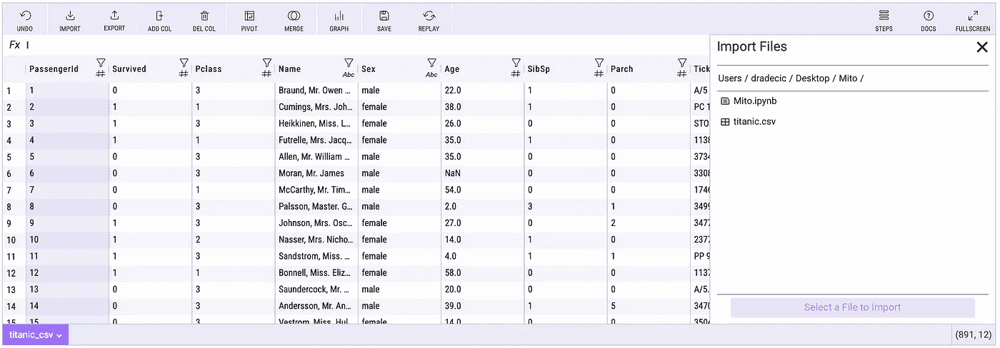
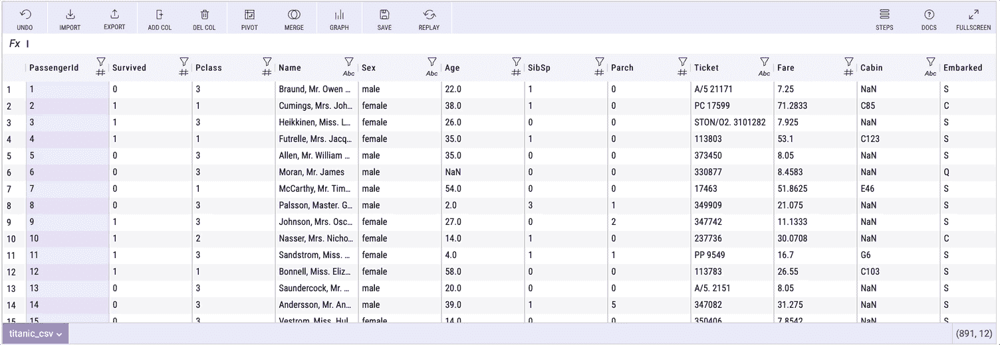
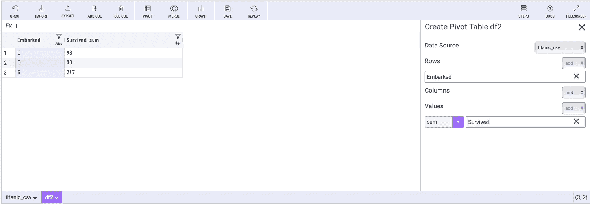
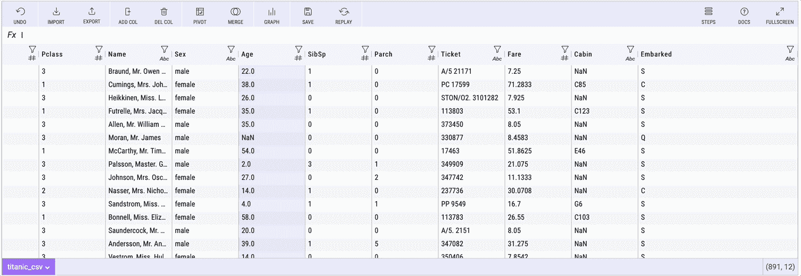

# 数据分析和可视化变得更好——米托增加了你应该尝试的 5 个功能

> 原文：<https://towardsdatascience.com/data-analysis-and-visualization-just-got-better-mito-adds-5-features-you-should-try-8758b4b7cd?source=collection_archive---------14----------------------->

## 无代码数据分析和可视化——熊猫的 GUI 使之成为可能。


在 [Unsplash](https://unsplash.com/s/photos/torch?utm_source=unsplash&utm_medium=referral&utm_content=creditCopyText) 上由 [Mitchell Y](https://unsplash.com/@mtchllyng?utm_source=unsplash&utm_medium=referral&utm_content=creditCopyText) 拍照

***免责声明*** *:这不是一篇赞助文章。我与米托或这个库的创建者没有任何关系。这篇文章展示了该库的一个公正的概述，旨在使数据科学工具能够被更广泛的大众所使用。*

试图跟上最新的数据科学库就像试图闭着眼睛阅读一样。如果不能很好地解决一个特定的问题，任何新的事物都无法获得关注。这就是米托吸引你注意力的地方。

几个月前，我已经写了关于米托的文章，但是从那以后，图书馆增加了一些新的功能并更新了现有的功能。这些将在今天讨论。

首先，让我们在您的本地机器上安装米托。

# 开始使用—在本地安装米托

米托方案有两个先决条件:

*   Python 3.6 或更新版本
*   [Node.js](https://nodejs.org/en/download/)

假设您已经安装了这两个工具，我将继续使用 Anaconda 创建并激活一个新的虚拟环境:

```
conda create --name mito_env python=3.8
conda activate mito_env
```

然后通过安装依赖项:

```
python -m pip install mitoinstaller
python -m mitoinstaller install
```

完成后，您可以启动 Jupyter 实验室:

```
jupyter lab
```

创建一个新笔记本，您就可以开始了！

# 新设计——90 年代已经过去

我喜欢工具工作出色的时候。但如果它看起来像狗屎，我就不会用它。对你来说可能不是这样，但现代设计每天都在击败不必要的边框、阴影和其他类似 Windows XP 的软件。

新的米托版本有一个更新的设计，你马上就会看到。然而，从技术上来说，这不是一个新功能，所以我不把它算在列表中。

首先，让我们创建一个新的米托工作表。假设您打开了一个空白笔记本，请执行以下代码:

```
import mitosheetmitosheet.sheet()
```

您应该会看到类似的内容:



图 1 —米托注册屏幕(图片由作者提供)

你必须输入你的电子邮件才能继续，但是他们不会用太多的邮件来打扰你。即使他们有，也总有退订的选择。

完成后，您会在笔记本中看到一张空白页:


图 2-空白米托表(图片由作者提供)

是的——米托看起来比以前更好了，但这不是你读这篇文章的原因。让我们继续第一个改进的特性—更简单的数据管理。

# 更简单的数据管理—连接到本地文件系统

我不喜欢熊猫的一点是猜测我要写多少次`../`才能找到正确的数据文件夹。米托的情况并非如此。

米托现在可以直接连接到您的本地文件系统，使数据集加载和管理更加容易。我们将在整篇文章中使用[泰坦尼克号数据集](https://raw.githubusercontent.com/datasciencedojo/datasets/master/titanic.csv)，所以如果你想继续的话，一定要下载它。

创建新的米托工作表后，您将看到导入文件的选项，如下所示:



图 3-导入文件选项(按作者分类的图像)

你可以选择你的数据集，点击下面的导入按钮。这将立即加载数据集:



图 4——米托的泰坦尼克号数据集(图片由作者提供)

该库将在下面的单元格中自动为您生成 Python 代码。现在看起来是这样的:


图片 5-生成的 Python 代码(图片由作者提供)

很整洁，不是吗？接下来我们来看看如何计算汇总统计。

# 汇总统计数据—只需点击一下鼠标

计算汇总统计数据——如平均值、中值、四分位数等——通常意味着在每一列上调用一个`describe()`函数，而不考虑变量的图形表示。

米托只需点击一下鼠标。

只需点击感兴趣的列，并浏览右侧的*汇总统计数据*选项卡。它用最合适的图表类型将数据可视化，并告诉您`describe()`函数会告诉您的一切:


图 6 —米托的汇总统计数据(图片由作者提供)

不用说，以这种方式探索数据对于任何初次接触数据集的人来说都是必须的。

# 更改数据类型—只需从下拉列表中选择

默认情况下，数据的格式并不总是正确的。要解决这个问题，您可以更改数据类型或创建一个派生列。米托轻松做到了这两点。

您可以单击标题列中的小图标打开属性，并从那里更改数据类型:



图 7-使用米托更改数据类型(图片由作者提供)

对于任何更复杂的事情，您最好创建一个派生列。下面的示例向您展示了如何将`Sex`属性转换为二进制列，其中 males 的值为 1:


图 8-使用米托创建派生列(作者图片)

前面的操作会生成以下 Python 代码:

```
# Set M in titanic_csv to =IF(Sex == ‘male’, 1, 0)
titanic_csv[‘M’] = IF(titanic_csv[‘Sex’] == ‘male’, 1, 0)# Renamed M to IsMale in titanic_csv
titanic_csv.rename(columns={“M”: “IsMale”}, inplace=True)
```

这对于任何具有基本 Excel 背景的人来说都应该很熟悉。

# 数据透视表—轻松创建和编辑

快速汇总数据的最简单方法之一是通过数据透视表。在米托，创建一个数据透视表会创建一个新的 Pandas 数据框架，然后您可以进一步修改它(例如，排序)。

解释这一概念的最佳方式是通过演示——接下来的演示创建了一个数据帧，其中包含了上船点的幸存乘客人数:


图 9 —带有米托的数据透视表(图片由作者提供)

下面是上一个操作生成的代码:

```
unused_columns = titanic_csv.columns.difference(set([‘Embarked’]).union(set([])).union(set({‘Survived’})))
tmp_df = titanic_csv.drop(unused_columns, axis=1)pivot_table = tmp_df.pivot_table(
    index=[‘Embarked’],
    values=[‘Survived’],
    aggfunc={‘Survived’: [‘sum’]}
)# Flatten the column headers
pivot_table.columns = [make_valid_header(col) for col in pivot_table.columns.values]# Reset the column name and the indexes
df2 = pivot_table.rename_axis(None, axis=1).reset_index()
```

*简单吧？*如前所述，你可以在创建后修改透视表。以下是如何对列进行排序和重命名:



图 10 —带有米托的数据透视表(2)(图片由作者提供)

前面的操作生成了以下代码:

```
# Sorted Survived_sum in df2 in descending order
df2 = df2.sort_values(by=’Survived_sum’, ascending=False, na_position=’first’)
df2 = df2.reset_index(drop=True)# Renamed Survived_sum to Total_survived in df2
df2.rename(columns={“Survived_sum”: “Total_survived”}, inplace=True)
```

最后，让我们来看看数据可视化。

# 图形—包括交互性

我喜欢可视化地检查数据，但我并不热衷于编写可视化代码。如你所料，米托会保护你。

你所要做的就是点击*图形*选项，选择可视化类型并选择 X 轴和 Y 轴的列——该库涵盖了所有其他内容。

下面是如何绘制`Age`列的箱线图:



图 11-米托数据可视化(图片由作者提供)

看起来 Plotly 是在幕后使用的，所以可视化默认是交互式的。整洁！

# 最后的话

在最近的米托版本中，五大新的/升级的特性也是如此。从旧的设计来看，官方文档还没有更新，但这只是时间问题。

问题仍然是——**你应该使用米托吗？**

我的回答和上一篇一样。作为一名数据科学家，我看不出你为什么不应该这样做，尤其是如果你精通 Excel 并想开始使用 Python 和 Pandas。米托可以让过渡过程变得容易得多。

总之——给米托一个机会。这是免费的，你不会有任何损失。我很想在下面的评论区听到你对这个库的看法。

喜欢这篇文章吗？成为 [*中等会员*](https://medium.com/@radecicdario/membership) *继续无限制学习。如果你使用下面的链接，我会收到你的一部分会员费，不需要你额外付费。*

[](https://medium.com/@radecicdario/membership) [## 通过我的推荐链接加入 Medium-Dario rade ci

### 作为一个媒体会员，你的会员费的一部分会给你阅读的作家，你可以完全接触到每一个故事…

medium.com](https://medium.com/@radecicdario/membership) 

# 了解更多信息

*   [2021 年学习数据科学的前 5 本书](/top-5-books-to-learn-data-science-in-2020-f43153851f14)
*   [如何用 Cron 调度 Python 脚本——你需要的唯一指南](/how-to-schedule-python-scripts-with-cron-the-only-guide-youll-ever-need-deea2df63b4e)
*   [Dask 延迟—如何轻松并行化您的 Python 代码](/dask-delayed-how-to-parallelize-your-python-code-with-ease-19382e159849)
*   [如何用 Python 创建 PDF 报告——基本指南](/how-to-create-pdf-reports-with-python-the-essential-guide-c08dd3ebf2ee)
*   [2021 年即使没有大学文凭也能成为数据科学家](/become-a-data-scientist-in-2021-even-without-a-college-degree-e43fa934e55)

# 保持联系

*   在 [Medium](https://medium.com/@radecicdario) 上关注我，了解更多类似的故事
*   注册我的[简讯](https://mailchi.mp/46a3d2989d9b/bdssubscribe)
*   在 [LinkedIn](https://www.linkedin.com/in/darioradecic/) 上连接