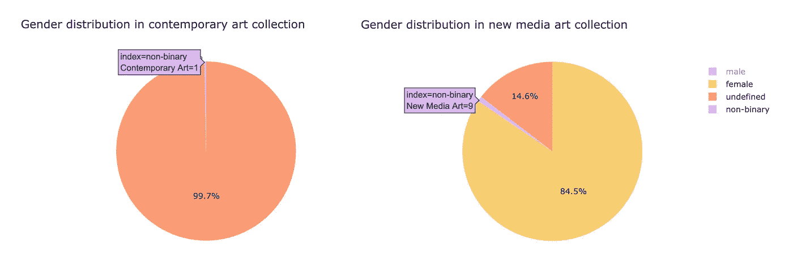
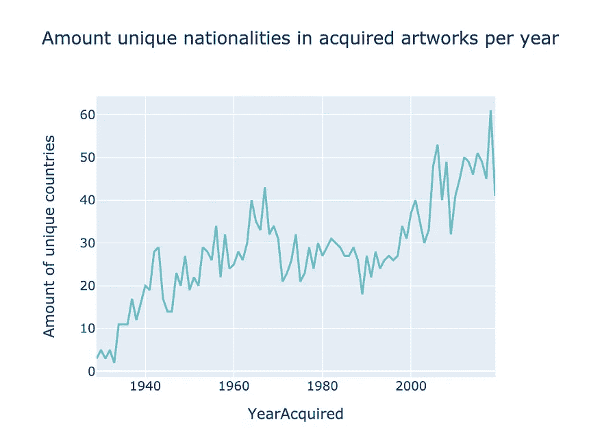
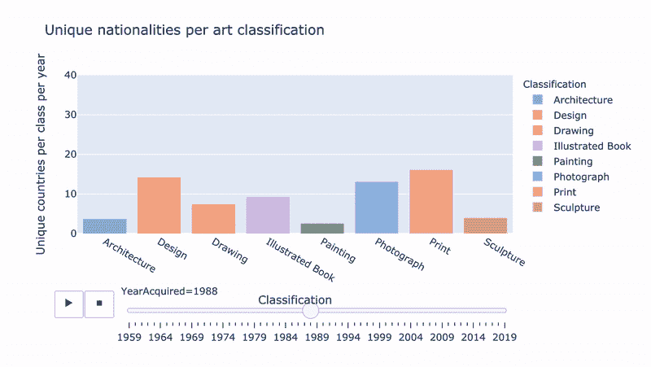
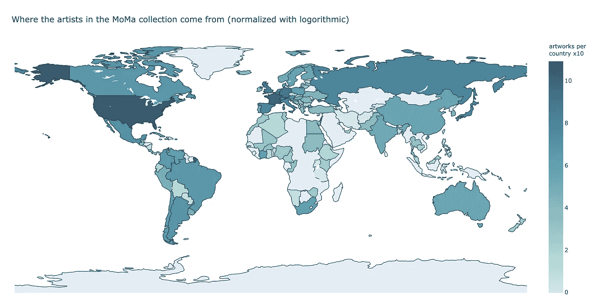
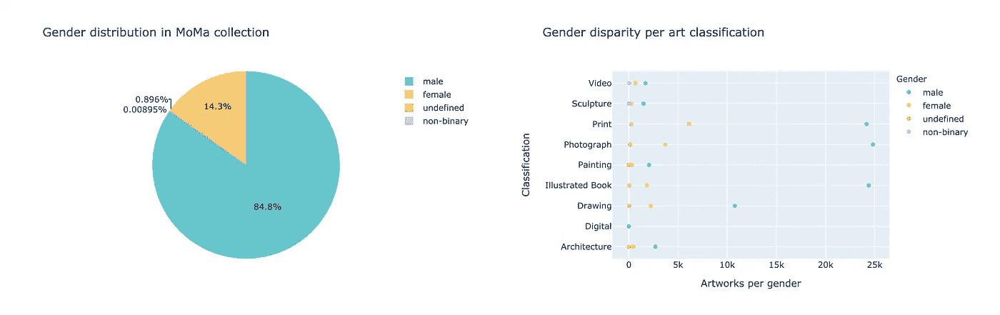
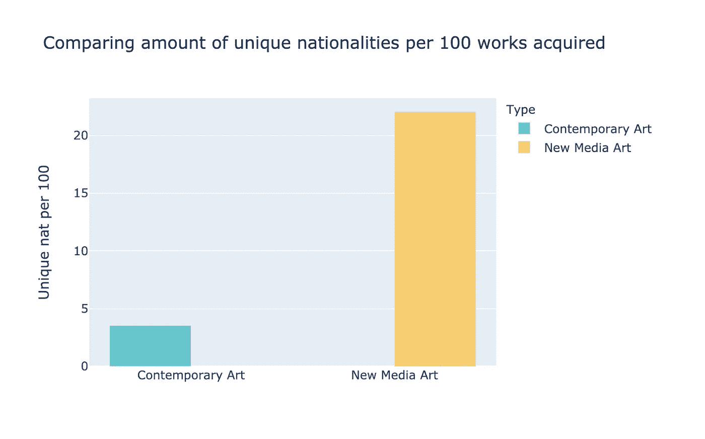
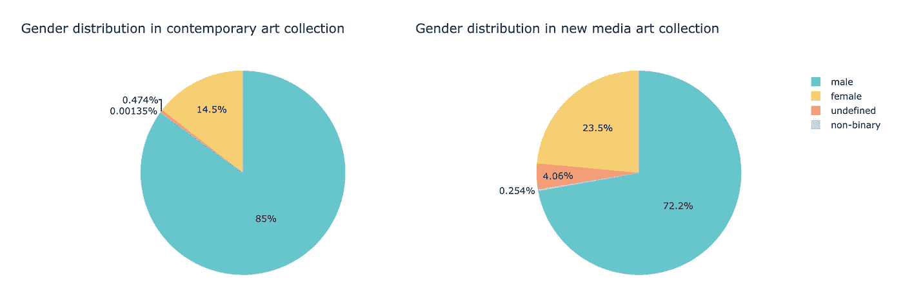
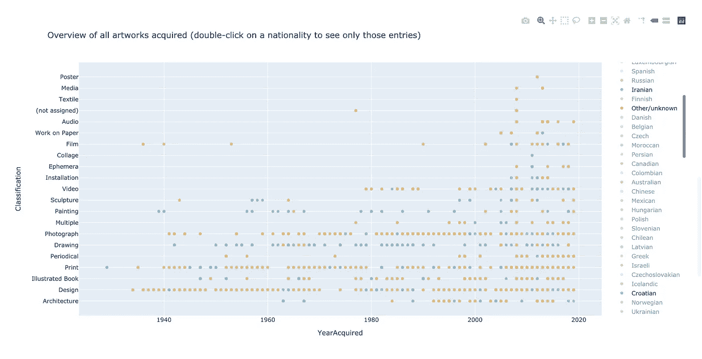

# MoMa 艺术收藏中种族多样性和性别分布的数据分析和可视化

> 原文：<https://towardsdatascience.com/data-analysis-and-visualization-of-ethic-diversity-gender-distribution-in-the-moma-art-9ce57c1a4f9e?source=collection_archive---------28----------------------->

*剧透:13.1 万件藏品中有 11 件作品出自非二元艺术家之手，其中 9 件来自新媒体艺术部门*

作为 MA 数据驱动设计的一部分，我的数据科学课被要求探索我们感兴趣的任何主题，我偶然发现了这个[官方 MoMa 数据集](https://github.com/MuseumofModernArt)，概述了他们收藏的 138.185 件艺术品。惊讶地发现以前没有人发表过任何关于它的分析或可视化，我很快就做出了决定。由此产生的见解很有趣，也许对进一步的研究有用，所以我决定改变我的任务，并在这里与你分享！

在🕵🏼‍♀️研究框架，我陈述了研究的目标，并勾勒了现代艺术机构，尤其是 MoMa 的多元化背景。

在…里📊数据洞察，我用彩色图表展示了分析的结果，并附有结论和讨论。

在🧽方法论中，我主要使用 Python、Pandas 和 Plotly 详细介绍了数据清理和预处理的过程和决策。

## 放弃

我并不宣称这些发现是绝对真实的——仅仅是数据集中反映的推论。多样性的维度极其有限，并且没有考虑到交叉性。这些结果不是指责，而是讨论的起点。数据预处理可能包含缺陷——我正在学习。既然我们已经解决了这个问题，那就让我们开始吧。

# 🕵🏼‍♀️研究框架

## 研究目标

这项研究旨在分析 MoMa 藏品中的种族和性别多样性，重点是对当代艺术和新媒体艺术作品进行比较分析。我的假设是，新媒体艺术部将会比它的当代同行获得更多艺术家的作品。

虽然研究的范围在数据集的范围(仅限于 MoMa 机构)和多样性的措施(仅限于种族和性别)方面都非常有限，但分析希望为围绕艺术机构和不同艺术实践中的代表性的进一步讨论提供一个起点。

## 艺术和现代艺术博物馆收藏的多样性

现代艺术博物馆(MoMA)是世界上最大和最有影响力的博物馆之一，对现代艺术的发展和收藏产生了巨大的影响(Kleiner，2016 年，第 1-3 页)。库尔特·勒温的看门人理论是一个选择，然后过滤媒体项目的过程，这些媒体项目可以在一个人碰巧拥有的时间或空间内被消费*这有助于我们理解 MoMa 机构在设定全球艺术议程中作为一个重要的看门人。*

*2019 年，MoMa 在一次大规模翻新后重新开放，旨在象征和实现其对来自更多元化地理和背景的艺术家的更多元化收藏的承诺([法拉戈，2019](https://www.nytimes.com/2019/10/03/arts/design/moma-renovation.html) )。2019 年 3 月进行的第一次大规模美国主要博物馆艺术家多样性研究提供了每个博物馆的性别和种族多样性估计，得出的结论是 85%的艺术家是白人，87%是男性。它还观察到，增加多样性的大部分努力都集中在游客和工作人员身上，而不是集合中的艺术家( [Topaz，2019](https://journals.plos.org/plosone/article?id=10.1371/journal.pone.0212852) )。*

*全球艺术行业正在努力解决多样性问题。随着现代艺术博物馆公开宣称其对多样性的承诺，我们开始评估这些意图是否超越了它的项目而延伸到藏品本身。*

## *当代与新媒体艺术*

*在当代和新媒体艺术的区分中，我们坚持将新媒体艺术定义为*“一个包含通过新媒体/数字技术制作、修改和传播的艺术形式的综合术语”* ( [Grau，2016](https://www.oxfordbibliographies.com/view/document/obo-9780199920105/obo-9780199920105-0082.xml) )。相反，新媒体艺术被认为具有更容易接近的性质和包容性的文化，然而很少或没有公共研究可以证明这一说法。这项研究还试图证明，与当代艺术相比，新媒体艺术的多样性是否在 MoMa 收藏中有所体现。*

# *📊数据洞察*

## *MoMa 系列中的种族多样性*

*数据显示，这些年来，收藏中的种族多样性明显增加，2018 年购买来自 61 个独特民族的艺术家作品达到最高峰，是 1989 年 18 个国家的三倍。右侧的动画展示了从 1986 年到 2019 年购买的每个流行分类的独特国籍。*

****

*作者提供的图片*

*世界地图显示，欧洲和美国艺术家明显过多，而中东，非洲和亚洲的部分地区在收藏中代表性不足。这里的数据是以对数标度归一化的。*

**

*作者图片*

## *MoMa 系列中的性别分布*

*性别分布极不平衡，85%为男性艺术家，14%为女性，1%不确定或未知。在 MoMa 收藏的作品中，只有 0.01%是由非二进制艺术家创作的:在数据集中的 140，000 件作品中，总共占了 11 件。*

*从右边的图表中，我们可以根据点之间的距离推断出一些分类比其他分类具有更好的性别分布。在摄影作品中，我们可以看到男性(25K)和女性(4K)之间的巨大差距，而建筑则更加平衡(根据进一步的调查，确实是扎哈·哈迪德一手造成的)。*

**

*作者图片*

## *当代与新媒体艺术收藏的多样性*

**

*数据显示了当代艺术和新媒体艺术作品之间的明显差异。对于每 100 件被收购的艺术品，当代艺术将从平均来自 3-4 个不同国家的艺术家那里购买新媒体艺术，包括多达 22 件，是这个数字的 6 倍。*

*当代艺术和新媒体艺术的性别分布分别是男性占 85%至 72%，女性占 14.5%至 23.5%，女性占 0.001%至 0.3%。*

**

*作者图片*

*2000 年后获得的当代艺术收藏中有 1 件作品来自非二元艺术家，而新媒体艺术收藏中有 9 件。*

**

*作者图片*

# *结论*

*当代和新媒体艺术之间的差异是显著的，并证实了新媒体艺术是一个更加多样化的空间的看法，这反映在 MoMa 的收藏中。在整个收藏中，我们看到非二元和 POC 艺术家仍然严重不足，这表明我们在致力于将艺术收藏作为社会的反映方面还有很长的路要走。*

# *讨论*

*为了继续研究，深入研究各种分类之间的比较和相互关系并考虑多样性的更多交叉措施将是令人感兴趣的。至于局限性，这项研究仅限于种族和性别作为多样性的衡量标准。种族划分是基于一个人的国籍，而不是他们的种族或他们自我认同的文化。因此，这非常有限地代表了多样性的含义。*

*至于复杂问题，不再存在的国家，如南斯拉夫，必须从数据集中删除，因为它们与 Plotly 图书馆不兼容。虽然就这项研究的目的而言，这并不是直接的问题，但很容易看出，如此容易地抹去一个国家的文化遗产需要谨慎。*

# *🧽数据(预处理)*

## *现代艺术博物馆数据集*

*使用的数据集是在[官方 MoMa GitHub](https://github.com/MuseumofModernArt) 上提供的艺术品文件。它包含 138.185 条记录，每条记录都有详细的元数据。*

## *数据清理和格式化*

*经过初步的数据清理，融合重复和删除丢失和损坏的价值，130.822 作品仍然存在。*

*不同的艺术实践是基于分类栏。当代艺术系列包括绘画、家具和室内装饰、插图书籍、印刷品、雕塑、绘画、出版物、纺织品和纸上作品，总共有 23754 件作品。*

*新媒体艺术集包括音频、数字、电影、平面设计、媒体、视频、软件共 3089 件作品。一些实践，如设计或摄影，不包括在任何一个数据集中，因为这些类别没有提供有意义的方法来区分它们。在提供的数据集中，当代艺术作品比新媒体艺术作品多得多，这就是为什么在一些可视化中，值被标准化为百分比。*

*时间线是基于作品被博物馆收购的年份，而不是艺术家创作的年份。仪表板上的各种可视化覆盖了不同的时间跨度。在当代艺术和新媒体艺术的比较中，两个数据集都只包括 2000 年以后的作品。*

*国籍基于国籍元数据，仅考虑主要国籍。使用 GitHub 上的 [coco converter 库](https://github.com/konstantinstadler/country_converter)和 [Demonym CSV 文件](https://github.com/knowitall/chunkedextractor/blob/master/src/main/resources/edu/knowitall/chunkedextractor/demonyms.csv)完成国家转换。世界地图上的国籍计数已经使用对数重新缩放进行了规范化。一些国籍已从数据集中删除，因为在世界地图上绘图所需的 ISO ALPHA 3 代码不再支持它们。这导致南斯拉夫人和科普特人等民族被删除，威尔士人和苏格兰人被添加到英国类别下，美洲土著人被添加到美国类别下——这是一行简单的代码，具有复杂的含义，在讨论中简要提及。*

*性别基于性别元数据(男性/女性/非二元/未定义)，仅考虑主要性别。*

## *语言和图书馆*

*主要使用 [Python](https://www.python.org/) 和[熊猫](https://pandas.pydata.org/)完成数据格式化和清理。数据可视化依靠 [Plotly](https://plotly.com/python/) 、 [Plotly Express](https://plotly.com/python/plotly-express/) 和 [Dash](https://plotly.com/dash/) 在 HTML 页面上显示图形。*

**

*作者图片*

# *谢谢你*

*如果你读到这里，谢谢你和我一起阅读！我很想听听您对这些见解的看法，是否以及如何使用它们，以及您是否有任何建议让我改进未来(数据)项目的方法。*