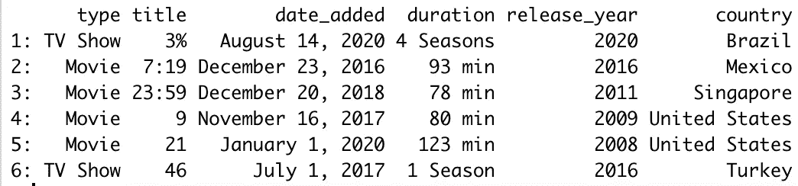
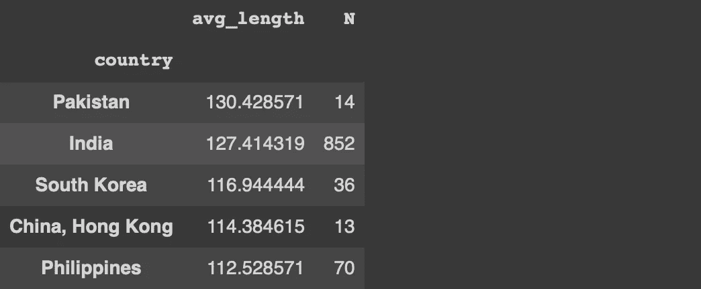

# 最佳数据分析

> 原文：<https://towardsdatascience.com/data-analysis-at-its-finest-69b8624ae988?source=collection_archive---------30----------------------->

## 一个能让你更喜欢 R 的例子


[美国传统巧克力](https://unsplash.com/@americanheritagechocolate?utm_source=unsplash&utm_medium=referral&utm_content=creditCopyText)在 [Unsplash](https://unsplash.com/s/photos/finest?utm_source=unsplash&utm_medium=referral&utm_content=creditCopyText) 上拍摄的照片

Python 和 R 是数据科学生态系统中的主流语言。它们都提供了大量的库来执行有效的数据争论和分析。

说到数据分析，熊猫一直是我的首选。然而，我觉得我的一些偏好可能会因为 R 包的出色功能而改变。

在本文中，我们将使用 R 包完成一个稍微复杂的任务。我会一步步讲解，让每一步的操作都清晰明了。最后，您将看到每个步骤是如何组合在一起，在一大步中完成任务的。

值得注意的是，同样的操作也可以在熊猫身上进行。事实上，我也将提供熊猫代码，这样你就有机会做一个比较。

我们将使用 Kaggle 上[网飞](https://www.kaggle.com/shivamb/netflix-shows)数据集的一部分。我们从导入库和读取数据集开始。

```
library(data.table)
library(stringr)netflix <- fread(
   "~/Downloads/netflix_titles.csv", select = c("type", "title", 
   "date_added", "duration", "release_year", "country")
)head(netflix)
```



(图片由作者提供)

该数据集包含网飞电视节目和电影的一些特征，例如类型、长度、国家等等。

任务是找到电影中平均电影长度排名前 5 的国家。作为一个附加条件，我想筛选出少于 10 个标题的国家。

第一步是创建一个包含电影长度(以分钟为单位)的列。我们可以通过从 duration 列中提取数字部分来获得它。

```
netflix$duration_qty <- as.numeric(str_split_fixed(netflix$duration, " ", 2)[,1])
```

我们使用 stringr 包的 str_split_fixed 函数来拆分空格字符处的值。然后我们用 as.numeric 函数将第一部分转换成一个数字。

下一步是过滤电影标题，因为我们对电视节目不感兴趣。使用 data.table 包进行过滤可以按如下方式进行:

```
netflix[type == "Movie"]
```

平均电影长度可以按如下方式计算:

```
netflix[
   type == "Movie", 
   .(avg_length = mean(duration_qty)
]
```

但是，我们希望分别计算国家/地区列中每个类别的平均电影长度。此任务涉及“分组依据”操作。我们可以使用 by 参数来实现它。

```
netflix[
   type == "Movie", 
   .(avg_length = mean(duration_qty), 
   by = "country"
]
```

因为我们想过滤掉电影数量少于 10 部的国家，所以我们需要一个变量来保存数量信息。这可以通过添加 count (N)函数来轻松实现。

```
netflix[
   type == "Movie", 
   .(avg_length = mean(duration_qty, .N), 
   by = "country"
]
```

该任务的剩余部分是:

*   过滤少于 10 部电影的国家
*   按照电影平均长度降序排列国家
*   选择前 5 个

```
[N>10]                                       # filter
[order(avg_length, decreasing = TRUE)]       # sort
[1:5]                                        # select
```

我们现在可以将每个步骤合并到一个操作中。

```
netflix[, duration_qty := as.numeric(str_split_fixed(netflix$duration, " ", 2)[,1])][type == "Movie", .(avg_length = mean(duration_qty), .N), by='country'][N>10][order(avg_length, decreasing = TRUE)][1:5]
```


(图片由作者提供)

下面是如何用 pandas 完成相同的任务(首先需要导入 Pandas 并将数据集读入 dataframe)。

```
netflix["duration_qty"] = netflix.duration.str.split(" ")\
.str.get(0).astype('int')netflix[netflix["type"] == "Movie"].groupby("country")\
.agg(avg_length = ("duration_qty", "mean"), 
     N = ('duration_qty', 'count'))\
.query("N > 10")\
.sort_values(by="avg_length", ascending=False)[:5]
```



(图片由作者提供)

## 结论

Pandas 和 data.table 库都允许链接多个操作。因此，我们可以将一个复杂的任务分解成几个小步骤，然后将它们组合起来。这种模块化还提供了很大的灵活性，我认为这对于某些数据争论任务非常重要。

这两个库都非常强大，能够成功完成高度复杂的操作。因此，您可以选择其中任何一个来进行数据争论和分析过程。

尽管我使用 Pandas 的次数更多，但 data.table 的语法似乎更吸引我。

感谢您的阅读。如果您有任何反馈，请告诉我。