# 数据分析初学者:Python 让它变得简单

> 原文：<https://towardsdatascience.com/data-analysis-beginners-python-makes-it-easy-70c98d43d621?source=collection_archive---------38----------------------->

## [电子表格到 PYTHON](https://towardsdatascience.com/tagged/spreadsheets-to-python)

## *在这个系列中，* [*【电子表格到 Python】，*](https://towardsdatascience.com/tagged/spreadsheets-to-python) *我探索了 Python 数据分析的许多乐趣和好处，并鼓励读者自己尝试一下。*

照片由 [Hitesh Choudhary](https://unsplash.com/@hiteshchoudhary?utm_source=medium&utm_medium=referral) 在 [Unsplash](https://unsplash.com?utm_source=medium&utm_medium=referral) 上拍摄

现在是做数据分析师的大好时机。只需点击一个按钮，就有如此多的数据可供分析，因此获取知识和产生影响的机会是无限的。

我们用来管理和分析这些数据的技术可以让这项任务变得令人生畏或令人愉快。

与电子表格相比，使用代码的一大优势是从大型数据集中可靠地提取信息非常容易。这里，我们将生成代码，可重复地对不同的数据子集执行计算，以产生有趣的比较。

在电子表格中这样做需要手动操作，这可能会引入错误。

因为代码是立即可见的，所以另一个用户很容易看到发生了什么并检查它是否正确；在电子表格中，对于所有的输出，这必须一个单元格一个单元格、一个标签一个标签地进行。

我一生都是板球爱好者，板球爱好者喜欢统计数据。我也喜欢 Python，所以我决定在这个练习中将两者结合起来。

我将向您展示如何使用 Python 从数据集中提取信息，并进一步了解英格兰最优秀的击球手之一:Joe Root。

除了查看他的职业生涯统计数据，我们还会看到鲁特的击球率如何取决于他在哪里打球、不同的对手、比赛中的时间等因素。

虽然使用的数据只有 200 行和 11 列，但是使用的方法很容易扩展。

因为大部分工作是重复的，我们将编写一个简短的函数来可靠地提取我们想要的数据，这使得一切变得更加整洁。

# 让我们加载一些数据

首先，我们需要打开一个 Python 环境。我使用 [Filament](/www.filament.so) ，它允许我为博客组合文本和代码，也便于与同事分享反馈。

我已经编译了一个 csv 文件，其中包含鲁特最近一次测试赛之前的击球数据，那次测试赛是在 9 月初，对手是印度。这复制了一个非常常见的情况:我们有一个 csv 文件，我们需要选择如何查看和分析它包含的数据。让我们用 Python 中的[熊猫](https://pandas.pydata.org/)来看看这是如何工作的。

第一步是加载我们稍后需要的模块。

现在我将读取 csv 文件，

这给了我:

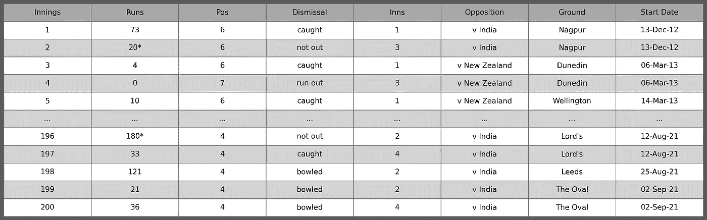

作者图片

为了清楚起见，我没有包括上图中的所有线条。

接下来，几乎总是这样，我们需要做一点数据操作。乔·鲁特主要扮演击球手，我们对他的击球率感兴趣。计算方法是将得分的总次数除以他出局的次数。然而，有时他完成一局“没有出局”。这在`Dismissal`栏中显示，在`Runs`中用*表示。这些分数计入得分，但不计入出局数。

我需要一种简单的方法来计算出局数。为此，我将创建一个新列`Out`，如果他不在，用 1 表示，如果不在，用 0 表示。我还将创建一个新列`Runs 2`，仅包含数字数据，即没有*。

让我们来看看实际情况。

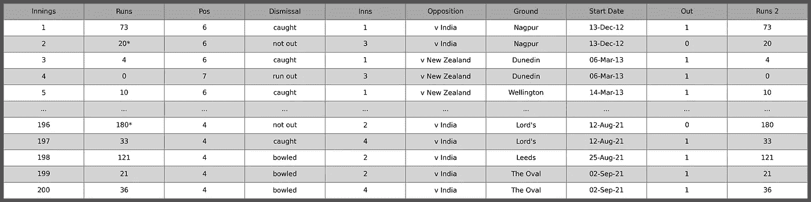

作者图片

检查一些总体统计数据以确保操作正确是有用的。

这给出:总局数= 200；总运行次数= 9278；不 Out = 15 高分= 254；职业生涯平均= 50.15；总世纪数= 23。

快速浏览一下互联网就可以确认这些价值。

在进行更详细的分析之前，让我们来看一些关键数据:跑步、职业平均和最近平均。

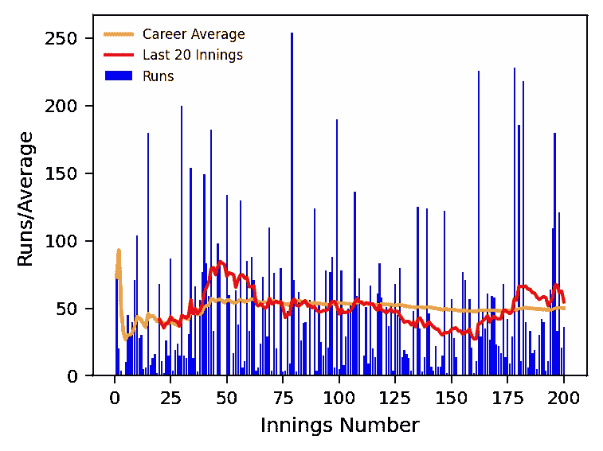

作者图片

用 Python 制作吸引人的图形真的很容易。在这里，我们看到了鲁特在前 120 局的出色记录，随后在接下来的 50 局左右的时间里有所下降，最近又恢复了状态。

# 让我们编写一些代码来探索这些数据

现在，我想更深入地研究这些数据。我们来看看鲁特对不同对手的平均水平。我对代码做了一些注释，以显示正在发生的事情。

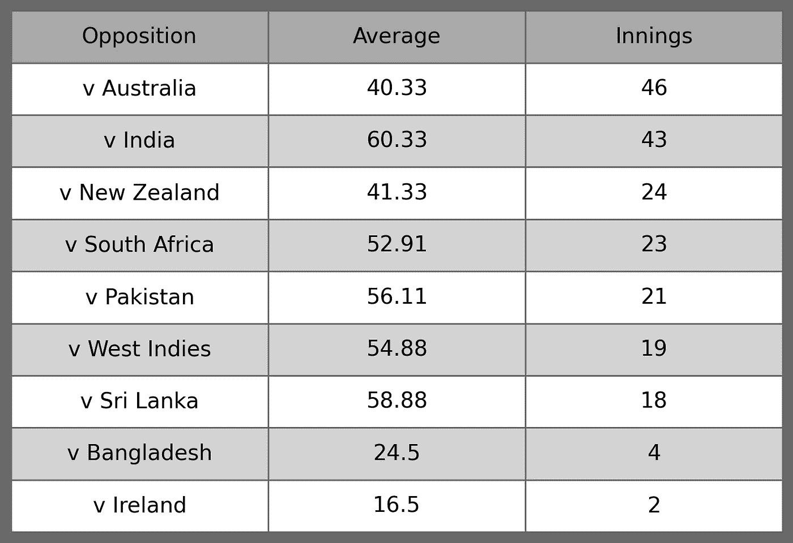

作者图片

抛开孟加拉国和爱尔兰，鲁特总共只打了 6 局，我们看到他对印度和斯里兰卡的平均水平特别高，可能是因为他对旋转保龄球的众所周知的[实力](https://www.thetimes.co.uk/article/joe-root-is-in-a-class-of-his-own-against-spin-bowling-says-ben-stokes-ffzrjxb9f)，而对澳大利亚和新西兰的平均水平比其他人低得多。

太酷了。现在我想试着看看他在比赛中不同局的击球记录(对于非板球爱好者来说，比赛有 4 局，在正常情况下，每个队都在 1 和 3 或 2 和 4 中击球)。

看起来我们会经常使用上面的代码。让我们定义一个函数，它允许我们选择要比较的变量，并输出相关的平均值。这实际上只是将前面的代码转换成函数的一个例子，但是我也缩短了变量名。

检查这个函数是否给出与上面相同的结果可能是个好主意。我们按如下方式调用函数:

作者图片

👍

# 让我们使用我们的新代码

现在计算鲁特在不同局比赛中的平均得分变得非常简单。这很有趣，因为它表明他在比赛的第二局击球时的平均得分比第一局或第三局高得多，而在第四局却很低。也许鲁特(和英格兰)不喜欢追一个总。

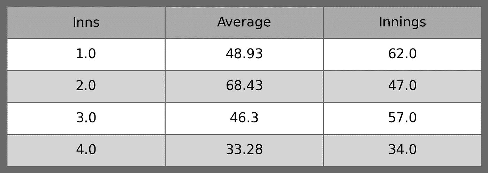

作者图片

一个板球队有 11 名队员，每人轮流击球。公认的击球手通常在 1-6 号位打球，鲁特占据了所有的位置，[更喜欢在 4 号位打球，尽管正如我们在下面看到的，他的最佳位置实际上是 5 号位。](https://www.independent.co.uk/sport/cricket/england-vs-new-zealand-test-series-joe-root-number-four-joe-denly-chris-silverwood-cricket-a9202396.html)

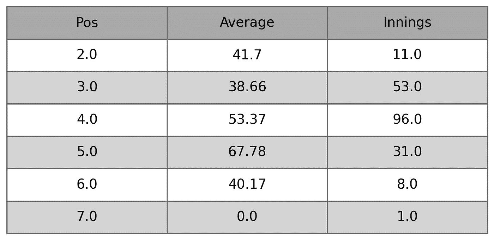

作者图片

现在我们有了一个函数，很容易对原始表中所有不同的列标题运行它，但是我不打算在这里这样做(我已经这样做了，结果在下面的附录中)。

相反，让我们看看现在比较不同国家的记录有多容易。鲁特在对阵印度和澳大利亚的比赛中打了几乎相同的几局，但平均得分却大相径庭。

我们可以快速生成数据帧，其中只包含与这两个国家比赛的信息。

现在，我们的函数可以用于这些新数据帧中的每一个，以提取 Root 相对于它们的性能的更详细的比较。为了证明这一点，下面是他在不同局比赛中的平均得分比较:

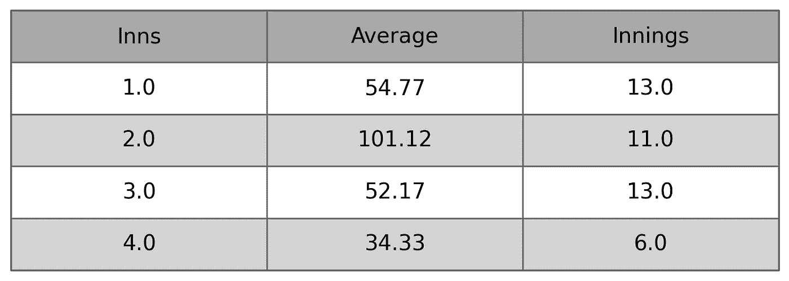

乔·鲁特对印度的平均得分——作者图片

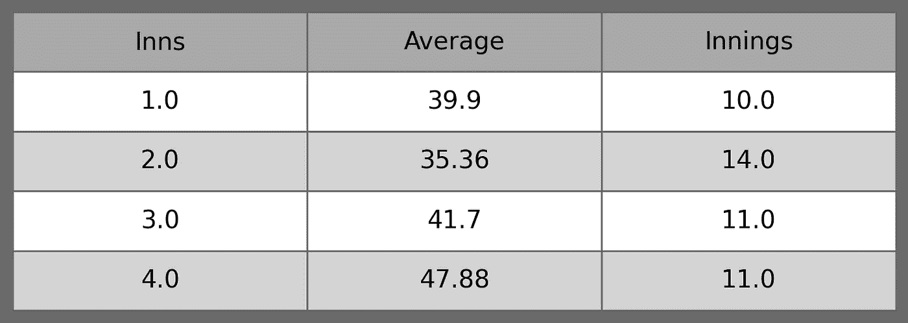

乔·鲁特对澳大利亚的平均得分——图片由作者提供

和几个世纪的比较:

世纪 v 印度= 8；世纪对澳大利亚= 3。

在 Python 中进行这种分析的便利之处在于，我们可以使用这些函数快速探索我们想要的数据的任何其他方面。

# 结论

就 cricket 而言，我可能没有赢得您的支持，但是我希望我已经说明了 Python 中的数据分析是多么简单和有用。

使用代码允许我们从原始 csv 文件中提取信息，并根据这些信息进行计算。很容易定义一个函数来做我们想要做的事情，然后使用该函数来探索不同因素或变量对结果的影响。在电子表格中这样做需要耗时的手工操作。

最后，因为我们不是在与原始数据相同的文件中工作，所以我们不必担心意外地改变某些东西——分析中的所有步骤都是可重复的。

所有这些代码都可以很容易地用于更大数量的数据，这在电子表格中会更麻烦，如果文件可以打开的话。甚至还有一个库，Dask，用于处理大量的数据。

我希望这篇文章展示了使用 Python 来探索数据是多么容易，并启发您亲自尝试一下。关于其他例子，请查看我的[最新的“电子表格到 Python”文章。](/spreadsheets-to-python-its-time-to-make-the-switch-ef49cf9463d5)

*这篇文章的文本、代码和图像是使用*[*Filament*](http://www.filament.so/)*创建的，这是一个用于数据、分析和报告的一体化工作空间。如需了解更多信息，请访问我们的网站*<http://www.filament.so/>**。Filament 目前正在运行一个封闭的测试程序；前 100 名使用推荐代码 TDSFILAMENT 请求访问的人可以跳过等候名单，提前获得访问权限。**

**感谢邦妮·塞勒斯·维勒斯基和尤安·维勒斯基**

## *保持联系*

*   *关注我在[媒体](https://clivesiviour.medium.com/)上的更多类似的故事*
*   *在 [LinkedIn](https://www.linkedin.com/in/clive-siviour/) 上连接*

# *附录——一些更有趣的记录*

## *国内还是海外*

*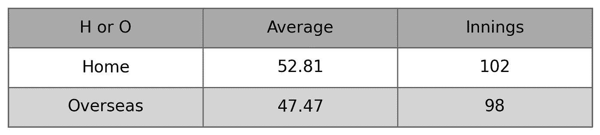*

*作者图片*

## *如何解散*

*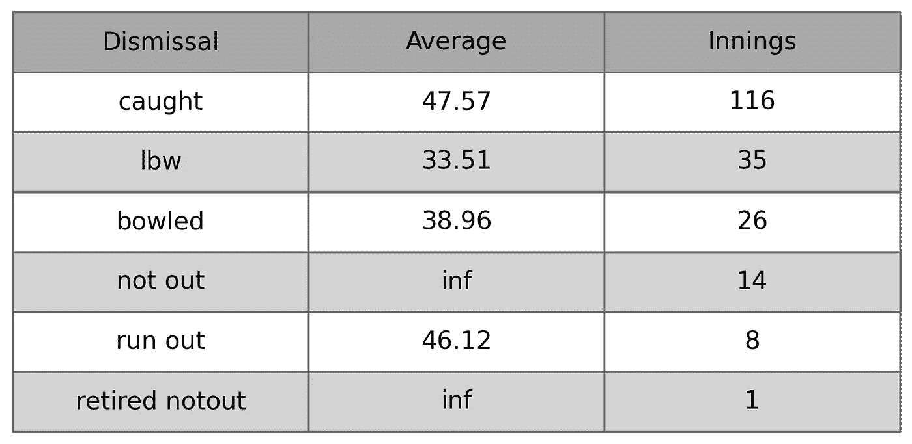*

*作者图片*

## *地面*

*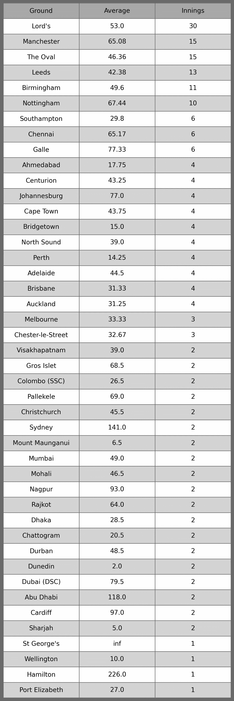*

*作者图片*