# 初学者的数据分析

> 原文：<https://towardsdatascience.com/data-analysis-for-beginners-90a8d53fa2f9?source=collection_archive---------20----------------------->


卢卡斯·布拉塞克在 [Unsplash](https://unsplash.com?utm_source=medium&utm_medium=referral) 上的照片

在过去的六个月左右的时间里，我决定尝试学习一些 python 来进行数据分析。目标是什么？我猜是技能培养。我喜欢学习新的东西，作为一名工程学本科生，我认为 python 将是开始学习如何编码的一个好地方。我喜欢人工智能用于医疗保健和机器学习的想法，所以我在这里，试图学习 python。我的主要问题是，我还没有真正开始我自己的项目。去年假期，我尝试了“代码 2020 挑战的来临”,但只坚持了几天。我的[尝试](https://github.com/DillM94/Advent_of_Code2020)对起床来说毫无意义，最终我放弃了，因为我的实习责任对我来说有点太多了，我无法兼顾一切。我一直在 DataCamp 上学习数据科学课程，虽然我喜欢它给我的结构，但我发现它的数据集/项目并不令人鼓舞。我经常为了练习而完成它们，但是我自己懒得去研究任何东西。

然而，在过去的一年里，一些事情促使我开始摆弄我的第一个数据集。一月初在爱尔兰有了 lockdowns insight，没有迹象表明我会回到大学(我们上网)，我发现我有很多空闲时间比平时跑得更多。几乎每天，我都会出去跑 5 公里，目的是保持健康，保持身材，希望最终能跑 20 分钟以下(到目前为止我还没有做到)。我有点认真地对待我的 Strava 账户，并报名参加了每月 100 公里的跑步。不过，我遇到的一个问题是，Strava 希望我支付额外费用来获得一些漂亮的图表和分析。订阅不会发生。我是一名学生，可能是为数不多的没有音乐流媒体服务的年轻人之一，因为我无法将预算拉长那么多。这让我开始思考，为什么我不自己把数据倒出来，做一些漂亮的图表呢？原来 Strava 有一个可爱的方法可以将你的数据下载到 csv 文件中，作为一个初学 python 的程序员，我知道如何使用它。这篇文章是关于六个月的小数据集。在这个过程中，我希望你能学到一些关于 Python、pandas 和 plotting 的知识，也许它会启发你找到自己的数据集来探索和提取一些有意义和令人兴奋的信息。

1.  但是首先，我们要上几堂课

那些了解 pandas 和 matplotlib 基础知识的人可以跳过，也许我会放一些 gif 来吸引你的注意力，让你在数据分析开始时停下来。也许不会，这是我第一次写作，我不知道我会做什么。对于其他人，我将使用这个小模块来解释熊猫和 matplotlib 的基础知识。我希望这篇文章能让初学者学到一些东西，同时让你体验一下如何使用网上的数据集。我将把这个简短的课程分成三个部分，python，pandas 和 matplotlib。python 部分会很短，如果有人想上 Python 的课，我可以写一篇全新的文章，请告诉我！

**1.1 Python**

那么 Python 是什么呢？或者为什么要为此烦恼呢？嗯，我不是计算机科学家，但是学了一点 MATLAB 和 Java，我可以有把握地说 Python 是最容易学的编程语言之一。幸运的是，它是最常见的编程语言之一，并得到了数据科学界的大力支持。如果没有 python，我将无法使用像 pandas 和 matplotlib 这样的工具，并且将不得不依靠其他编程语言来完成某些任务。它有它的缺点，但是对于一个初学编程语言和数据科学的人来说，它是理想的。举个简单的例子，看看这个:

用 Java 打印“Hello World ”:

```
System.out.println('Hello World')
```

用 Python 打印“Hello World ”:

```
print('Hello World')
```

我们中的大多数人都有可能同意，其中一段代码比另一段更直观。再说一遍，我不是计算机科学家，但我是一名工程师，我需要最有效的工具来完成这项工作。(此外，我认为我遗漏了一些 Java 代码的公共静态 void。已经有一段时间了，请不要对我大喊大叫。)

**1.2 只熊猫**

数据科学家传统上使用 R，一种为统计软件和数据分析而构建的编程语言。我喜欢。它肯定能完成任务。但是随着 Python 拥有了更多的读者，Wes McKinney 开始用 Python 实现 R 的数据框架。他建立了熊猫图书馆，因此数据科学能够接触到更多的人。使用 pandas，我们能够创建、操作和显示表格数据。在很大程度上，它看起来像一个 excel 电子表格，有列、行和许多函数来改变它们之间的一切。它的力量来自于你，来自于用户，来自于你对数据的任何操作方式。

我们有多种方法来创建自己的自定义数据框架，其中一种方法如下所示:

它将输出以下内容:

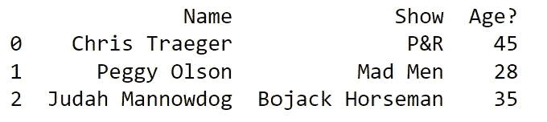

每列有三行数据，每一行数据都有各自的条目。这些条目可能是空的，真/假值，浮点数，地址，任何东西。关于码箱，我先从`import pandas as pd`说起。Pandas 不会自动内置到 python 中。没有那行代码，我将无法执行任何熊猫的命令。我可以毫无问题地把它们打出来，但是当我试图运行代码时，我会得到一个错误。`as pd`部分只是让我给熊猫取个小一点的名字。在上面的例子中，我使用了一个字典来创建数据帧。每个键是列名，每个值是该列的行中的条目。为什么要创建这样的数据帧？好吧，如果你在课堂上为一个项目收集一些列和行的数据，并且你更喜欢 pandas 的灵活性和 matplotlib 的图表而不是 Excel，那么手动创建一个像上面这样的小数据框架可能是值得的。

但是，通常您会将数据存储在硬盘上的其他地方，您会想要导入这些数据。您将在下面看到如何做到这一点。

**1.3 Matplotlib**

Python 没有绘制和显示数据的固有方法。Matplotlib 帮助我们解决了这个问题。让我们看一个例子:

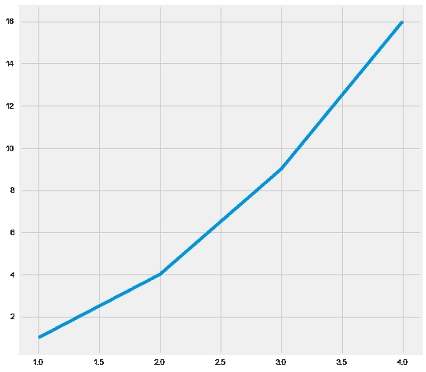

同样，我必须导入相关的库。然后，我用`plt.subplots()`创建了一个图形和一个轴。一旦创建，我可以创建任何类型的情节，我能想到的。这里我使用了`.plot()`，它给出了一个线形图，但我也可以使用`.scatter()`或`.hist()`分别给出散点图或柱状图。然后我调用`plt.show()`来显示这个图。

*2。数据探索*

在投入之前，我认为最好从几个目标开始。当我开始查看数据并探索 Strava 会给我的任何东西时，一些东西可能会引起我的兴趣，但如果我们开始时心中有一些东西，至少我们不会挣扎着开始。因为我大概每个月跑一次，脑子里一直想着 100k，所以我想每个月都比较一下。Strava 给了我跑步记录，但不允许我按月/周/星期几过滤。我还想知道我每个月的平均时间/距离是多少。我开始跑 5 公里，然后慢慢增加到 10 公里，在 6 月份，我跑了 3 次半程马拉松。也许我可以说明距离的增加？我的总时间增加了吗？让我们把这些都记下来。

*   每月距离/跑步次数。
*   距离是急剧增加还是逐渐增加？
*   距离/时间/月份图表。

剩下的部分有望更多地基于代码。必要时，我会对代码块进行注释。我不会分解每一行，但希望探索数据集的信息会变得清晰。

**2.1 导入、清洗、初始观察**

我下载的数据有多份。csv 文件。csv 代表逗号分隔值，是处理数据时最常见的文件类型之一。使用`pd.read_csv`后跟我保存的文件路径，我可以将我的数据保存到`strava_df`。

为了确保我的数据涵盖 2021 年前六个月，我可以使用`.head()`和`.tail()`方法来查看我的数据集的顶部和底部。

`.head`慨然:

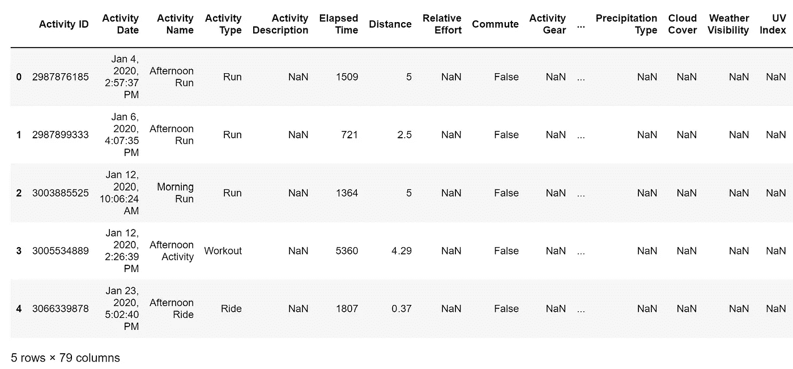

并且`.tail`给出:

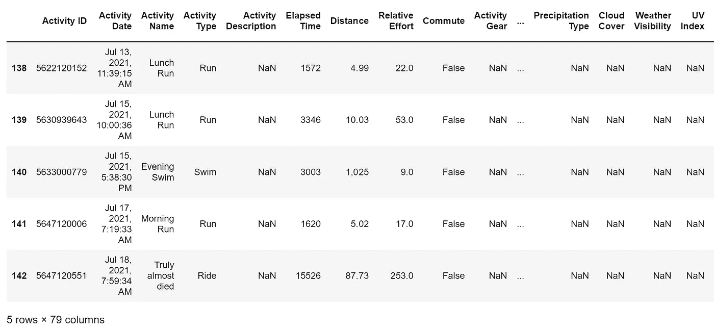

输出自动为五行。列被切成两半，因为太多了，无法显示(有 79 列，大部分是空白的)。如你所见，我的数据集的第一条记录日期是 2020 年 1 月 4 日至 2021 年 7 月 18 日。只要我在这段时间内上传一个活动到 Strava，他们就会出现。我要清理数据的第一件事就是删除所有不重要的列。我可以使用`pd.drop()`函数来完成这项工作，但是如果我想将数据保存在数据帧的开头(日期、时间、距离),我更喜欢使用`pd.loc[]`,因为它允许我对数据进行子集化。它的基本用例是使用下面的约定访问数据`pd.loc[row_A:row_Z,column_A:column_Z]``:`表示我想要中间的所有内容，`,`区分行和列。现在，我想保留每一行，删除“距离”之后的每一列。

对此调用`.head()`显示我们更新的 strava_df 数据帧:

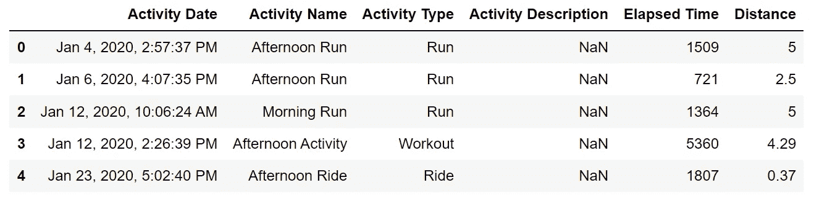

接下来，我希望我的数据集只包含我的跑步。Strava 自动正确保存每个活动，但我有时会编辑活动，并将跑步标记为“锻炼”或“比赛”。让我们检查并查看“活动类型”列中保存了哪些类型的数据。

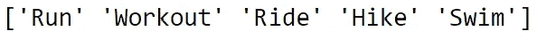

我的输出显示了五种活动类型。我将过滤掉“骑行”、“徒步旅行”、“游泳”，然后检查“跑步”和“锻炼”的最大值，以确保我的周期没有被错误标记。

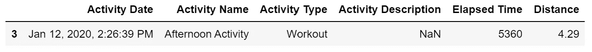

第 1 行根据两个条件过滤数据帧。如果“活动类型”是“跑步”或“锻炼”，我们保留它，如果不是，我们忽略它。执行这段代码给出了一个跑步被标记为锻炼的例子。因为是在 2020 年，我们不需要转换类型，因为我们将忽略 2021 年之前的数据。为了进一步清理数据，让我们删除“Name”、“Type”和“Description”列，因为我们的目标不需要它们(`axis = 1`告诉 pandas 查看列表的列`[_____]`而不是行)。

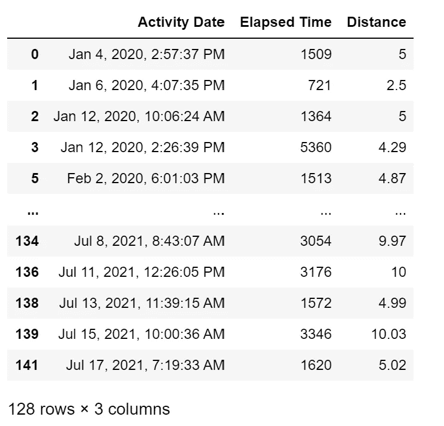

然后将以秒为单位的时间转换为以分钟为单位的时间:

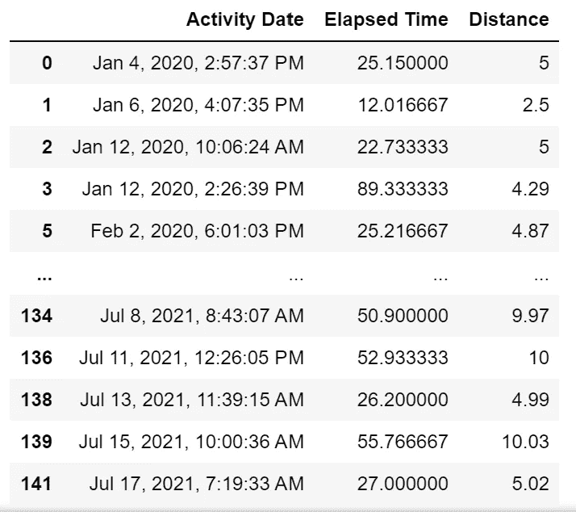

现在，下一个任务将是过滤 2021 年记录的活动的所有行(并最终以每天和每月为基础拆分它们)。有几种方法可以实现这一点，所有这些方法都需要将“活动日期”列中的每一项转换为 datetime 对象:

第一行将每个行条目转换为 datetime 对象，接下来的三行提取日、月和年数据，并将其放入自己单独的列中，如下所示:

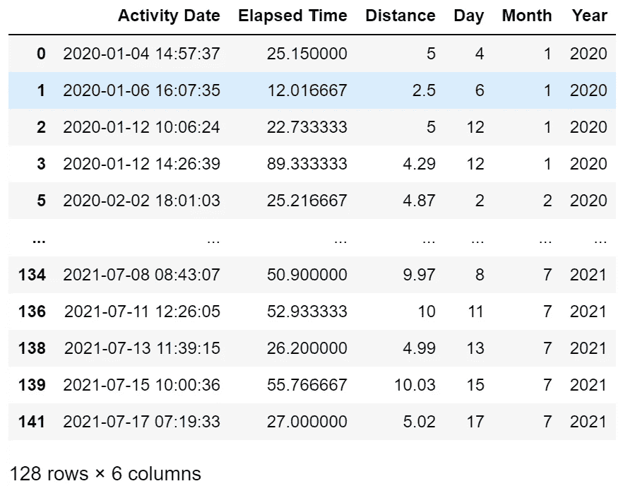

作为个人偏好，我将重新排列列顺序:

这将提供:

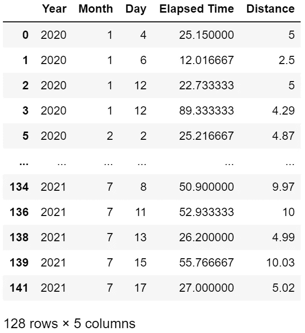

包括所有数据，我们有 128 条记录要处理，但是我们需要在 2020 年删除所有值。这就容易多了，因为现在有一个只有年度信息的栏目。

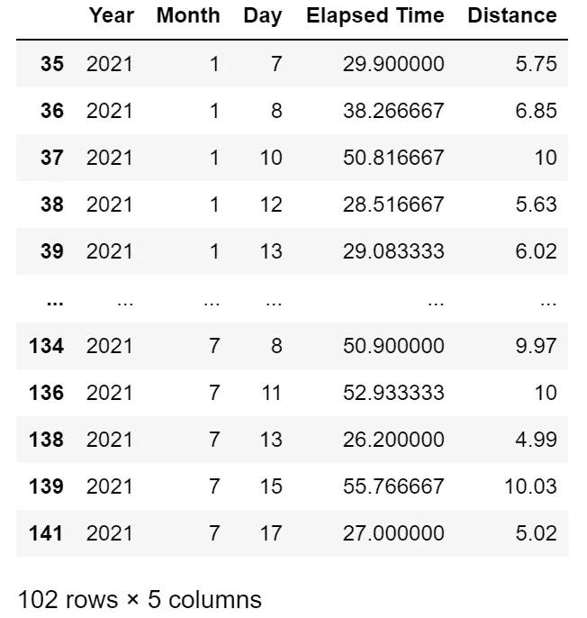

并删除 7 月份的数据:

这就是导入和清理的大部分内容。我们有 102 行可以从中提取信息，表中列出了我们需要的变量。

我可以创建四个数据帧来存储我的最长和最短运行/时间的行信息:

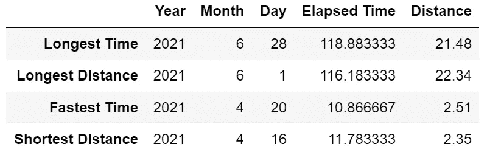

每个块中的第一行(第 1、4、7、10 行)隔离数据帧中最大值`.max()`或最小值`.min()`的行。分别打印这些变量给了我存放这些变量的索引。然后，我可以使用`.rename()`函数将索引值更改为自定义值。然后，第 13 行使用`pd.concat()`将所有四个数据帧连接在一起。

我们可以使用熊猫内置的带有字符串格式的统计函数来给出一些关于距离和时间的有意义的信息(其他函数包括`.mean(), .std(), .var()`)

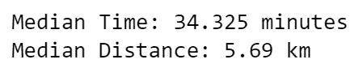

最后，在我们绘制任何图表之前，让我们看看每个月和每个星期的数据分布情况:

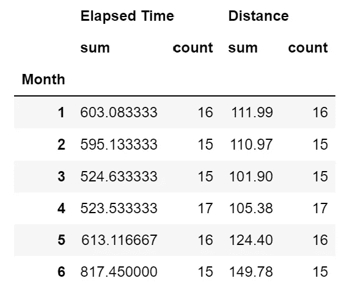

使用`.groupby()`功能，我们可以按月对“运行时间”和“距离”列进行分组。然后，使用`.agg()`函数，我们可以对数据应用`sum`和`count`函数。6 月份跑了 15 次，总距离 149.78 km(三次半程马拉松帮忙)。另一方面，我在 4 月份跑了 17 次，只跑了 105.38 公里。这看起来像是解决的第一个目标！

在这个阶段，我们还可以做更多的事情。我们可以遍历每一天的值，并用它们来确定一周的值。使用它我们可以创建相似的表。我们也可以用跑步时间来划分距离，以确定每次跑步的速度，并观察其随时间的变化。但是为了让事情简单明了，我想是时候看看这些数据了。

**2.2 数据可视化**

我知道我想要的主图。我想要一个散点图，x 轴上是距离，y 轴上是经过的时间，也许还有一种方法可以告诉我们每个数据点属于哪个月。

使用 matplotlib，我们应该能够相当容易地实现这一点:

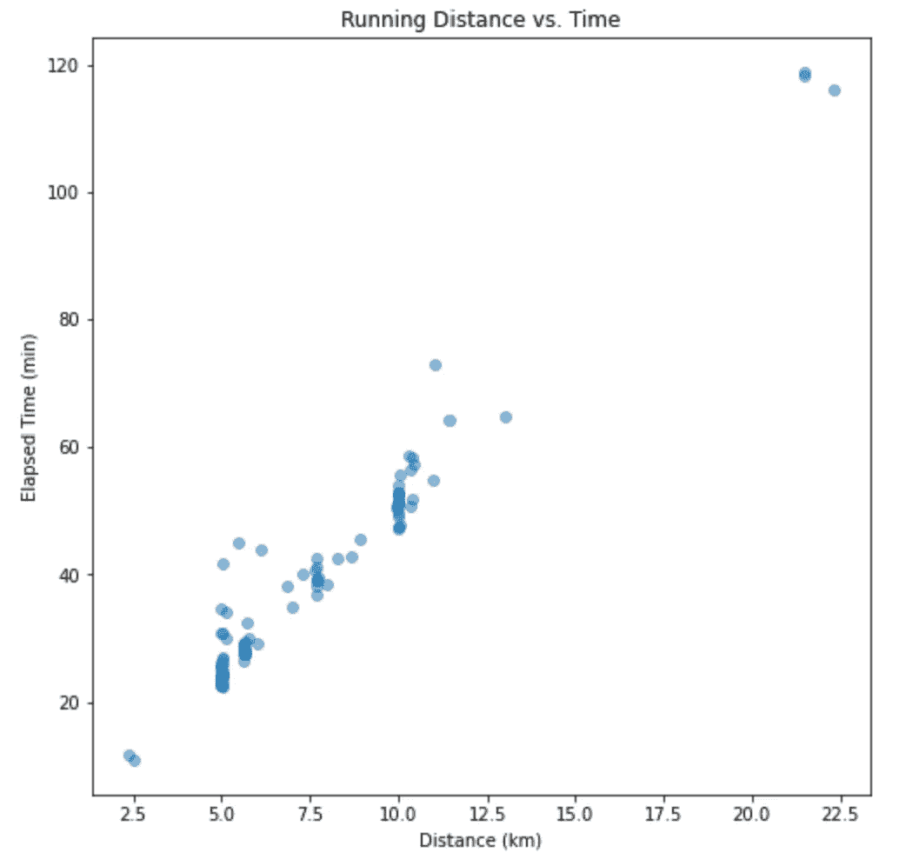

好吧，那是相当无趣的。如何才能提高？嗯，我们可以使用`plt.style.use()`很容易地改变图形的样式。此外，我们希望能够使用`color`和`label`参数来增强图形(剧透:不会那么容易)。

如果我添加`color`参数，并说出我想要映射到绘图的六种颜色，我会收到一个错误:

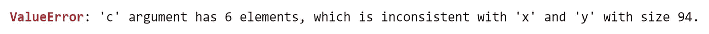

我需要一个有 94 种颜色值的列表。显然，我不会仔细检查数据框中的每一项，并为每个月输入一种颜色。相反，我们可以创建一个简单的循环:

这段代码将遍历`strava_df[month]`中的每一行，并为每个月的列表添加一种特定的颜色`col_list`。现在，让`c`等于`col_list`，我们应该得到一个合适的颜色渐变来代表每个月。此外，我们可以把风格改得更好一点。我将使用流行数据科学网站[的`fivethirtyeight`样式。](https://fivethirtyeight.com/)

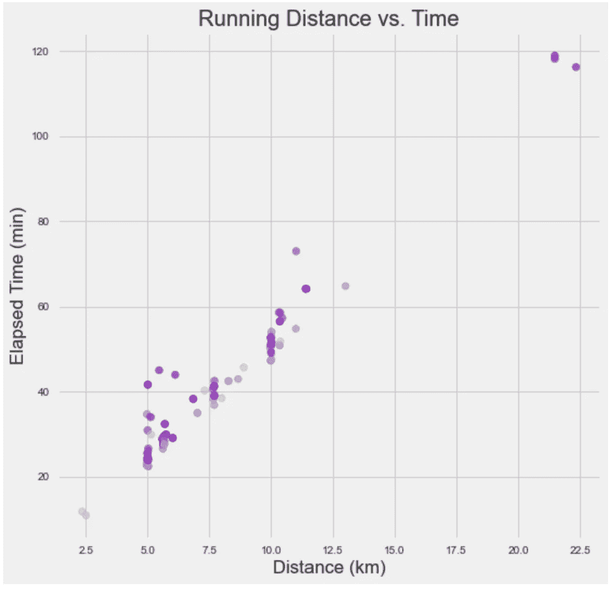

让我们快速使用一些数据帧子集来删除所有大于 20 的值(允许我们删除右上角的数据点，以避免中间的大间隙):

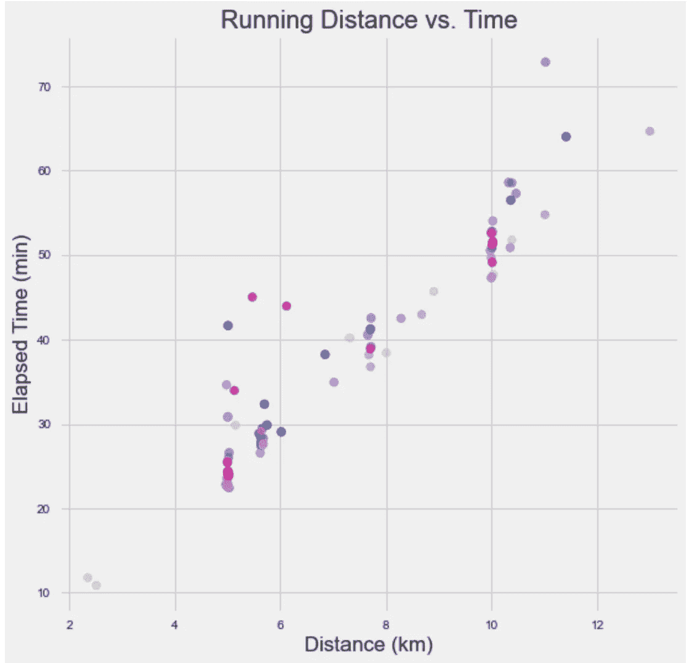

离最终产品越来越近了。然而，就其现状而言，它是相当静态的。我对一个接一个的月份没有太多印象。也许我们可以制作一个动画，首先绘制一月份的数据，然后绘制二月份的数据，以此类推。虽然上面的一切都是针对初学者的，应该足够容易理解和跟随，但接下来的一点可能有点困难。然而，这是一个明显的例子，说明用 python 对数据分析进行硬编码比传统的图形/数据分析包更有优势。

首先我会列几个清单。我在这上面花了一段时间，发现更新图例和竖线来显示每月的数据以及每月的平均距离和速度太难了。反而通过题目来说明就容易多了。第一个循环将数据帧分成六个月，提取步速，并将整数值附加到`pace_avg`。第二个循环将`pace_avg`中的每个步速转换为一个字符串，并在它的末尾添加“km”。现在，进入动画情节。

让我们来分析一下。首先我们需要从 matplotlib 导入 FuncAnimation 包，和 numpy(数值包，类似 MATLAB 的东西)。然后，我们初始化图形大小、轴限制、标题和轴标签。

对于 FuncAnimation，我们需要创建一个`animate`函数，本质上就是我们想要制作的动画。FuncAnimation 需要几个参数，即它需要一个动画人物和一个动画循环来绘制。我们的动画循环首先更新绘图的标题以反映绘制的月份和步调(因此出现了上面的循环),然后循环通过`strava_df`以提取`Distance`和`Elapsed Time`数据。这被标绘出来，限制被控制，同时颜色用`scat.set_color()`更新。最后，使用数字`fig`、函数`animate`在七个独立的帧上调用`FuncAnimation`，每帧之间有 1000 毫秒。使用`plt.show()`,我们得到以下结果:

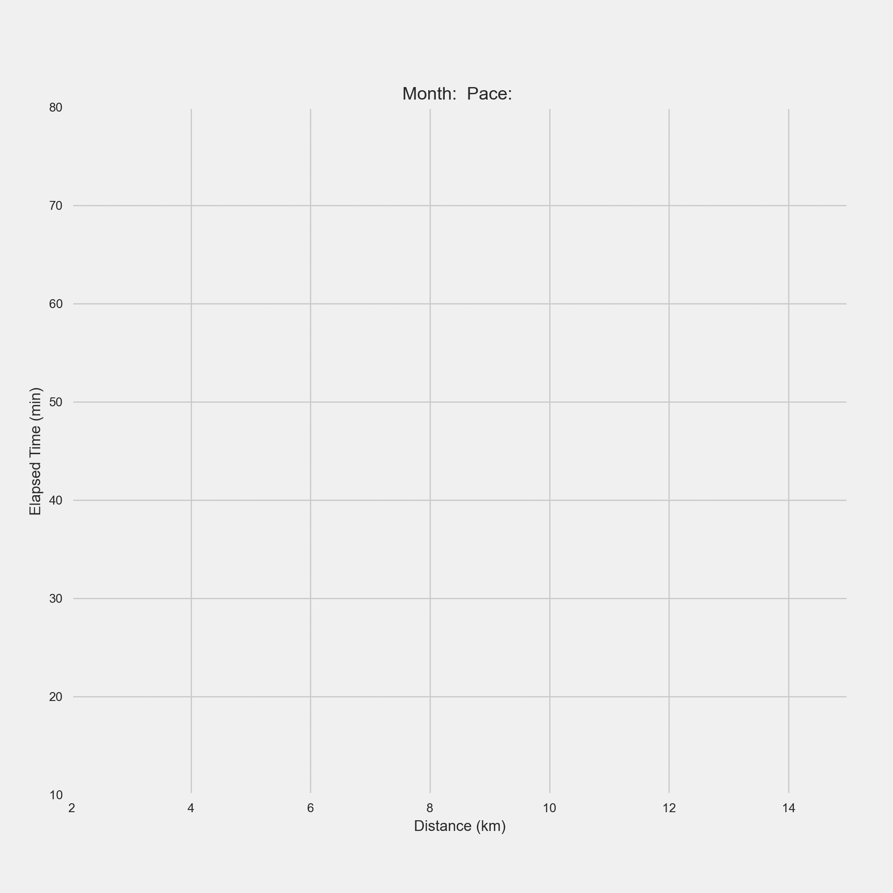

似乎直到六月我的步伐都在加快。我认为，上个月上升的原因是由于一些间歇时段，我从来没有暂停我的手表，所以它记录了我在间歇之间行走。否则，我认为我们已经创建了一个相当好的图表，显示了我所希望的。

*3。结论*

大多数人建议你应该选择一个项目，然后通过工作来学习编码。一旦你习惯了文档，简单的东西就唾手可得了，在线资源可以帮助你完成工作中比较复杂的部分。我总是发现这个建议很难接受。我喜欢有条理的节目。但我发现，许多结构化课程并没有给你提供太多的学习机会。他们引入一个话题，让你做几个问题，然后继续。通常在一个模块结束时，所有的材料都会在一个稍微大一点的更连贯的问题中进行测试，但仅此而已。对于任何学习 Python 的人来说，找到一些小项目来测试你所学到的东西以巩固这些经验是很重要的。我的只是碰巧是一个方便的数据集，我从一个我不愿意支付额外费用访问的网站上得到的。

如果这里有任何不清楚的地方，或者你想详细说明，请告诉我。我很乐意帮忙。此外，如果对 Python、Pandas、Numpy、Matplotlib 和数据分析的完整教程感兴趣，我很乐意写下来，请告诉我！上面用来输出所有代码的链接都可以在这里找到<https://github.com/DillM94/Strava/blob/main/Strava_Data_Jan-Jun.ipynb>**。**