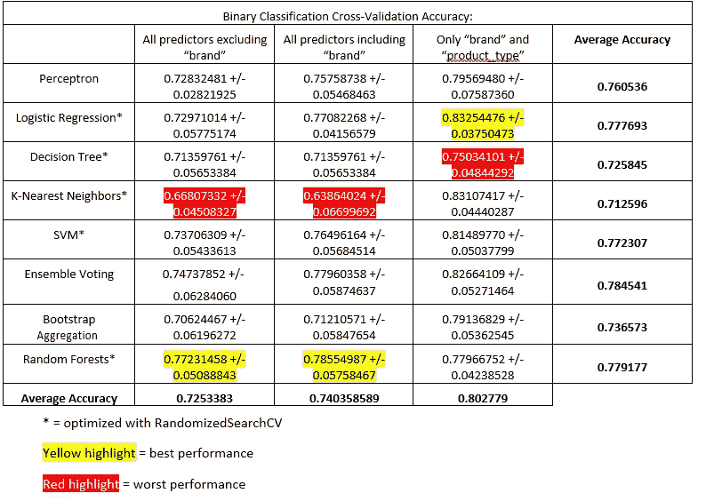
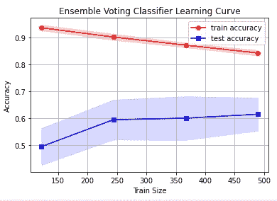

# 数据分析:护肤品成分不能预测产品价格

> 原文：<https://towardsdatascience.com/data-analysis-ingredients-of-skincare-products-not-found-to-affect-product-price-c3593d123a4d?source=collection_archive---------23----------------------->

## 在这个项目中，我使用了机器学习算法的组合来测试成分在决定护肤品价格方面的信息含量。


*图片来源:Diego Cervo / Getty Images*

# 介绍

护肤品行业利润丰厚——2020 年全球化妆品护肤品市场预计为 1453 亿美元。

然而，护肤品公司如何给它们的产品定价似乎是一个严守的秘密。例如，一桶 16 盎司的*海蓝之谜*面霜在*海蓝之谜*官方网站上的价格为 2475 美元，而便宜得多的*妮维雅霜*的成分列表几乎相同。普通的*是另一个因其实惠的护肤品和朴实无华的成分而变得非常受欢迎的品牌。*与其他护肤公司相比，普通的*能够通过最大限度地减少营销支出来降低成本，并且只使用已被证明有效的成分(如类视黄醇和维生素 C)。这就引出了一个问题— **当你购买护肤品时，你是为品牌和营销成本买单，还是为成分和配方买单？***

当然，当大多数人在护肤上花了很多钱时，他们希望高质量的成分和配方能产生最好的效果。奢侈护肤品公司的利益在于延续这样一种理论，即更高的价格意味着更高质量的成分和性能。在本文中，我将使用 Scikit-Learn 中的各种机器学习算法来预测一个产品的价格。我的项目的第一部分是探索性的，比较在有和没有品牌信息的数据上训练的二元分类器，以预测产品是“便宜”还是“昂贵”。我的论文的第二部分试图构建多类分类器，将产品分为 4 个价格类别之一——“最便宜”、“便宜”、“昂贵”和“最昂贵”。

**我假设在训练数据中包含产品成分列表不会使分类器表现更好，即产品的成分不会对其价格产生有意义的影响。**

相反，我预计“品牌”将是预测产品价格的一个更具信息性的特征。

我在这个项目中使用的数据集是 Erin Ward 的[“护肤品及其成分”数据集。](https://www.kaggle.com/eward96/skincare-products-and-their-ingredients/metadata)

> ***数据集详情***
> 
> 来自 LookFantastic.com 的护肤品数据集，包含 1138 种护肤品，包括它们的名称、网址、产品类型、成分和价格。

我的项目由 5 部分组成:

1)使用成分列表、产品数量(即内容)和产品类型的二元分类。

2)使用品牌、成分列表、产品数量和产品类型的二元分类。

3)使用品牌和产品类型的二元分类(没有关于产品数量或成分的任何信息)。

4)使用品牌、成分列表、产品数量和产品类型的多类分类。

5)使用品牌和产品类型的多类分类(没有关于产品数量或成分的任何信息)。

# 准备数据集

为了对数据进行预处理并为算法做准备，我首先将“price”列转换为浮点数列，去掉了“”符号。

```
df[‘price’] = df[‘price’].str.replace(‘£’, ‘’) 
df[‘price’] = df[‘price’].astype(float)
```

我还加了一个“品牌”栏，手动填写每个产品的品牌。然后，我添加了一个“contents”列，通过使用正则表达式从“product_name”中提取毫升、克或千克的数量，包含项目中产品的数量。例如，项目“Acorelle Pure Harvest Body 香水— 100ml”在“内容”列中的值为“100”(这个过程的限制将在我的“限制”一节中讨论。)

```
contents = [] 
**for** title **in** df[‘product_name’]: 
    **try**: 
       m = re.search(‘\d+(ml|g|kg)’, title)
       contents.append(m.group()) 
    **except** **AttributeError**: 
       contents.append(np.nan) 
df[‘contents’] = contents
```

不幸的是,“contents”列包含 155 个丢失的值，其中 regex 无法在“product_name”中找到产品数量。我手动搜索并在“内容”栏中填入体积量，以替换这些缺失的值。我决定创建这个“contents”列，因为如果成分列表有任何预测价值，那么这些成分的*数量*也会对产品价格产生影响。我将“品牌”、“内容”、“产品类型”和“成分”列作为我的数据集中的预测特征。

接下来，我从“内容”栏中删除了所有的“毫升”和“克”单位。然后，我将“内容”和“价格”列转换为浮点数。

```
skincare[‘contents’] = skincare[‘contents’].str.replace(‘ml’, ‘’) skincare[‘contents’] = skincare[‘contents’].str.replace(‘g’, ‘’)
skincare['contents'] = skincare['contents'].astype(float)
skincare['price'] = skincare['price'].astype(float)
```

这是准备好的数据集，准备好进行处理并输入算法:


成品数据框，包含产品名称、品牌、网址、产品类型、成分、价格(英镑)和内容

大多数产品都在 1 公斤以下，而这些产品中，大多数都集中在 100 公斤以下。产品价格和产品数量之间似乎没有什么关系。


如下图所示，绝大多数产品的价格都低于 50 英镑。


数据集中的平均价格在 24 左右。


护肤品数据集中的价格分布

在二元分类实验中，我根据上述四分位数范围定义了两种价格类别:“便宜”(类别 0，低于 18.90——数据集中一半的产品低于此价格)和“昂贵”(类别 1，高于 18.90——数据集中一半的产品高于此价格)。

```
skincare[‘price’] = skincare[“price”].apply(lambda x: 1 if x > 18.90 else 0)
```

诚然，这种区分是武断的。但是这一部分的目标仅仅是看看是否可以从预测“品牌”、“内容”、“产品类型”和“成分”的组合中获得任何关于价格的信息。

在多类分类实验中，我定义了 4 个价格类别:“最便宜”( 31.25)，使用上面相同的四分位数范围，以获得每个类别中相同数量的产品(代码如下)。

```
def price_to_class(x):
   if x <= 9.950000:
      x = 0
   elif (x > 9.950000) and (x <= 18.900000):
      x = 1
   elif (x > 18.900000) and (x <= 31.250000):
      x = 2
   elif x > 31.250000: 
      x = 3
   return x
skincare['price'] = skincare["price"].apply(price_to_class
```

# 预处理

我使用了一个列转换器来准备要提供给算法的数据集。“product_type”有 14 个编码为字符串的唯一值，所以我在这个列上使用 OneHotEncoder()来获得相应的虚拟变量。我在包含数字数据的“contents”列上使用了 StandardScaler()，将列值集中在平均值 0 上，标准偏差为 1(在决策树的实验中没有使用 StandardScaler()，因为决策树不会从被缩放的特征中受益)。

最后，我在“配料”列上使用了 CountVectorizer()。我为“成分”列选择了 CountVectorizer()，因为如果测试集的“成分”列中出现了看不见的成分，那么对每种成分进行一次性编码会导致错误。CountVectorizer()简单地忽略了没有经过训练的词汇。

对于计数矢量器，我定义了一个定制的记号化器来删除数据集不必要的字符或假象，用逗号分隔(成分用逗号分隔，例如，“水，丁二醇，…”)。

```
def tokenizer(x) -> list: 
   x = x.replace('(', '')
   x = x.replace(')', '')
   x = x.replace('\xa0', '')
   x = x.replace('.', ', ')
   x = x.replace('&', ', ')
   x = re.split(', ', x)
   return x
```

这些转换器是使用函数 make_column_transformer()编译的。列转换器在流水线中与每个机器学习算法相结合。

```
from sklearn.feature_extraction.text import CountVectorizer
from sklearn.preprocessing import OneHotEncoder
from sklearn.preprocessing import StandardScaler
from sklearn.compose import make_column_transformer

ohe = OneHotEncoder()
vect = CountVectorizer(tokenizer=lambda x: tokenizer(x))
scaler = StandardScaler()ct = make_column_transformer(
   (ohe, ['product_type']),
   (vect, 'ingredients'),
   (scaler, ['contents']), 
    remainder='passthrough')
```

# 价格类别的二元分类

在我实验的第一部分，我包括了除“品牌”之外的所有预测因素。也就是说，我使用了预测器“内容”、“产品类型”和“成分”，不包括“品牌”。在我实验的第二部分，我包括了所有的预测因素:“品牌”、“内容”、“产品类型”和“成分”。在实验的第三部分，我删除了所有关于产品成分和数量的信息。相反，我只使用了“品牌”和“产品类型”列。我怀疑“内容”并没有提供关于价格的有用信息。例如，普通的血清(30-50 毫升装)价格超过 30 欧元，而 1 升装的沐浴露价格仅为前者的一小部分。

在二元分类中，我测试了感知器、逻辑回归、决策树、K 近邻(KNN)和支持向量机(SVM)分类器的准确性。在预测产品的价格类别时，我还包括了三个集成学习模型，如投票分类器、bootstrap aggregation (bagging)和随机森林分类器。超参数调整是通过在逻辑回归、决策树、KNN、SVM 和随机森林分类器上进行随机网格搜索来执行的(GridSearchCV 非常慢，显然计算开销太大)。

随机网格搜索没有用于感知器、投票和 bagging 分类器。我选择给集合投票分类器 3 个性能最好的算法(所有算法都符合在对这些算法进行随机网格搜索期间获得的最佳超参数)。bagging 分类器使用决策树，这些决策树与在决策树分类器上随机网格搜索期间获得的最佳超参数相匹配。

# 二元分类结果及讨论



表 1。对于每个分类器，计算 10 倍交叉验证分数。这些 10 倍交叉验证分数如上所述。感知器、集成投票和 bagging 分类器不进行超参数调整，尽管 bagging 分类器的 *n_estimators=* 超参数被优化。每个实验迭代的最佳精度以黄色突出显示，以便查看。

平均而言，仅使用“品牌”和“产品类型”作为预测器的分类器表现最佳，平均分类器预测大约为 80.3%。当“成分”列被包括在内时，随机森林分类器表现最好，不管“品牌”是否存在。我怀疑当成分存在时，随机森林分类器表现最好，因为对成分列表进行矢量化会产生非常长的特征向量。在随机森林中，在树的每个节点上只能对 *d* 个特征进行采样而不进行替换，其中 *d* 的默认值= sqrt(特征数)。这可能有助于减少维数，并在处理极长的特征向量时减少过度拟合。

极长的特征向量也可能解释了当包括“成分”列时 KNN 的不良性能。特征空间可能非常稀疏，以至于相邻的数据点彼此相距太远，无法做出有意义的预测(即，数据集遭受维数灾难)。

平均而言，表现最好的模型是集合投票分类器，平均准确率约为 78.5%。这是有意义的，因为集成投票分类器是用三种性能最高的非集成机器学习算法(逻辑回归、SVM 和感知器)训练的，并通过多数投票进行预测。然而，当仅使用“品牌”和“产品 _ 类型”时，通过逻辑回归获得最佳准确度，准确度为 83.3%。总体而言，包括 SVM、逻辑回归和感知器在内的参数模型比包括 KNN 和决策树分类器在内的非参数模型表现更好。

# 价格类别的多级分类

我构建了多类分类器，将护肤品分为四类——“最便宜的”( 31.25)。我通过检查 price 列的内部四分位数范围，并将每个四分位数作为一个类别(代码如下)来获得这些数据。

```
def price_to_class(x):
   if x <= 9.950000:
      x = 0
   elif (x > 9.950000) and (x <= 18.900000):
      x = 1
   elif (x > 18.900000) and (x <= 31.250000):
      x = 2
   elif x > 31.250000: 
      x = 3
   return x
skincare['price'] = skincare["price"].apply(price_to_class)
```

这一部分的目标是看看是否可以通过预测因子“品牌”、“内容”、“产品类型”和“成分”的组合来预测特定的价格范围。

当我完成二元分类实验时，很明显“品牌”是价格类别的一个有用的预测指标。因此，在这一部分中，我使用所有的预测值进行了多类分类:“品牌”、“内容”、“产品类型”和“成分”。我将这些结果与涉及“品牌”和“产品类型”的多类分类进行了比较，没有包括产品成分或数量的信息。

在多类分类中，我测试了逻辑回归、决策树、K 近邻(KNN)和支持向量机(SVM)分类器的准确性。我还包括了同样的三个集成学习模型:投票分类器、引导聚合(bagging)和随机森林。

我没有包括感知器，因为让感知器适应多类标签很麻烦，而且可能不会产生好的结果。相反，我在逻辑回归和 SVM 中探索了不同的多类策略。决策树、K-最近邻、集合投票、引导聚集(使用决策树)和随机森林分类器不必被显式修改以适应多类标签。

在我的逻辑回归模型中，我使用了一对多分类。在 one-vs-rest 中，逻辑回归算法计算每个点相对于其他类属于某个类的概率。在多项逻辑回归中，标记的对数几率被预测。

在逻辑回归和支持向量机中，一对一策略是相同的，但是由于支持向量机不能自然地输出概率，所以我也在 SVM 分类器中使用了一对一策略。在一对一策略中，SVM 分类器将多类分类问题分成每对类一个二元分类问题(例如，“便宜”对“最贵”，“贵”对“最便宜”，等等)。).

通过在逻辑回归、决策树、KNN 和随机森林算法上的随机网格搜索来执行超参数调整。bagging 分类器用决策树来拟合，决策树具有用 RandomizedSearchCV()找到的优化的超参数，而投票分类器用具有优化的超参数的三个最佳执行算法来拟合。我没有对 SVM 分类器执行 RandomizedSearchCV()，因为 OneVsOneClassifier()和 OneVsRestClassifier()没有易于优化的超参数。

# 多类分类结果和讨论


表二。对于每个分类器，在执行随机网格搜索以优化分类器的超参数后，计算 10 倍交叉验证分数。这些 10 倍交叉验证分数报告如下。尽管 bagging 分类器的 *n_estimators=* 超参数得到了优化，但 SVM、集成投票和 bagging 分类器没有进行超参数调整。每个实验迭代的最佳精度以黄色突出显示，以便查看。

平均而言，仅使用“品牌”和“产品类型”作为预测器时，分类器的表现更好，平均分类器预测约为 59.3%。然而，这些结果与上一节中获得的中等准确度分数相比是令人沮丧的。

一种学习算法(在这种情况下是集合投票)的学习曲线的快速可视化可能会对这个问题有所帮助。



很明显，训练精度很高，标准偏差很小，而测试精度很低。由于训练和测试准确性之间存在很大差距，很明显，该模型的 at 存在很大的差异，这意味着需要降低模型的复杂性，或者需要收集更多的数据。

平均而言，表现最好的模型是集合投票分类器，平均准确率约为 59.6%。这是预料之中的，因为投票分类器是用三种性能最高的非集成机器学习算法训练的(在这种情况下，是一对一的逻辑回归、一对一的 SVM 和决策树分类器)，并通过多数投票进行预测。KNN 再次表现最差，可能是因为即使没有“成分”一栏，特征空间也过于稀疏，无法对产品的具体价格范围做出有意义的预测。

# 实验限制

这个项目的实验设计有很多问题。最重要的问题之一是用 CountVectorizer()对成分及其名称进行编码。不同产品对相同成分的称呼也有所不同。例如，在一种产品中，一种成分被称为“香料”，而在另一种产品中，被称为“香水”。当应用 CountVectorizer()时，这些相同的成分将被分成两个不同的特征列，使得矩阵更加稀疏。由于不同的命名惯例甚至拼写，可能在不同的列中有数百个重复的成分——我对化学不够熟悉，无法捕捉这些冗余。在未来的实验中，应彻底研究成分名称，以寻找出现在数据集中其他产品成分列表中的同一产品的替代名称。配料表应该标准化，一种成分有一个成分名称，反之亦然。

这个实验的第二个问题是，训练和测试数据集没有按照品牌进行分层。数据集中有许多品牌仅由一种产品代表。由于 CountVectorizer()预处理步骤，如果这些产品中的一个出现在测试数据集中，模型将无法使用其品牌来预测价格类别。收集更多的数据可以解决数据集中只有一种产品代表的品牌问题。收集这些品牌的其他产品的数据将有助于模型对一个品牌的典型价格范围做出更多预测。

这个实验的第三个问题是配料清单中配料的顺序很重要。例如，如果“水”出现在成分列表的开头，这意味着该产品中的水比任何其他成分都多。成分列表末尾的成分在该产品中浓度最低。CountVectorizer()不保留关于成分顺序的信息，因此关于每种成分的相对量的信息会丢失。成分对价格影响的潜在洞察力因此变得模糊。将来，应该设计一个 CountVectorizer()来分割配料列表，记录列表中配料的索引，并用各自的索引填充特征列，以指示配料在列表中的位置。

这个实验的第四个问题是“内容”列。当我创建这个专栏时，我去掉了产品数量(比如 100 毫升，50 克，等等。)的单位(‘g’和‘ml’)，并将它们视为相同的单位进行测量。克是质量的度量单位，毫升是体积的度量单位。1 克相当于 1 毫升的水，所以在这个实验中，我假设所有产品在去掉“ml”和“g”标签的时候，粘度都和水大致相同。当然，这是一个不准确的假设，但我没有获得每种产品的粘度测量值来进行克到毫升的转换。写这个专栏可能是个错误，在未来的实验中，它不应该被包括在内。

这个实验的第五个问题是，这个数据集不包含这些品牌在总体营销上花费的不同金额的信息。花在营销上的钱在产品的价格中得到补偿，所以营销预算影响产品的价格。我倾向于将“品牌”视为营销支出的代表，但即使在品牌内部，不同产品线的营销预算也可能存在差异。例如，一个品牌中的一个产品线可能比另一个更积极地营销——例如，*欧莱雅*拥有*欧莱雅豪华*产品线，其平均价格高于公司其他产品。因此，“品牌”不是营销预算的直接代表，因此也不是价格类别的理想预测指标。这个问题的解决方案是收集每个品牌和不同产品线的更多数据点。

# 结论

**二分类器和多分类器的实验结果表明，品牌确实对价格有一定的预测作用。**无论是否将品牌作为预测因素，用产品的成分列表预测价格的准确性都较差。在仅使用特征“产品类型”和“品牌”的二元分类器中实现了最好的准确度。然而，试图将产品分成具有相同特征的四个价格范围的多类分类器表现很差。由于模型无法执行更复杂的任务，如多类分类，很明显，需要额外的数据来使这些模型更加稳健。然而，这一粗略的分析表明，人们不应该认为高昂的价格意味着更高质量的护肤成分。

数据集和代码可以在我的 [GitHub](https://github.com/dorothyh-ms/ML1_Project) 中找到。