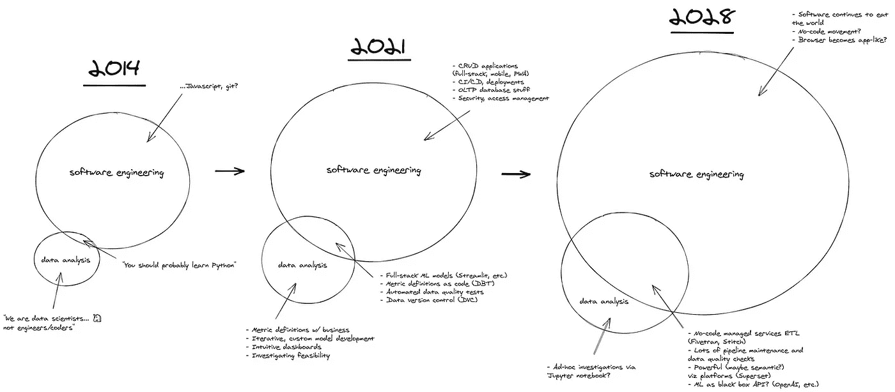
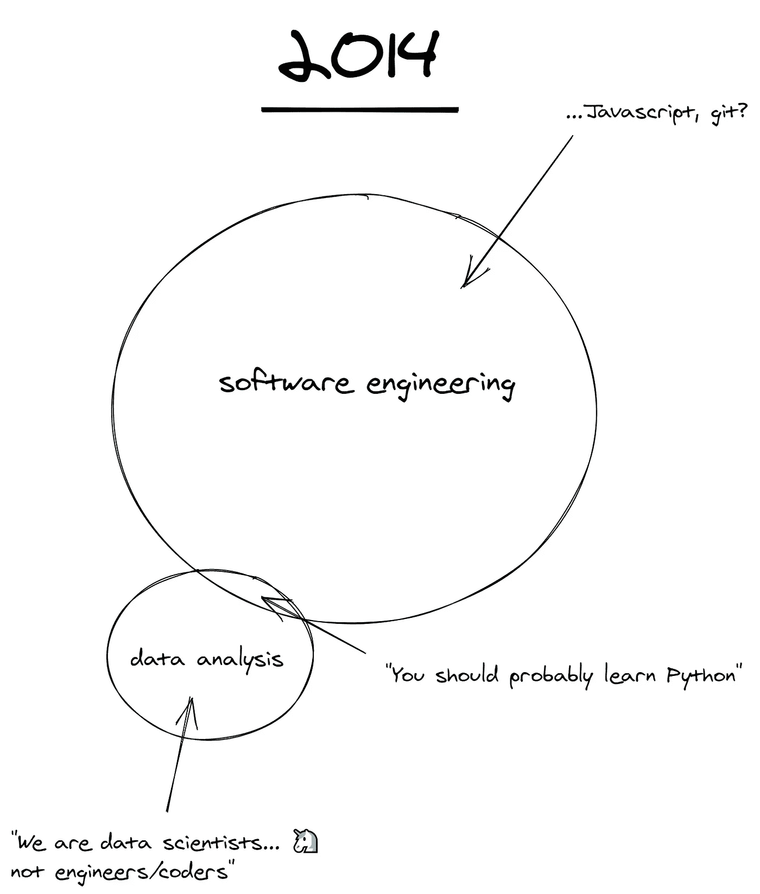
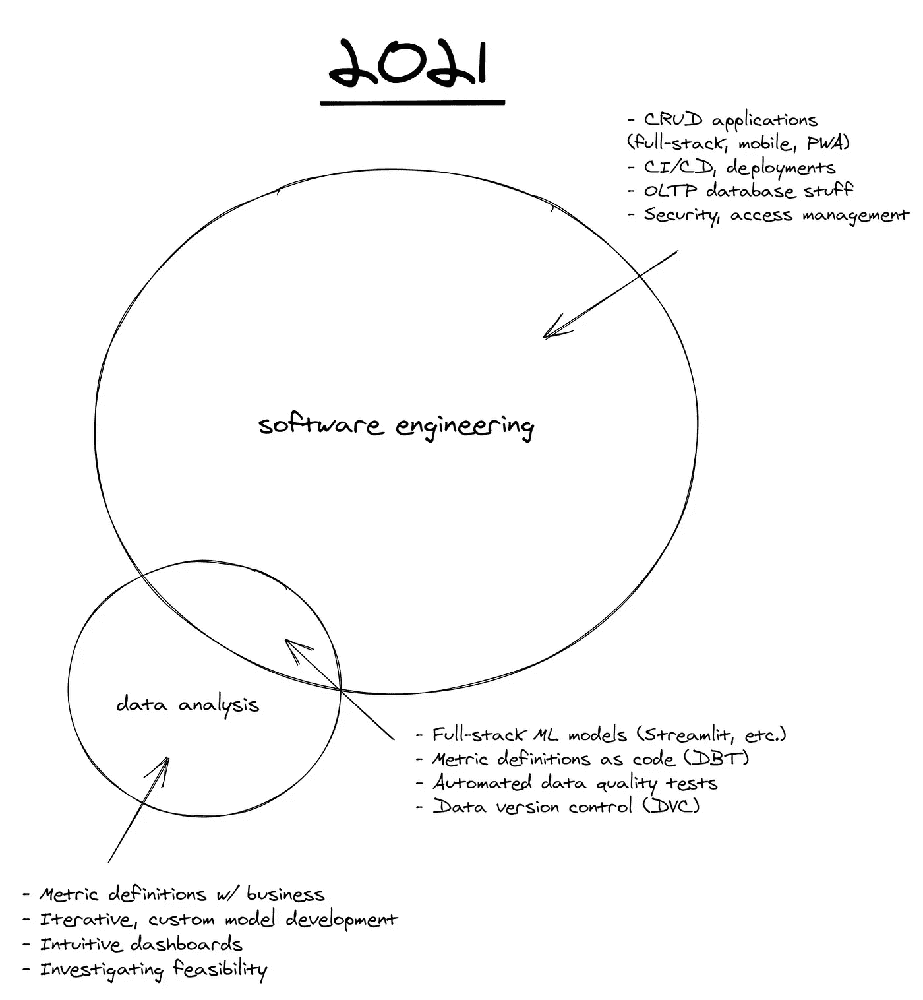
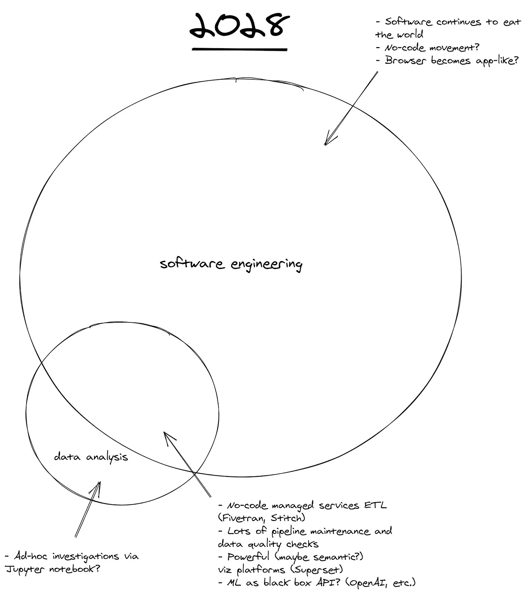
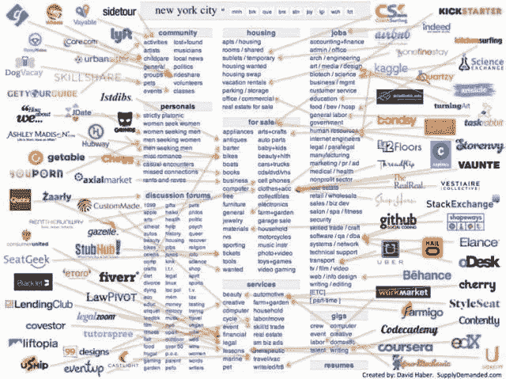

# 数据分析是软件工程的一种形式

> 原文：<https://towardsdatascience.com/data-analysis-is-a-form-of-software-engineering-876232bd3ebc?source=collection_archive---------18----------------------->

## 对工具领域的思考，7 年来

当我在 2014 年开始对数据科学[感到兴奋时，我同时也在学习如何编程。比如…不是如何从头开始编程](https://medium.com/r?url=https%3A%2F%2Fnbviewer.jupyter.org%2Fgithub%2Fnhuber%2Fmagickmeans%2Fblob%2Fmaster%2FmagicPCA.ipynb) [k-means](https://en.wikipedia.org/wiki/K-means_clustering) ，比如如何在 Javascript 中[画圆](https://codehs.com/)。

因此，我同时学习了多个技术概念:

照片由[本·怀特](https://unsplash.com/@benwhitephotography?utm_source=medium&utm_medium=referral)在 [Unsplash](https://unsplash.com?utm_source=medium&utm_medium=referral) 上拍摄

从那以后，作为一名数据科学家，我收集了一些成功案例。但我最好的学习实际上来自于犯错误——编写低效的 Hive 查询，制作低精度或过度工程化的模型，对指标定义过于学术化，等待太久才向业务用户显示中间进度，等等。

我从数据科学起步时犯的最大的概念性错误之一是认为数据分析是一个与软件工程不同的、特殊的、不相交的领域。我要花几个小时来写报告——并起草！—我过去和现在对这个话题的看法。

如果你很忙，只有几分钟的时间，这篇文章的主旨是**数据分析最佳实践/工具开始非常类似于软件工程的实践/工具**并且这是一个我期望继续的趋势。

以下是我对这个主题的直观体验:

作者图片

如果你想有更多的导游，请随意阅读。

# 冒险的召唤

当我开始成为一名技术个人贡献者时，我害怕“真正的编程”——对我来说，这意味着:为 web/移动应用程序构建功能、运行/维护服务器、确保多个数据库副本的一致性、使用版本控制、发布😱拉取请求😱。我更喜欢“数据科学”或数据分析，它们与我的经济学本科学位共享许多熟悉的工具，如回归。

现在，我已经在美国/SEA 的多个组织从事数据科学方面的工作，处理不同的分析问题，当我回顾数据科学的概念时，我不禁感觉很像我想象的奥德修斯在与塞壬和其他神话生物战斗后返回伊萨卡时的感觉，或者佛罗多在毁灭火山炽热的深渊中摧毁一个戒指后返回夏尔时的感觉——一旦你开始了漫长的史诗般的旅程，[你的家看起来永远不会一样了](https://en.wikipedia.org/wiki/Nostos):

[Mukuko 工作室](https://unsplash.com/@mukukostudio?utm_source=medium&utm_medium=referral)在 [Unsplash](https://unsplash.com?utm_source=medium&utm_medium=referral) 拍摄的照片

也就是说，我知道软件工程和数据分析是同一条蛇的不同头部，它们有着千丝万缕的联系——具体来说，**数据分析是软件工程**的一个子集！我认为它在未来会与软件工程越来越多地重叠，现在我将更详细地描述它。

# 我过去的世界状态(大约 2014 年)

当我开始的时候，我基本上对这两个主题一无所知，虽然重建你以前的无知视角总是很困难，但我记得我的思维模式是这样的:

作者图片

软件工程对我来说基本上是一种魔法——它是编写驱动网站、移动应用等的代码。——我几乎没有任何理解。相比之下，数据分析，或“数据科学”，因为它最终[成为品牌](https://qr.ae/TQRofC)，是我可以理解的东西——它似乎需要挖掘用户行为模式，寻找趋势，建立模型来理解因果关系，等等。

尽管软件工程的工具是“真正的编码语言”,如 Java、Javascript、Ruby，但我认为数据科学使用的是“不太核心的语言”,如 SQL、Python 和 r。现在，作为一个什么都涉猎过的人，我意识到这种层次结构非常愚蠢，而且总是极度简化！

此外，我漫画中的一切都很小，因为[软件刚刚开始吞噬世界](https://a16z.com/2011/08/20/why-software-is-eating-the-world/)而[数据还不是新的石油](https://www.wired.com/insights/2014/07/data-new-oil-digital-economy/)。尽管我对数据科学(以及软件工程)感到兴奋，并且是一名从业者，但我仍然**低估了短短 7 年内该领域会取得多少进步。**

# 我当前的世界状态(2021)

以下是我目前对软件工程和数据分析的大致看法:

作者图片

也就是一些东西(构建 [CRUD](https://en.wikipedia.org/wiki/Create,_read,_update_and_delete) 移动网络/应用等)。)都是纯软件工程，有些东西是纯数据分析(和业务用户做度量定义等。).然而，它们的交集很大，而且还在增长。

# 这个十字路口发生了什么事？

这里发生了一些非常有趣的事情，让我们深入探讨一下吧！

## 全栈 ML 模型

大多数业务用户不想要黑盒模型——即使你可以凭经验证明它们有 98%的准确性。总有可能你的训练/测试划分不像你声称的那样具有普遍性，他们的行业中可能有一个模型可能没有发现的结构性转变，或者他们可能只是在总体上怀疑 ML。

进入全栈 ML 模型，其中模型的输入、预测、解释和置信度得分可以在熟悉的图形界面中呈现给决策者。如果你能允许用户在界面中纠正错误的预测，并把这些反馈到模型中，那就更好了。像 [Streamlit](https://github.com/streamlit) 这样的工具使得机器学习开发者可以构建接口，而无需离开 Python 或过于担心部署。

## 作为代码的度量定义

当数据分析刚刚开始时，根本没有足够的时间来过多地担心统一单一来源的事实或版本化指标定义。它们只存在于一个地方可能是很常见的，所以为什么要担心这个呢？如果您想知道每周活跃用户的定义是什么，只需查看 2–3 报告仪表板中的底层 SQL 即可。

然而，现在 50 人、100 人或 500 人的分析团队和数百万美元的业务决策都是根据仪表盘和指标做出的，我们作为一个行业，意识到我们需要更加认真地对待这个问题。

如果定价数据科学家爱丽丝(Alice)制作了一个指示每周活跃用户的仪表板，而搜索数据科学家鲍勃(Bob)在 Python 笔记本中深入研究了一些也涉及每周活跃用户的新功能，那么这两件事的定义(在代码中)应该完全相同，以免随之而来的是完全的困惑、沮丧和信任危机。如果 Alice 和 Bob 来自不同的部门，甚至可能不共享工具集，情况会变得更糟。也就是“周活跃用户”必须变成`weekly active users`。

大公司有集中的数据工程团队来解决这个问题，这需要[多年的努力](https://medium.com/airbnb-engineering/how-airbnb-achieved-metric-consistency-at-scale-f23cc53dea70)；对于那些拥有较小数据团队的人来说，一旦有了> 10 个人来创建和报告指标，最好还是使用像 [dbt](https://www.getdbt.com/) 这样的按座位付费工具。

## 更多

实际上，在这个领域还有很多其他的子主题，我只是刚刚开始探索。

一个是**自动化数据质量测试**。也就是说，当我们知道 80–90%的时间是数据质量问题而不是实际影响时，而不是等待业务用户去想为什么他的团队的 KPI 在一夜之间莫名其妙地飙升了 30%,将需要跨多种源类型工作的数据质量监控工具，与不同类型的数据库互操作，等等。我还没有发现一个开源产品或公司产品在这方面做得足够好，但我正在寻找！

**数据版本控制**也是一个有趣的概念，我的团队[已经开始](https://www.thinkingmachin.es/)[尝试](https://github.com/iterative/dvc)。还没有达成共识，但它似乎是一个自然的工具，如果机器学习开发人员在同一个模型上工作超过几个月，并且不希望必须通过查看她过去的训练数据集的`_v11`、`_v12`来找到一个具有良好或难忘结果的结果，则需要将其纳入机器学习开发人员的工具集。

## 摘要

软件工程实践越来越成为标准的数据分析实践。度量和数据版本化只是 SWE 已经使用了几十年的共享代码回购实践的概括，数据质量测试基本上只是特定于数据的[单元测试](https://en.wikipedia.org/wiki/Unit_testing)和[页面责任](https://www.pagerduty.com/)规范，现在已经在 SWE 的工作方式中长期确立。

我想我已经意识到了这一点，因为我变得不那么害怕“易碎的”软件工程问题，并且开始看到采用软件工程方法进行数据分析会产生更好和更可持续的结果。

# 未来数据工具前景(2028 年)

预测未来的唯一可靠方法是[构建它](https://quoteinvestigator.com/2012/09/27/invent-the-future/)，但是我将冒险对我所看到的数据工具前景进行一些粗略的猜测。我期望继续看到软件工程和数据分析领域的增长，但是随着更多的软件工程实践适应数据分析工作流。

或者视觉上:

作者图片

一切都变得更大，因为软件和数据对每个企业、每个垂直行业和每个行业都非常重要。但是还要注意，数据分析已经开始与软件工程有大约 65%的重叠！

# 在这个十字路口可能会发生什么？

*让我们再放大一遍！*

## 让摄入更容易？

像 [Fivetran](https://fivetran.com/) 和 [Stitch](https://www.stitchdata.com/) 这样的低代码或无代码 ETL 托管服务肯定会继续构建更多的集成，变得更高性能，并最终降低它们的价格。在未来，对于没有现有现代数据仓库的企业(据我推测，在东南亚大约有 75–90%)，您只需获得其最重要的 SaaS 数据源(如 Salesforce、Google Analytics 等)的凭证，就可以获得基本的启动和运行。).

这在今天已经有些可能了，但是根据我的经验，通常一个公司最重要的数据源(例如 [POS 系统](https://en.wikipedia.org/wiki/Point_of_sale)、 [ERP 系统](https://en.wikipedia.org/wiki/Enterprise_resource_planning)、设施、制造、交易系统)仍然要么在内部，要么还没有预先构建的、易于使用的连接器。因此，仍然有大量的数据工程工作要做，以便开始使用现代数据分析技术。我相信——也许是一厢情愿——这一时间的建立将在未来被记录下来。

## 更强大的可视化和探索工具？

就像 Craigslist 的许多子市场被分流到更具体、更有针对性的替代市场(如短期住房的 Airbnb，门票的 Stubhub)，2021 年的 Jupyter 笔记本正在执行如此多的核心数据分析功能，我预计它也会被类似地“拆分”，尽管可能没有那么引人注目。

[来源](https://techcrunch.com/2012/12/01/the-future-of-online-marketplaces/)来自[大卫·哈伯](https://www.linkedin.com/in/haber/)(经许可后重用)

特别是我找到的`pandas`、`matplotlib`等 Jupyter 笔记本流程。超级笨重的初始数据探索和清理阶段的数据工作。感觉自从我 7 年前进入这个行业以来，它没有得到有意义的改进。我越来越多地开始依赖更强大的数据可视化工具，如 [Apache Superset](https://github.com/apache/superset) 来完成这项工作，并且在未来，我预计这一领域将会激增。

此外，如果有人能够最终提出一个交互式的语义数据可视化工具(例如，“自从 YYYY 以来，X 类型用户的使用情况如何？”)实际上比一个优秀的数据分析师花 3-5 个小时的时间得出的结果更好(例如，这不仅仅是一个营销玩具)，该产品将价值数十亿美元。有几种尝试，我不知道有什么真正的解决方案，但我会密切关注。

## ML 作为黑箱？

随着越来越多基于 API 的微服务用于最常见的机器学习任务——如用于情感、实体提取、翻译的[谷歌语言 API](https://cloud.google.com/natural-language/) ，用于图像识别和分类的[谷歌视觉 API](https://cloud.google.com/vision) ，用于通用语言模型的[open ai](https://openai.com/)——我相信会发生两件事。

首先，使用开箱即用的解决方案很容易获得良好的基准性能，因此构建定制、专门构建的机器学习模型的门槛将会越来越高。其次，更多的工作将集中在将多个模型的输出拼接在一起，并确保数据可靠地输入其中，而不是为单个任务开发高精度、高性能的模型。请注意，第一个是经典的机器学习开发流程，第二个更像是经典的数据/软件工程任务。

## 管道，到处都是管道？！

气流 Dag，克隆作业，云运行作业，SFTP 批量加载，卡夫卡主题。今天已经很乱了，7 年后会是什么样子？我的一个保证是，能够让这一团乱麻可靠地运行**、**透明地运行**和**轻松运行**的数据工程工具和方法将继续是数据科学家工具箱中真正的 10 倍工具。面对糟糕的数据，最优雅的模型、可视化和洞察力都会崩溃。**

# 谢谢

非常感谢你的阅读。我一直在寻找更多的工具来评估，并让我的团队去尝试。如果你有这里遗漏的最爱，或者你觉得某个领域[没有被充分代表或者被错误描述](https://xkcd.com/386/)，请通过 Twitter 或电子邮件联系[nicholas.e.huber@gmail.com！](https://twitter.com/nhuber)

*感谢* [*恩佐·安比尔*](https://twitter.com/AND__SO) *和* [*尼克·考*](https://twitter.com/NickKhaw23) *阅读此稿。*

—

尽管我实际上无法这样描述它。

我甚至还没有开始学习 A/B 测试和产品实验的迷人的兔子洞。

我知道我说过商业用户不想要黑盒模型，但是这是关于开发人员的，大多数优秀的开发人员在他们的时间里都被请求淹没了，他们只会使用最好的工具来完成工作。

—

## 更多推荐阅读:

*   [a16z 的现代数据基础设施前景帖子](https://a16z.com/2020/10/15/the-emerging-architectures-for-modern-data-infrastructure/)
*   [马特图尔克 2020 AI/ML 风景](https://mattturck.com/data2020/)
*   [从技术角度分析您的数据团队使用的工具](https://technically.dev/posts/what-your-data-team-is-using)
*   [Jackson Mohsenin 为 ML post 提供的接口](https://jmohsenin.com/interfaces-for-ml)