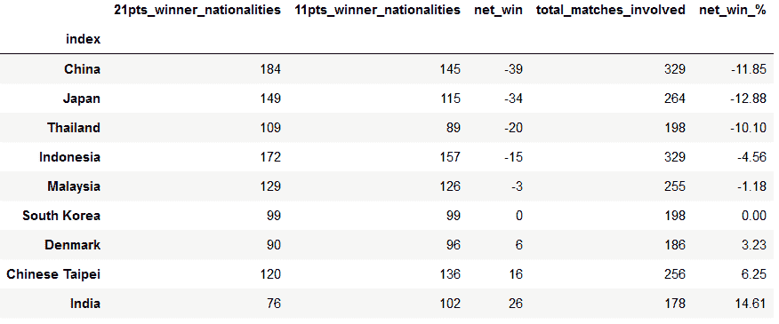

# 羽毛球评分系统变化的数据分析

> 原文：<https://towardsdatascience.com/data-analysis-on-badminton-scoring-system-change-ef5bfcdc11cb?source=collection_archive---------19----------------------->

萨尔曼·侯赛因·赛义夫在 [Unsplash](https://unsplash.com?utm_source=medium&utm_medium=referral) 上的照片

## 如果提议的评分系统更改更早实施，过去的结果会是什么样的？

# 目录

*   问题背景
*   目标
*   数据收集
*   数据预处理
*   数据可视化
*   结论
*   参考

# 泰勒:博士

*   大约 70%的比赛可以在中场休息时结束(11 分)。
*   在所有锦标赛类型中，比赛评估的组成大致相同。
*   从“改变”的结果来看，中国受到的负面影响最大，而印度将受益最大，这从他们的净赢指数可以看出。
*   提案的好处已经得到验证，但是即使是数据驱动的决策也需要与利益相关者进行适当的沟通才能成功。
*   该项目的 Github 回购链接:[此处](https://github.com/juanliong14/badminton_data_analysis)

> **“如果缺乏与利益相关者的适当沟通，即使是最复杂的数据驱动决策也会失败。”**

# 问题背景

最近，印度尼西亚羽毛球协会(PBSI)提交了一份提案，将现行的计分制度从 3x21 分制修改为 5x11 分制，尽管 3 年前世界羽毛球联合会(BWF)理事会提出了同样的提案，但遭到了拒绝[2]

这项提议引起了争议，运动员和官员对此反应不一。该提案的支持者(如印度尼西亚的亨德拉·塞蒂亚万[3])公开表示，新系统将使玩家受益，游戏时间更短，恢复更好，游戏质量更高。

相反，来自丹麦的 Victor Axelsen，5]强烈反对，因为他声称从未就该提议适当咨询过球员，并抱怨球员在投票上没有发言权，考虑到球员是受提议的改变直接影响的人，这是疯狂的。

尽管存在利弊，但我很想知道如果提议的评分系统早点实施，游戏会是什么样子，并希望更深入地调查这些论点，所以我决定深入研究我在 Kaggle [这里](https://www.kaggle.com/sanderp/badminton-bwf-world-tour)【1】找到的数据集。

# 目标

*   用 11 分制评价比赛结果(比赛的胜负是在第 11 分而不是第 21 分决定的)。
*   通过计算‘净赢’找出哪个国家受益最大。

# 数据收集

我使用的 Kaggle 数据集包含了每个学科从 2018 年 1 月到 2021 年 3 月的近 1.5 万场 BWF 世界巡回赛。

数据集为我提供了一些初始信息，我可以使用这些信息进一步进行分析，例如:

*   锦标赛类型
*   团队/个人国籍
*   第 1、2 和 3 场比赛得分历史
*   第 1、2 和 3 场比赛的分数为 21 分制
*   第 1、2 和 3 场比赛的分数为 11 分制

# 数据预处理

为了达到目标，仍然需要一些预处理:

*   确定 11 分和 21 分制的获胜者。
*   决定获胜者的国籍。
*   评估 11 分制的比赛结果。

匹配评估将有 3 种可能的结果:

1.  未改变= 21 点和 11 点的结果相同(例如 21–15、21–16 和 11–5、11–6)
2.  已更改= 21 点和 11 点的不同结果(例如 21–15、21–16 和 5–11、6–11)
3.  不确定= 11 分制没有明确的结果(例如:21–15、21–16 和 11–5、6–11)。

*   想象每个学科、每个锦标赛和所有比赛的每场比赛结果的比例。
*   计算“净赢球变化”参数，该参数将不同国籍的比赛数据框进行子集划分，并计算如果实施 11 分制，哪些国家将赢得更多比赛。

# 数据可视化

## 大多数比赛不会受到影响

在评估了数据集中的所有比赛后，如果使用 11 分制，71.2 %的比赛结果没有变化，只有 11.3%的比赛结果会被推翻。

每场比赛评估结果的比例可以被视为平均分布在所有羽毛球项目和比赛类型中。那些支持这个提议的人的观点似乎是有效和准确的，因为我们可以看到游戏的大部分将在每个学科和锦标赛级别保持不变。如果实施这一改变，大约只有十分之一的匹配会有不同的结果。

## 谁从变革中获益，谁从中受损？

通过只分析“变化”的结果和不同国籍之间的比赛，我计算出“净赢变化”指数，这是 11 分制赢得的比赛数减去 21 分制赢得的比赛数的结果。请注意，我只使用了来自全国总共有超过 100 场比赛的数据来消除噪音。

中国将遭受最大的净损失，而另一方面，印度将从该提议中受益。与直觉相反的是，作为该提案的主要发起国，印度尼西亚将会有一个负面的净收益变化。

# 结论

*   即使实行 11 分制，71.2%的比赛结果保持不变，只有 11.3%的人会改变。
*   比赛结果评估的趋势平均分布在所有学科和锦标赛类型中。
*   根据净收益指数，中国受负面影响最大，而印度受益最大。

2021 年 5 月 22 日，BWF 成员对该提案进行了投票，该提案仅差一票获得批准[4]。我发现的最令人震惊的事情是，玩家甚至没有权利或发言权来投票。

作为一名羽毛球爱好者，我希望未来球员可以有一个平台来表达他们的意见，特别是在技术问题上，这种变化会对他们产生直接影响。在我看来，如果缺乏与利益相关者的适当沟通，即使是最复杂的数据驱动决策也会失败。

也看看我的另一篇帖子吧！

<https://juanliong.medium.com/epl-covid-19-data-analysis-a79ee0d75fe>  

# 参考

[1]桑德普。(2021).羽毛球国际羽联世界巡回赛数据集:[https://www.kaggle.com/sanderp/badminton-bwf-world-tour](https://www.kaggle.com/sanderp/badminton-bwf-world-tour)

[2] VOI 编辑小组。(2021).PBSI 向 BWF 提交评分系统从 3x21 到 5x11 格式的修改:[https://voi . id/en/sports/42398/pbsi-submitts-to-the-institution-of-of-the-score-to-bwf-From-3x 21 to-5x 11-format](https://voi.id/en/sports/42398/pbsi-submits-changes-to-the-institution-of-score-to-bwf-from-3x21-to-5x11-format)

[3]印度尼西亚有线电视新闻网。(2021).亨德拉·塞蒂亚万 Dukung Perubahan Sistem Skor di 羽毛球:[https://www . cnnindonesia . com/olahraga/20210404192206-170-625855/hendra-setia wan-du kung-Perubahan-Sistem-Skor-di-羽毛球](https://www.cnnindonesia.com/olahraga/20210404192206-170-625855/hendra-setiawan-dukung-perubahan-sistem-skor-di-badminton)

[4]刘。(2021).5x11 计分系统差一票通过，维克托·阿萨尔森松了一口气:[https://www . badmintonplanet . com/羽毛球-新闻/17453-5x 11-计分-系统-一票-害羞-批准. html](https://www.badmintonplanet.com/badminton-news/17453-5x11-scoring-system-one-vote-shy-approved.html)

[5]柯伊杰姆 K &西蒂·鲁哈尼。(2021).阿克塞尔森一个月后收到 BWF 的回信，11×5 评分系统:[https://360 羽毛球. com/news/axel sen-receives-a-reply-from-bwf-after-one-month-11×5-scoring-system/](https://360badminton.com/news/axelsen-receives-a-reply-from-bwf-after-one-month-11x5-scoring-system/)