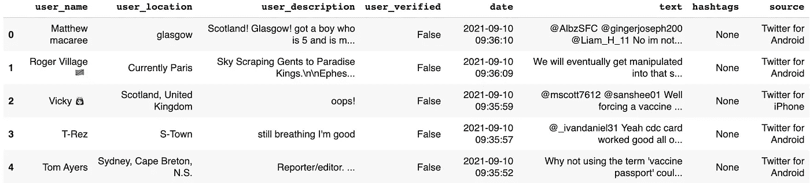
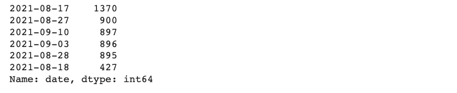
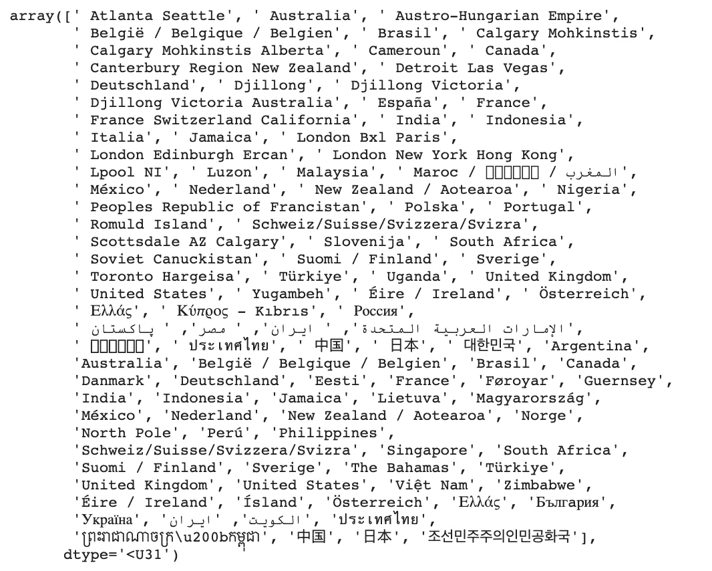
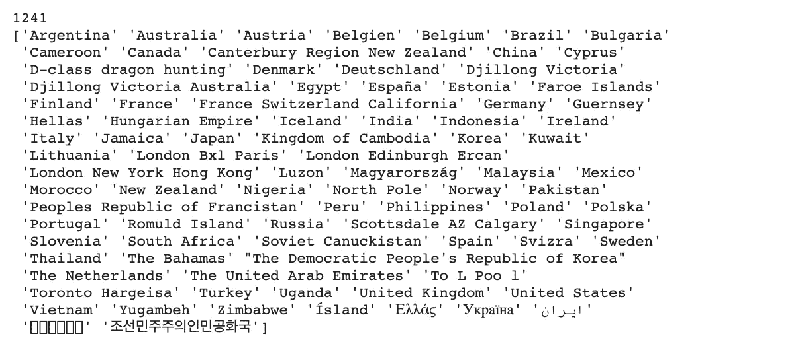
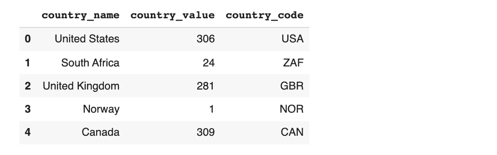
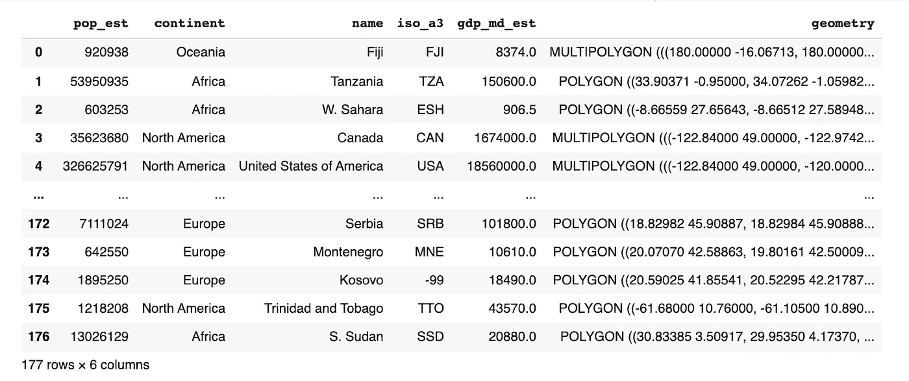
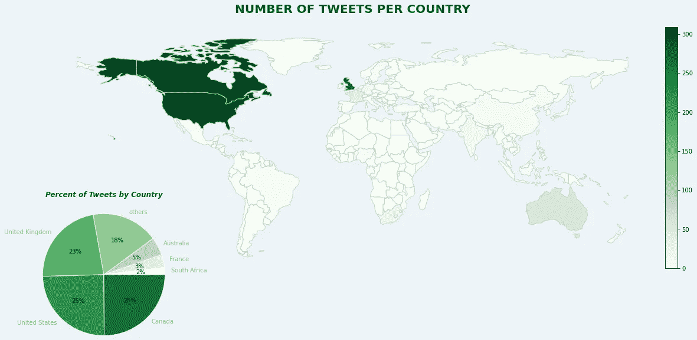
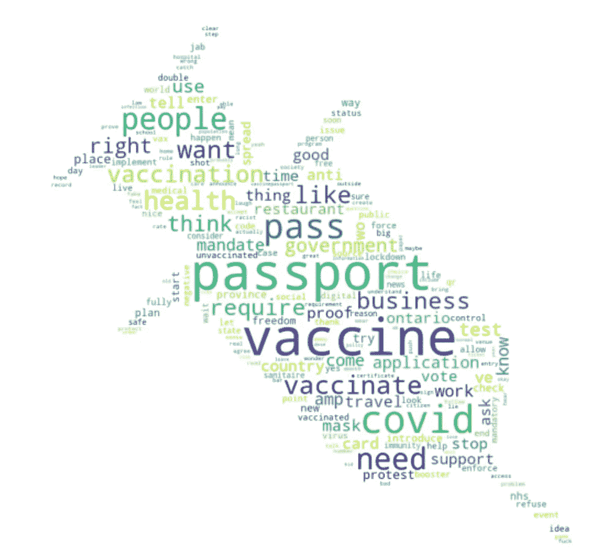
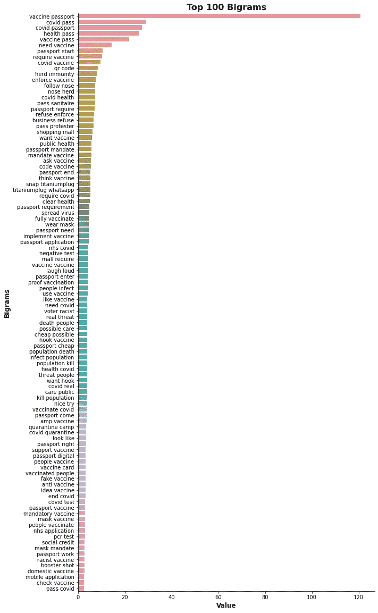
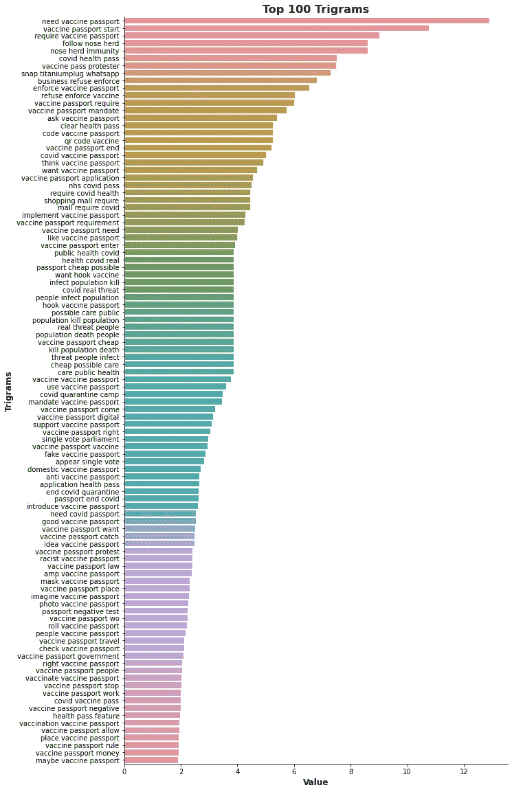

# 健康护照推文的数据分析

> 原文：<https://towardsdatascience.com/data-analysis-on-health-passport-tweets-6732660324f3?source=collection_archive---------26----------------------->

## [实践教程](https://towardsdatascience.com/tagged/hands-on-tutorials)

## 通过自然语言处理和数据可视化，发现关于健康护照的推文必须告诉我们什么


[来源](https://www.pexels.com/photo/internet-typography-technology-travel-8383888/)

健康护照又称绿色护照、卫生护照或疫苗护照，是 2019 年开始的 [*【新冠肺炎】*](https://en.wikipedia.org/wiki/COVID-19_pandemic) 的成果。健康护照在世界范围内引起了广泛的争议。当各国政府认为这是限制病毒传播的解决方案时，许多人和团体坚决反对，认为这是对人权的侵犯。因此，我决定在谈论健康护照的推特上训练我的数据分析技能，特别是自然语言处理(NLP)和数据可视化。

为了开始这个项目，创建一个 [*twitter 开发者帐户*](https://developer.twitter.com/en/apply-for-access) 并获取密钥和令牌以通过 twitter 检索数据是很重要的。本文不会详细讨论提取 tweets 的步骤；然而，值得一提的是，提取的推文只有英文，使用的搜索查询如下:

```
search_query = """ “vaccine passport” OR “vaccine pass” OR 
                   “pass sanitaire” OR “sanitary pass” OR 
                   “sanitary passport” OR “health pass” OR 
                   “covid passport” OR “covid pass” 
                   -filter:retweets -filter:media """
```

该 search_query 用于搜索包含一个或多个上述关键字的任何推文，不包括转发和媒体推文。

创建的数据集如下所示:



对于这个项目，我对以下三个栏目感兴趣:

*   user_location 栏——查看每个国家的推文数量
*   日期——查看推文的日期
*   文本——通过一元、二元和三元模型进行文本分析

# 日期分析

日期列的分析是一项相当简单的任务。为了验证推文的日期，使用以下代码行从日期列中删除了时间:

```
tweets['date'] = pd.to_datetime(tweets['date']).dt.date
```

然后，使用[*value _ counts()*](https://pandas.pydata.org/pandas-docs/stable/reference/api/pandas.Series.value_counts.html)方法显示唯一日期的计数。

```
tweets['date'].value_counts()
```

*输出:*



# 位置分析

位置分析的目的是通过计算每个国家的推文数量来获得推文来源的总体概况。为了实现这一点，有必要对 user_location 列进行一些预处理。另外，[*matplotlib . py plot*](https://matplotlib.org/stable/api/_as_gen/matplotlib.pyplot.html)和 [*geopandas*](https://geopandas.org/) 用于以饼状图和地理空间图的形式可视化结果。

## 预处理用户位置

预处理 user_location 列是从该列中找到的数据中提取国家名称的一项重要任务。

user_location 列中的一些数据没有任何意义，例如'*莱昂内尔·梅西的奖杯室'*和'*你在哪里'*，因此，所做的第一步是删除任何不是位置的内容。这是通过使用 [*空间*](https://spacy.io/) 库的命名实体识别实现的。

```
*# NLP* import spacy
nlp = spacy.load('en_core_web_sm')*# create a list of raw locations - i.e. locations entered by users* raw_locations = tweets.user_location.unique().tolist()*# replace nan by "" - the first element of the list is nan* raw_locations[0] = ""*# locations list will only include relevant locations* locations = []*# search for relevant locations and add them to the locations list* for loc in raw_locations:
  text = ""
  loc_ = nlp(loc)
  for ent in loc_.ents:
    if ent.label_ == "GPE":
      text = text + " " + ent.text
      locations.append(text)
    else:
      continue
```

上述代码用于删除所有在位置方面没有意义的内容；然而，user_location 列不仅包括国家名称，还包括城市和州，例如' *London'* 或' *New York，NY '。*因此，我决定使用 [*geopy*](https://geopy.readthedocs.io/en/stable/) 库从城市和州名中获取国名。

```
*# Geocoding Webservices* from geopy.geocoders import Nominatim*# NLP* import spacy
nlp = spacy.load('en_core_web_sm')*# Get the country name from cities' and states' names* countries = []for loc in locations:
  geolocator = Nominatim(user_agent = "geoapiExercises")
  location = geolocator.geocode(loc, timeout=10000)

  if location == None:
    countries.append(loc)
    continue

  location_ = nlp(location.address) if "," in location_.text:
 *# Example of a location_.text: "New York, United States"
    # get the name after the last ","*    countries.append(location_.text.split(",")[-1])
  else:
    countries.append(location.address)
```

为了显示国家名称，我使用了 [*np.unique()*](https://numpy.org/doc/stable/reference/generated/numpy.unique.html) 方法。

```
np.unique(np.array(countries))
```

*输出:*



你可以明显地注意到，有些结果是用英语以外的语言显示的，有些是用“/”或“-”分隔的多种语言显示的。另外，一些结果仍然没有指示国家名称，例如'*多伦多哈尔格萨'*和'*底特律拉斯维加斯'*。我通过删除文本中的“/”和“-”来解决这些问题，并使用这些图标后的姓氏。我还用相关的国家名称手动替换了一些地名。最后，我使用了 [*googletrans*](https://pypi.org/project/googletrans/) 库，将非英文的国家名称自动翻译成英文。请注意，我保留了包含不同国家城市的位置(例如*‘London Bxl Paris’)*)不变。以下是上述步骤的完整代码:

```
*# Translation*
from googletrans import Translator*# get the last name only when "/" or "-" is found 
# "/" and "-" separates names in different languages* countries = [country.split("/")[-1] for country in countries]
countries = [country.split("-")[-1] for country in countries]*# remove white space found at the beginning of a string*
countries = [country[1:] if country[0] == " " else country for country in countries]*# Manually replace locations to their relevant country name*
countries = ['United States' if country in 
                ["LA", "Detroit Las Vegas", "Atlanta Seattle"] 
                   else country for country in countries]countries = ['Canada' if country in
                ["Calgary Mohkinstis", "Calgary Mohkinstis Alberta"]
                   else country for country in countries]*# translate countries in foreign language to english*
translator = Translator()
countries = [translator.translate(country).text 
              for country in countries]print(len(countries))
print(np.unique(np.array(countries)))
```

*输出:*



不幸的是，仍然有一些国家的名称没有被正确翻译，因此，我不得不手动用它们的英文版本名称来替换它们。

```
*# for those that were not translated properly add them manually
# unknown to be added to others later: joke To L Poo l  ދިވެހިރާއްޖެ*countries = ['Germany'  if country == "Deutschland" 
               else country for country in countries]countries = ['Spain'  if country == "España" 
               else country for country in countries]countries = ['Iceland'  if country == "Ísland" 
               else country for country in countries]countries = ['Greece'  if country == "Ελλάς" 
               else country for country in countries]countries = ['Ukraine'  if country == "Україна" 
               else country for country in countries]countries = ['Iran'  if country == "ایران" 
               else country for country in countries]countries = ['Japan'  if country == "日本" 
               else country for country in countries]countries = ['Svizra'  if country == "Switzerland" 
               else country for country in countries]countries = ['Polska'  if country == "Poland" 
               else country for country in countries]countries = ["The Democratic People's Republic of Korea"  
               if country == "조선민주주의인민공화국" 
                 else country for country in countries]
```

最后，我创建了两个字典:1) *countries_values* 字典，它将所有国家的名称存储为键，将每个国家的推文数量存储为值；2)*main _ countries*字典，它存储推文数量最多的国家，并将所有其他国家归入名为*【其他】*的键。

```
from collections import Counter*# Use Counter to create a dictionary with all countries 
# and their equivalent number of tweets* countries_values = Counter(countries)*# Create dictionary of the countries having the most tweets 
# "others" key represent all other countries* main_countries = {'others': 0}
other_countries = []
for key, val in countries_values.items():
  if val >= 20:
    main_countries[key] = val
  else:
    main_countries["others"] += val
    other_countries.append(key)
```

## 使用 matplotlib.pyplot 和 geopandas 绘制结果

在预处理 user_location 列以获得作为国家名称的位置后，我决定使用[*matplotlib . py plot*](https://matplotlib.org/stable/api/_as_gen/matplotlib.pyplot.html)和 [*geopandas*](https://geopandas.org/) 以地图和饼状图的形式显示结果。绘制饼图时，只需使用之前创建的字典*‘main _ countries’*即可。但是，要显示显示每个国家的 tweets 数量的地图，创建地理数据框是很重要的。

***创建地理数据框架***

创建地理数据框架的第一步是从存储每个国家的 iso_alpha3 代码的*‘countries _ values’*字典创建数据框架。 [*pycountry*](https://pypi.org/project/pycountry/) 库用于获取 iso 代码。

```
*# Library to get the iso codes of the countries* import pycountry*# create a DataFrame of country names and their codes* df_countries = pd.DataFrame()
df_countries["country_name"] = list(countries_values.keys())
df_countries["country_value"] = list(countries_values.values())def get_cntry_code(column):
  CODE=[]
  for country in column:
    try:
      code=pycountry.countries.get(name=country).alpha_3
 *# .alpha_3 means 3-letter country code
      # .alpha_2 means 2-letter country code* CODE.append(code)
    except:
      CODE.append('None')
  return CODE*# create a column for code* df_countries["country_code"] = 
  get_cntry_code(df_countries.country_name)df_countries.head()
```



第二步是使用 [*geopandas*](https://geopandas.org/) 库加载世界地理数据框架，如下所示:

```
*# Geospatial Data* import geopandasworld = geopandas.read_file(
  geopandas.datasets.get_path('naturalearth_lowres'))world
```



值得注意的是，一些国家的 iso_a3 被设置为-99，因此，我不得不手动更新代码，如下所示:

```
world.loc[world['name'] == 'France', 'iso_a3'] = 'FRA'
world.loc[world['name'] == 'Norway', 'iso_a3'] = 'NOR'
world.loc[world['name'] == 'N. Cyprus', 'iso_a3'] = 'CYP'
world.loc[world['name'] == 'Somaliland', 'iso_a3'] = 'SOM'
world.loc[world['name'] == 'Kosovo', 'iso_a3'] = 'RKS'
```

为了最终确定地理数据框架，世界地理数据框架和国家数据框架 *(countries_df* )被合并到“*国家代码*”(即“iso_a3”)。

```
*# rename columns to merge the DataFrames* world = world.rename(columns={"iso_a3": "country_code"})df_merged = pd.merge(world, df_countries, 
                      on="country_code", how='outer')*# fill empty value with zero
# any country with no tweet will have a value of 0* df_merged.country_value = df_merged.country_value.fillna(0)
```

***绘制地图和饼状图***

下面的代码显示了绘制地图和饼图的步骤。

```
*# Geospatial Data* import geopandas
*# Data Visualisation* import matplotlib.pyplot as plt
from mpl_toolkits.axes_grid1 import make_axes_locatablefig = plt.figure(figsize=(15,10), facecolor='#eef3f8')ax1 = fig.add_axes([0, 0, 1, 1]) *# the map*
ax2 = fig.add_axes([0, 0.1, 0.2, 0.2]) *# the pie chart*divider = divider = make_axes_locatable(ax1)
cax = divider.append_axes("right", size="2%", pad=0) *# legend of map**### MAP ###* df_merged = df_merged[(df_merged.name != "Antarctica") & 
                       (df_merged.name != "Fr. S. Antarctic Lands")]df_merged.to_crs(epsg=4326, inplace=True)df_merged.plot(column='country_value', cmap='Greens', 
                linewidth=1.0, ax=ax1, edgecolor='0.8', 
                  legend=True, cax=cax)*# remove axis* ax1.axis('off')*# add a title of the map* font_t1 = {'fontsize':'20', 'fontweight':'bold', 'color':'#065535'}ax1.set_title('NUMBER OF TWEETS PER COUNTRY', 
                fontdict=font_t1, pad=24)*### PIE CHART ###* total = len(countries) *# 1241**# Sort the dictionary - this is only for the sake of visualisation* sorted_main_countries = dict(sorted(main_countries.items(),
                              key=lambda x: x[1]))*# get labels for pie chart* labels = list(sorted_main_countries.keys())*# get percentages for pie chart* percentages = [(val/total)*100 
                 for val in list(sorted_main_countries.values())]*# get theme colors to be coherent with that of the map's colors* theme = plt.get_cmap('Greens')
ax2.set_prop_cycle("color", [theme(1\. * i / len(percentages)) 
                              for i in range(len(percentages))])wedgeprops = {'linewidth':1, 'edgecolor':'white'}_, texts, autotexts = ax2.pie(percentages, labels=labels, 
                               labeldistance=1.1, autopct='%.0f%%',
                                 radius=1.8, wedgeprops=wedgeprops)*# set color for the autotext* for auto in autotexts:
  auto.set_color('black')*# set color of the labels* for text in texts:
  text.set_color('#909994') *# add a title for the pie chart* font_t2 = {'fontsize':'12', 'fontweight':'bold', 'color':'#065535'}ax2.set_title('Percent of Tweets by Country', fontdict=font_t2,
                pad=60, style='oblique')*# save figure* plt.savefig("no_of_tweets_per_country.png", 
              bbox_inches = 'tight', facecolor='#eef3f8')plt.show()
```

*最终结果:*



结果表明，大多数推文来自英语国家*(美国、英国、加拿大、澳大利亚和南非)*。这背后的原因可能是因为收集的推文只有英文。如果选择其他语言，结果可能会有所不同。法国是应用卫生通行证最严格的欧洲国家之一，反对“卫生通行证”概念的示威活动经常发生，这可以解释为什么法国在不是英语国家的情况下仍名列前茅。

# 文本分析

文本分析的重点是获取推文的一元词、二元词和三元词。单字通过世界云可视化，二元和三元显示在条形图上。这些都是通过应用 [TF_IDF](/tf-idf-for-document-ranking-from-scratch-in-python-on-real-world-dataset-796d339a4089) (词频-逆文档频率)实现的。我们的目标是一瞥推特中最常用的术语，因此，希望能帮助我们总体上理解推特用户的立场。

## 文本预处理

在获取一元词、二元词和三元词之前，进行文本预处理是很重要的。下面，我列出了预处理文本所采取的步骤以及本节末尾显示的完整代码

1-转换为小写

2-删除 URL

3-将俚语转换成它们原来的形式(为了实现这一点，我不得不抓取这个 [*网站*](https://www.noslang.com/dictionary/1/)——网页抓取的细节将不在本文中提及)

4-删除提及

5-删除标点符号

6-引理

7-删除停用词

8-去掉数字(表情符号翻译成数字。为了避免进入前 n 个字母的数字，我决定去掉数字。然而，人们可以决定保留它们并使用表情符号作为分析的一部分)

9-删除国家和城市的名字(为了避免国家或城市的名字出现在前 n 个字母中，我决定将它们从推文中删除)

***文本预处理的全部代码:***

```
*# NLP* import spacy
import regex as re
import stringnlp = spacy.load('en_core_web_sm')tweets["text_processed"] = ""*# convert to lower case* tweets["text_processed"] = tweets["text"].apply(lambda x:
                             str.lower(x))*# remove URL* tweets["text_processed"] = tweets["text_processed"].apply(lambda x:
                             re.sub(
                              r"(?:\@|http?\://|https?\://|www)\S+",
                                  ' ', x))*# convert slang
# load slang dictionary* with open('slangdict.json') as json_file:
  slang_dict=json.load(json_file)for i in range(len(tweets["text_processed"])):
  txt = ""
  doc = nlp(tweets["text_processed"].iloc[i])

  for token in doc:
    if token.text in list(slang_dict.keys()):
      txt = txt + " " + slang_dict[token.text]
    else:
      txt = txt + " " + token.text
  tweets["text_processed"].iloc[i] = txt*# remove mentions* def remove_entities(text, entity_list): for separator in string.punctuation:
    if separator not in entity_list:
      text = text.replace(separator,' ')
  words = []
  for word in text.split():
    word = word.strip()
    if word:
      if word[0] not in entity_list:
        words.append(word) return ' '.join(words)tweets["text_processed"] = tweets["text_processed"].apply(lambda x:
                             remove_entities(x, ["@"]))*# remove punctuation* tweets["text_processed"] = tweets["text_processed"].apply(lambda x:
                             re.sub(r'[^\w\s]',' ', x))*# lemmatize* def lemmatize(sentence): doc = nlp(sentence) *# tokenize the text and produce a Doc Object*
  lemmas = [token.lemma_ for token in doc]

  return " ".join(lemmas)tweets["text_processed"] = tweets["text_processed"].apply(lambda x:
                             lemmatize(x))*# remove stopwords* def remove_stopwords(sentence): doc = nlp(sentence) *# tokenize the text and produce a Doc Object* all_stopwords = nlp.Defaults.stop_words
  doc_tokens = [token.text for token in doc]
  tokens_without_sw = [word for word in doc_tokens 
                        if not word in all_stopwords]

  return " ".join(tokens_without_sw)tweets["text_processed"] = tweets["text_processed"].apply(lambda x:
                             remove_stopwords(x))*# remove -PRON- a result of lemmatization* tweets["text_processed"] = tweets["text_processed"].apply(lambda x:
                             re.sub('-PRON-', " ", x))*# remove numbers* tweets["text_processed"] = tweets["text_processed"].apply(lambda x:
                             re.sub(r'[0-9]', " ", x))*# remove country and city names* def remove_country_city(sentence): doc = nlp(sentence) return (" ".join([ent.text for ent in doc if not ent.ent_type_]))tweets["text_processed"] = tweets["text_processed"].apply(lambda x:
                             remove_country_city(x) 
                               if pd.isna(x) != True else x)
```

***从单字创建词云***

如下所示，我决定创建一个世界云来显示推文中最突出的单词。我通过使用[*TfidfVectorizer*](https://scikit-learn.org/stable/modules/generated/sklearn.feature_extraction.text.TfidfVectorizer.html)*，*实现了这一点，其中默认的 ngram_range 是(1，1)，意思是 unigram。

```
from PIL import Image
import numpy as np
from sklearn.feature_extraction.text import TfidfVectorizer
import matplotlib.pyplot as plt
from wordcloud import WordCloudvectorizor = TfidfVectorizer(stop_words='english')
vecs = vectorizor.fit_transform(tweets.text_processed)
feature_names = vectorizor.get_feature_names()
dense = vecs.todense()
l = dense.tolist()
df = pd.DataFrame(l, columns=feature_names)*# mask is the image used to reshape the cloud* mask = np.array(Image.open('./images/syringe44_.jpeg'))word_cloud = WordCloud(collocations=False, background_color='white',
                         max_words=200, width=3000,
                           height=2000, colormap='viridis',
                             mask=mask).generate_from_frequencies(
                                                   df.T.sum(axis=1))plt.figure(figsize=[15,10])
plt.imshow(word_cloud)
plt.axis("off")
plt.show()word_cloud.to_file("tfidf_ps_word_cloud.png")
```

*词云:*



不出所料，*【护照】**【疫苗】**【接种】**【通行证】**【covid】*等词汇非常丰富。这很正常，因为这是推文的主题；此外，提取 tweets 时的搜索查询集中在这些关键字上。然而，如果我们更仔细地观察单词 cloud，我们可以注意到对进一步分析有用的其他感兴趣的单词，如*‘抗议’**【停止】**【强制】**【拒绝】**【正确】*和*【强制】*。

在 Unigrams 中，每个单词的出现被认为是独立于它前面的那个单词的，这并不总是使它成为文本分析的最佳选择。因此，我决定进一步检查二元模型和三元模型，看看它们是否能提供更多的见解。

***获取并可视化二元模型和三元模型***

获取一元模型、二元模型和三元模型的步骤非常相似。唯一需要更新的参数是[*TfidfVectorizer*](https://scikit-learn.org/stable/modules/generated/sklearn.feature_extraction.text.TfidfVectorizer.html)中的 ngram_range，其中对于单个字符，它是(1，1)(默认值)，对于双字符，它是(2，2)，对于三字符，它是(3，3)。

```
from sklearn.feature_extraction.text import TfidfVectorizer*# bigrams* vectorizor = TfidfVectorizer(stop_words='english', 
                              ngram_range =(2, 2))vecs = vectorizor.fit_transform(tweets.text_processed)
feature_names = vectorizor.get_feature_names()
dense = vecs.todense()
l = dense.tolist()
df = pd.DataFrame(l, columns=feature_names)n_grams = df.T.sum(axis=1).sort_values(ascending=False)n_grams.to_csv("bigrams.csv")
```

我用一个条形图来显示前 100 个二元模型和三元模型。[*matplotlib . py plot*](https://matplotlib.org/stable/api/_as_gen/matplotlib.pyplot.html)和 [*seaborn*](https://seaborn.pydata.org/) 库对于这种可视化是必不可少的。以下是可视化数据的代码示例:

```
*# read bigram dataset* bigrams = pd.read_csv("bigrams.csv")*# Data Visualization* import matplotlib.pyplot as plt
import seaborn as sns*# plot bar graph* plt.figure(figsize=(10,20))
sns.barplot(x = bigrams[:101].value , y=bigrams[:101].bigram)
sns.despine(top=True, right=True, left=False, bottom=False)
plt.xlabel("Value", 
             fontdict={'fontsize':'12', 'fontweight':'bold'})
plt.ylabel("Bigrams", 
             fontdict={'fontsize':'12', 'fontweight':'bold'})plt.title("Top 100 Bigrams", 
            fontdict={'fontsize':'16', 'fontweight':'bold'})plt.savefig("Top 100 Bigrams.png", bbox_inches='tight')
```

*结果:*



就像世界云的情况一样，在第一排有诸如*、*、*、【covid pass】、*、【健康通行证】、*这样的术语是很容易理解的。然而，如果我们进一步观察，我们可以发现其他可能对分析有用的二元和三元模型。例如，一些有趣的二元模型可能是*【群体免疫】**【通过抗议者】**【假疫苗】**【杀死人群】**【传播病毒】*和*【完全接种】*。然而，感兴趣的三元模型可能是*‘真正的威胁人物’*和*‘反疫苗护照’。也就是说，需要更深入的分析才能得出准确的结论。此外，我建议不要局限于前 100 个二元和三元语法，而要对 n 元语法进行情感分析。**

在这篇文章中，我解释了对谈论健康护照的推文进行数据分析的步骤。为了实现这个项目，使用了几种自然语言处理技术，例如命名实体识别、文本预处理和通过单字、双字和三字的文本分析。此外，结果以饼图、地理空间图、条形图和世界云的形式通过数据可视化显示。