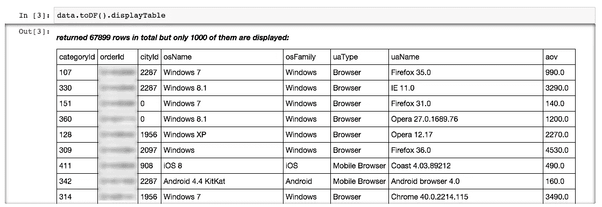
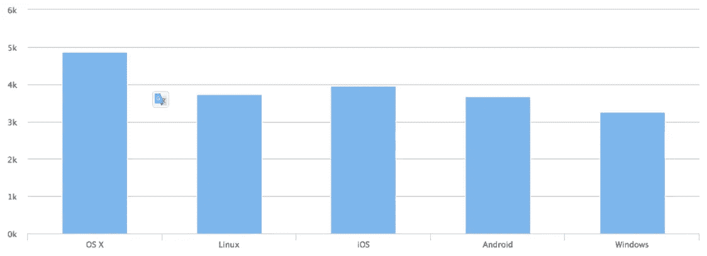
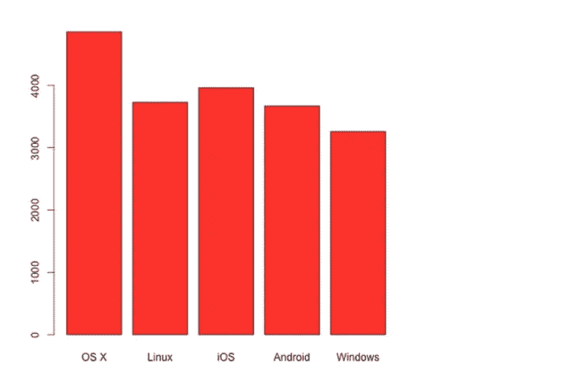
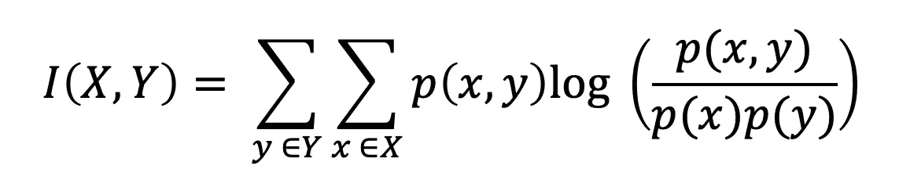
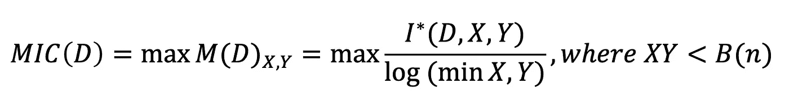
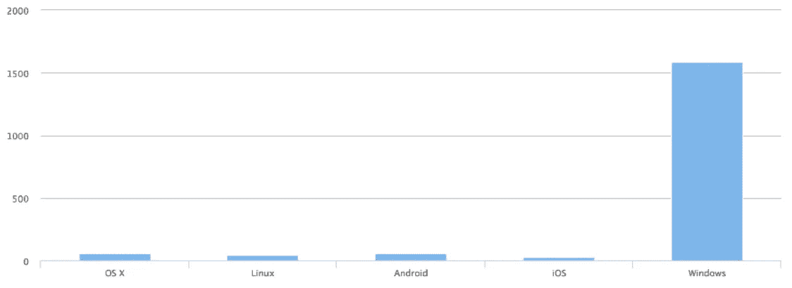

# 使用 Scala 进行数据分析

> 原文：<https://towardsdatascience.com/data-analysis-using-scala-f3846602fb0d?source=collection_archive---------33----------------------->

## 使用最大信息系数和 RScala 库进行可视化的示例学习

马库斯·斯皮斯克在 [Unsplash](https://unsplash.com?utm_source=medium&utm_medium=referral) 上的照片

选择合适的工具进行数据分析非常重要。在举办国际数据科学竞赛的 Kaggle.com[论坛上，人们经常会问哪个工具更好。r 和 Python 排在最前面。在这篇文章中，我们将告诉你另一套数据分析技术，基于 Scala 编程语言和](http://kaggle.com/) [Spark](http://spark.apache.org/) 分布式计算平台。

# 我们是怎么想出来的？

在 Retail Rocket，我们对非常大的数据集进行了大量的机器学习。我们以前用一堆 IPython+pyh S2(Python 的 hive 驱动)+ Pandas + Sklearn 开发原型。在 2014 年夏末，我们做出了一个根本性的决定，转而使用 Spark，因为实验表明，在相同的服务器上，我们将获得 3 到 4 倍的性能提升。

另一个优点是，我们可以使用一种编程语言来建模和编写将在生产服务器上运行的代码。这对我们来说是一个巨大的好处，因为之前我们同时使用 4 种语言:Hive，Pig，Java，Python。这是一个小工程师团队的问题。

Spark 很好地支持通过 API 与 Python/Scala/Java 协同工作。我们决定选择 Scala，因为它是编写 Spark 的语言，这意味着我们可以分析它的源代码，并在需要时修复 bug。它也是运行 Hadoop 的 JVM。

我必须说这个选择并不容易，因为当时团队中没有人了解 Scala。众所周知，要学会用一种语言很好地交流，你需要让自己沉浸在这种语言中，并尽可能多地使用它。所以我们放弃了 Python 栈，转而使用 Scala 进行建模和快速数据分析。

第一步是找到 IPython 笔记本的替代品。这些选择如下:

1.  [Zeppelin](https://zeppelin.apache.org/)—Spark 的 IPython 式笔记本；
2.  [ISpark](https://github.com/tribbloid/ISpark)；
3.  火花笔记本；
4.  IBM 的 Spark IPython 笔记本。
5.  阿帕奇 T [oree](https://toree.apache.org/)

到目前为止，选择 ISpark 是因为它很简单——它是 Scala/Spark 的 IPython。附加高图表和 R 图形相对容易。我们可以毫不费力地把它连接到纱线束上。

# 工作

让我们试着回答这个问题:

**您在线商店的平均订单价值(AOV)是否取决于静态客户参数，包括结算、浏览器类型(移动/桌面)、操作系统和浏览器版本？**

你可以用[交互信息](http://en.wikipedia.org/wiki/Mutual_information)做到这一点。我们在推荐算法和分析中大量使用熵:经典的香农公式、Kullback-Leibler 散度、互信息。我们甚至提交了一份关于这个主题的论文。在 Murphy 关于机器学习的著名教科书[5]中，有一个单独的，尽管很小的章节专门讨论这些措施。

下面就以我自己真实的零售火箭数据来分析一下。在进行分析之前，所有数据都是完全匿名的。事先，我将样本从我们的集群复制到我的计算机上，作为一个 csv 文件。

# 数据

这里我们使用 ISpark 和 Spark 在本地模式下运行，这意味着所有计算都在本地执行，并分布在处理器内核中。一切都在代码的注释中描述。最重要的是，在输出中我们得到了 RDD (Spark 数据结构)，它是 Row 类型的 case 类的集合，这是在代码中定义的。这将允许您通过“.”引用字段例如 _.categoryId。

资料截图，图片作者

上面的行使用了在 1.3.0 版本中添加到 Spark 的新 DataFrame 数据类型，它与 Python 中 pandas 库中的类似结构非常相似。toDf 选择了我们的行 case 类，所以我们可以通过名称来引用这个字段。

为了进一步分析，我们需要选择单个类别，最好是有大量数据的类别。为此，我们需要获得最流行类别的列表。

为了进一步的工作，我决定选择第 128 类。

让我们准备数据:让我们过滤必要类型的操作系统，以避免在图表中添加噪声。

想要可视化，让我们在 HighCharts 中实现它。

操作系统的 AOV，作者的图像

您可以使用任何 HighCharts 图形，只要 Wisp 支持它们。所有图表都是交互式的。

让我们尝试做同样的事情，但是使用 R.
运行 R 客户端并绘制一个 char:

操作系统的 AOV，作者的图像

# 交互信息

图表显示了这种关系，但是指标能为我们证实这个结论吗？有很多方法可以做到这一点。在我们的例子中，我们使用表中值之间的互信息。它测量两个随机(离散)变量分布之间的相互依赖性。

对于离散分布，使用以下公式计算:

作者图片

但是我们对一个更实用的度量标准感兴趣——最大信息系数(MIC ),它需要对连续变量进行一些复杂的计算。下面是这个参数的定义。

设 D = (x，Y)是随机变量 X 和 Y 的 n 个有序元素对的集合，这个二维空间由 X 和 Y 网格划分，将 X 和 Y 值分别分组到 X 和 Y 分区中(还记得直方图吗！).

作者图片

其中 B(n)是网格大小，I∫(D，X，Y)是 X 和 Y 分区的互信息。分母指定对数，用于将 MIC 归一化为段[0，1]的值。MIC 取区间[0，1]内的连续值:对于极值，有依赖关系为 1，没有依赖关系为 0。关于这个主题还有什么可以阅读的，列在文章末尾的参考书目中。

《T2》一书(机器学习:概率视角)称 MIC(互信息)为 21 世纪的相关性。原因如下！来自[1]和[4]的[图](https://www.cs.ubc.ca/~murphyk/MLbook/figReport-16-Aug-2012/pdfFigures/MICfig4.pdf)显示了 6 个相关性(C 到 H 图)。已经为它们计算了皮尔逊相关和 MIC，并在左边的图表上用相应的字母标出。正如我们所看到的，皮尔逊相关性几乎为零，而 MIC 显示了相关性(图 F、G、E)。根据[1]，MIC 可以很好地检测非线性相关性。

在我们的例子中，我们正在处理一个 MIC 计算，其中我们有一个连续的变量 AOV，所有其他的都是离散的无序值，如浏览器类型。为了正确计算 MIC，我们需要离散化 AOV 变量。我们将使用来自 exploredata.net 的现成解决方案。这种解决方案有一个问题:它假设两个变量都是连续的，并且用浮点值表示。因此，我们必须通过将离散变量的值编码成 Float 并随机改变这些变量的顺序来欺骗代码。为此，我们将不得不以随机顺序(100)进行多次迭代，我们将取最大 MIC 值作为结果。

对于这个实验，我添加了一个均匀分布的随机变量和 AOV(平均购买价值)本身。正如我们所见，几乎所有 MIC 都低于随机 MIC，这可以被认为是一个“有条件的”决策阈值。AOV 麦克风几乎是统一的，这是自然的，因为它本身的相关性等于 1。

一个有趣的问题出现了:为什么我们在图中看到了相关性，但 MIC 为零？我们可以提出很多假设，但最有可能的是，对于操作系统家族来说，这很简单 Windows 机器的数量远远高于其他机器的数量。

Windows 机器的数量远远高于其他机器，图片由作者提供

**结论**
我希望 Scala 在数据分析师(数据科学家)中得到普及。它非常方便，因为它可以使用标准的 IPython 笔记本+获得 Spark 的所有功能。这段代码可以安全地处理万亿字节的数据，您只需要更改 ISpark 中的配置行，指定集群的 URI。

Roman Zykov 是 Retail Rocket 的联合创始人，也是《Roman ' s Data Science:How to money your Data》一书的作者。

**参考文献**

[1] Reshef，D. N .，Y. A. Reshef，H. K. Finucane，S. R. Grossman，G. McVean，P. J. Turnbaugh，E. S. Lander，M. Mitzenmacher 和 P. C. Sabeti，“[检测大型数据集中的新关联。](https://www.researchgate.net/publication/51884204_Detecting_Novel_Associations_in_Large_Data_Sets)(2011)
【2】[Minepy 库](https://minepy.readthedocs.io/en/latest/) —基于最大信息量的非参数探索。
【3】[用数据集挖掘 Java 库](http://www.exploredata.net/Downloads)。
【4】凯文·帕特里克·墨菲，[《机器学习:一种概率视角》](https://probml.github.io/pml-book/book0.html)，2012
【5】[以上代码要点](https://gist.github.com/rzykov/2c66b2bfffad3136837ab9dc0c22000c)

【https://topdatalab.com】原载于**。**